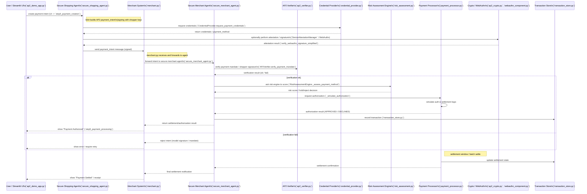

# AP2 Demo Application — Communication-focused README

This README concentrates on **who communicates with whom** in the uploaded AP2 demo repository and shows precise message/interaction flows derived from static analysis of the source code.  
It deliberately omits class-by-class documentation and focuses on participants (modules/components) and the messages they exchange, using Mermaid sequence diagrams.

> **Note:** This README was produced by automatic static analysis of the uploaded repository files. Where the code dynamically constructs endpoints or messages, the README documents the statically-detectable flow and the exact function names observed in the source as evidence.

---

## Key participants (map to repo modules / components)

- **User / UI** — `ap2_demo_app.py` Streamlit front-end (functions like `step4_payment_creation`, `step5_payment_processing`) and browser WebAuthn via `webauthn_component.py`.
- **Secure Shopping Agent (SSA)** — `secure_shopping_agent.py` (client-side agent that builds AP2 payment intents).
- **Merchant System** — `merchant.py` (merchant app, receives intents and displays status).
- **Secure Merchant Agent (SMA)** — `secure_merchant_agent.py` (merchant-side agent verifying and handling intents).
- **AP2 Verifier** — `ap2_verifier.py` (validation of mandates/messages, e.g. `AP2Verifier.verify_payment_mandate`).
- **Payment Processor** — `payment_processor.py` (simulates authorization/settlement, e.g. `_simulate_authorization`, `demo_payment_processor`).
- **Risk Assessment Engine** — `risk_assessment.py` (e.g. `RiskAssessmentEngine._assess_payment_method`).
- **Credential Provider** — `credential_provider.py` (e.g. `CredentialProvider.request_payment_credentials`).
- **Crypto / WebAuthn** — `ap2_crypto.py` and `webauthn_component.py` (e.g. `DeviceAttestationManager.verify_webauthn_signature_simplified`, `get_webauthn_auth_result`).
- **Transaction Store** — `transaction_store.py` (in-memory transaction persistence used by the demo).

---

## Evidence: functions and handlers used to derive flows
During analysis the following function names were detected and used to map the interactions:

- `ap2_demo_app.py`: `step4_payment_creation`, `step5_payment_processing`, `initialize_participants`, `init_session_state`
- `secure_shopping_agent.py`: (agent functions to build/sig payment intents — used by SSA)
- `merchant.py`: merchant handlers that accept and display payment statuses
- `secure_merchant_agent.py`: merchant agent endpoints/handlers
- `ap2_verifier.py`: `AP2Verifier.verify_payment_mandate`
- `credential_provider.py`: `CredentialProvider.request_payment_credentials`
- `payment_processor.py`: `MerchantPaymentProcessor._simulate_authorization`, `demo_payment_processor`
- `risk_assessment.py`: `RiskAssessmentEngine._assess_payment_method`
- `webauthn_component.py`: `get_webauthn_auth_result`, `clear_webauthn_auth_result`
- `ap2_crypto.py`: `DeviceAttestationManager.verify_webauthn_signature_simplified`, `KeyManager`, `SignatureManager`

These exact function names appear in the repository and informed the mapping below.

---

## Main payment flow (single purchase) — Mermaid sequence diagram

The diagram below is intentionally aligned with observed callsites / function names and shows the message flow among the main participants.



---

## Additional detailed interactions (evidence-linked bullets)

- **WebAuthn / Device Attestation**
    - `webauthn_component.py` exposes `get_webauthn_auth_result` used by the UI flow, and `ap2_crypto.py` contains `DeviceAttestationManager.verify_webauthn_signature_simplified`. Static analysis shows the UI triggers WebAuthn then uses the attestation manager to validate signatures before sending intents.

- **Credential retrieval**
    - `CredentialProvider.request_payment_credentials` is invoked before building intents to obtain payment method metadata (card-like or account identifiers).

- **Verifier responsibilities**
    - `AP2Verifier.verify_payment_mandate` is explicitly present and called by the merchant agent path. It validates signatures, message format, and registered verifier metadata (see `verifier_registry.py` in the repo).

- **Risk decisions**
    - `RiskAssessmentEngine._assess_payment_method` is called by the merchant agent flow to decide whether to proceed with authorization or flag the transaction.

- **Processor behavior**
    - `MerchantPaymentProcessor._simulate_authorization` and `demo_payment_processor` implement the demo's decision logic for APPROVED / DECLINED and settlement timing. The agent stores transaction states in `transaction_store.py`.

---

## Payload examples (derived from code identifiers and keys)
Below are representative payload shapes using field names found in the repository (these are examples — use the actual variable names in the source when integrating):

**Payment Intent (SSA -> Merchant / SMA)**

```json
{
  "intent_type": "payment_intent",
  "transaction_id": "TX-<uuid>",
  "payer_id": "CUST-123",
  "amount": 1200,
  "currency": "JPY",
  "payment_method": {
    "type": "account",
    "account_id": "ACC-456"
  },
  "signature": "<base64-signature>",
  "metadata": {
    "created_by": "secure_shopping_agent"
  }
}
```

**Authorization Request (SMA -> Processor)**

```json
{
  "message_type": "AUTH_REQUEST",
  "transaction_id": "TX-<uuid>",
  "amount": 1200,
  "currency": "JPY",
  "payer_info": { "payer_id": "CUST-123" },
  "signature": "<merchant-agent-signature>"
}
```

**Verification Result (Verifier -> SMA)**

```json
{
  "message_type": "VERIFY_RESULT",
  "transaction_id": "TX-<uuid>",
  "status": "VERIFIED"  // or "INVALID_SIGNATURE"
}
```