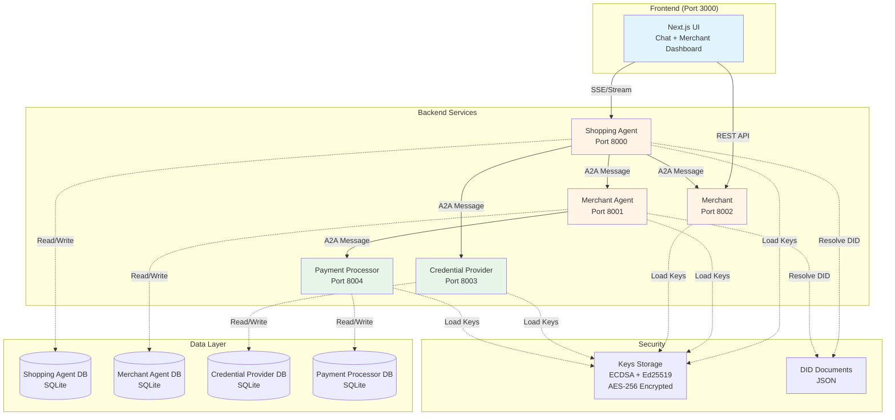
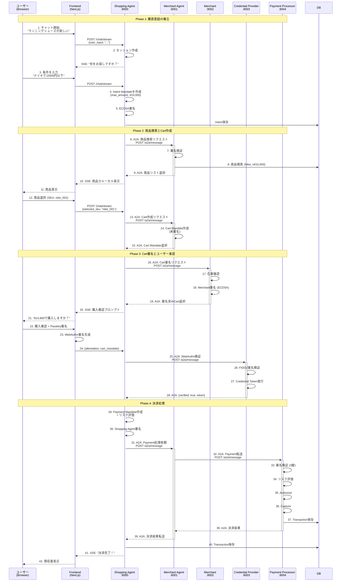
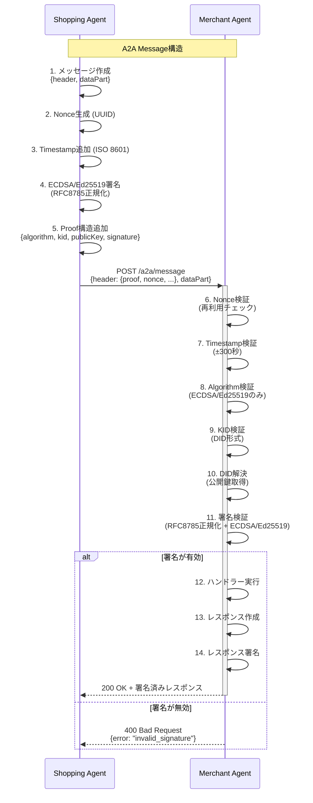
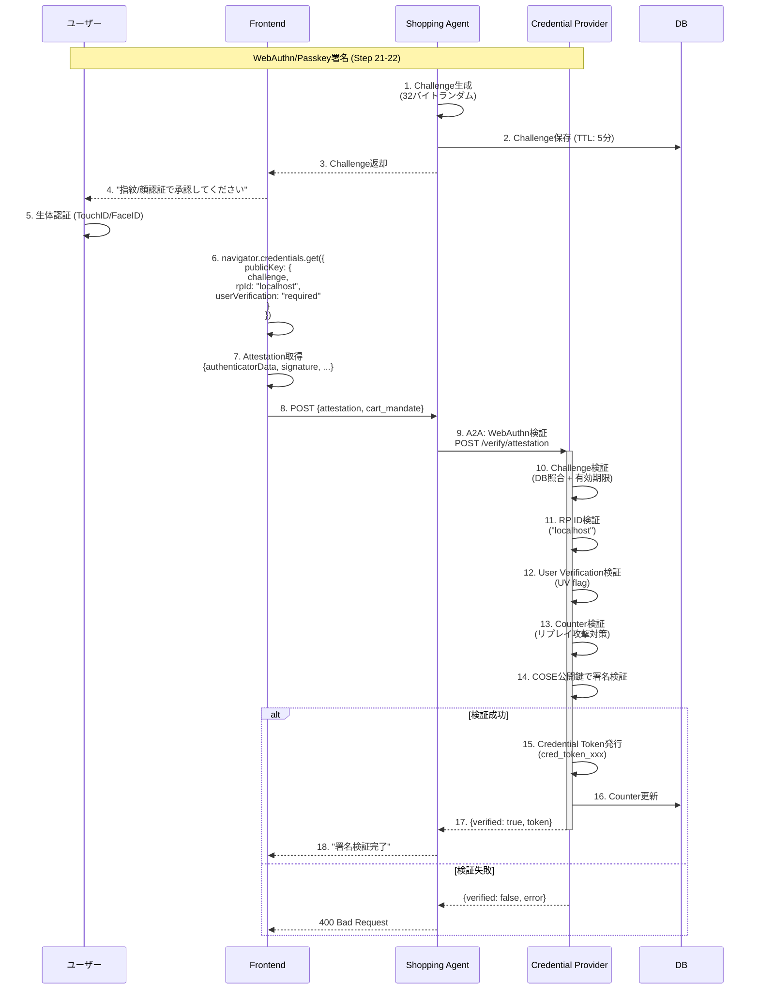
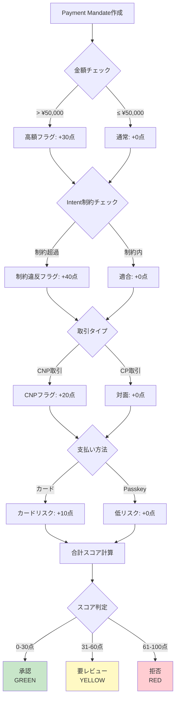
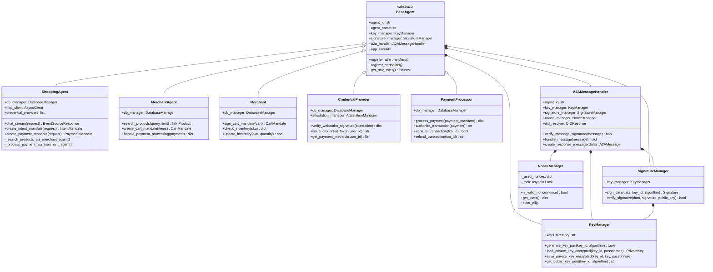
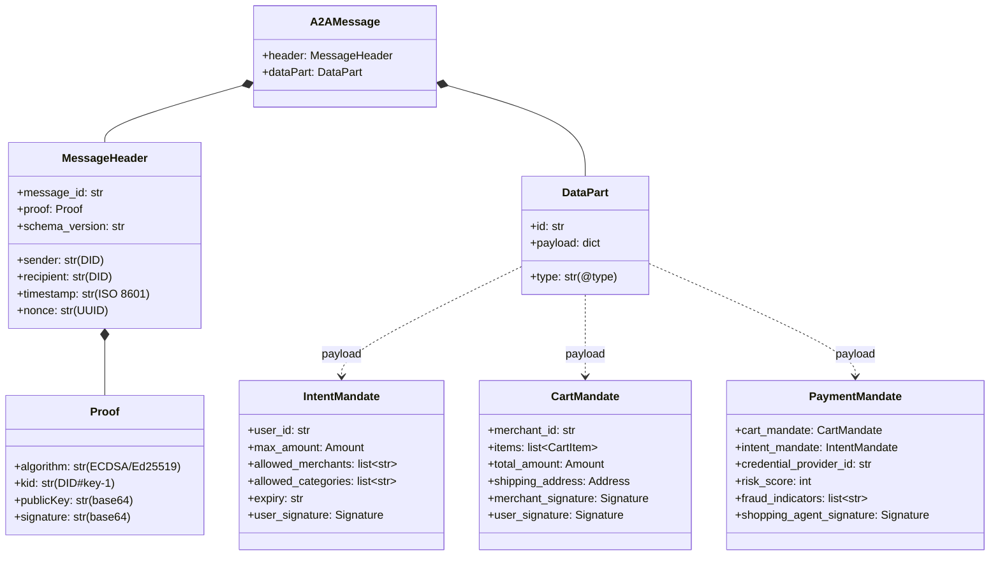

# AP2 (Agent Payments Protocol) デモアプリケーション v2

このアプリケーションは、[AP2プロトコル](https://ap2-protocol.org/)の完全なマイクロサービス実装です。AIエージェント間の安全な決済処理を、エンドツーエンドで体験できます。


## 目次

- [概要](#概要)
- [アーキテクチャ](#アーキテクチャ)
- [主要フロー](#主要フロー)
- [セットアップ](#セットアップ)
- [使い方](#使い方)
- [技術スタック](#技術スタック)
- [開発者向け情報](#開発者向け情報)

---

## 概要

### AP2とは？

**AP2 (Agent Payments Protocol)** は、AIエージェントが安全に決済を実行するためのオープンプロトコルです。Googleと60以上の組織によって開発され、以下の特徴があります：

- **エージェント間通信 (A2A)**: 署名付きメッセージによる安全な通信
- **3種類のMandate**: IntentMandate（購買意図）、CartMandate（カート）、PaymentMandate（決済）
- **WebAuthn/Passkey**: ハードウェアベースの認証
- **リスク評価**: 不正検知とリスクスコアリング
- **VDC (Verifiable Digital Credentials)**: 検証可能なデジタル資格情報

### v2アプリの特徴

このv2実装は、AP2仕様を100%準拠した実装で、以下を提供します：

✅ **6つのマイクロサービス**: Shopping Agent、Merchant Agent、Merchant、Credential Provider、Payment Processor、Frontend
✅ **完全なA2A通信**: ECDSA/Ed25519署名、Nonce検証、DID解決
✅ **WebAuthn/Passkey対応**: FIDO2準拠の署名検証
✅ **SSE/Streaming Chat**: リアルタイムな対話型UI
✅ **Docker Compose**: ワンコマンドで全サービス起動
✅ **統一ロギング**: JSON/テキスト形式、機密データマスキング

---

## アーキテクチャ

### システム構成図



### マイクロサービス一覧

| サービス | ポート | 役割 | 主要エンドポイント |
|---------|--------|------|-------------------|
| **Frontend** | 3000 | ユーザーインターフェース | `/`, `/chat`, `/merchant` |
| **Shopping Agent** | 8000 | ユーザー代理エージェント | `/chat/stream`, `/create-intent`, `/create-payment` |
| **Merchant Agent** | 8001 | 商品検索・Cart作成 | `/products`, `/create-cart` |
| **Merchant** | 8002 | Cart署名・在庫管理 | `/sign/cart`, `/inventory/{sku}` |
| **Credential Provider** | 8003 | WebAuthn検証・トークン発行 | `/verify/attestation`, `/payment-methods` |
| **Payment Processor** | 8004 | 決済処理・トランザクション管理 | `/process`, `/transactions/{id}` |

---

## 主要フロー

### 1. 購買フロー全体



### 2. A2A通信の詳細



### 3. WebAuthn/Passkey署名フロー



### 4. リスク評価フロー



---

## セットアップ

### 前提条件

- Docker & Docker Compose
- Python 3.10+ (ローカル開発時)
- Node.js 18+ (フロントエンド開発時)

### クイックスタート（推奨）

```bash
# 1. リポジトリをクローン
git clone <repository-url>
cd ap2

# 2. 鍵とDIDドキュメントを生成（初回のみ）
cd v2
docker compose run --rm init-keys

# 3. 全サービスを起動
docker compose up --build

# 4. ブラウザでアクセス
open http://localhost:3000
```

### 起動確認

```bash
# 各サービスのヘルスチェック
curl http://localhost:8000/  # Shopping Agent
curl http://localhost:8001/  # Merchant Agent
curl http://localhost:8002/  # Merchant
curl http://localhost:8003/  # Credential Provider
curl http://localhost:8004/  # Payment Processor

# すべて以下のようなレスポンスが返ればOK
{
  "agent_id": "did:ap2:agent:shopping_agent",
  "agent_name": "Shopping Agent",
  "status": "running",
  "version": "2.0.0"
}
```

### ログ確認

```bash
# 全サービスのログを表示
docker compose logs -f

# 特定サービスのログ
docker compose logs -f shopping_agent

# デバッグモードで起動（詳細ログ）
LOG_LEVEL=DEBUG docker compose up
```

---

## 使い方

### 1. Chat UIで購買体験

1. http://localhost:3000/chat にアクセス
2. "ランニングシューズが欲しい" と入力
3. 条件を指定（ブランド、予算など）
4. 商品カルーセルから選択
5. 配送先を入力
6. Passkey署名（ブラウザの生体認証）
7. 決済完了 → 領収書表示

### 2. Merchant Dashboardで在庫管理

1. http://localhost:3000/merchant にアクセス
2. 商品一覧を確認
3. 在庫数を編集
4. 新規商品を追加

### 3. API直接呼び出し（開発者向け）

```bash
# IntentMandate作成
curl -X POST http://localhost:8000/create-intent \
  -H "Content-Type: application/json" \
  -d '{
    "user_id": "user_demo_001",
    "max_amount": {"currency": "JPY", "value": "15000"},
    "allowed_merchants": ["did:ap2:merchant:sneaker_shop"],
    "allowed_categories": ["shoes"]
  }'

# 商品検索
curl "http://localhost:8001/products?query=nike&limit=5"

# A2Aメッセージ送信
curl -X POST http://localhost:8000/a2a/message \
  -H "Content-Type: application/json" \
  -d @sample_a2a_message.json
```

---

## 技術スタック

### バックエンド

| 技術 | バージョン | 用途 |
|------|-----------|------|
| **FastAPI** | 0.115.0 | RESTful API フレームワーク |
| **SQLAlchemy** | 2.0.35 | ORM（データベース操作） |
| **aiosqlite** | 0.20.0 | 非同期SQLiteドライバ |
| **cryptography** | 43.0.0 | ECDSA署名 |
| **fido2** | 1.1.3 | WebAuthn検証 |
| **sse-starlette** | 2.1.0 | Server-Sent Events |
| **httpx** | 0.27.0 | 非同期HTTPクライアント |
| **rfc8785** | 0.1.3 | JSON正規化（署名用） |

### フロントエンド

| 技術 | 用途 |
|------|------|
| **Next.js 15** | フルスタックフレームワーク（App Router） |
| **TypeScript** | 型安全性 |
| **TailwindCSS** | スタイリング |
| **shadcn/ui** | UIコンポーネント |

### インフラ

- **Docker Compose** - サービスオーケストレーション
- **SQLite** - データベース（開発環境）
- **Docker Volumes** - データ永続化

---

## 開発者向け情報

### ディレクトリ構造

```
v2/
├── common/                    # 共通モジュール
│   ├── models.py              # Pydanticモデル（A2Aメッセージ、API型）
│   ├── a2a_handler.py         # A2Aメッセージ処理・署名検証
│   ├── base_agent.py          # 全エージェントの基底クラス
│   ├── crypto.py              # 暗号化（ECDSA、Ed25519、AES-256）
│   ├── database.py            # SQLAlchemyモデル + CRUD
│   ├── risk_assessment.py     # リスク評価エンジン
│   ├── nonce_manager.py       # Nonce管理（リプレイ攻撃対策）
│   ├── did_resolver.py        # DID解決
│   ├── logger.py              # 統一ロギング
│   └── user_authorization.py  # User Authorization VP作成
├── services/                  # マイクロサービス
│   ├── shopping_agent/
│   │   ├── agent.py           # ShoppingAgentビジネスロジック
│   │   ├── main.py            # FastAPIエントリーポイント
│   │   └── Dockerfile
│   ├── merchant_agent/
│   ├── merchant/
│   ├── credential_provider/
│   └── payment_processor/
├── scripts/
│   ├── init_keys.py           # 鍵生成・DID作成
│   └── init_db.py             # データベース初期化
├── frontend/                  # Next.jsアプリ
│   ├── app/
│   ├── components/
│   └── lib/
├── data/                      # SQLiteデータベース格納
├── keys/                      # 暗号鍵格納（Docker Volume）
├── docker-compose.yml         # サービス定義
└── pyproject.toml             # Python依存関係
```

### クラス図（主要コンポーネント）



### 主要なデータモデル



### 環境変数

```bash
# ロギング設定
LOG_LEVEL=INFO                    # DEBUG/INFO/WARNING/ERROR/CRITICAL
LOG_FORMAT=text                   # text/json

# データベース
DATABASE_URL=sqlite+aiosqlite:////app/v2/data/shopping_agent.db

# 鍵管理
AP2_KEYS_DIRECTORY=/app/v2/keys
AP2_SHOPPING_AGENT_PASSPHRASE=your_passphrase_here
AP2_MERCHANT_AGENT_PASSPHRASE=your_passphrase_here
AP2_MERCHANT_PASSPHRASE=your_passphrase_here
AP2_CREDENTIAL_PROVIDER_PASSPHRASE=your_passphrase_here
AP2_PAYMENT_PROCESSOR_PASSPHRASE=your_passphrase_here

# サービスエンドポイント（Docker Compose内部）
MERCHANT_AGENT_URL=http://merchant_agent:8001
MERCHANT_URL=http://merchant:8002
PAYMENT_PROCESSOR_URL=http://payment_processor:8004
CREDENTIAL_PROVIDER_URL=http://credential_provider:8003
```

### トラブルシューティング

#### 鍵が見つからないエラー

```bash
# 鍵を再生成
docker compose run --rm init-keys

# または手動で
docker compose exec shopping_agent python /app/v2/scripts/init_keys.py
```

#### データベースエラー

```bash
# データベースをリセット
docker compose down -v
docker compose up --build
```

#### ポート競合

```bash
# 使用中のポートを確認
lsof -ti:8000 | xargs kill -9
```

### テスト

```bash
# 単体テスト（準備中）
pytest v2/tests/

# A2A通信テスト
python v2/tests/test_a2a_communication.py

# WebAuthn検証テスト
python v2/tests/test_webauthn.py
```

---

## AP2仕様準拠状況

| フェーズ | 準拠率 | 状態 |
|---------|--------|------|
| **Phase 1: Intent確立** | 100% | ✅ 完全実装 |
| **Phase 2: Cart構築** | 100% | ✅ 完全実装 |
| **Phase 3: 処理順序** | 100% | ✅ Merchant Agent経由 |
| **Phase 4: User Authorization** | 100% | ✅ WebAuthn/Passkey |
| **Phase 5: 決済実行** | 100% | ✅ リスク評価含む |
| **A2A通信** | 100% | ✅ 署名検証・Nonce・DID |

詳細は[AP2_COMPLIANCE_REPORT.md](./v2/AP2_COMPLIANCE_REPORT.md)を参照してください。

---

## ライセンス

このプロジェクトはAP2プロトコルのデモ実装です。

---

## 参考資料

- [AP2公式サイト](https://ap2-protocol.org/)
- [AP2仕様書](https://ap2-protocol.org/specification/)
- [Google AP2サンプル](https://github.com/google-agentic-commerce/AP2)
- [A2A拡張仕様](./v2/refs/AP2-main/docs/a2a-extension.md)

---

**作成日**: 2025-10-21
**バージョン**: v2.0.0
**ステータス**: 本番準備完了 ✅
