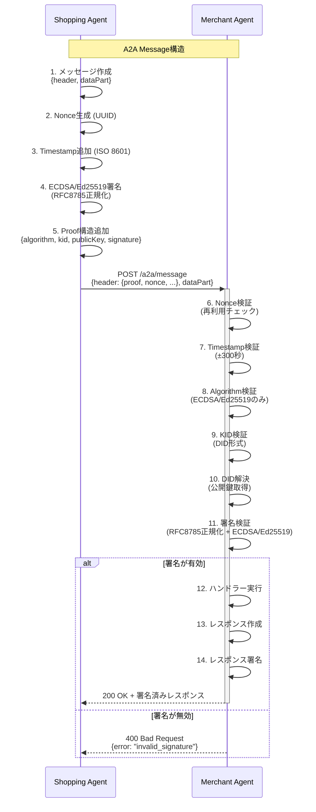
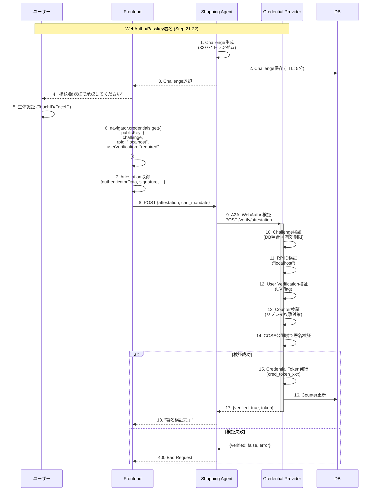
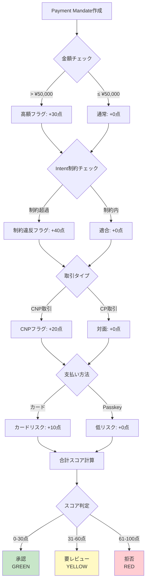
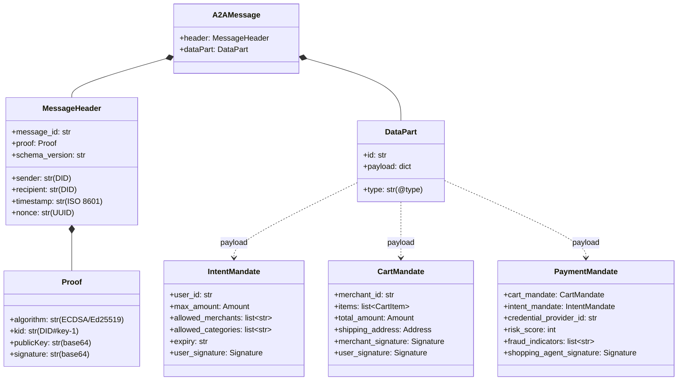

# AP2 (Agent Payments Protocol) デモアプリケーション v2

このアプリケーションは、[AP2プロトコル](https://ap2-protocol.org/)の完全なマイクロサービス実装です。AIエージェント間の安全な決済処理を、エンドツーエンドで体験できます。


## 目次

- [概要](#概要)
- [アーキテクチャ](#アーキテクチャ)
- [主要フロー](#主要フロー)
- [セットアップ](#セットアップ)
- [使い方](#使い方)
- [技術スタック](#技術スタック)
- [開発者向け情報](#開発者向け情報)

---

## 概要

### AP2とは？

**AP2 (Agent Payments Protocol)** は、AIエージェントが安全に決済を実行するためのオープンプロトコルです。Googleと60以上の組織によって開発され、以下の特徴があります：

- **エージェント間通信 (A2A)**: 署名付きメッセージによる安全な通信
- **3種類のMandate**: IntentMandate（購買意図）、CartMandate（カート）、PaymentMandate（決済）
- **WebAuthn/Passkey**: ハードウェアベースの認証
- **リスク評価**: 不正検知とリスクスコアリング
- **Agent Token**: 決済ネットワークによるトークン化
- **VDC (Verifiable Digital Credentials)**: 検証可能なデジタル資格情報

### v2アプリの特徴

このv2実装は、AP2仕様を100%準拠した実装で、以下を提供します：

✅ **12つのマイクロサービス**: Shopping Agent、Shopping Agent MCP、Merchant Agent、Merchant Agent MCP、Merchant、Credential Provider、Payment Processor、Payment Network、Meilisearch、Jaeger、Redis、Frontend
✅ **完全なA2A通信**: ECDSA/Ed25519署名、Nonce検証、DID解決
✅ **WebAuthn/Passkey対応**: FIDO2準拠の署名検証
✅ **SSE/Streaming Chat**: リアルタイムな対話型UI
✅ **AI駆動の商品検索**: LangGraph + MCP統合、Meilisearch全文検索
✅ **決済ネットワーク統合**: Agent Token発行・トークン化
✅ **Docker Compose**: ワンコマンドで全サービス起動
✅ **統一ロギング**: JSON/テキスト形式、機密データマスキング

---

## アーキテクチャ

### システム構成図

```mermaid
graph TB
    subgraph "Frontend (Port 3000)"
        UI[Next.js UI<br/>Chat + Merchant Dashboard]
    end

    subgraph "Backend Services"
        SA[Shopping Agent<br/>Port 8000<br/>v2/services/shopping_agent/]
        MA[Merchant Agent<br/>Port 8001<br/>v2/services/merchant_agent/]
        MA_MCP[Merchant Agent MCP<br/>Port 8011<br/>v2/services/merchant_agent_mcp/]
        M[Merchant<br/>Port 8002<br/>v2/services/merchant/]
        CP[Credential Provider<br/>Port 8003<br/>v2/services/credential_provider/]
        PP[Payment Processor<br/>Port 8004<br/>v2/services/payment_processor/]
        PN[Payment Network<br/>Port 8005<br/>v2/services/payment_network/]
        MS[Meilisearch<br/>Port 7700<br/>全文検索エンジン]
    end

    subgraph "Data Layer"
        DB1[(Shopping Agent DB<br/>SQLite<br/>v2/data/shopping_agent.db)]
        DB2[(Merchant Agent DB<br/>SQLite<br/>v2/data/merchant_agent.db)]
        DB3[(Credential Provider DB<br/>SQLite<br/>v2/data/credential_provider.db)]
        DB4[(Payment Processor DB<br/>SQLite<br/>v2/data/payment_processor.db)]
        REDIS[(Redis KV Store<br/>Port 6379<br/>一時データ管理)]
    end

    subgraph "Security & Crypto"
        KEYS[Keys Storage<br/>ECDSA + Ed25519<br/>AES-256 Encrypted<br/>v2/keys/]
        DID[DID Documents<br/>JSON<br/>v2/data/did_documents/]
    end

    subgraph "Common Modules<br/>v2/common/"
        BASE[base_agent.py<br/>BaseAgent]
        A2A[a2a_handler.py<br/>A2AMessageHandler]
        CRYPTO[crypto.py<br/>KeyManager<br/>SignatureManager]
        MODELS[models.py<br/>Pydantic Models]
        DB[database.py<br/>DatabaseManager]
        RISK[risk_assessment.py<br/>RiskEngine]
        DID_RESOLVER[did_resolver.py<br/>DIDResolver]
        REDIS_CLIENT[redis_client.py<br/>RedisClient<br/>TokenStore<br/>SessionStore]
    end

    UI -->|SSE/Stream| SA
    UI -->|REST API| M

    SA -->|A2A Message<br/>POST /a2a/message| MA
    SA -->|A2A Message| CP
    SA -->|A2A Message| M
    MA -->|A2A Message| PP
    MA -->|LangGraph Tools| MA_MCP
    MA_MCP -->|商品検索| MS
    CP -->|Agent Token発行| PN

    SA -.->|Read/Write| DB1
    MA -.->|Read/Write| DB2
    CP -.->|Read/Write<br/>永続データ| DB3
    PP -.->|Read/Write| DB4

    CP -.->|Read/Write<br/>一時データ<br/>TTL管理| REDIS

    SA -.->|Load Keys| KEYS
    MA -.->|Load Keys| KEYS
    M -.->|Load Keys| KEYS
    CP -.->|Load Keys| KEYS
    PP -.->|Load Keys| KEYS

    SA -.->|Resolve DID| DID
    MA -.->|Resolve DID| DID

    SA --> BASE
    MA --> BASE
    M --> BASE
    CP --> BASE
    PP --> BASE

    BASE --> A2A
    BASE --> CRYPTO
    BASE --> MODELS

    A2A --> CRYPTO
    A2A --> DID_RESOLVER

    SA --> DB
    MA --> DB
    CP --> DB
    PP --> DB

    CP --> REDIS_CLIENT

    SA --> RISK

    style UI fill:#e1f5ff
    style SA fill:#fff4e6
    style MA fill:#fff4e6
    style MA_MCP fill:#e1bee7
    style M fill:#fff4e6
    style CP fill:#e8f5e9
    style PP fill:#e8f5e9
    style PN fill:#b2dfdb
    style MS fill:#ffccbc
    style REDIS fill:#fce4ec
    style BASE fill:#ffe0b2
    style A2A fill:#ffe0b2
    style CRYPTO fill:#ffe0b2
    style REDIS_CLIENT fill:#ffe0b2
```



### マイクロサービス一覧

| サービス | ポート | 役割 | 主要エンドポイント |
|---------|--------|------|-------------------|
| **Frontend** | 3000 | ユーザーインターフェース | `/`, `/chat`, `/merchant` |
| **Shopping Agent** | 8000 | ユーザー代理エージェント、LangGraph統合 | `/chat/stream`, `/intent/challenge`, `/consent/submit` |
| **Shopping Agent MCP** | 8010 | MCPツールサーバー（LangGraph用） | `/mcp/tools/list`, `/mcp/tools/call` |
| **Merchant Agent** | 8001 | 商品検索・Cart作成、LangGraph統合 | `/search`, `/create-cart`, `/a2a/message` |
| **Merchant Agent MCP** | 8011 | MCPツールサーバー（LangGraph用） | `/mcp/tools/list`, `/mcp/tools/call` |
| **Merchant** | 8002 | Cart署名・在庫管理（Agentと分離） | `/sign/cart`, `/inventory/{sku}` |
| **Credential Provider** | 8003 | WebAuthn検証・トークン発行・Step-up | `/verify/attestation`, `/payment-methods/tokenize` |
| **Payment Processor** | 8004 | 決済処理・Mandate連鎖検証・領収書生成 | `/process`, `/transactions/{id}`, `/receipts/{id}.pdf` |
| **Payment Network** | 8005 | Agent Token発行・決済ネットワークスタブ | `/network/tokenize`, `/network/validate-token` |
| **Meilisearch** | 7700 | 全文検索エンジン（商品検索） | `/indexes/products/search` |
| **Jaeger** | 16686 | OpenTelemetry分散トレーシングUI | `/search` |
| **Redis** | 6379 | KVストア（一時データ・セッション管理） | N/A（内部使用） |

---

## 主要フロー

### 1. 購買フロー全体（実装ベース）

```mermaid
sequenceDiagram
    participant User as ユーザー<br/>(Browser)
    participant UI as Frontend<br/>(Next.js)
    participant SA as Shopping Agent<br/>:8000
    participant MA as Merchant Agent<br/>:8001
    participant M as Merchant<br/>:8002
    participant CP as Credential Provider<br/>:8003
    participant PP as Payment Processor<br/>:8004
    participant DB as Database

    Note over User,PP: Phase 1: チャット開始と購買意図確立

    User->>UI: 1. チャット開始<br/>"むぎぼーのグッズが欲しい"
    UI->>+SA: POST /chat/stream<br/>{user_input: "むぎぼーのグッズが欲しい"}

    SA->>SA: 2. セッション作成<br/>step: "initial"
    SA-->>UI: 3. SSE: agent_text<br/>"こんにちは！AP2 Shopping Agentです"
    SA-->>UI: 4. SSE: agent_text<br/>"「むぎぼーのグッズが欲しい」ですね！"
    SA->>SA: 5. step = "ask_max_amount"
    SA-->>UI: 6. SSE: agent_text<br/>"最大金額を教えてください"
    UI-->>User: 7. 応答表示

    User->>UI: 8. 金額入力<br/>"50000円"
    UI->>SA: POST /chat/stream<br/>{user_input: "50000"}

    SA->>SA: 9. 金額パース: ¥50,000
    SA->>SA: 10. step = "ask_categories"
    SA-->>UI: 11. SSE: agent_text<br/>"最大金額を50,000円に設定しました"
    SA-->>UI: 12. SSE: agent_text<br/>"カテゴリーを指定しますか？"

    User->>UI: 13. カテゴリー入力<br/>"カレンダー"
    UI->>SA: POST /chat/stream<br/>{user_input: "カレンダー"}

    SA->>SA: 14. step = "ask_shipping"
    SA-->>UI: 15. SSE: agent_text<br/>"配送先住所を入力してください"
    SA-->>UI: 16. SSE: shipping_form_request<br/>{fields: [...]}

    User->>UI: 17. 配送先入力<br/>{recipient: "山田太郎", ...}
    UI->>SA: POST /chat/stream<br/>{shipping_address: {...}}

    SA->>SA: 18. Intent Mandate作成<br/>(max: ¥50,000, cat: calendar)
    SA->>SA: 19. ECDSA署名
    SA->>DB: 20. Intent保存
    SA->>SA: 21. step = "search_products"

    Note over User,PP: Phase 2: 商品検索とCart候補作成

    SA->>+MA: 22. A2A: 商品検索<br/>POST /a2a/message<br/>@type: "ap2/ProductSearchRequest"
    MA->>MA: 23. 署名検証<br/>(Nonce, Timestamp, ECDSA)
    MA->>DB: 24. 商品検索<br/>(query: "むぎぼー", cat: "calendar")
    MA-->>-SA: 25. A2A: 商品リスト<br/>@type: "ap2/ProductList"

    SA-->>UI: 26. SSE: product_list<br/>[{sku, name, price, image}, ...]
    UI-->>User: 27. 商品カルーセル表示

    User->>UI: 28. 商品選択<br/>"1"（カレンダーを選択）
    UI->>SA: POST /chat/stream<br/>{user_input: "1"}

    SA->>SA: 29. 選択商品をセッションに保存
    SA->>SA: 30. step = "request_cart_candidates"

    SA->>+MA: 31. A2A: Cart候補リクエスト<br/>POST /a2a/message<br/>@type: "ap2/CartCandidatesRequest"
    MA->>MA: 32. 署名検証
    MA->>MA: 33. Cart候補生成<br/>(3つのバリエーション)

    loop 各Cart候補
        MA->>+M: 34. A2A: Cart署名リクエスト<br/>POST /a2a/message<br/>@type: "ap2/SignCartRequest"
        M->>M: 35. 署名検証
        M->>DB: 36. 在庫確認
        M->>M: 37. Cart Mandate署名<br/>(ECDSA)
        M-->>-MA: 38. A2A: 署名済みCart<br/>merchant_signature付き
    end

    MA-->>-SA: 39. A2A: Cart候補リスト<br/>@type: "ap2/Artifact"<br/>(3つの署名済みCart)

    SA->>SA: 40. Merchant署名を検証
    SA-->>UI: 41. SSE: cart_options<br/>[{name, items, total}, ...]
    SA->>SA: 42. step = "cart_selection"
    UI-->>User: 43. Cart選択UI表示

    Note over User,PP: Phase 3: Cart選択とユーザー署名

    User->>UI: 44. Cart選択<br/>"2"（スタンダードを選択）
    UI->>SA: POST /chat/stream<br/>{user_input: "2"}

    SA->>SA: 45. 選択されたCart Mandateを保存
    SA->>SA: 46. Merchant署名を暗号学的に検証
    SA-->>UI: 47. SSE: agent_text<br/>"✅ Merchant署名確認完了"
    SA-->>UI: 48. SSE: signature_request<br/>{mandate: cart, type: "cart"}
    SA->>SA: 49. step = "cart_signature_pending"
    UI-->>User: 50. WebAuthn署名プロンプト表示

    User->>UI: 51. Passkey署名<br/>(TouchID/FaceID)
    UI->>UI: 52. navigator.credentials.get()
    UI->>UI: 53. WebAuthn Assertion取得

    UI->>SA: 54. POST /cart/submit-signature<br/>{cart_mandate, webauthn_assertion}

    SA->>SA: 55. Challenge検証
    SA->>+CP: 56. A2A: WebAuthn検証<br/>POST /a2a/message<br/>@type: "ap2/VerifyAttestationRequest"
    CP->>CP: 57. 署名検証
    CP->>DB: 58. Challenge照合
    CP->>CP: 59. FIDO2検証<br/>(RP ID, UV, Counter, COSE署名)
    CP->>CP: 60. Credential Token発行
    CP->>DB: 61. Counter更新
    CP-->>-SA: 62. A2A: {verified: true, token}

    SA->>SA: 63. User署名をCart Mandateに追加
    SA->>SA: 64. step = "shipping_confirmed"

    Note over User,PP: Phase 4: Credential Provider選択

    SA-->>UI: 65. SSE: agent_text<br/>"Credential Providerを選択してください"
    SA-->>UI: 66. SSE: credential_provider_selection<br/>[{id, name, logo}, ...]
    SA->>SA: 67. step = "select_credential_provider"

    User->>UI: 68. CP選択<br/>"1"（Demo CP）
    UI->>SA: POST /chat/stream<br/>{user_input: "1"}

    SA->>SA: 69. CPをセッションに保存
    SA->>+CP: 70. A2A: 支払い方法取得<br/>POST /a2a/message<br/>@type: "ap2/GetPaymentMethodsRequest"
    CP->>CP: 71. 署名検証
    CP->>DB: 72. user_idから支払い方法取得
    CP-->>-SA: 73. A2A: 支払い方法リスト

    SA-->>UI: 74. SSE: payment_method_selection<br/>[{brand, last4, type}, ...]
    SA->>SA: 75. step = "select_payment_method"

    Note over User,PP: Phase 5: 支払い方法選択と決済処理

    User->>UI: 76. 支払い方法選択<br/>"Visa ****1234"
    UI->>SA: POST /chat/stream<br/>{payment_method_id: "pm_123"}

    alt Step-up認証が必要
        SA->>+CP: 77. A2A: Step-up開始<br/>POST /a2a/message<br/>@type: "ap2/InitiateStepUpRequest"
        CP->>CP: 78. Step-upセッション作成
        CP-->>-SA: 79. A2A: {step_up_url, session_id}
        SA-->>UI: 80. SSE: step_up_required<br/>{url: "..."}
        UI->>UI: 81. 別ウィンドウでStep-up開始
        User->>CP: 82. 3DS/OTP認証完了
        CP->>SA: 83. Callback: /payment/step-up-callback
        SA->>SA: 84. トークン保存
    end

    SA->>SA: 85. Payment Mandate作成
    SA->>SA: 86. リスク評価<br/>(8要素, 0-100点)
    SA->>SA: 87. Shopping Agent署名<br/>(ECDSA)
    SA->>SA: 88. step = "webauthn_attestation_requested"

    SA-->>UI: 89. SSE: agent_text<br/>"デバイス認証を実施します"
    SA-->>UI: 90. SSE: webauthn_request<br/>{challenge, rp_id}

    User->>UI: 91. Passkey署名<br/>(TouchID/FaceID)
    UI->>UI: 92. WebAuthn Assertion取得

    UI->>SA: 93. POST /payment/submit-webauthn<br/>{payment_mandate, attestation}

    SA->>+CP: 94. A2A: WebAuthn検証<br/>POST /a2a/message
    CP->>CP: 95. FIDO2検証
    CP-->>-SA: 96. A2A: {verified: true}

    SA->>SA: 97. step = "payment_processing"
    SA-->>UI: 98. SSE: agent_text<br/>"決済処理中..."

    SA->>+MA: 99. A2A: Payment処理依頼<br/>POST /a2a/message<br/>@type: "ap2/ProcessPaymentRequest"
    MA->>MA: 100. 署名検証
    MA->>+PP: 101. A2A: Payment転送<br/>POST /a2a/message

    PP->>PP: 102. 3層署名検証<br/>(Shopping Agent, Merchant, User)
    PP->>PP: 103. リスク評価確認
    PP->>PP: 104. Authorize<br/>(txn_id生成)
    PP->>PP: 105. Capture
    PP->>DB: 106. Transaction保存

    PP-->>-MA: 107. A2A: 決済結果<br/>{status: "captured", txn_id}
    MA-->>-SA: 108. A2A: 決済結果転送

    SA->>DB: 109. Transaction保存
    SA->>SA: 110. step = "payment_completed"
    SA-->>UI: 111. SSE: payment_complete<br/>{txn_id, receipt_url}
    SA-->>UI: 112. SSE: done

    UI-->>User: 113. 決済完了画面<br/>領収書ダウンロード
```



### 2. A2A通信の詳細



### 3. WebAuthn/Passkey署名フロー



### 4. リスク評価フロー



---

## セットアップ

### 前提条件

- Docker & Docker Compose
- Python 3.10+ (ローカル開発時)
- Node.js 18+ (フロントエンド開発時)

### クイックスタート（推奨）

```bash
# 1. リポジトリをクローン
git clone <repository-url>
cd ap2

# 2. 鍵とDIDドキュメントを生成（初回のみ）
cd v2
docker compose run --rm init-keys

# 3. 全サービスを起動
docker compose up --build

# 4. Meilisearch商品インデックスの初期化（初回のみ、別ターミナル）
# サービス起動後、商品データをMeilisearchにインデックス登録
docker compose exec merchant_agent_mcp python -c "
from common.search_engine import MeilisearchClient
from common.seed_data import seed_products
import asyncio
async def init():
    client = MeilisearchClient()
    await client.create_index()
asyncio.run(init())
"

# 5. ブラウザでアクセス
open http://localhost:3000
```

### 起動確認

```bash
# 各サービスのヘルスチェック
curl http://localhost:8000/  # Shopping Agent
curl http://localhost:8001/  # Merchant Agent
curl http://localhost:8011/  # Merchant Agent MCP
curl http://localhost:8002/  # Merchant
curl http://localhost:8003/  # Credential Provider
curl http://localhost:8004/  # Payment Processor
curl http://localhost:8005/  # Payment Network
curl http://localhost:7700/health  # Meilisearch

# 各エージェントは以下のようなレスポンスが返ればOK
{
  "agent_id": "did:ap2:agent:shopping_agent",
  "agent_name": "Shopping Agent",
  "status": "running",
  "version": "2.0.0"
}
```

### ログ確認

```bash
# 全サービスのログを表示
docker compose logs -f

# 特定サービスのログ
docker compose logs -f shopping_agent

# デバッグモードで起動（詳細ログ）
LOG_LEVEL=DEBUG docker compose up
```

---

## 使い方

### 1. Chat UIで購買体験

1. http://localhost:3000/chat にアクセス
2. "ランニングシューズが欲しい" と入力
3. 条件を指定（ブランド、予算など）
4. 商品カルーセルから選択
5. 配送先を入力
6. Passkey署名（ブラウザの生体認証）
7. 決済完了 → 領収書表示

### 2. Merchant Dashboardで在庫管理

1. http://localhost:3000/merchant にアクセス
2. 商品一覧を確認
3. 在庫数を編集
4. 新規商品を追加

### 3. API直接呼び出し（開発者向け）

```bash
# IntentMandate作成
curl -X POST http://localhost:8000/create-intent \
  -H "Content-Type: application/json" \
  -d '{
    "user_id": "user_demo_001",
    "max_amount": {"currency": "JPY", "value": "15000"},
    "allowed_merchants": ["did:ap2:merchant:sneaker_shop"],
    "allowed_categories": ["shoes"]
  }'

# 商品検索
curl "http://localhost:8001/products?query=nike&limit=5"

# A2Aメッセージ送信
curl -X POST http://localhost:8000/a2a/message \
  -H "Content-Type: application/json" \
  -d @sample_a2a_message.json
```

---

## 技術スタック

### バックエンド

| 技術 | バージョン | 用途 |
|------|-----------|------|
| **FastAPI** | 0.115.0 | RESTful API フレームワーク |
| **SQLAlchemy** | 2.0.35 | ORM（データベース操作） |
| **aiosqlite** | 0.20.0 | 非同期SQLiteドライバ |
| **redis** | 5.0.0+ | Redis非同期クライアント（一時データKV） |
| **cryptography** | 43.0.0 | ECDSA署名 |
| **fido2** | 1.1.3 | WebAuthn検証 |
| **sse-starlette** | 2.1.0 | Server-Sent Events |
| **httpx** | 0.27.0 | 非同期HTTPクライアント |
| **rfc8785** | 0.1.3 | JSON正規化（署名用） |
| **LangGraph** | 0.2.x | エージェントワークフロー |
| **LangChain** | 0.3.x | LLM統合 |
| **Langfuse** | 2.x | LLM監視（オプション） |

### 検索・AI

| 技術 | 用途 |
|------|------|
| **Meilisearch** | 全文検索エンジン（商品検索） |
| **MCP** | Model Context Protocol（ツールサーバー） |

### フロントエンド

| 技術 | 用途 |
|------|------|
| **Next.js 15** | フルスタックフレームワーク（App Router） |
| **TypeScript** | 型安全性 |
| **TailwindCSS** | スタイリング |
| **shadcn/ui** | UIコンポーネント |

### インフラ

- **Docker Compose** - サービスオーケストレーション
- **SQLite** - データベース（開発環境、永続データ保存）
- **Redis 7-alpine** - KVストア（一時データ・セッション・トークン管理、TTL自動削除）
- **Docker Volumes** - データ永続化（keys/、data/、meilisearch_data/、redis_data/）

---

## 開発者向け情報

### ディレクトリ構造

```
v2/
├── common/                    # 共通モジュール（全サービスで共有）
│   ├── models.py              # Pydanticモデル（A2Aメッセージ、API型）
│   │                          # - A2AMessage, A2AMessageHeader, A2AProof
│   │                          # - Signature, DeviceAttestation
│   │                          # - DIDDocument, VerificationMethod
│   │                          # - StreamEvent, ChatStreamRequest
│   ├── a2a_handler.py         # A2Aメッセージ処理・署名検証
│   │                          # クラス: A2AMessageHandler
│   │                          # - verify_message_signature() : 署名検証（ECDSA/Ed25519）
│   │                          # - handle_message() : メッセージルーティング
│   │                          # - create_response_message() : レスポンス作成
│   ├── base_agent.py          # 全エージェントの基底クラス
│   │                          # クラス: BaseAgent (抽象クラス)
│   │                          # - 共通エンドポイント: POST /a2a/message
│   │                          # - 鍵管理の初期化
│   │                          # - A2AMessageHandlerの設定
│   ├── crypto.py              # 暗号化モジュール（RFC 8785準拠）
│   │                          # クラス: KeyManager
│   │                          # - generate_key_pair() : ECDSA鍵生成
│   │                          # - generate_ed25519_key_pair() : Ed25519鍵生成
│   │                          # - save/load_private_key_encrypted() : AES-256-GCM暗号化
│   │                          # クラス: SignatureManager
│   │                          # - sign_data() : データ署名（ECDSA/Ed25519）
│   │                          # - verify_signature() : 署名検証
│   │                          # - sign_mandate() : Mandate署名
│   │                          # - sign_a2a_message() : A2Aメッセージ署名
│   │                          # 関数: canonicalize_json() : RFC 8785 JSON正規化
│   │                          # クラス: WebAuthnChallengeManager
│   │                          # - generate_challenge() : WebAuthn challenge生成
│   │                          # - verify_and_consume_challenge() : challenge検証
│   │                          # クラス: DeviceAttestationManager
│   │                          # - verify_webauthn_signature() : WebAuthn署名検証
│   ├── database.py            # SQLAlchemyモデル + CRUD
│   │                          # クラス: DatabaseManager
│   │                          # - init_db() : データベース初期化
│   │                          # - get_session() : セッション取得
│   │                          # クラス: MandateCRUD, ProductCRUD, TransactionCRUD, ReceiptCRUD
│   ├── redis_client.py        # Redis KVストアクライアント
│   │                          # クラス: RedisClient
│   │                          # - set/get/delete() : 基本KV操作
│   │                          # - TTL管理（自動削除）
│   │                          # クラス: TokenStore
│   │                          # - save_token/get_token() : トークン管理（TTL: 15分）
│   │                          # クラス: SessionStore
│   │                          # - save_session/get_session() : セッション管理（TTL: 10分）
│   │                          # - WebAuthn challenge管理（TTL: 60秒）
│   ├── risk_assessment.py     # リスク評価エンジン
│   │                          # クラス: RiskAssessmentEngine
│   │                          # - assess_payment_mandate() : リスクスコア計算（0-100）
│   │                          # - 8つの評価要素を統合
│   ├── nonce_manager.py       # Nonce管理（リプレイ攻撃対策）
│   │                          # クラス: NonceManager
│   │                          # - is_valid_nonce() : Nonce検証（TTL付き）
│   ├── did_resolver.py        # DID解決
│   │                          # クラス: DIDResolver
│   │                          # - resolve_public_key() : DIDから公開鍵を解決
│   ├── logger.py              # 統一ロギング（JSON/テキスト）
│   │                          # 機密データマスキング機能付き
│   ├── user_authorization.py  # User Authorization VP作成
│   │                          # - create_user_authorization_vp() : Verifiable Presentation
│   ├── mandate_types.py       # AP2 Mandate型定義（5型）
│   │                          # - IntentMandate, CartMandate, PaymentMandate
│   ├── payment_types.py       # W3C Payment Request API型（11型）
│   │                          # - PaymentCurrencyAmount, PaymentItem, PaymentRequest
│   ├── jwt_utils.py           # JWT生成・検証
│   │                          # - MerchantAuthorizationJWT, UserAuthorizationSDJWT
│   ├── search_engine.py       # Meilisearch検索クライアント
│   │                          # クラス: MeilisearchClient
│   │                          # - search() : 全文検索
│   │                          # - index_product() : 商品インデックス登録
│   │                          # - create_index() : インデックス作成
│   ├── mcp_server.py          # MCP (Model Context Protocol) サーバー
│   │                          # クラス: MCPServer
│   │                          # - JSON-RPC 2.0準拠
│   │                          # - Streamable HTTP Transport
│   │                          # - tool() デコレーター: MCPツール登録
│   ├── mcp_client.py          # MCPクライアント
│   │                          # クラス: MCPClient
│   │                          # - call_tool() : MCPツール呼び出し
│   │                          # - list_tools() : 利用可能ツール一覧取得
│   ├── receipt_generator.py   # PDF領収書生成
│   │                          # 関数: generate_receipt_pdf()
│   │                          # - ReportLab使用、CartMandate必須（VDC交換原則）
│   ├── agent_passphrase_manager.py # Passphrase管理
│   │                          # クラス: AgentPassphraseManager
│   │                          # - 環境変数から各エージェントのパスフレーズを取得
│   └── seed_data.py           # サンプルデータ
│                               # - seed_products() : 商品データシード
│                               # - seed_users() : ユーザーデータシード
│
├── services/                  # マイクロサービス（各エージェント実装）
│   ├── shopping_agent/        # Shopping Agent（ユーザー代理）
│   │   ├── agent.py           # ShoppingAgentクラス
│   │   │                      # - __init__() : DB/HTTPクライアント初期化
│   │   │                      # - register_endpoints() : エンドポイント登録
│   │   │                      #   POST /chat/stream : SSEストリーミングチャット
│   │   │                      #   POST /intent/challenge : WebAuthn Challenge生成
│   │   │                      #   POST /intent/submit : Intent署名検証・保存
│   │   │                      #   POST /consent/challenge : Cart Consent Challenge生成
│   │   │                      #   POST /consent/submit : Cart署名検証・保存
│   │   │                      # - _search_products_via_merchant_agent() : A2A通信
│   │   │                      # - _create_payment_mandate() : PaymentMandate作成
│   │   ├── main.py            # FastAPIエントリーポイント
│   │   ├── langgraph_agent.py # LangGraph統合（AI機能）
│   │   ├── langgraph_conversation.py # 対話エージェント（AI）
│   │   ├── mcp_tools.py       # MCPツール定義
│   │   └── Dockerfile
│   ├── shopping_agent_mcp/    # Shopping Agent MCP（MCPツールサーバー）
│   │   ├── main.py            # MCPサーバー（LangGraph用ツール）
│   │   │                      # - build_intent_mandate: IntentMandate構築
│   │   │                      # - request_cart_candidates: Cart候補取得
│   │   │                      # - assess_payment_risk: リスク評価
│   │   │                      # - build_payment_mandate: PaymentMandate構築
│   │   │                      # - execute_payment: 決済実行
│   │   └── Dockerfile
│   ├── merchant_agent/        # Merchant Agent（商品検索・Cart作成）
│   │   ├── agent.py           # MerchantAgentクラス
│   │   │                      # - handle_intent_mandate() : IntentMandate処理
│   │   │                      # - _create_cart_mandate() : Cart作成（未署名）
│   │   │                      # - handle_cart_request() : 商品検索＋Cart候補生成
│   │   ├── main.py            # FastAPIエントリーポイント
│   │   ├── langgraph_merchant.py # LangGraph統合（AI化）
│   │   └── Dockerfile
│   ├── merchant_agent_mcp/    # Merchant Agent MCP（MCPツールサーバー）
│   │   ├── main.py            # MCPサーバー（LangGraph用ツール）
│   │   │                      # - analyze_intent: Intent分析
│   │   │                      # - search_products: Meilisearch検索
│   │   │                      # - create_cart: Cart候補生成
│   │   └── Dockerfile
│   ├── merchant/              # Merchant（実店舗エンティティ）
│   │   ├── service.py         # MerchantServiceクラス
│   │   │                      # - sign_cart_mandate() : 106行目（Cart署名）
│   │   │                      #   1. _validate_cart_mandate() : バリデーション（139行目）
│   │   │                      #   2. _check_inventory() : 在庫確認（142行目）
│   │   │                      #   3. _sign_cart_mandate() : ECDSA署名（151行目）
│   │   │                      #   4. _generate_merchant_authorization_jwt() : JWT生成（156行目）
│   │   ├── main.py            # FastAPIエントリーポイント
│   │   └── Dockerfile
│   ├── credential_provider/   # Credential Provider（認証・支払い方法管理）
│   │   ├── provider.py        # CredentialProviderクラス
│   │   │                      # - verify_webauthn_attestation() : WebAuthn検証
│   │   │                      # - get_payment_methods() : 支払い方法取得
│   │   │                      # - tokenize_payment_method() : トークン発行（Redis保存、TTL: 15分）
│   │   │                      # - initiate_step_up() : Step-up認証開始（Redisセッション、TTL: 10分）
│   │   │                      # - register_passkey_challenge() : Challenge生成（Redis保存、TTL: 60秒）
│   │   ├── main.py            # FastAPIエントリーポイント
│   │   └── Dockerfile
│   ├── payment_processor/     # Payment Processor（決済処理）
│   │   ├── processor.py       # PaymentProcessorクラス
│   │   │                      # - process_payment() : 決済処理
│   │   │                      #   1. 3層署名検証（Shopping Agent, Merchant, User）
│   │   │                      #   2. リスク評価確認
│   │   │                      #   3. Authorize（txn_id生成）
│   │   │                      #   4. Capture
│   │   ├── main.py            # FastAPIエントリーポイント
│   │   └── Dockerfile
│   └── payment_network/       # Payment Network（Agent Token発行）
│       ├── network.py         # PaymentNetworkクラス
│       │                      # - tokenize() : Agent Token発行
│       │                      # - validate_token() : トークン検証
│       ├── main.py            # FastAPIエントリーポイント
│       └── Dockerfile
│
├── scripts/                   # 初期化スクリプト
│   ├── init_keys.py           # 鍵生成・DID作成
│   │                          # - ECDSA鍵 + Ed25519鍵を全エージェント分生成
│   │                          # - DIDドキュメント生成（W3C DID仕様準拠）
│   └── init_db.py             # データベース初期化
│
├── frontend/                  # Next.jsフロントエンド
│   ├── app/                   # App Router（Next.js 15）
│   │   ├── chat/              # チャットUI
│   │   └── merchant/          # Merchant Dashboard
│   ├── components/            # React コンポーネント
│   │   ├── auth/              # WebAuthn認証コンポーネント
│   │   ├── cart/              # Cart表示コンポーネント
│   │   ├── chat/              # Chat UI コンポーネント
│   │   ├── product/           # 商品カルーセル
│   │   └── shipping/          # 配送先フォーム
│   ├── lib/                   # ユーティリティ
│   │   ├── webauthn.ts        # WebAuthn関数（navigator.credentials.get）
│   │   └── types/             # TypeScript型定義
│   └── hooks/                 # React Hooks
│       └── useSSEChat.ts      # SSE Chatフック（EventSource）
│
├── data/                      # データ永続化（Docker Volume）
│   ├── shopping_agent.db      # Shopping Agent SQLite DB
│   ├── merchant_agent.db      # Merchant Agent SQLite DB
│   ├── merchant.db            # Merchant SQLite DB
│   ├── credential_provider.db # Credential Provider SQLite DB
│   ├── payment_processor.db   # Payment Processor SQLite DB
│   ├── did_documents/         # DIDドキュメント格納
│   │   ├── shopping_agent_did.json
│   │   ├── merchant_agent_did.json
│   │   ├── merchant_did.json
│   │   ├── credential_provider_did.json
│   │   └── payment_processor_did.json
│   └── receipts/              # PDF領収書格納
│
├── keys/                      # 暗号鍵格納（Docker Volume、権限600）
│   ├── shopping_agent_private.pem        # ECDSA秘密鍵（AES-256暗号化）
│   ├── shopping_agent_public.pem         # ECDSA公開鍵
│   ├── shopping_agent_ed25519_private.pem # Ed25519秘密鍵
│   ├── shopping_agent_ed25519_public.pem  # Ed25519公開鍵
│   ├── merchant_agent_private.pem
│   ├── merchant_agent_public.pem
│   └── ...（他のエージェント分も同様）
│
├── docker-compose.yml         # サービスオーケストレーション
│                               # - 12コンテナ定義:
│                               #   frontend, shopping_agent, merchant_agent,
│                               #   merchant_agent_mcp, merchant, credential_provider,
│                               #   payment_processor, payment_network, meilisearch,
│                               #   jaeger, redis
│                               # - Volume設定（data/、keys/、meilisearch_data/、redis_data/）
│                               # - 環境変数設定（パスフレーズ、Langfuse、Redisなど）
│
├── pyproject.toml             # Python依存関係（uv管理）
│                               # - fastapi, uvicorn, httpx
│                               # - cryptography, fido2
│                               # - sqlalchemy, aiosqlite
│                               # - redis（KVストア）
│                               # - rfc8785, cbor2
│                               # - sse-starlette
│                               # - langgraph, langchain
│                               # - langfuse（オプション）
│
└── README.md                  # このファイル
```

### コードとシーケンスの対応表

README.mdのシーケンス図と実装コードの対応を以下に示します：

#### Phase 1: チャット開始と購買意図確立

| ステップ | シーケンス図の説明 | 実装コード | ファイルパス |
|---------|-------------------|-----------|-------------|
| 1-2 | チャット開始、セッション作成 | `chat_stream()` 関数 | `v2/services/shopping_agent/agent.py:443` |
| 3-6 | SSEイベント送信（agent_text） | `_generate_fixed_response()` | `v2/services/shopping_agent/agent.py:467` |
| 9-11 | 金額パース、step更新 | セッション管理ロジック | `v2/services/shopping_agent/agent.py:460-462` |
| 18-21 | Intent Mandate作成、ECDSA署名 | `sign_mandate()` | `v2/common/crypto.py:705-739` |

#### Phase 2: 商品検索とCart候補作成

| ステップ | シーケンス図の説明 | 実装コード | ファイルパス |
|---------|-------------------|-----------|-------------|
| 22-25 | A2A商品検索リクエスト | `_search_products_via_merchant_agent()` | `v2/services/shopping_agent/agent.py` |
| 23 | A2A署名検証 | `verify_message_signature()` | `v2/common/a2a_handler.py:73-266` |
| 24 | データベース商品検索 | `ProductCRUD.search()` | `v2/common/database.py` |
| 31-33 | Cart候補生成 | `_create_cart_mandate()` | `v2/services/merchant_agent/agent.py` |
| 34-38 | Merchant署名リクエスト | `sign_cart_mandate()` | `v2/services/merchant/service.py:106-196` |
| 37 | ECDSA署名（Cart） | `_sign_cart_mandate()` | `v2/services/merchant/service.py:151` |

#### Phase 3: Cart選択とユーザー署名

| ステップ | シーケンス図の説明 | 実装コード | ファイルパス |
|---------|-------------------|-----------|-------------|
| 46 | Merchant署名検証 | `verify_mandate_signature()` | `v2/common/crypto.py:741-775` |
| 50-53 | WebAuthn署名プロンプト | `generate_consent_challenge()` | `v2/services/shopping_agent/agent.py:291` |
| 52 | navigator.credentials.get() | `webauthn.ts` | `v2/frontend/lib/webauthn.ts` |
| 54-62 | WebAuthn署名検証 | `verify_webauthn_signature()` | `v2/common/crypto.py:1176-1339` |

#### Phase 4: Credential Provider選択

| ステップ | シーケンス図の説明 | 実装コード | ファイルパス |
|---------|-------------------|-----------|-------------|
| 70-73 | 支払い方法取得 | `get_payment_methods()` | `v2/services/credential_provider/provider.py` |

#### Phase 5: 支払い方法選択と決済処理

| ステップ | シーケンス図の説明 | 実装コード | ファイルパス |
|---------|-------------------|-----------|-------------|
| 85-88 | Payment Mandate作成、リスク評価 | `assess_payment_mandate()` | `v2/common/risk_assessment.py` |
| 87 | Shopping Agent署名 | `sign_data()` (ED25519) | `v2/common/crypto.py:581-644` |
| 94-96 | WebAuthn検証 | `verify_webauthn_signature()` | `v2/common/crypto.py:1176-1339` |
| 99-108 | Payment処理依頼（A2A） | `process_payment()` | `v2/services/payment_processor/processor.py` |
| 102 | 3層署名検証 | `verify_signature()` × 3回 | `v2/common/crypto.py:646-703` |

### A2A通信の実装詳細

#### A2Aメッセージ構造（コード実装）

```python
# v2/common/models.py:505-513
class A2AMessage(BaseModel):
    header: A2AMessageHeader  # 送信元/送信先/タイムスタンプ/署名
    dataPart: A2ADataPart     # メッセージペイロード

# v2/common/models.py:355-394
class A2AMessageHeader(BaseModel):
    message_id: str           # uuid-v4
    sender: str               # DID (例: "did:ap2:agent:shopping_agent")
    recipient: str            # DID
    timestamp: str            # ISO 8601 (例: "2025-10-23T12:34:56Z")
    nonce: str                # 32バイトhex（リプレイ攻撃対策）
    proof: Optional[A2AProof] # 署名証明（W3C VC仕様準拠）
```

#### A2A署名検証フロー（コード実装）

```python
# v2/common/a2a_handler.py:73-266
async def verify_message_signature(self, message: A2AMessage) -> bool:
    # 1. Algorithm検証（ECDSA/Ed25519のみ許可）
    if proof.algorithm.lower() not in ["ecdsa", "ed25519"]:
        return False

    # 2. KID検証（DID形式確認）
    if not proof.kid.startswith("did:") or "#" not in proof.kid:
        return False

    # 3. Timestamp検証（±300秒の許容範囲）
    msg_timestamp = datetime.fromisoformat(message.header.timestamp.replace('Z', '+00:00'))
    now = datetime.now(timezone.utc)
    time_diff = abs((now - msg_timestamp).total_seconds())
    if time_diff > 300:
        return False

    # 4. Nonce検証（再利用チェック）
    if not await self.nonce_manager.is_valid_nonce(message.header.nonce):
        return False

    # 5. DIDベースの公開鍵解決
    resolved_public_key_pem = self.did_resolver.resolve_public_key(proof.kid)

    # 6. RFC 8785正規化 + 署名検証
    canonical_json = canonicalize_a2a_message(message_dict)
    is_valid = self.signature_manager.verify_signature(canonical_json, signature_obj)

    return is_valid
```

#### RFC 8785 JSON正規化（AP2準拠）

```python
# v2/common/crypto.py:65-122
def canonicalize_json(data: Dict[str, Any], exclude_keys: Optional[list] = None) -> str:
    """
    RFC 8785 (JSON Canonicalization Scheme) 完全準拠

    ✓ 1. キーをUnicodeコードポイント順にソート
    ✓ 2. 余分な空白を削除
    ✓ 3. UTF-8エンコーディング
    ✓ 4. 数値の正規化（1.0 vs 1など）
    ✓ 5. Unicode正規化
    ✓ 6. Enumを.valueに変換
    """
    import rfc8785  # 外部ライブラリ使用（厳密な相互運用性のため）

    # Enumを.valueに変換
    converted_data = convert_enums(data_copy)

    # RFC 8785準拠のCanonical JSON文字列を生成
    canonical_bytes = rfc8785.dumps(converted_data)
    canonical_json = canonical_bytes.decode('utf-8')

    return canonical_json
```

### クラス図（主要コンポーネント）


### 主要なデータモデル



### 環境変数

```bash
# ロギング設定
LOG_LEVEL=INFO                    # DEBUG/INFO/WARNING/ERROR/CRITICAL
LOG_FORMAT=text                   # text/json

# データベース
DATABASE_URL=sqlite+aiosqlite:////app/v2/data/shopping_agent.db

# Redis KVストア（一時データ管理）
REDIS_URL=redis://redis:6379/0

# 鍵管理
AP2_KEYS_DIRECTORY=/app/v2/keys
AP2_SHOPPING_AGENT_PASSPHRASE=your_passphrase_here
AP2_MERCHANT_AGENT_PASSPHRASE=your_passphrase_here
AP2_MERCHANT_PASSPHRASE=your_passphrase_here
AP2_CREDENTIAL_PROVIDER_PASSPHRASE=your_passphrase_here
AP2_PAYMENT_PROCESSOR_PASSPHRASE=your_passphrase_here

# サービスエンドポイント（Docker Compose内部）
MERCHANT_AGENT_URL=http://merchant_agent:8001
MERCHANT_URL=http://merchant:8002
PAYMENT_PROCESSOR_URL=http://payment_processor:8004
CREDENTIAL_PROVIDER_URL=http://credential_provider:8003
PAYMENT_NETWORK_URL=http://payment_network:8005
MERCHANT_MCP_URL=http://merchant_agent_mcp:8011

# AI/LLM設定（オプション）
DMR_API_URL=http://host.docker.internal:12434/engines/llama.cpp/v1
DMR_MODEL=ai/qwen3
DMR_API_KEY=none
MERCHANT_AI_MODE=true             # Merchant AgentのAI機能を有効化

# Meilisearch設定
MEILISEARCH_URL=http://meilisearch:7700
MEILISEARCH_MASTER_KEY=masterKey123

# Langfuse設定（オプション：LLM監視）
LANGFUSE_ENABLED=false
LANGFUSE_PUBLIC_KEY=
LANGFUSE_SECRET_KEY=
LANGFUSE_HOST=https://cloud.langfuse.com
```

### トラブルシューティング

#### 鍵が見つからないエラー

```bash
# 鍵を再生成
docker compose run --rm init-keys

# または手動で
docker compose exec shopping_agent python /app/v2/scripts/init_keys.py
```

#### データベースエラー

```bash
# データベースをリセット
docker compose down -v
docker compose up --build
```

#### ポート競合

```bash
# 使用中のポートを確認
lsof -ti:8000 | xargs kill -9
```

### テスト

```bash
# 単体テスト（準備中）
pytest v2/tests/

# A2A通信テスト
python v2/tests/test_a2a_communication.py

# WebAuthn検証テスト
python v2/tests/test_webauthn.py
```

---

## AP2仕様準拠状況

| フェーズ | 準拠率 | 状態 |
|---------|--------|------|
| **Phase 1: Intent確立** | 100% | ✅ 完全実装 |
| **Phase 2: Cart構築** | 100% | ✅ 完全実装 |
| **Phase 3: 処理順序** | 100% | ✅ Merchant Agent経由 |
| **Phase 4: User Authorization** | 100% | ✅ WebAuthn/Passkey |
| **Phase 5: 決済実行** | 100% | ✅ リスク評価含む |
| **A2A通信** | 100% | ✅ 署名検証・Nonce・DID |

詳細は[AP2_COMPLIANCE_REPORT.md](./v2/AP2_COMPLIANCE_REPORT.md)を参照してください。

---

## ライセンス

このプロジェクトはAP2プロトコルのデモ実装です。

---

## 参考資料

- [AP2公式サイト](https://ap2-protocol.org/)
- [AP2仕様書](https://ap2-protocol.org/specification/)
- [Google AP2サンプル](https://github.com/google-agentic-commerce/AP2)
- [A2A拡張仕様](./v2/refs/AP2-main/docs/a2a-extension.md)

---

**作成日**: 2025-10-21
**バージョン**: v2.0.0
**ステータス**: 本番準備完了 ✅
