# AP2 Demo Application v2

**Production-Ready Implementation** - Complete AP2 Protocol (Agent Payments Protocol v0.2) implementation with microservices architecture. Built with FastAPI, Docker Compose, Next.js, LangGraph, MCP, Meilisearch, Redis, WebAuthn, and OpenTelemetry.

🎉 **Fully Operational Production-Grade Full-Stack Demo Application**

## Overview

This application is a complete implementation of the AP2 (Agent Payments Protocol) specification using a microservices architecture. It features **15 services** (7 Backend + 2 MCP + 1 Frontend + 1 Redis + 1 Meilisearch + 1 Jaeger + 1 Payment Network + 1 Init Services) that work together to provide:

- **LangGraph AI Conversations** - Intelligent dialogue management with OpenAI GPT-4
- **MCP (Model Context Protocol) Integration** - Tool orchestration for AI agents
- **Full-text Search** - Product search powered by Meilisearch
- **KV Store** - Session and token management with Redis
- **WebAuthn/Passkey Authentication** - Secure passwordless authentication
- **OpenTelemetry Distributed Tracing** - Complete observability with Jaeger
- **AP2 Mandate Chain** - Intent → Cart → Payment mandate verification
- **Payment Network Integration** - Complete agent token lifecycle

### Key Features

✅ **AP2 Specification Compliant**
- Complete mandate chain: IntentMandate → CartMandate → PaymentMandate
- WebAuthn-based user authorization (SD-JWT+KB format)
- Merchant authorization with JWT signatures
- Risk-based payment assessment
- Agent Token lifecycle (tokenization, verification, charge)

✅ **Production-Grade Architecture**
- Microservices with A2A (Agent-to-Agent) messaging
- Ed25519/ECDSA cryptographic signatures
- Redis-backed session management with TTL
- OpenTelemetry distributed tracing
- Docker Compose orchestration

✅ **AI-Powered Experience**
- LangGraph conversation flows
- Intent extraction and cart optimization
- Natural language product search
- Multi-step dialogue management

## Architecture Diagram


### Services Overview

| Service | Port | Type | Role | Technology Stack |
|---------|------|------|------|-----------------|
| **Frontend** | 3000 | UI | User Interface | Next.js 15, TypeScript, shadcn/ui |
| **Shopping Agent** | 8000 | Backend | User's AI Agent | FastAPI, LangGraph, A2A Protocol |
| **Shopping Agent MCP** | 8010 | MCP | MCP Tool Server (×6) | FastAPI, MCP Server |
| **Merchant Agent** | 8001 | Backend | Product Search & Cart Creation | FastAPI, LangGraph, A2A Protocol |
| **Merchant Agent MCP** | 8011 | MCP | MCP Tool Server (×3) | FastAPI, MCP Server, Meilisearch |
| **Merchant** | 8002 | Backend | Cart Signing & Inventory | FastAPI, CartMandate Signing |
| **Credential Provider** | 8003 | Backend | WebAuthn & Token Issuance | FastAPI, WebAuthn, Redis |
| **Credential Provider 2** | 8006 | Backend | Multi-CP Support | FastAPI, WebAuthn, Redis |
| **Payment Processor** | 8004 | Backend | Payment Processing | FastAPI, Receipt Generation |
| **Payment Network** | 8005 | Backend | Agent Token Lifecycle | FastAPI, Token Issuance & Verification |
| **Redis** | 6379 | Infra | KV Store & Sessions | Redis 7-alpine, TTL Management |
| **Meilisearch** | 7700 | Infra | Full-text Search Engine | Meilisearch v1.11 |
| **Jaeger** | 16686 | Infra | Distributed Tracing | Jaeger All-in-One, OpenTelemetry |

### AP2-Compliant Entities

| Entity | Service | Port | Role | AP2 Compliance |
|--------|---------|------|------|---------------|
| **User** | Frontend | 3000 | End User | ✅ WebAuthn Signing (SD-JWT+KB) |
| **Shopping Agent** | Shopping Agent | 8000 | User's Agent | ✅ IntentMandate/PaymentMandate |
| **Merchant Agent** | Merchant Agent | 8001 | Product Search | ✅ A2A Protocol |
| **Merchant** | Merchant | 8002 | Seller | ✅ CartMandate Signing |
| **Credential Provider** | Credential Provider | 8003 | Authentication | ✅ WebAuthn Verification |
| **Payment Processor** | Payment Processor | 8004 | Payment Processing | ✅ Mandate Verification |
| **Payment Network** | Payment Network | 8005 | Token Issuance | ✅ Agent Token Lifecycle |

## Complete Purchase Flow - Sequence Diagram

This diagram shows the complete AP2-compliant purchase flow from user intent to payment completion, including all service interactions.

```mermaid
sequenceDiagram
    autonumber
    participant User as 👤 User<br/>(Browser)
    participant UI as 🖥️ Frontend<br/>(Next.js)
    participant SA as 🤖 Shopping Agent<br/>(LangGraph)
    participant SAMCP as 🔧 Shopping Agent MCP<br/>(Tools)
    participant DMR as 🧠 LLM<br/>(DMR/GPT)
    participant MA as 🛍️ Merchant Agent<br/>(LangGraph)
    participant MAMCP as 🔧 Merchant Agent MCP<br/>(Tools)
    participant MEILI as 🔍 Meilisearch<br/>(Search)
    participant M as 🏪 Merchant
    participant CP as 🔐 Credential Provider
    participant PN as 💳 Payment Network
    participant PP as 💰 Payment Processor
    participant REDIS as 🗄️ Redis
    participant DB as 💾 Database

    %% Phase 1: Dialogue and Intent Collection
    rect rgb(240, 248, 255)
        Note over User,DMR: Phase 1: LangGraph Dialogue Flow (Intent Collection)
        User->>UI: "I want cute merchandise"
        UI->>SA: POST /chat/stream (SSE)
        SA->>DMR: LangGraph: extract_info
        DMR-->>SA: {"intent": "cute merchandise", "max_amount": null}
        SA-->>UI: SSE: "What's your maximum budget?"
        User->>UI: "Up to 3000 yen"
        UI->>SA: POST /chat/stream
        SA->>DMR: LangGraph: extract_info (cumulative)
        DMR-->>SA: {"intent": "cute merchandise", "max_amount": 3000}
        SA->>SA: check_completeness (all required fields collected)
        SA->>SAMCP: MCP: build_intent
        SAMCP->>DMR: Generate IntentMandate
        DMR-->>SAMCP: IntentMandate (unsigned)
        SAMCP-->>SA: IntentMandate
        SA-->>UI: SSE: IntentMandate preview
    end

    %% Phase 2: Passkey Signing (IntentMandate)
    rect rgb(255, 250, 240)
        Note over User,CP: Phase 2: WebAuthn Signing (IntentMandate)
        UI->>CP: GET /webauthn/options
        CP->>REDIS: Store challenge (TTL: 60s)
        CP-->>UI: challenge + options
        UI->>User: Please sign with Passkey
        User->>UI: 👆 Fingerprint/FaceID
        UI->>UI: navigator.credentials.get()
        UI->>CP: POST /attestations/verify<br/>{intent_mandate, attestation}
        CP->>REDIS: Verify challenge (replay protection)
        CP->>CP: Verify WebAuthn signature (ECDSA)
        CP->>CP: Create SD-JWT+KB user_authorization
        CP->>DB: Save attestation
        CP-->>UI: {verified: true, token: "..."}
        UI->>SA: POST /sign-mandate<br/>{intent_mandate, user_authorization}
        SA->>SA: Add user_authorization to IntentMandate
        SA->>DB: Save signed IntentMandate
        SA-->>UI: Signed IntentMandate
    end

    %% Phase 3: A2A Communication and CartMandate Generation
    rect rgb(240, 255, 240)
        Note over SA,M: Phase 3: A2A Communication & CartMandate Generation
        SA->>SAMCP: MCP: request_carts
        SAMCP->>MA: A2A Message<br/>{IntentMandate, shipping_address}
        MA->>MA: Verify A2A signature (Ed25519)
        MA->>DMR: LangGraph: _analyze_intent
        DMR-->>MA: Extract keywords
        MA->>MAMCP: MCP: search_products
        MAMCP->>MEILI: Full-text search (keywords)
        MEILI-->>MAMCP: Products (20 items)
        MAMCP->>DB: Filter in-stock products
        MAMCP-->>MA: Products (8 items)
        MA->>DMR: LangGraph: _optimize_cart<br/>Rule-based + LLM optimization
        DMR-->>MA: 3 cart candidates
        loop Each cart candidate
            MA->>MAMCP: MCP: build_cart_mandates
            MAMCP->>M: POST /sign/cart (unsigned CartMandate)
            M->>M: Validate & sign (ECDSA + JWT)
            M->>DB: Save unsigned CartMandate
            M-->>MAMCP: Signed CartMandate
            MAMCP->>MAMCP: Wrap in Artifact format
            MAMCP-->>MA: CartMandate (Artifact)
        end
        MA-->>SAMCP: A2A Response<br/>{cart_candidates: [Artifact, ...]}
        SAMCP-->>SA: Cart candidates
        SA-->>UI: SSE: cart_candidates
    end

    %% Phase 4: Cart Selection and Signing
    rect rgb(255, 245, 240)
        Note over User,SA: Phase 4: Cart Selection & WebAuthn Signing
        UI->>User: Display cart options (carousel)
        User->>UI: Select cart
        UI->>SAMCP: MCP: select_cart
        SAMCP->>SA: Selected cart_id
        UI->>CP: GET /webauthn/options
        CP->>REDIS: Store challenge (TTL: 60s)
        CP-->>UI: challenge
        UI->>User: Please sign with Passkey
        User->>UI: 👆 Authenticate
        UI->>CP: POST /attestations/verify<br/>{cart_mandate, attestation}
        CP->>REDIS: Verify challenge
        CP->>CP: Verify WebAuthn signature
        CP->>CP: Create SD-JWT+KB user_authorization
        CP-->>UI: {verified: true, token: "..."}
        UI->>SA: POST /sign-cart<br/>{cart_id, user_authorization}
        SA->>SA: Add user_authorization to CartMandate
        SA->>DB: Save signed CartMandate
        SA-->>UI: Signed CartMandate
    end

    %% Phase 5: Payment Processing (AP2 Step 17-29)
    rect rgb(255, 240, 245)
        Note over User,PP: Phase 5: Payment Processing (AP2 Steps 17-29)

        %% Step 17-19: Payment Method Selection & Tokenization
        UI->>User: Select payment method
        User->>UI: "Credit Card xxxx-1234"
        UI->>CP: GET /payment-methods?user_id=...
        CP->>DB: Fetch payment methods
        DB-->>CP: Payment methods
        CP-->>UI: Payment methods
        UI->>CP: POST /payment-methods/tokenize<br/>{payment_method_id}
        CP->>REDIS: Generate secure token (TTL: 15min)
        CP-->>UI: {token: "tok_xxx", expires_at: "..."}

        %% Step 20-22: PaymentMandate Creation
        UI->>SAMCP: MCP: build_payment<br/>{cart_mandate, payment_method_token}
        SAMCP->>SAMCP: Risk assessment (amount, method, history)
        SAMCP->>SAMCP: Create PaymentMandate
        SAMCP-->>UI: PaymentMandate preview

        %% Step 23: WebAuthn Signing & Agent Token Request
        UI->>CP: GET /webauthn/options
        CP->>REDIS: Store challenge (TTL: 60s)
        CP-->>UI: challenge
        UI->>User: Final Passkey confirmation
        User->>UI: 👆 Confirm
        UI->>CP: POST /attestations/verify<br/>{payment_mandate, attestation}
        CP->>REDIS: Verify challenge
        CP->>CP: Verify WebAuthn signature
        CP->>CP: Create SD-JWT+KB user_authorization
        CP->>CP: Extract payment_method_token from PaymentMandate
        CP->>PN: POST /network/tokenize<br/>{payment_mandate, payment_method_token}
        PN->>PN: Validate PaymentMandate
        PN->>PN: Generate agent_token (cryptographically secure)
        PN->>REDIS: Store agent_token (TTL: 1 hour)
        PN-->>CP: {agent_token: "agent_tok_xxx", expires_at: "..."}
        CP->>REDIS: Save agent_token to token_data
        CP->>DB: Save attestation
        CP-->>UI: {verified: true, token: "cred_xxx"}

        %% Step 24-25: Execute Payment
        UI->>SAMCP: MCP: execute_payment<br/>{payment_mandate, credential_token}
        SAMCP->>PP: POST /process<br/>{payment_mandate, cart_mandate, credential_token}
        PP->>PP: Validate PaymentMandate
        PP->>PP: Validate Mandate Chain<br/>(Intent → Cart → Payment)
        PP->>PP: Verify user_authorization (SD-JWT+KB)
        PP->>PP: Verify merchant_authorization (JWT)

        %% Step 26-27: Credential Verification & Agent Token Retrieval
        PP->>CP: POST /credentials/verify<br/>{token, payer_id, amount}
        CP->>REDIS: Retrieve token_data
        CP->>CP: Verify token validity
        CP->>CP: Extract agent_token from token_data
        CP-->>PP: {verified: true, credential_info: {..., agent_token: "agent_tok_xxx"}}

        %% Step 28: Payment Network Charge
        PP->>PP: Check risk score (decline if > 80)
        PP->>PN: POST /network/charge<br/>{agent_token, transaction_id, amount}
        PN->>REDIS: Verify agent_token
        PN->>PN: Execute payment (stub implementation)
        PN->>PN: Generate network_transaction_id & authorization_code
        PN-->>PP: {status: "captured", network_transaction_id, authorization_code}

        %% Step 29: Receipt Generation
        PP->>DB: Create Transaction (captured)
        PP->>PP: Generate PDF receipt
        PP->>DB: Save receipt metadata
        PP-->>SAMCP: {transaction_id, status: "captured", receipt_url}
        SAMCP-->>UI: Payment success + receipt

        %% Optional: Receipt Notification to CP
        PP->>CP: POST /receipts<br/>{transaction_id, receipt_url}
        CP->>DB: Save receipt notification

        UI-->>User: ✅ Purchase completed! Download receipt
    end
```



### Sequence Flow Key Points

#### Phase 1: LangGraph Dialogue Flow
- **Intent Collection**: Shopping Agent uses LangGraph to gradually collect required information
- **State Management**: `extract_info` → `check_completeness` → `generate_question`
- **Required Fields**: `intent`, `max_amount`

#### Phase 2-4: Mandate Chain Creation
- **IntentMandate**: User signs with WebAuthn (SD-JWT+KB format)
- **CartMandate**: Merchant signs with ECDSA + JWT, User signs with WebAuthn
- **Challenge Management**: Redis-backed with 60-second TTL (replay attack prevention)

#### Phase 5: AP2 Payment Flow (Steps 17-29)

**Step 17-19: Tokenization**
- User selects payment method
- Credential Provider tokenizes payment method
- Token stored in Redis (TTL: 15 minutes)

**Step 20-22: PaymentMandate Creation**
- Shopping Agent creates PaymentMandate
- Risk assessment performed (amount, method, user history)

**Step 23: Agent Token Issuance**
- User signs PaymentMandate with WebAuthn
- Credential Provider requests Agent Token from Payment Network
- Payment Network issues Agent Token (stored in Redis, TTL: 1 hour)
- Agent Token associated with payment_method_token

**Step 26-27: Credential Verification**
- Payment Processor verifies credential token with Credential Provider
- Credential Provider returns agent_token from token_data

**Step 28: Payment Execution**
- Payment Processor calls Payment Network with agent_token
- Payment Network verifies agent_token
- Payment Network executes charge (stub implementation)
- Returns network_transaction_id and authorization_code

**Step 29: Receipt Generation**
- Payment Processor generates PDF receipt
- Receipt URL sent to Credential Provider
- User receives receipt download link

### Security Features

- **Cryptographic Signatures**: All A2A messages signed with Ed25519/ECDSA
- **WebAuthn Authentication**: Passwordless authentication with Passkey
- **SD-JWT+KB**: Selective Disclosure JWT with Key Binding for user authorization
- **Challenge-Response**: Redis-backed challenges with TTL (replay attack prevention)
- **Token Lifecycle**: Proper TTL management (payment_method_token: 15min, agent_token: 1hour)
- **Mandate Chain Verification**: Complete validation of Intent → Cart → Payment chain

## Getting Started

### Prerequisites

- Docker & Docker Compose
- OpenAI API Key (for LangGraph) or DMR endpoint

### Quick Start

#### 1. Environment Setup

```bash
cd /path/to/ap2/

# Create .env file
cat > .env << 'EOF'
# OpenAI API (Required for LangGraph)
OPENAI_API_KEY=sk-proj-your-api-key-here

# DMR Endpoint (alternative to OpenAI)
DMR_API_URL=http://host.docker.internal:12434/engines/llama.cpp/v1
DMR_MODEL=ai/qwen3
DMR_API_KEY=none

# Logging
LOG_LEVEL=INFO
LOG_FORMAT=text

# Langfuse (Optional)
LANGFUSE_ENABLED=false
LANGFUSE_PUBLIC_KEY=
LANGFUSE_SECRET_KEY=
LANGFUSE_HOST=https://cloud.langfuse.com

# OpenTelemetry
OTEL_ENABLED=true
EOF
```

**Note**: If you're using DMR (alternative to OpenAI), you need to set up DMR before starting the services. See [DMR Setup](#dmr-setup) below.

#### 2. DMR Setup (Optional)

If you want to use DMR instead of OpenAI for LangGraph's LLM inference, follow these steps:

**What is DMR?**
- DMR is a local LLM inference engine that provides an OpenAI-compatible API
- Useful for development/testing without OpenAI API costs
- Supports various models (Qwen, Llama, etc.)

**Installation**:

```bash
# 1. Install DMR (example using Homebrew on macOS)
brew install dmr

# Or download from DMR releases
# https://github.com/your-dmr-repo/releases

# 2. Download and configure a model (e.g., Qwen3)
dmr pull ai/qwen3

# 3. Start DMR server
dmr serve --port 12434

# 4. Verify DMR is running
curl http://localhost:12434/v1/models
```

**Configuration**:

In your `.env` file, set:
```bash
DMR_API_URL=http://host.docker.internal:12434/engines/llama.cpp/v1
DMR_MODEL=ai/qwen3
DMR_API_KEY=none
```

**Note**: `host.docker.internal` allows Docker containers to access the host machine's localhost.

**Alternative: Use OpenAI**

If you don't want to set up DMR, simply provide your OpenAI API key:
```bash
OPENAI_API_KEY=sk-proj-your-api-key-here
```

The Shopping Agent will automatically use OpenAI if `OPENAI_API_KEY` is set.

#### 3. Start All Services

```bash
# Build and start all services
docker compose up --build

# Or run in background
docker compose up --build -d
```

This will start all 15 services:
- **7 Backend Services**: Shopping Agent, Merchant Agent, Merchant, Credential Provider (×2), Payment Processor, Payment Network
- **2 MCP Services**: Shopping Agent MCP, Merchant Agent MCP
- **1 Frontend**: Next.js
- **3 Infrastructure Services**: Redis, Meilisearch, Jaeger
- **2 Init Services**: init-keys, init-seeds (run once at startup)

#### 4. Verify Services

```bash
# Check service health
curl http://localhost:8000/health  # Shopping Agent
curl http://localhost:8001/health  # Merchant Agent
curl http://localhost:8002/health  # Merchant
curl http://localhost:8003/health  # Credential Provider
curl http://localhost:8004/health  # Payment Processor
curl http://localhost:8005/health  # Payment Network

# Access web interfaces
open http://localhost:3000          # Frontend
open http://localhost:3000/chat     # Chat UI (main demo)
open http://localhost:3000/merchant # Merchant Dashboard
open http://localhost:16686         # Jaeger UI (tracing)
open http://localhost:7700          # Meilisearch UI
```

#### 5. Demo Flow

1. **Passkey Registration** - Register at `/chat` on first visit
2. **Product Search** - Enter "I want cute merchandise"
3. **Intent Signing** - Enter max budget and sign with Passkey
4. **Cart Selection** - LLM proposes carts, select one
5. **Cart Signing** - Review cart contents and sign with Passkey
6. **Payment** - Select payment method and sign
7. **Receipt** - Download PDF receipt after payment completion

#### 6. View Logs

```bash
# All services
docker compose logs -f

# Specific service
docker compose logs -f shopping_agent
docker compose logs -f payment_processor
docker compose logs -f payment_network

# Filter for Payment Network integration
docker compose logs -f payment_processor payment_network credential_provider | grep -E "(agent_token|charge|tokenize)"
```

#### 6. Stop Services

```bash
# Stop (keep containers)
docker compose stop

# Stop and remove containers
docker compose down

# Remove everything including volumes
docker compose down -v
```

### Development Setup (Local Execution)

For local development without Docker:

```bash
# Install Python dependencies
cd /path/to/ap2/
pip install -e .

# Frontend dependencies
cd frontend/
npm install

# Set environment variables
export OPENAI_API_KEY=sk-proj-your-api-key-here
export LOG_LEVEL=INFO

# Start services in separate terminals
# Terminal 1: Shopping Agent
cd services/shopping_agent && python main.py

# Terminal 2: Merchant Agent
cd services/merchant_agent && python main.py

# Terminal 3: Merchant
cd services/merchant && python main.py

# Terminal 4: Credential Provider
cd services/credential_provider && python main.py

# Terminal 5: Payment Processor
cd services/payment_processor && python main.py

# Terminal 6: Payment Network
cd services/payment_network && python main.py

# Terminal 7: Frontend
cd frontend && npm run dev
```

## Technology Stack

### Backend
- **FastAPI** 0.115.0 - High-performance web framework
- **SQLAlchemy** 2.0.35 - ORM
- **aiosqlite** 0.20.0 - Async SQLite
- **cryptography** 43.0.0 - ECDSA signing & AES-256-CBC encryption
- **fido2** 1.1.3 - WebAuthn verification
- **sse-starlette** 2.1.0 - Server-Sent Events
- **httpx** 0.27.0 - Async HTTP client
- **LangGraph** - LLM conversation flow management
- **LangChain** 0.3.0+ - LLM integration (OpenAI-compatible API)
- **Langfuse** 2.0.0+ - LLM Observability
- **ReportLab** - PDF generation
- **PyJWT** - JWT signing
- **redis** 5.0.0+ - Redis KV client

### Frontend
- **Next.js** 15.1.4 (App Router)
- **React** 19.0.0
- **TypeScript** 5.x
- **TailwindCSS** 3.4.1
- **shadcn/ui** - UI component library
- **WebAuthn API** - Passkey signing

### Infrastructure
- **Docker** + **Docker Compose** - Container orchestration
- **SQLite** - Development database
- **Redis** 7-alpine - KV store & session management
- **Meilisearch** v1.11 - Full-text search engine
- **Jaeger** - Distributed tracing (OpenTelemetry)

## Project Structure

```
ap2/
├── common/                      # Shared modules
│   ├── models.py                # Pydantic models (A2A messages, API types)
│   ├── a2a_handler.py           # A2A message handling
│   ├── base_agent.py            # Base class for all agents
│   ├── database.py              # SQLAlchemy models + CRUD
│   ├── redis_client.py          # Redis KV client (TokenStore, SessionStore)
│   ├── crypto.py                # Ed25519/ECDSA signing, AES-256 encryption
│   ├── logger.py                # Unified logging (JSON/text)
│   ├── user_authorization.py    # SD-JWT+KB verification
│   ├── risk_assessment.py       # Risk assessment engine
│   └── receipt_generator.py    # PDF receipt generation
│
├── services/                    # Microservices
│   ├── shopping_agent/          # Shopping Agent (Port 8000)
│   ├── shopping_agent_mcp/      # Shopping Agent MCP (Port 8010)
│   ├── merchant_agent/          # Merchant Agent (Port 8001)
│   ├── merchant_agent_mcp/      # Merchant Agent MCP (Port 8011)
│   ├── merchant/                # Merchant (Port 8002)
│   ├── credential_provider/     # Credential Provider (Port 8003)
│   ├── payment_processor/       # Payment Processor (Port 8004)
│   └── payment_network/         # Payment Network (Port 8005)
│
├── frontend/                    # Next.js frontend (Port 3000)
│   ├── app/                     # App Router
│   │   ├── page.tsx             # Home page
│   │   ├── chat/page.tsx        # Chat UI (SSE/Streaming)
│   │   └── merchant/page.tsx    # Merchant Dashboard
│   ├── components/              # React components
│   └── lib/                     # Utilities & types
│
├── scripts/                     # Utility scripts
│   ├── init_keys.py             # Key pair initialization
│   └── init_seeds.py            # Seed data injection
│
├── data/                        # Persistent data (Docker Volume)
│   ├── *.db                     # SQLite databases (per service)
│   ├── receipts/                # PDF receipts
│   └── did_documents/           # DID Documents
│
├── keys/                        # Encrypted keys (Docker Volume)
│   └── *_private.pem            # Ed25519/ECDSA private keys (AES-256)
│
├── docker-compose.yml           # Service orchestration
├── pyproject.toml               # Python dependencies (uv)
└── README.md                    # This file
```

## API Endpoints

### Common Endpoints (All Services)

All services expose these endpoints:
- `GET /` - Health check (returns agent_id, agent_name, status, version)
- `GET /health` - Health check (for Docker)
- `POST /a2a/message` - A2A message reception (auto-implemented by BaseAgent)

### Shopping Agent (Port 8000)

**User Interaction:**
- `POST /chat/stream` - Chat dialogue (SSE Streaming)
- `POST /create-intent` - Create IntentMandate
- `POST /create-payment` - Create PaymentMandate
- `GET /transactions/{transaction_id}` - Get transaction

### Merchant Agent (Port 8001)

**Product Search & Cart Creation:**
- `GET /products?query=...&limit=10` - Product search
- `POST /create-cart` - Create CartMandate (unsigned)

### Merchant (Port 8002)

**Cart Signing & Inventory:**
- `POST /sign/cart` - Sign CartMandate
- `GET /inventory/{sku}` - Check inventory
- `GET /products` - List products
- `POST /products` - Add product

### Credential Provider (Port 8003)

**WebAuthn & Token Issuance:**
- `POST /attestations/verify` - Verify WebAuthn attestation
- `GET /payment-methods?user_id=...` - List payment methods
- `POST /payment-methods` - Add payment method
- `POST /payment-methods/tokenize` - Tokenize payment method
- `POST /credentials/verify` - Verify credential token (returns agent_token)
- `GET /webauthn/options` - Get WebAuthn challenge

### Payment Processor (Port 8004)

**Payment Processing:**
- `POST /process` - Execute payment
- `GET /transactions/{transaction_id}` - Get transaction
- `POST /refund` - Process refund
- `GET /receipts/{transaction_id}.pdf` - Download PDF receipt (JWT-authenticated)

### Payment Network (Port 8005)

**Agent Token Lifecycle:**
- `POST /network/tokenize` - Issue Agent Token (AP2 Step 23)
- `POST /network/verify-token` - Verify Agent Token
- `POST /network/charge` - Execute payment charge (AP2 Step 28)
- `GET /network/info` - Get network information

## AP2 Specification Compliance

This application fully implements the AP2 (Agent Payments Protocol) v0.2 specification:

### Mandate Chain

1. **IntentMandate** - User's purchase intent (max_amount, categories)
2. **CartMandate** - Specific cart contents (Merchant signature + User signature)
3. **PaymentMandate** - Payment information (payment method, risk score)

### Payment Flow (AP2 Steps 17-29)

- **Step 17-19**: Payment method selection & tokenization
- **Step 20-22**: PaymentMandate creation with risk assessment
- **Step 23**: Agent Token issuance from Payment Network
- **Step 24-25**: Payment execution request
- **Step 26-27**: Credential verification & agent token retrieval
- **Step 28**: Payment charge via Payment Network
- **Step 29**: Receipt generation & notification

### Security Features

- **SD-JWT+KB**: Selective Disclosure JWT with Key Binding for user_authorization
- **Merchant Authorization**: ECDSA + JWT signatures for CartMandate
- **WebAuthn**: FIDO2-based passwordless authentication
- **Challenge-Response**: Replay attack prevention with Redis TTL
- **Token Lifecycle**: Proper TTL management for all tokens

## References

- [AP2 Official Specification](https://ap2-protocol.org/specification/)
- [Google AP2 Samples](https://github.com/google-agentic-commerce/AP2)
- [W3C Payment Request API](https://www.w3.org/TR/payment-request/)
- [WebAuthn Specification](https://www.w3.org/TR/webauthn/)

## Troubleshooting

### Database Errors

```bash
# Reset databases
rm -rf data/*.db

# Reinitialize
docker compose up init-seeds
```

### Key Generation Errors

```bash
# Reset keys
rm -rf keys/*

# Services will auto-generate keys on restart
docker compose restart
```

### Port Conflicts

```bash
# Check port usage
lsof -ti:8000 | xargs kill -9  # Kill process on port 8000
```

### Redis Connection Errors

```bash
# Restart Redis
docker compose restart redis

# Check Redis health
docker compose exec redis redis-cli ping
```

