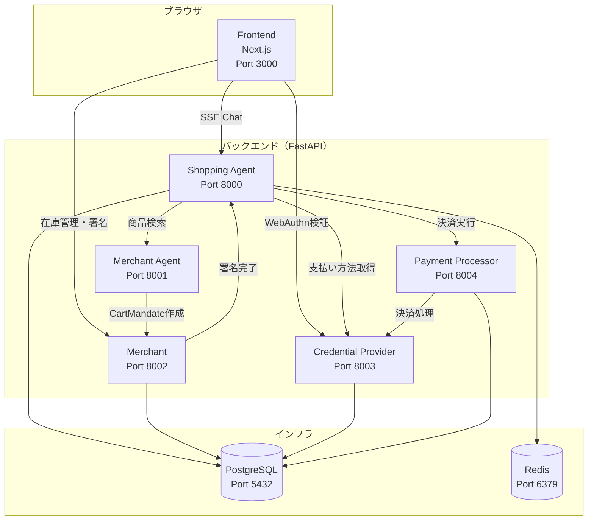
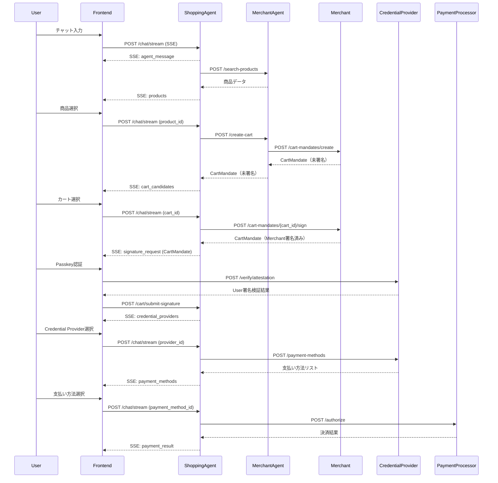
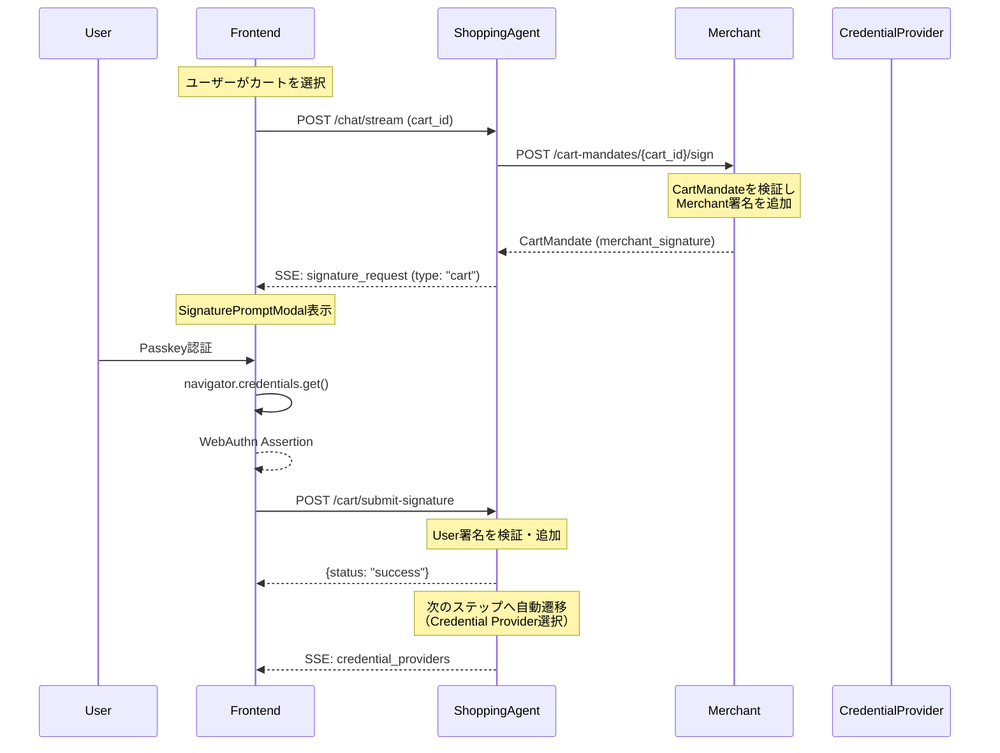
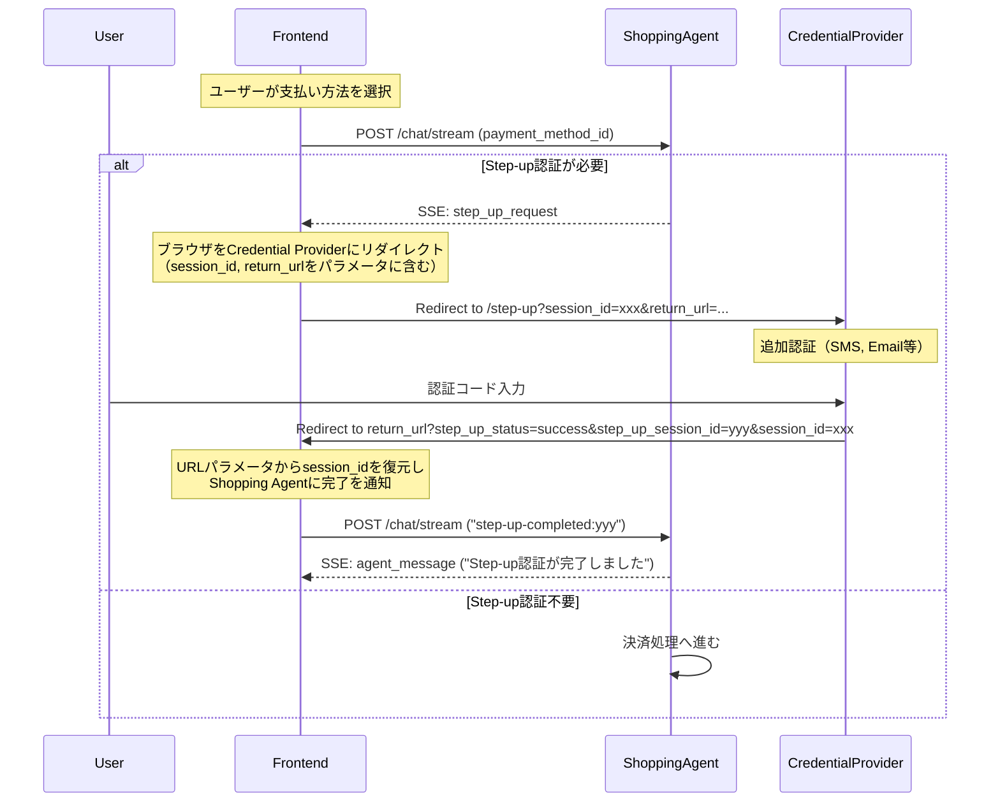

# AP2 Demo App v2 - Frontend

**Next.js App Router + TypeScript + TailwindCSS + shadcn/ui**

AP2（Agent Payments Protocol）のマイクロサービスアーキテクチャに対応したフロントエンドアプリケーションです。
ユーザーがAIエージェントとチャット形式で商品を検索・購入し、マーチャントがCartMandateに署名できるUIを提供します。

---

## 📋 目次

- [セットアップ](#-セットアップ)
- [環境変数](#-環境変数)
- [プロジェクト構造](#-プロジェクト構造)
- [アーキテクチャ](#-アーキテクチャ)
- [技術スタック](#-技術スタック)
- [主要機能](#-主要機能)
- [主要コンポーネント](#-主要コンポーネント)
- [AP2 フロー実装](#-ap2-フロー実装)
- [開発中の注意点](#-開発中の注意点)

---

## 🚀 セットアップ

### ローカル開発

```bash
# 依存関係インストール
npm install

# 開発サーバー起動 (port 3000)
npm run dev

# 型チェック
npm run type-check

# Lint
npm run lint
```

### プロダクションビルド

```bash
# ビルド (standalone出力)
npm run build

# プロダクションサーバー起動
npm start
```

### Docker

```bash
# Docker Composeで全体を起動
cd ../..
docker compose up frontend
```

---

## 🔧 環境変数

`.env.example`を`.env.local`にコピーして設定してください：

```bash
cp .env.example .env.local
```

### 設定項目

| 変数名 | デフォルト値 | 説明 |
|--------|-------------|------|
| `NEXT_PUBLIC_SHOPPING_AGENT_URL` | `http://localhost:8000` | Shopping Agent API URL（ブラウザから直接アクセス） |
| `NEXT_PUBLIC_CREDENTIAL_PROVIDER_URL` | `http://localhost:8003` | Credential Provider API URL（WebAuthn検証用） |
| `NEXT_PUBLIC_RP_ID` | `localhost` | WebAuthn Relying Party ID |
| `NEXT_PUBLIC_RP_NAME` | `AP2 Demo App v2` | WebAuthn Relying Party Name |
| `NEXT_PUBLIC_MERCHANT_URL` | `http://localhost:8002` | Merchant API URL（Merchant管理画面用） |

**注意**: Docker Compose環境では、`docker-compose.yml`の`environment`セクションでコンテナ間通信用のURLを設定します。

---

## 📁 プロジェクト構造

```
v2/frontend/
├── app/                           # Next.js App Router
│   ├── layout.tsx                 # ルートレイアウト（共通ヘッダー）
│   ├── page.tsx                   # ホーム画面（Shopping / Merchant 選択）
│   ├── chat/
│   │   └── page.tsx               # チャットUI（Shopping Agent）
│   └── merchant/
│       └── page.tsx               # Merchant管理画面（在庫管理・CartMandate署名）
├── components/                    # Reactコンポーネント
│   ├── ui/                        # shadcn/ui コンポーネント（Button, Card, Dialog等）
│   ├── auth/
│   │   ├── PasskeyRegistration.tsx      # Passkey登録ダイアログ
│   │   └── PasskeyAuthentication.tsx    # Passkey認証ダイアログ（WebAuthn）
│   ├── cart/
│   │   ├── CartCard.tsx           # カート候補カード（A2A準拠）
│   │   ├── CartCarousel.tsx       # カートカルーセル
│   │   └── CartDetailsModal.tsx   # カート詳細モーダル
│   ├── chat/
│   │   ├── ChatInput.tsx          # チャット入力欄
│   │   ├── ChatMessage.tsx        # チャットメッセージ表示
│   │   └── SignaturePromptModal.tsx # 署名リクエストモーダル（CartMandate/IntentMandate）
│   ├── product/
│   │   ├── ProductCard.tsx        # 商品カード
│   │   └── ProductCarousel.tsx    # 商品カルーセル（Embla）
│   └── shipping/
│       └── ShippingAddressForm.tsx # 配送先入力フォーム
├── hooks/
│   └── useSSEChat.ts              # SSE (Server-Sent Events) チャットフック
├── lib/
│   ├── types/                     # TypeScript型定義
│   │   └── chat.ts                # チャット関連型
│   ├── utils.ts                   # cn() ユーティリティ
│   └── webauthn.ts                # WebAuthn ヘルパー関数
├── public/assets/                 # 静的ファイル（商品画像等）
├── Dockerfile                     # 本番用Dockerイメージ（multi-stage build）
├── next.config.mjs                # Next.js設定（standalone出力）
├── tailwind.config.ts             # TailwindCSS設定
├── components.json                # shadcn/ui設定
└── package.json                   # 依存関係
```

---

## 🏗️ アーキテクチャ

### システム全体図



### API通信フロー



---

## 🛠️ 技術スタック

| カテゴリ | 技術 | バージョン | 用途 |
|---------|------|-----------|------|
| **フレームワーク** | Next.js | 15.0.0 | React SSR/SSG フレームワーク（App Router） |
| **ランタイム** | React | 19.0.0 | UIライブラリ |
| **言語** | TypeScript | 5.6.0 | 型安全性 |
| **スタイリング** | TailwindCSS | 3.4.0 | ユーティリティファーストCSS |
| **UIコンポーネント** | shadcn/ui | - | Radix UI + TailwindCSS（再利用可能コンポーネント） |
| **アイコン** | Lucide React | 0.454.0 | アイコンライブラリ |
| **カルーセル** | Embla Carousel | 8.3.0 | 商品カルーセル |
| **認証** | WebAuthn API | - | Passkey登録・認証（ブラウザ標準API） |
| **ビルドツール** | Docker | - | マルチステージビルド（Node 20 Alpine） |

### shadcn/ui コンポーネント

以下のコンポーネントを利用しています：

- `Button`, `Card`, `Dialog`, `Input`, `Label`, `Tabs`, `Badge`, `Switch`, `Separator`, `ScrollArea`, `Avatar`, `Dropdown Menu`

---

## ✨ 主要機能

### 1. Shopping Agent チャットUI (`/chat`)

- **SSE (Server-Sent Events) ストリーミング**
  - リアルタイムでエージェントの応答をストリーミング表示
  - LLMの思考過程（`agent_thinking`）とユーザー向けメッセージ（`agent_message`）を分離表示

- **Passkey登録・認証**
  - WebAuthn APIを使ったPasskey登録（初回アクセス時）
  - 生体認証・セキュリティキーによる署名

- **商品検索・カルーセル表示**
  - Embla Carouselで商品をスワイプ表示
  - 商品カードをクリックして選択

- **カート候補選択（A2A準拠）**
  - 複数のカート候補をカルーセル表示
  - カート詳細モーダルで内訳を確認

- **CartMandate署名フロー**
  - Merchant署名済みCartMandateをPasskeyで署名
  - AP2仕様準拠の2段階署名（Merchant → User）

- **配送先入力フォーム**
  - 動的に生成されるフォームフィールド

- **Credential Provider / 支払い方法選択**
  - 複数のCredential Providerから選択
  - 登録済み支払い方法から選択

- **決済実行**
  - WebAuthn認証で支払いを確定
  - 領収書URL付きの決済完了メッセージ

- **Step-up認証対応**
  - AP2仕様準拠のStep-up認証フロー
  - セッションIDを維持してリダイレクト後に復帰

### 2. Merchant管理画面 (`/merchant`)

- **在庫管理**
  - 商品一覧表示（SKU、在庫数、価格）
  - 商品追加・更新・削除

- **CartMandate署名待ちリスト**
  - 未署名CartMandateをリスト表示
  - 手動署名 / 自動署名モード切り替え

- **取引履歴**
  - 過去の取引ログを表示

---

## 🧩 主要コンポーネント

### `useSSEChat` (hooks/useSSEChat.ts)

Shopping AgentとのSSE通信を管理するカスタムフック。

**主な機能：**

- セッションID管理（会話を通じて同一IDを使用）
- SSEイベントパース（`agent_message`, `agent_thinking`, `products`, `cart_candidates`, `signature_request`, `credential_providers`, `payment_methods`, `webauthn_request`等）
- ストリーミング中断（`AbortController`）
- メッセージ履歴管理

**使用例：**

```typescript
const {
  messages,
  isStreaming,
  currentAgentMessage,
  currentProducts,
  signatureRequest,
  sendMessage,
  stopStreaming,
} = useSSEChat();
```

### `PasskeyRegistration` (components/auth/PasskeyRegistration.tsx)

WebAuthn Passkeyの登録ダイアログ。

- ユーザー名入力
- `navigator.credentials.create()`でPasskey作成
- Credential ProviderにAttestationを送信

### `PasskeyAuthentication` (components/auth/PasskeyAuthentication.tsx)

WebAuthn Passkeyによる認証ダイアログ。

- Challengeを受け取って`navigator.credentials.get()`を実行
- Assertionを返して署名検証

### `SignaturePromptModal` (components/chat/SignaturePromptModal.tsx)

CartMandate / IntentMandateの署名リクエストモーダル。

- Mandate内容を表示（金額、商品、制約等）
- Passkey認証ボタン
- 署名完了後、Attestationを親コンポーネントに返す

### `ProductCarousel` (components/product/ProductCarousel.tsx)

商品をカルーセル表示するコンポーネント。

- Embla Carouselでスワイプ対応
- 商品画像、名前、価格、説明を表示

### `CartCarousel` (components/cart/CartCarousel.tsx)

カート候補をカルーセル表示するコンポーネント（A2A仕様準拠）。

- `cart_mandate.contents`から商品情報を取得
- 合計金額、商品数を表示
- 「詳細を見る」ボタンでモーダルを開く

---

## 🔐 AP2 フロー実装

### CartMandate 署名フロー



### Step-up認証フロー（AP2準拠）



---

## ⚠️ 開発中の注意点

### 1. バックエンドサービスの起動

フロントエンドを起動する前に、以下のバックエンドサービスが起動している必要があります：

- **Shopping Agent** (Port 8000)
- **Merchant Agent** (Port 8001)
- **Merchant** (Port 8002)
- **Credential Provider** (Port 8003)
- **Payment Processor** (Port 8004)

Docker Composeで一括起動：

```bash
cd ../..
docker compose up -d
```

### 2. WebAuthn / Passkeyの動作条件

WebAuthn APIは以下の環境でのみ動作します：

- **HTTPS環境** または **localhost**
- ブラウザがWebAuthnをサポート（Chrome, Firefox, Safari, Edge等）

### 3. CORS設定

ブラウザから直接バックエンドAPIにアクセスするため、各バックエンドサービスでCORS設定が必要です：

```python
# FastAPI CORS設定例
from fastapi.middleware.cors import CORSMiddleware

app.add_middleware(
    CORSMiddleware,
    allow_origins=["http://localhost:3000"],  # Frontendのオリジン
    allow_credentials=True,
    allow_methods=["*"],
    allow_headers=["*"],
)
```

### 4. SSEタイムアウト

SSE接続が長時間アイドル状態になるとタイムアウトする可能性があります。
定期的にkeep-aliveメッセージを送信することを推奨します。

### 5. Docker Composeの環境変数

Docker Compose環境では、`docker-compose.yml`の`environment`セクションで以下を設定：

```yaml
environment:
  - NEXT_PUBLIC_SHOPPING_AGENT_URL=http://shopping_agent:8000
  - NEXT_PUBLIC_CREDENTIAL_PROVIDER_URL=http://credential_provider:8003
  - NEXT_PUBLIC_MERCHANT_URL=http://merchant:8002
```

**注意**: コンテナ間通信では、`localhost`ではなくサービス名を使用します。

---

## 📚 参考リンク

- [AP2 Protocol Specification](https://ap2-protocol.org/)
- [Next.js Documentation](https://nextjs.org/docs)
- [shadcn/ui](https://ui.shadcn.com/)
- [WebAuthn Guide](https://webauthn.guide/)
- [Embla Carousel](https://www.embla-carousel.com/)

---

## 📝 ライセンス

MIT License
