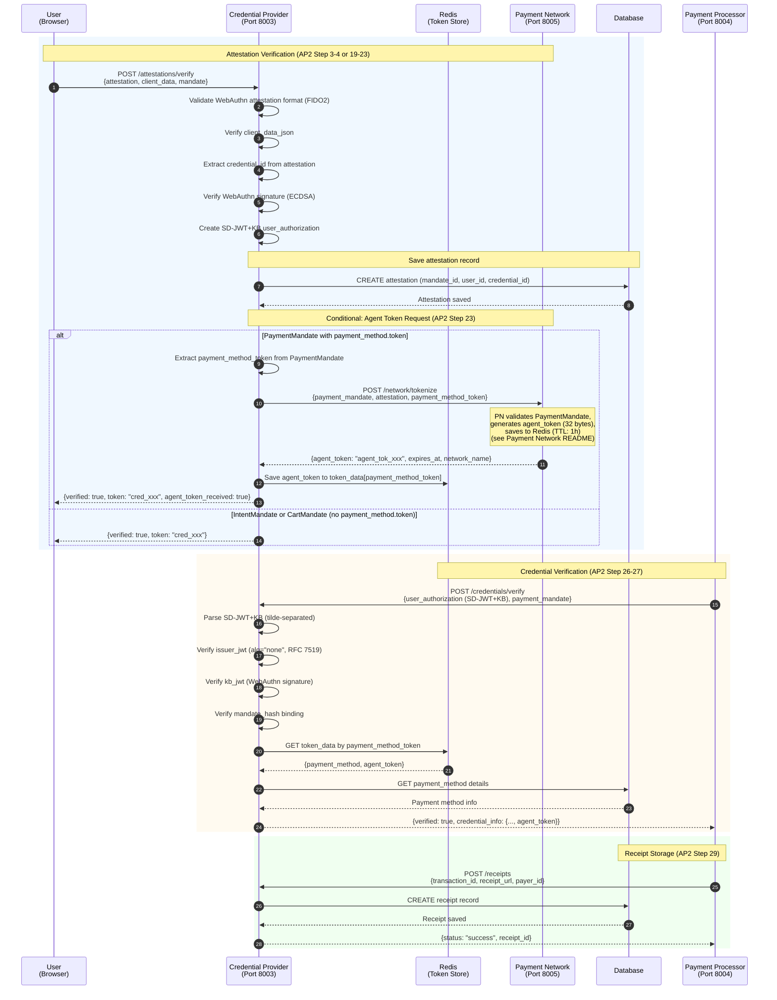

# Credential Provider

**WebAuthn & Payment Credential Service** - Manages user authentication, payment methods, and agent token lifecycle for AP2 transactions.

## Overview

The Credential Provider is responsible for WebAuthn/Passkey verification, payment method management, and agent token lifecycle orchestration. It acts as the bridge between user credentials, Payment Network tokenization, and Payment Processor verification.

**Port**: 8003
**Role**: Credential Provider
**Protocol**: AP2 v0.2

## Key Features

- **WebAuthn/Passkey Verification** - FIDO2-compliant authentication
- **Payment Method Management** - Card tokenization and storage
- **Agent Token Orchestration** - Payment Network tokenization (AP2 Step 23)
- **Step-up Authentication** - Additional verification for sensitive operations
- **Receipt Management** - Receipt storage and retrieval (AP2 Step 29)
- **Redis Token Store** - TTL-managed token storage (15-minute expiry)
- **SD-JWT+KB Generation** - Selective Disclosure JWT with Key Binding

## Sequence Diagram

This diagram shows the Credential Provider's internal processing for attestation verification and credential verification.



## API Endpoints

### Attestation Verification

**`POST /attestations/verify`** - Verify WebAuthn attestation (AP2 Step 3-4, 19-23)

**Request**:
```json
{
  "attestation": "base64_encoded_attestation_object",
  "client_data": "base64_encoded_client_data_json",
  "mandate": {
    "id": "intent_xxx | cart_xxx | payment_xxx",
    "payer_id": "user_123",
    "amount": {"value": 3000, "currency": "JPY"}
  },
  "credential_id": "base64_encoded_credential_id",
  "user_id": "user_123"
}
```

**Response (PaymentMandate with payment_method.token)**:
```json
{
  "verified": true,
  "token": "cred_abc123xyz789",
  "agent_token_received": true,
  "network_name": "DemoPaymentNetwork"
}
```

**Response (IntentMandate or CartMandate)**:
```json
{
  "verified": true,
  "token": "cred_abc123xyz789"
}
```

**Implementation**: `provider.py:300`

**Processing Steps**:
1. Verify WebAuthn attestation format (FIDO2)
2. Verify client_data_json
3. Extract credential_id from attestation
4. Verify WebAuthn signature (ECDSA)
5. Create SD-JWT+KB user_authorization
6. Save attestation record to database
7. **Conditional**: If mandate is PaymentMandate with `payment_method.token`:
   - Extract payment_method_token from PaymentMandate
   - Call Payment Network `/network/tokenize` (AP2 Step 23)
   - Receive agent_token from Payment Network
   - Store agent_token in Redis token_data[payment_method_token]
   - Return `{verified: true, token, agent_token_received: true}`
8. **Otherwise** (IntentMandate or CartMandate):
   - Return `{verified: true, token}`

### Credential Verification

**`POST /credentials/verify`** - Verify credentials and return agent token (AP2 Step 26-27)

**Request**:
```json
{
  "user_authorization": "issuer_jwt~kb_jwt",
  "payment_mandate": {
    "id": "payment_xxx",
    "user_authorization": "issuer_jwt~kb_jwt"
  },
  "mandate_hash": "sha256_hash_of_mandate"
}
```

**Response**:
```json
{
  "verified": true,
  "credential_info": {
    "payment_method_id": "pm_xxx",
    "type": "card",
    "brand": "visa",
    "last4": "1234",
    "holder_name": "John Doe",
    "expiry_month": 12,
    "expiry_year": 2025,
    "agent_token": "agent_tok_abc123xyz789"
  }
}
```

**Implementation**: `provider.py:1500`

**SD-JWT+KB Verification**:
1. Parse tilde-separated format (`issuer_jwt~kb_jwt`)
2. Verify issuer_jwt with `alg="none"` (RFC 7519)
3. Verify kb_jwt WebAuthn signature
4. Verify mandate_hash binding
5. Retrieve agent_token from Redis token_data
6. Return payment method info + agent_token

### Payment Method Management

**`POST /payment-methods`** - Create payment method

**Request**:
```json
{
  "user_id": "user_123",
  "type": "card",
  "card_number": "4111111111111111",
  "expiry_month": 12,
  "expiry_year": 2025,
  "cvv": "123",
  "holder_name": "John Doe"
}
```

**Response**:
```json
{
  "id": "pm_xxx",
  "user_id": "user_123",
  "type": "card",
  "brand": "visa",
  "last4": "1111",
  "holder_name": "John Doe",
  "expiry_month": 12,
  "expiry_year": 2025,
  "created_at": "2025-10-23T12:34:56Z"
}
```

**Implementation**: `provider.py:800`

**`GET /payment-methods`** - List payment methods

**Response**:
```json
{
  "payment_methods": [
    {
      "id": "pm_xxx",
      "type": "card",
      "brand": "visa",
      "last4": "1111",
      "holder_name": "John Doe"
    }
  ]
}
```

**Implementation**: `provider.py:900`

### Receipt Management

**`POST /receipts`** - Store receipt (AP2 Step 29)

**Request**:
```json
{
  "transaction_id": "txn_xxx",
  "receipt_url": "http://payment_processor:8004/receipts/txn_xxx.pdf",
  "payer_id": "user_123",
  "amount": {"value": 2500, "currency": "JPY"}
}
```

**Response**:
```json
{
  "status": "success",
  "receipt_id": "receipt_xxx"
}
```

**Implementation**: `provider.py:1800`

**`GET /receipts`** - List receipts

**Response**:
```json
{
  "receipts": [
    {
      "id": "receipt_xxx",
      "transaction_id": "txn_xxx",
      "receipt_url": "http://...",
      "payer_id": "user_123",
      "created_at": "2025-10-23T12:34:56Z"
    }
  ]
}
```

**Implementation**: `provider.py:1900`

### Common Endpoints (Inherited from BaseAgent)

**`GET /`** - Health check
- **Response**: `{agent_id, agent_name, status, version}`

**`GET /health`** - Health check (for Docker)
- **Response**: `{status: "healthy"}`

**`POST /a2a/message`** - Receive A2A messages from other agents
- **Request**: A2AMessage (Ed25519 signed)
- **Response**: A2A response

**`GET /.well-known/did.json`** - DID document
- **Response**: W3C DID Document

## Environment Variables

```bash
# Service Configuration
AGENT_ID=did:ap2:agent:credential_provider
DATABASE_URL=sqlite+aiosqlite:////app/data/credential_provider.db
AP2_KEYS_DIRECTORY=/app/keys

# Downstream Services
PAYMENT_NETWORK_URL=http://payment_network:8005

# Redis Configuration
REDIS_URL=redis://localhost:6379/0

# Token TTL Configuration
TOKEN_EXPIRY_MINUTES=15
WEBAUTHN_CHALLENGE_TTL=60
STEPUP_SESSION_TTL=600

# OpenTelemetry
OTEL_ENABLED=true
OTEL_SERVICE_NAME=credential_provider
OTEL_EXPORTER_OTLP_ENDPOINT=http://jaeger:4317

# Logging
LOG_LEVEL=INFO
LOG_FORMAT=text
```

## Database Schema

### Tables

- **passkey_credentials** - WebAuthn/Passkey credentials
  - `id` (primary key)
  - `user_id`
  - `credential_id` (base64)
  - `public_key` (base64)
  - `sign_count`
  - `created_at`

- **payment_methods** - Payment method storage
  - `id` (primary key)
  - `user_id`
  - `type` (card/digital_wallet)
  - `brand` (visa/mastercard/etc)
  - `last4`
  - `holder_name`
  - `expiry_month`
  - `expiry_year`
  - `created_at`

- **receipts** - Receipt storage (AP2 Step 29)
  - `id` (primary key)
  - `transaction_id`
  - `receipt_url`
  - `payer_id`
  - `amount` (JSON)
  - `created_at`

## Dependencies

### Python Packages
- **fastapi** 0.115.0 - Web framework
- **fido2** - WebAuthn/FIDO2 implementation
- **httpx** 0.27.0 - Async HTTP client
- **cryptography** 43.0.0 - Cryptographic operations
- **sqlalchemy** 2.0.35 - ORM
- **redis** - Redis client for token storage

### Shared Components
- **common.base_agent** - BaseAgent for A2A protocol
- **common.redis_client** - RedisClient, TokenStore, SessionStore
- **common.crypto** - DeviceAttestationManager, KeyManager
- **common.database** - DatabaseManager, CRUD classes

### Downstream Services
- **Payment Network** (Port 8005) - Agent token generation (AP2 Step 23)

### Upstream Services
- **Payment Processor** (Port 8004) - Credential verification requests (AP2 Step 26-27)
- **Shopping Agent** (Port 8000) - Attestation verification, receipt storage

## Key Implementation Details

### WebAuthn Attestation Verification

Complete FIDO2-compliant verification:

```python
# provider.py:300-650
async def verify_attestation(request: AttestationVerifyRequest):
    # Step 1: Decode attestation object
    attestation_obj = AttestationObject(base64.b64decode(request.attestation))

    # Step 2: Verify client data
    client_data = json.loads(base64.b64decode(request.client_data))

    # Step 3: Verify attestation format (packed, fido-u2f, etc.)
    auth_data = attestation_obj.auth_data
    credential_id = auth_data.credential_data.credential_id
    public_key = auth_data.credential_data.public_key

    # Step 4: Check if passkey exists
    passkey = await passkey_crud.get_by_credential_id(credential_id)

    if not passkey:
        # Registration flow
        await passkey_crud.create(
            user_id=request.user_id,
            credential_id=credential_id,
            public_key=public_key,
            sign_count=auth_data.sign_count
        )
    else:
        # Authentication flow
        # Verify sign_count hasn't decreased (replay attack prevention)
        if auth_data.sign_count <= passkey.sign_count:
            raise HTTPException(status_code=401, detail="Invalid sign_count")

        # Update sign_count
        await passkey_crud.update_sign_count(credential_id, auth_data.sign_count)

    return {"verified": True, "credential_id": credential_id}
```

**Attestation Verification Steps**:
1. Decode attestation object (base64 → CBOR)
2. Verify client_data_json signature
3. Extract credential_id and public_key
4. Check replay attack (sign_count)
5. Register new passkey or verify existing

### Agent Token Lifecycle

Complete token orchestration:

```python
# provider.py:400-650
# Step 1: Generate payment_method_token
payment_method_token = f"tok_{secrets.token_hex(16)}"

# Step 2: Save to Redis (TTL: 15 minutes)
token_data = {
    "payment_method_id": payment_method.id,
    "user_id": user_id,
    "created_at": datetime.now(timezone.utc).isoformat()
}
await token_store.save_token(
    payment_method_token,
    token_data,
    ttl_seconds=TOKEN_EXPIRY_MINUTES * 60
)

# Step 3: Call Payment Network for agent_token (AP2 Step 23)
response = await http_client.post(
    f"{payment_network_url}/network/tokenize",
    json={
        "payment_mandate": payment_mandate,
        "attestation": attestation,
        "payment_method_token": payment_method_token
    }
)
agent_token = response.json()["agent_token"]

# Step 4: Save agent_token to token_data
token_data["agent_token"] = agent_token
await token_store.save_token(payment_method_token, token_data, ttl_seconds=TOKEN_EXPIRY_MINUTES * 60)
```

**Token Lifecycle**:
1. **payment_method_token** - Generated by CP, stored in Redis (15-min TTL)
2. **agent_token** - Generated by Payment Network, stored by CP in token_data (1-hour TTL at PN side)
3. **Credential Verification** - PP requests, CP returns both payment_method and agent_token

### SD-JWT+KB Verification

Selective Disclosure JWT with Key Binding:

```python
# provider.py:1500-1700
async def verify_credentials(request: Dict[str, Any]):
    user_authorization = request["user_authorization"]

    # Step 1: Parse tilde-separated format
    if "~" not in user_authorization:
        raise HTTPException(status_code=400, detail="Invalid SD-JWT+KB format")

    parts = user_authorization.split("~")
    issuer_jwt = parts[0]  # Issuer-signed JWT
    kb_jwt = parts[1]      # Key binding JWT (WebAuthn)

    # Step 2: Verify issuer_jwt (alg="none" per RFC 7519)
    header, payload, signature = issuer_jwt.split(".")
    header_data = json.loads(base64.b64decode(header))

    if header_data.get("alg") != "none":
        raise HTTPException(status_code=401, detail="Invalid issuer_jwt algorithm")

    # Step 3: Verify kb_jwt (WebAuthn signature)
    kb_header, kb_payload, kb_signature = kb_jwt.split(".")
    kb_data = json.loads(base64.b64decode(kb_payload))

    # Verify WebAuthn signature using stored public key
    passkey = await passkey_crud.get_by_credential_id(kb_data["credential_id"])
    verify_webauthn_signature(passkey.public_key, kb_signature, kb_payload)

    # Step 4: Verify mandate_hash binding
    mandate_hash = request["mandate_hash"]
    if kb_data["mandate_hash"] != mandate_hash:
        raise HTTPException(status_code=401, detail="Mandate hash mismatch")

    # Step 5: Retrieve agent_token from Redis
    payment_method_token = payload["payment_method_token"]
    token_data = await token_store.get_token(payment_method_token)
    agent_token = token_data.get("agent_token")

    return {
        "verified": True,
        "credential_info": {
            "payment_method_id": token_data["payment_method_id"],
            "agent_token": agent_token,
            ...
        }
    }
```

**SD-JWT+KB Format** (tilde-separated):
- `issuer_jwt`: Issuer-signed JWT with `alg="none"` (RFC 7519 compliant)
- `kb_jwt`: Key binding JWT with WebAuthn signature

### Redis Token Store

TTL-managed token storage:

```python
# Token store structure
# Key: cp:token:{payment_method_token}
# Value: {
#   "payment_method_id": "pm_xxx",
#   "user_id": "user_123",
#   "agent_token": "agent_tok_xxx",  # Added after Payment Network call
#   "created_at": "2025-10-23T12:34:56Z"
# }
# TTL: 900 seconds (15 minutes)

# Challenge store structure (WebAuthn)
# Key: cp:challenge:{challenge_id}
# Value: {
#   "challenge": "base64_encoded_challenge",
#   "user_id": "user_123",
#   "created_at": "2025-10-23T12:34:56Z"
# }
# TTL: 60 seconds (replay attack prevention)
```

**Redis Databases**:
- **DB 0**: Credential Provider (tokens, challenges, sessions)
- **DB 1**: Credential Provider 2 (if deployed)
- **DB 2**: Payment Network (agent tokens)

## Development

### Run Locally

```bash
# Set environment variables
export AGENT_ID=did:ap2:agent:credential_provider
export DATABASE_URL=sqlite+aiosqlite:////app/data/credential_provider.db
export PAYMENT_NETWORK_URL=http://localhost:8005
export REDIS_URL=redis://localhost:6379/0

# Install dependencies
pip install -e .

# Start Redis
redis-server --port 6379

# Run service
cd services/credential_provider
python main.py
```

### Run with Docker

```bash
# Build and run
docker compose up credential_provider

# View logs
docker compose logs -f credential_provider
```

## Testing

```bash
# Health check
curl http://localhost:8003/health

# Verify attestation (requires WebAuthn data)
curl -X POST http://localhost:8003/attestations/verify \
  -H "Content-Type: application/json" \
  -d '{
    "attestation": "base64_encoded_attestation",
    "client_data": "base64_encoded_client_data",
    "payment_mandate": {...},
    "user_id": "user_123"
  }'

# Verify credentials
curl -X POST http://localhost:8003/credentials/verify \
  -H "Content-Type: application/json" \
  -d '{
    "user_authorization": "issuer_jwt~kb_jwt",
    "payment_mandate": {...},
    "mandate_hash": "sha256_hash"
  }'

# List payment methods
curl http://localhost:8003/payment-methods?user_id=user_123

# List receipts
curl http://localhost:8003/receipts?payer_id=user_123
```

## AP2 Compliance

- ✅ **WebAuthn Verification** - FIDO2-compliant attestation verification
- ✅ **Agent Token Orchestration** - AP2 Step 23 (Payment Network tokenization)
- ✅ **SD-JWT+KB Format** - Tilde-separated, alg="none" for issuer_jwt
- ✅ **Credential Verification** - AP2 Step 26-27 (returns agent_token to PP)
- ✅ **Receipt Storage** - AP2 Step 29 (receipt persistence)
- ✅ **Redis Token Store** - TTL-managed with 15-minute expiry
- ✅ **Replay Attack Prevention** - Challenge TTL (60 seconds), sign_count verification

## References

- [Main README](../../README.md)
- [Payment Network README](../payment_network/README.md)
- [Payment Processor README](../payment_processor/README.md)
- [AP2 Specification](https://ap2-protocol.org/specification/)
- [WebAuthn Specification](https://www.w3.org/TR/webauthn/)

---

**Port**: 8003
**Role**: Credential Provider
**Protocol**: AP2 v0.2
**Status**: Production-Ready
