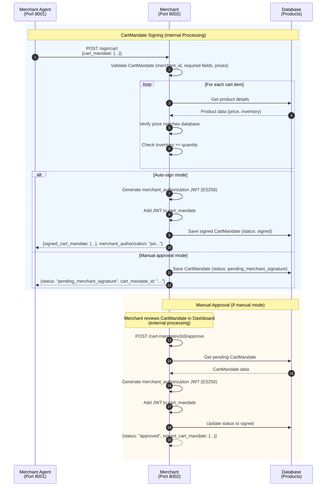

# Merchant

**Merchant Service** - Real store entity responsible for CartMandate signing, product/inventory management, and order approval (AP2-compliant).

## Overview

The Merchant service represents the actual store entity (むぎぼーショップ) in the AP2 protocol. It is responsible for signing CartMandates, managing inventory, and approving orders. **Merchant and Merchant Agent are separate entities**, and only Merchant has signing authority.

**Port**: 8002
**Role**: Merchant (store entity, NOT agent)
**Protocol**: AP2 v0.2
**DID**: `did:ap2:merchant` (NOT `did:ap2:agent:...`)

## Key Features

- **CartMandate Signing** - ECDSA signature with merchant_authorization JWT
- **Inventory Management** - Product and stock management
- **Order Approval** - Auto-sign or manual approval modes
- **Merchant Authorization JWT** - AP2-compliant JWT generation
- **Signature Key Management** - Merchant-only private key custody
- **A2A Protocol** - Ed25519-signed messaging
- **W3C DID Document** - DID resolution endpoint

## Sequence Diagram

This diagram shows the Merchant service's internal processing for CartMandate signing.



## API Endpoints

### CartMandate Signing

**`POST /sign/cart`** - Sign CartMandate

**Request**:
```json
{
  "cart_mandate": {
    "contents": {
      "id": "cart_abc123",
      "user_cart_confirmation_required": true,
      "payment_request": {
        "method_data": [...],
        "details": {
          "display_items": [...],
          "total": {"label": "合計", "amount": {"value": 8800.0, "currency": "JPY"}}
        },
        "options": {...},
        "shipping_address": {...}
      },
      "cart_expiry": "2025-10-23T13:34:56Z",
      "merchant_name": "むぎぼーショップ"
    },
    "merchant_authorization": null,
    "_metadata": {
      "merchant_id": "did:ap2:merchant:mugibo_merchant",
      "raw_items": [...]
    }
  }
}
```

**Response (Auto-sign mode)**:
```json
{
  "signed_cart_mandate": {
    "contents": {...},
    "merchant_authorization": "eyJhbGciOiJFUzI1NiIsInR5cCI6IkpXVCJ9...",
    "_metadata": {...}
  },
  "merchant_authorization": "eyJhbGciOiJFUzI1NiIsInR5cCI6IkpXVCJ9..."
}
```

**Response (Manual approval mode)**:
```json
{
  "status": "pending_merchant_signature",
  "cart_mandate_id": "cart_abc123",
  "message": "Manual approval required by merchant"
}
```

**Implementation**: `service.py:182`

**Signing Process**:
1. **Validation** - Verify merchant_id, required fields, price calculations
2. **Inventory Check** - Verify all items have sufficient stock
3. **JWT Generation** - Create merchant_authorization JWT (ES256)
4. **Database Storage** - Save signed CartMandate

**`POST /poll/cart`** - Poll CartMandate approval status

**Request**:
```json
{
  "cart_mandate_id": "cart_abc123"
}
```

**Response (Pending)**:
```json
{
  "status": "pending_merchant_signature",
  "cart_mandate_id": "cart_abc123"
}
```

**Response (Signed)**:
```json
{
  "status": "signed",
  "signed_cart_mandate": {...}
}
```

**Response (Rejected)**:
```json
{
  "status": "rejected",
  "cart_mandate_id": "cart_abc123",
  "reason": "Insufficient inventory"
}
```

**Implementation**: `service.py:311`

### Manual Approval

**`GET /cart-mandates/pending`** - List pending CartMandates

**Response**:
```json
{
  "pending_cart_mandates": [
    {
      "id": "cart_abc123",
      "payload": {...},
      "created_at": "2025-10-23T12:34:56Z"
    }
  ],
  "total": 1
}
```

**Implementation**: `service.py:481`

**`GET /cart-mandates/{cart_mandate_id}`** - Get CartMandate details

**Response**:
```json
{
  "id": "cart_abc123",
  "status": "pending_merchant_signature",
  "payload": {...},
  "created_at": "2025-10-23T12:34:56Z",
  "updated_at": "2025-10-23T12:35:00Z"
}
```

**Implementation**: `service.py:509`

**`POST /cart-mandates/{cart_mandate_id}/approve`** - Approve and sign CartMandate

**Response**:
```json
{
  "status": "approved",
  "signed_cart_mandate": {...},
  "merchant_authorization": "eyJhbGciOiJFUzI1NiIsInR5cCI6IkpXVCJ9..."
}
```

**Implementation**: `service.py:540`

**`POST /cart-mandates/{cart_mandate_id}/reject`** - Reject CartMandate

**Request**:
```json
{
  "reason": "Insufficient inventory"
}
```

**Response**:
```json
{
  "status": "rejected",
  "cart_mandate_id": "cart_abc123",
  "reason": "Insufficient inventory"
}
```

**Implementation**: `service.py:589`

### Product Management

**`GET /products`** - List all products

**Response**:
```json
{
  "products": [
    {
      "id": 1,
      "sku": "MUGIBO-001",
      "name": "むぎぼーぬいぐるみ（S）",
      "price": 250000,
      "inventory_count": 10
    }
  ],
  "total": 1
}
```

**Implementation**: `service.py:381`

**`POST /products`** - Create product

**Request**:
```json
{
  "sku": "MUGIBO-002",
  "name": "むぎぼーTシャツ",
  "description": "かわいいTシャツ",
  "price": 300000,
  "inventory_count": 20,
  "product_metadata": {
    "category": "apparel",
    "brand": "むぎぼーショップ"
  }
}
```

**Response**:
```json
{
  "id": 2,
  "sku": "MUGIBO-002",
  "name": "むぎぼーTシャツ",
  "price": 300000,
  "inventory_count": 20
}
```

**Implementation**: `service.py:657`

**`PATCH /products/{product_id}`** - Update product

**Request**:
```json
{
  "inventory_count": 15
}
```

**Response**:
```json
{
  "id": 1,
  "sku": "MUGIBO-001",
  "inventory_count": 15
}
```

**Implementation**: `service.py:398`

**`DELETE /products/{product_id}`** - Delete product

**Response**:
```json
{
  "status": "deleted",
  "product_id": "1"
}
```

**Implementation**: `service.py:692`

### Settings

**`GET /settings/signature-mode`** - Get signature mode

**Response**:
```json
{
  "auto_sign_mode": true,
  "mode": "auto"
}
```

**Implementation**: `service.py:451`

**`POST /settings/signature-mode`** - Set signature mode

**Request**:
```json
{
  "auto_sign_mode": false
}
```

**Response**:
```json
{
  "auto_sign_mode": false,
  "mode": "manual",
  "message": "Signature mode set to manual"
}
```

**Implementation**: `service.py:461`

### Transactions

**`GET /transactions`** - List transactions

**Query Parameters**:
- `status`: Filter by status (captured, failed, refunded)
- `limit`: Maximum results (default: 100)

**Response**:
```json
{
  "transactions": [
    {
      "id": "txn_xxx",
      "status": "captured",
      "amount": {"value": 8800.0, "currency": "JPY"},
      "created_at": "2025-10-23T12:34:56Z"
    }
  ],
  "total": 1
}
```

**Implementation**: `service.py:630`

### Common Endpoints (Inherited from BaseAgent)

**`GET /`** - Health check
- **Response**: `{agent_id, agent_name, status, version}`

**`GET /health`** - Health check (for Docker)
- **Response**: `{status: "healthy"}`

**`POST /a2a/message`** - Receive A2A messages from other agents
- **Request**: A2AMessage (Ed25519 signed)
- **Response**: A2A response

**`GET /.well-known/did.json`** - DID document
- **Response**: W3C DID Document

## Environment Variables

```bash
# Service Configuration
AGENT_ID=did:ap2:merchant
DATABASE_URL=sqlite+aiosqlite:////app/data/merchant.db
AP2_KEYS_DIRECTORY=/app/keys

# Merchant Configuration
MERCHANT_ID=did:ap2:merchant:mugibo_merchant
MERCHANT_NAME=むぎぼーショップ
AUTO_SIGN_MODE=true

# OpenTelemetry
OTEL_ENABLED=true
OTEL_SERVICE_NAME=merchant
OTEL_EXPORTER_OTLP_ENDPOINT=http://jaeger:4317

# Logging
LOG_LEVEL=INFO
LOG_FORMAT=text
```

## Database Schema

### Tables

- **products** - Product catalog
  - `id` (primary key)
  - `sku` (unique)
  - `name`
  - `description`
  - `price` (cents)
  - `inventory_count`
  - `metadata` (JSON)

- **mandates** - CartMandate storage
  - `id` (primary key, cart_id)
  - `type` (Cart)
  - `status` (pending_merchant_signature/signed/rejected)
  - `payload` (JSON)
  - `issuer` (did:ap2:merchant)
  - `issued_at`
  - `updated_at`

## Dependencies

### Python Packages
- **fastapi** 0.115.0 - Web framework
- **sqlalchemy** 2.0.35 - ORM
- **cryptography** 43.0.0 - ECDSA signing
- **httpx** 0.27.0 - Async HTTP client

### Shared Components
- **common.base_agent** - BaseAgent for A2A protocol
- **common.database** - DatabaseManager, ProductCRUD, MandateCRUD
- **common.crypto** - SignatureManager, KeyManager
- **common.jwt_utils** - MerchantAuthorizationJWT
- **common.telemetry** - OpenTelemetry instrumentation

## Key Implementation Details

### Merchant Authorization JWT

AP2-compliant JWT generation:

```python
# service.py:792-864
def _generate_merchant_authorization_jwt(
    self,
    cart_mandate: Dict[str, Any],
    merchant_id: str
) -> str:
    """Generate AP2-compliant merchant_authorization JWT

    JWT Structure:
    - Header: {"alg": "ES256", "kid": "did:ap2:merchant:xxx#key-1", "typ": "JWT"}
    - Payload: {
        "iss": "did:ap2:merchant:xxx",  // Merchant
        "sub": "did:ap2:merchant:xxx",  // Same as iss
        "aud": "did:ap2:agent:payment_processor",  // Payment Processor
        "iat": <timestamp>,
        "exp": <timestamp + 3600>,  // 1 hour (AP2-compliant)
        "jti": <unique_id>,  // Replay attack prevention
        "cart_hash": "<cart_contents_hash>"
      }
    - Signature: ECDSA signature (merchant's private key)
    """
    from common.user_authorization import compute_mandate_hash
    from common.jwt_utils import MerchantAuthorizationJWT

    # Compute cart hash (excluding signature fields)
    cart_hash = compute_mandate_hash(cart_mandate)

    jwt_generator = MerchantAuthorizationJWT(
        signature_manager=self.signature_manager,
        key_manager=self.key_manager
    )

    # Generate JWT (ES256)
    jwt_token = jwt_generator.generate_with_hash(
        merchant_id=merchant_id,
        cart_hash=cart_hash,
        audience="did:ap2:agent:payment_processor",
        expiration_minutes=60,  // 1 hour
        algorithm="ECDSA",
        key_id=merchant_id  // AP2-compliant: DID registered in DID document
    )

    logger.info(
        f"[_generate_merchant_authorization_jwt] Generated signed JWT for CartMandate: "
        f"cart_id={cart_mandate.get('id')}, "
        f"alg=ES256, merchant_id={merchant_id}"
    )

    return jwt_token
```

**JWT Properties**:
- Algorithm: ES256 (ECDSA with P-256 and SHA-256)
- Expiry: 1 hour from issuance
- cart_hash: SHA-256 hash of CartMandate (RFC 8785 normalized)
- Audience: Payment Processor DID

### CartMandate Validation

Comprehensive validation logic:

```python
# service.py:773-781 (delegated to validation_helpers)
def _validate_cart_mandate(self, cart_mandate: Dict[str, Any]):
    """Validate CartMandate structure

    Validation checks:
    1. merchant_id matches self.merchant_id (_metadata)
    2. Required fields exist (contents, payment_request, etc.)
    3. Price calculations are correct (display_items sum = total)
    4. cart_expiry is within valid range
    """
    self.validation_helpers.validate_cart_mandate(cart_mandate)
```

**Validation Steps**:
1. **merchant_id Check** - Verify CartMandate is for this merchant
2. **Required Fields** - Verify contents.id, payment_request, display_items, total exist
3. **Price Calculation** - Verify display_items sum matches total
4. **Expiry Check** - Verify cart_expiry is in the future

### Inventory Check

Stock verification logic:

```python
# service.py:783-790 (delegated to inventory_helpers)
async def _check_inventory(self, cart_mandate: Dict[str, Any]):
    """Check inventory for all cart items

    Raises HTTPException(400) if any item is out of stock

    Retrieves items from _metadata.raw_items:
    - product_id: Database product ID
    - quantity: Requested quantity

    For each item:
    1. Get product from database
    2. Check inventory_count >= quantity
    3. Raise error if insufficient stock
    """
    await self.inventory_helpers.check_inventory(cart_mandate)
```

**Inventory Check Flow**:
1. Extract raw_items from `_metadata.raw_items`
2. For each item, query ProductCRUD
3. Verify `inventory_count >= quantity`
4. Return error if any item is out of stock

### Signature Mode

Two signing modes supported:

**1. Auto-sign Mode (Default)**:
- Immediately signs CartMandate upon receipt
- No human intervention required
- Suitable for demo/development environments

**2. Manual Approval Mode**:
- Saves CartMandate with `pending_merchant_signature` status
- Requires merchant to review and approve via Dashboard
- Suitable for production environments

**Configuration**:
```python
# service.py:79
self.auto_sign_mode = DEFAULT_AUTO_SIGN_MODE  # True by default
```

**API for Mode Toggle**:
- `GET /settings/signature-mode` - Get current mode
- `POST /settings/signature-mode` - Change mode

### A2A Message Handler

CartMandate signing via A2A protocol:

```python
# service.py:722-767
async def handle_cart_mandate_sign_request(self, message: A2AMessage) -> Dict[str, Any]:
    """Handle CartMandate sign request from Merchant Agent

    A2A Message:
    - type: ap2.mandates.CartMandate
    - payload: CartMandate (unsigned)

    Response:
    - type: ap2.mandates.CartMandate
    - payload: CartMandate (signed with merchant_authorization)

    Error Response:
    - type: ap2.errors.Error
    - payload: {error_code, error_message}
    """
    logger.info("[Merchant] Received CartMandate sign request")
    cart_mandate = message.dataPart.payload

    try:
        # Validation
        self._validate_cart_mandate(cart_mandate)

        # Inventory check
        await self._check_inventory(cart_mandate)

        # Generate merchant_authorization JWT
        signed_cart_mandate = cart_mandate.copy()
        merchant_authorization_jwt = self._generate_merchant_authorization_jwt(
            cart_mandate,
            self.merchant_id
        )
        signed_cart_mandate["merchant_authorization"] = merchant_authorization_jwt

        cart_id = cart_mandate["contents"]["id"]

        logger.info(
            f"[A2A] Signed CartMandate: {cart_id} "
            f"(with merchant_authorization JWT)"
        )

        return {
            "type": "ap2.mandates.CartMandate",
            "id": cart_id,
            "payload": signed_cart_mandate
        }

    except Exception as e:
        logger.error(f"[handle_cart_mandate_sign_request] Error: {e}", exc_info=True)
        return {
            "type": "ap2.errors.Error",
            "id": str(uuid.uuid4()),
            "payload": {
                "error_code": "signature_failed",
                "error_message": str(e)
            }
        }
```

### Helper Classes

Merchant uses 4 helper classes for business logic separation:

```python
# service.py:82-92
from services.merchant.utils import (
    SignatureHelpers,
    ValidationHelpers,
    InventoryHelpers,
    JWTHelpers,
)

self.signature_helpers = SignatureHelpers()
self.validation_helpers = ValidationHelpers(merchant_id=self.merchant_id)
self.inventory_helpers = InventoryHelpers(db_manager=self.db_manager)
self.jwt_helpers = JWTHelpers(key_manager=self.key_manager)
```

**Helper Responsibilities**:
- **SignatureHelpers** (`utils/signature_helpers.py`) - ECDSA signature generation
- **ValidationHelpers** (`utils/validation_helpers.py`) - CartMandate validation
- **InventoryHelpers** (`utils/inventory_helpers.py`) - Stock verification
- **JWTHelpers** (`utils/jwt_helpers.py`) - JWT generation and verification

## Development

### Run Locally

```bash
# Set environment variables
export AGENT_ID=did:ap2:merchant
export DATABASE_URL=sqlite+aiosqlite:////app/data/merchant.db
export MERCHANT_ID=did:ap2:merchant:mugibo_merchant

# Install dependencies
pip install -e .

# Run service
cd services/merchant
python main.py
```

### Run with Docker

```bash
# Build and run
docker compose up merchant

# View logs
docker compose logs -f merchant
```

## Testing

```bash
# Health check
curl http://localhost:8002/health

# Sign CartMandate (auto-sign mode)
curl -X POST http://localhost:8002/sign/cart \
  -H "Content-Type: application/json" \
  -d '{
    "cart_mandate": {
      "contents": {
        "id": "cart_test123",
        "user_cart_confirmation_required": true,
        "payment_request": {...},
        "cart_expiry": "2025-10-23T13:34:56Z",
        "merchant_name": "むぎぼーショップ"
      },
      "merchant_authorization": null,
      "_metadata": {
        "merchant_id": "did:ap2:merchant:mugibo_merchant",
        "raw_items": [...]
      }
    }
  }'

# Poll CartMandate status
curl -X POST http://localhost:8002/poll/cart \
  -H "Content-Type: application/json" \
  -d '{
    "cart_mandate_id": "cart_test123"
  }'

# List products
curl http://localhost:8002/products

# Get signature mode
curl http://localhost:8002/settings/signature-mode

# Change to manual approval mode
curl -X POST http://localhost:8002/settings/signature-mode \
  -H "Content-Type: application/json" \
  -d '{
    "auto_sign_mode": false
  }'
```

## AP2 Compliance

- ✅ **CartMandate Signing** - ECDSA signature with merchant_authorization JWT
- ✅ **Merchant Authorization JWT** - ES256, cart_hash, 1-hour expiry
- ✅ **Separate from Merchant Agent** - Clear entity separation
- ✅ **Inventory Verification** - Pre-signature stock check
- ✅ **CartMandate Validation** - merchant_id, prices, expiry checks
- ✅ **Manual Approval Mode** - Optional human-in-the-loop
- ✅ **A2A Protocol** - Ed25519 signed messages
- ✅ **W3C DID Document** - DID resolution endpoint (`/.well-known/did.json`)

## References

- [Main README](../../README.md)
- [Merchant Agent README](../merchant_agent/README.md)
- [Payment Processor README](../payment_processor/README.md)
- [AP2 Specification](https://ap2-protocol.org/specification/)

---

**Port**: 8002
**Role**: Merchant (store entity)
**Protocol**: AP2 v0.2
**Status**: Production-Ready
