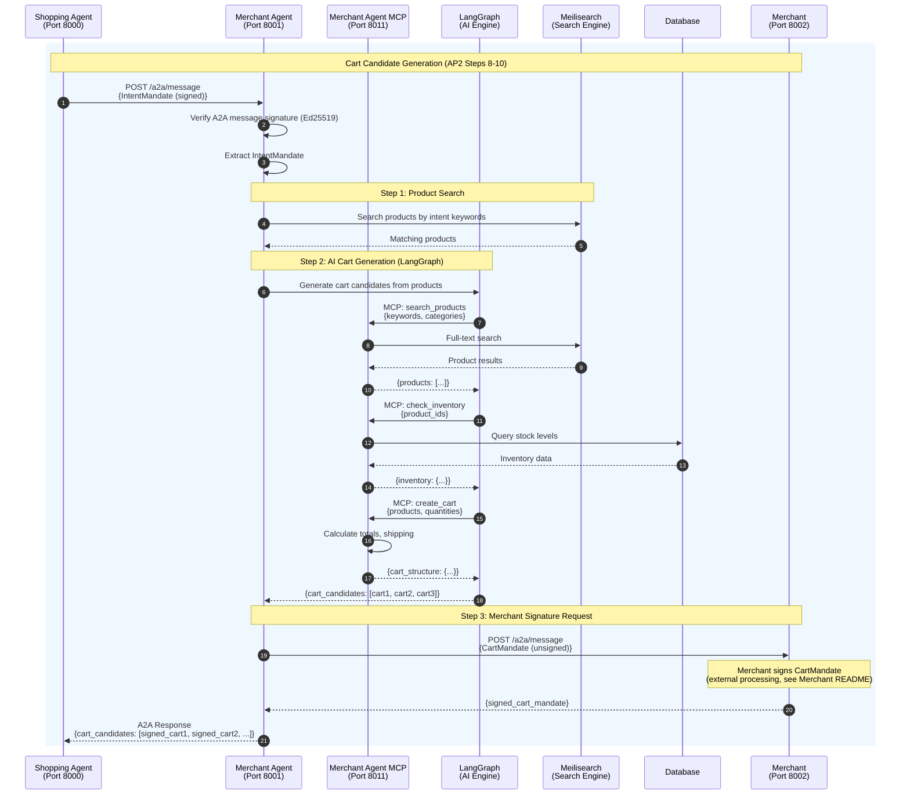

# Merchant Agent

**Merchant's AI Agent** - Handles product search, cart candidate generation, and merchant signature coordination for AP2 transactions.

## Overview

The Merchant Agent is the merchant's representative in the AP2 protocol. It receives IntentMandates from Shopping Agents via A2A messaging, searches the product database, generates cart candidates using AI (LangGraph), and coordinates with the Merchant for CartMandate signatures.

**Port**: 8001
**Role**: Merchant Agent (merchant's AI representative)
**Protocol**: AP2 v0.2
**Merchant**: did:ap2:merchant:mugibo_merchant

## Key Features

- **Product Search** - Meilisearch-powered full-text search
- **AI Cart Generation** - LangGraph-based intelligent cart candidate creation
- **A2A Communication** - Ed25519-signed messaging with Shopping Agent
- **CartMandate Creation** - AP2-compliant cart structure generation
- **Merchant Coordination** - Signature requests via A2A to Merchant service
- **MCP Integration** - 3 tools via Merchant Agent MCP (Port 8011)
- **Inventory Management** - Stock checking and reservation

## Sequence Diagram

This diagram shows the Merchant Agent's internal processing for cart candidate generation.



## API Endpoints

### A2A Messaging

**`POST /a2a/message`** - Receive A2A messages from Shopping Agent

**Request (IntentMandate)**:
```json
{
  "header": {
    "message_id": "msg_xxx",
    "sender": "did:ap2:agent:shopping_agent",
    "recipient": "did:ap2:agent:merchant_agent",
    "timestamp": "2025-10-23T12:34:56Z"
  },
  "dataPart": {
    "@type": "ap2/IntentMandate",
    "payload": {
      "intent_mandate": {
        "id": "intent_xxx",
        "intent": "cute merchandise",
        "constraints": {
          "max_amount": {"value": 3000, "currency": "JPY"},
          "categories": ["merchandise", "accessories"]
        }
      },
      "shipping_address": {...}
    }
  },
  "signature": {
    "type": "Ed25519Signature2020",
    "signatureValue": "..."
  }
}
```

**Response**:
```json
{
  "header": {
    "message_id": "msg_yyy",
    "sender": "did:ap2:agent:merchant_agent",
    "recipient": "did:ap2:agent:shopping_agent"
  },
  "dataPart": {
    "@type": "ap2/CartCandidates",
    "payload": {
      "cart_candidates": [
        {
          "id": "cart_xxx",
          "merchant_id": "did:ap2:merchant:mugibo_merchant",
          "items": [
            {
              "product_id": "prod_123",
              "name": "Cute Mug",
              "quantity": 1,
              "unit_price": {"value": 1500, "currency": "JPY"}
            }
          ],
          "subtotal": {"value": 1500, "currency": "JPY"},
          "shipping_fee": {"value": 500, "currency": "JPY"},
          "total_amount": {"value": 2000, "currency": "JPY"},
          "merchant_signature": "..."
        }
      ]
    }
  }
}
```

**Implementation**: `agent.py:200`

### Product Search

**`GET /products/search`** - Search products (Meilisearch)

**Query Parameters**:
- `q` - Search query (full-text)
- `category` - Filter by category
- `limit` - Result limit (default: 20)

**Response**:
```json
{
  "products": [
    {
      "id": "prod_123",
      "name": "Cute Mug",
      "description": "Adorable ceramic mug with cute design",
      "price": {"value": 1500, "currency": "JPY"},
      "category": "merchandise",
      "stock": 50,
      "image_url": "https://..."
    }
  ],
  "total": 10
}
```

**Implementation**: `agent.py:350`

### Inventory Management

**`GET /inventory/{product_id}`** - Check product inventory

**Response**:
```json
{
  "product_id": "prod_123",
  "stock": 50,
  "reserved": 5,
  "available": 45,
  "last_updated": "2025-10-23T12:34:56Z"
}
```

**Implementation**: `agent.py:450`

### Common Endpoints (Inherited from BaseAgent)

**`GET /`** - Health check
- **Response**: `{agent_id, agent_name, status, version}`

**`GET /health`** - Health check (for Docker)
- **Response**: `{status: "healthy"}`

**`GET /.well-known/did.json`** - DID document
- **Response**: W3C DID Document

## Environment Variables

```bash
# Service Configuration
AGENT_ID=did:ap2:agent:merchant_agent
DATABASE_URL=sqlite+aiosqlite:////app/data/merchant_agent.db
AP2_KEYS_DIRECTORY=/app/keys

# Merchant Configuration
MERCHANT_ID=did:ap2:merchant:mugibo_merchant
MERCHANT_NAME=むぎぼーショップ
MERCHANT_URL=http://merchant:8002

# Downstream Services
PAYMENT_PROCESSOR_URL=http://payment_processor:8004
MERCHANT_MCP_URL=http://merchant_agent_mcp:8011

# Search Engine
MEILISEARCH_URL=http://meilisearch:7700
MEILISEARCH_API_KEY=masterKey

# AI Configuration
MERCHANT_AI_MODE=true
DMR_API_URL=http://host.docker.internal:12434/engines/llama.cpp/v1
DMR_MODEL=ai/qwen3
DMR_API_KEY=none

# Langfuse (Optional)
LANGFUSE_ENABLED=false
LANGFUSE_PUBLIC_KEY=
LANGFUSE_SECRET_KEY=
LANGFUSE_HOST=https://cloud.langfuse.com

# OpenTelemetry
OTEL_ENABLED=true
OTEL_SERVICE_NAME=merchant_agent
OTEL_EXPORTER_OTLP_ENDPOINT=http://jaeger:4317

# Logging
LOG_LEVEL=INFO
LOG_FORMAT=text
```

## Database Schema

### Tables

- **products** - Product catalog
  - `id` (primary key)
  - `name`
  - `description`
  - `price` (JSON)
  - `category`
  - `stock`
  - `merchant_id`
  - `image_url`
  - `created_at`

- **cart_mandates** - Generated cart mandates (cache)
  - `id` (primary key)
  - `intent_mandate_id`
  - `merchant_id`
  - `items` (JSON)
  - `total_amount` (JSON)
  - `status` (draft/signed)
  - `merchant_signature`
  - `created_at`

## Dependencies

### Python Packages
- **fastapi** 0.115.0 - Web framework
- **httpx** 0.27.0 - Async HTTP client
- **langgraph** - LangGraph AI engine
- **langchain** 0.3.0+ - LLM integration
- **meilisearch-python-async** - Meilisearch client
- **sqlalchemy** 2.0.35 - ORM
- **cryptography** 43.0.0 - Ed25519 signing

### Shared Components
- **common.base_agent** - BaseAgent for A2A protocol
- **common.search_engine** - MeilisearchClient
- **common.database** - DatabaseManager, ProductCRUD
- **common.seed_data** - Product seeding utilities

### Downstream Services
- **Merchant Agent MCP** (Port 8011) - 3 MCP tools
- **Merchant** (Port 8002) - CartMandate signature requests
- **Meilisearch** (Port 7700) - Full-text product search

## Key Implementation Details

### LangGraph AI Engine

AI-powered cart candidate generation:

```python
# langgraph_merchant.py
class MerchantLangGraphAgent:
    def __init__(self, db_manager, merchant_id, merchant_name, merchant_url, http_client):
        self.db_manager = db_manager
        self.merchant_id = merchant_id
        self.merchant_name = merchant_name
        self.merchant_url = merchant_url
        self.http_client = http_client

        # MCP tools
        self.tools = [
            search_products_tool,
            check_inventory_tool,
            create_cart_tool
        ]

        # LangGraph StateGraph
        self.graph = self._build_graph()

    async def generate_cart_candidates(
        self,
        intent_mandate: Dict[str, Any],
        shipping_address: Dict[str, Any]
    ) -> List[Dict[str, Any]]:
        """Generate multiple cart candidates using AI"""

        # Initial state
        state = {
            "intent_mandate": intent_mandate,
            "shipping_address": shipping_address,
            "products": [],
            "cart_candidates": []
        }

        # Run LangGraph
        result = await self.graph.ainvoke(state)

        return result["cart_candidates"]
```

**LangGraph Nodes**:
1. `extract_keywords_node` - Extract search keywords from intent
2. `search_products_node` - MCP: search_products
3. `check_inventory_node` - MCP: check_inventory
4. `generate_carts_node` - MCP: create_cart (multiple candidates)
5. `request_signatures_node` - Request Merchant signatures

**File**: `langgraph_merchant.py`

### MCP Integration (3 Tools)

**MCP Server**: `http://merchant_agent_mcp:8011`

| MCP Tool | Description | Used in Node |
|----------|-------------|--------------|
| `search_products` | Full-text search via Meilisearch | search_products_node |
| `check_inventory` | Check stock levels | check_inventory_node |
| `create_cart` | Generate cart structure | generate_carts_node |

### Product Search (Meilisearch)

Full-text search with Meilisearch:

```python
# common/search_engine.py
class MeilisearchClient:
    def __init__(self, url="http://meilisearch:7700", api_key="masterKey"):
        self.client = meilisearch.Client(url, api_key)
        self.index = self.client.index("products")

    async def search_products(
        self,
        query: str,
        filters: Dict[str, Any] = None,
        limit: int = 20
    ) -> List[Dict[str, Any]]:
        """Search products with full-text search"""

        search_params = {
            "q": query,
            "limit": limit
        }

        if filters:
            # Add filters (category, price range, etc.)
            search_params["filter"] = self._build_filter(filters)

        results = await self.index.search(**search_params)
        return results["hits"]
```

**Search Features**:
- Full-text search (name, description, category)
- Typo tolerance (1-2 characters)
- Faceted filtering (category, price range)
- Ranking by relevance
- Index synchronization from database

### CartMandate Creation

AP2-compliant cart structure:

```python
# utils/cart_helpers.py
class CartHelpers:
    def create_cart_mandate_structure(
        self,
        products: List[Dict[str, Any]],
        merchant_id: str,
        shipping_address: Dict[str, Any],
        shipping_fee: Dict[str, str] = {"value": 500, "currency": "JPY"}
    ) -> Dict[str, Any]:
        """Create CartMandate structure"""

        # Calculate item totals
        items = []
        subtotal = 0

        for product in products:
            item = {
                "product_id": product["id"],
                "name": product["name"],
                "quantity": product["quantity"],
                "unit_price": product["price"],
                "subtotal": {
                    "value": product["price"]["value"] * product["quantity"],
                    "currency": product["price"]["currency"]
                }
            }
            items.append(item)
            subtotal += item["subtotal"]["value"]

        # Calculate total
        total = subtotal + shipping_fee["value"]

        # Build CartMandate
        cart_mandate = {
            "id": f"cart_{uuid.uuid4().hex[:12]}",
            "merchant_id": merchant_id,
            "items": items,
            "subtotal": {"value": subtotal, "currency": "JPY"},
            "shipping_fee": shipping_fee,
            "shipping_address": shipping_address,
            "total_amount": {"value": total, "currency": "JPY"},
            "created_at": datetime.now(timezone.utc).isoformat()
        }

        return cart_mandate
```

**CartMandate Structure**:
- Items list with product details
- Subtotal, shipping fee, total amount
- Shipping address
- Merchant ID
- Created timestamp

### Merchant Signature Coordination

Request signature from Merchant service:

```python
# agent.py:500-600
async def request_merchant_signature(
    self,
    cart_mandate: Dict[str, Any]
) -> Dict[str, Any]:
    """Request Merchant to sign CartMandate"""

    # Create A2A message
    message = self.a2a_handler.create_response_message(
        recipient="did:ap2:merchant:mugibo_merchant",
        data_type="ap2.mandates.CartMandate",
        data_id=cart_mandate["id"],
        payload={"cart_mandate": cart_mandate},
        sign=True
    )

    # Send to Merchant
    response = await self.http_client.post(
        f"{self.merchant_url}/a2a/message",
        json=message.model_dump()
    )

    # Extract signed cart mandate
    signed_cart = response.json()["dataPart"]["payload"]["signed_cart_mandate"]

    return signed_cart
```

**Signature Flow**:
1. Merchant Agent creates unsigned CartMandate
2. Sends A2A message to Merchant
3. Merchant reviews and signs CartMandate
4. Returns signed CartMandate to Merchant Agent
5. Merchant Agent includes in cart_candidates response

### A2A Communication

All inter-agent communication uses Ed25519-signed A2A messages:

```json
{
  "header": {
    "message_id": "msg_abc123",
    "sender": "did:ap2:agent:merchant_agent",
    "recipient": "did:ap2:agent:shopping_agent",
    "timestamp": "2025-10-23T12:34:56Z",
    "schema_version": "0.2"
  },
  "dataPart": {
    "@type": "ap2/CartCandidates",
    "payload": {
      "cart_candidates": [...]
    }
  },
  "signature": {
    "type": "Ed25519Signature2020",
    "created": "2025-10-23T12:34:56Z",
    "verificationMethod": "did:ap2:agent:merchant_agent#key-1",
    "proofPurpose": "authentication",
    "signatureValue": "..."
  }
}
```

## Development

### Run Locally

```bash
# Set environment variables
export AGENT_ID=did:ap2:agent:merchant_agent
export DATABASE_URL=sqlite+aiosqlite:////app/data/merchant_agent.db
export MERCHANT_URL=http://localhost:8002
export MEILISEARCH_URL=http://localhost:7700

# Install dependencies
pip install -e .

# Run Meilisearch
meilisearch --master-key=masterKey

# Run service
cd services/merchant_agent
python main.py
```

### Run with Docker

```bash
# Build and run
docker compose up merchant_agent

# View logs
docker compose logs -f merchant_agent
```

## Testing

```bash
# Health check
curl http://localhost:8001/health

# Search products
curl "http://localhost:8001/products/search?q=cute&limit=10"

# Check inventory
curl http://localhost:8001/inventory/prod_123

# Send A2A message (requires signature)
curl -X POST http://localhost:8001/a2a/message \
  -H "Content-Type: application/json" \
  -d '{
    "header": {...},
    "dataPart": {
      "@type": "ap2/IntentMandate",
      "payload": {...}
    },
    "signature": {...}
  }'
```

## AP2 Compliance

- ✅ **A2A Protocol** - Ed25519 signed messages
- ✅ **CartMandate Generation** - AP2-compliant structure
- ✅ **Merchant Separation** - Separate Agent and Merchant entities
- ✅ **Product Search** - Meilisearch full-text search
- ✅ **Inventory Management** - Stock checking and reservation
- ✅ **AI Cart Generation** - LangGraph-powered intelligent candidates
- ✅ **MCP Integration** - 3 tools for product operations

## References

- [Main README](../../README.md)
- [Merchant Agent MCP README](../merchant_agent_mcp/README.md)
- [Merchant README](../merchant/README.md)
- [AP2 Specification](https://ap2-protocol.org/specification/)

---

**Port**: 8001
**Role**: Merchant Agent
**Protocol**: AP2 v0.2
**Status**: Production-Ready
