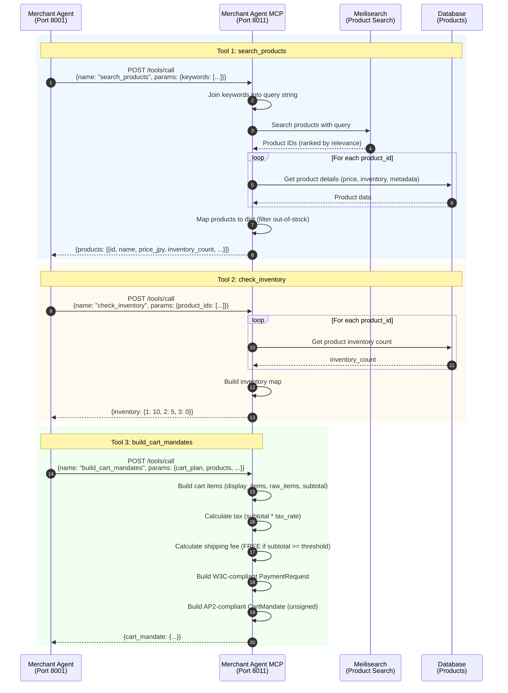

# Merchant Agent MCP

**Merchant Agent MCP Server** - Provides 3 data access tools for Merchant Agent's LangGraph AI engine (AP2-compliant).

## Overview

The Merchant Agent MCP (Model Context Protocol) Server provides data access tools for the Merchant Agent's LangGraph AI engine. Following MCP specification, this server provides tools ONLY (no LLM inference) - the Merchant Agent orchestrates LLM reasoning and tool calls via LangGraph.

**Port**: 8011
**Role**: MCP Tool Provider for Merchant Agent
**Protocol**: AP2 v0.2 + W3C Payment Request API

## Key Features

- **3 MCP Tools** - search_products, check_inventory, build_cart_mandates
- **Meilisearch Integration** - Full-text product search with fallback
- **W3C Payment Request API Compliance** - PaymentOptions, method_data configuration
- **AP2 CartMandate Construction** - Unsigned CartMandate with shipping, tax, fees
- **Database Access** - Product and inventory management
- **OpenTelemetry Integration** - Jaeger tracing for all MCP calls

## Sequence Diagram

This diagram shows the MCP server's internal tool processing.



## MCP Tools

### Tool 1: search_products

**Description**: Search products from database using Meilisearch full-text search

**Input Schema**:
```json
{
  "type": "object",
  "properties": {
    "keywords": {
      "type": "array",
      "items": {"type": "string"},
      "description": "Search keywords"
    },
    "limit": {
      "type": "integer",
      "description": "Maximum results",
      "default": 20
    }
  },
  "required": ["keywords"]
}
```

**Input Example**:
```json
{
  "keywords": ["かわいい", "グッズ"],
  "limit": 20
}
```

**Output Example**:
```json
{
  "products": [
    {
      "id": 1,
      "sku": "MUGIBO-001",
      "name": "むぎぼーぬいぐるみ（S）",
      "description": "かわいいむぎぼーのぬいぐるみ",
      "price_cents": 250000,
      "price_jpy": 2500.0,
      "inventory_count": 10,
      "category": "ぬいぐるみ",
      "brand": "むぎぼーショップ",
      "image_url": "https://example.com/mugibo-s.jpg",
      "refund_period_days": 30
    }
  ]
}
```

**Implementation**: `main.py:118`

**Search Logic**:
1. Join keywords with spaces (e.g., `["かわいい", "グッズ"]` → `"かわいい グッズ"`)
2. Query Meilisearch for full-text search (OR search across name, description, keywords, category, brand)
3. Get product IDs ranked by relevance
4. Fetch product details from Product DB
5. Filter out-of-stock products (`inventory_count <= 0`)
6. Map to standardized product dict format

**Fallback Behavior**:
- If no products found in Meilisearch → Return all products
- If Meilisearch error → Return all products
- Empty keywords (`[]` or `[""]`) → Return all products

### Tool 2: check_inventory

**Description**: Check inventory status for given product IDs

**Input Schema**:
```json
{
  "type": "object",
  "properties": {
    "product_ids": {
      "type": "array",
      "items": {"type": "integer"},
      "description": "Product IDs"
    }
  },
  "required": ["product_ids"]
}
```

**Input Example**:
```json
{
  "product_ids": [1, 2, 3]
}
```

**Output Example**:
```json
{
  "inventory": {
    "1": 10,
    "2": 5,
    "3": 0
  }
}
```

**Implementation**: `main.py:206`

**Inventory Logic**:
- Query Product DB for each product_id
- Return `inventory_count` if product exists
- Return `0` if product not found
- Return `{product_id: 0}` on error

### Tool 3: build_cart_mandates

**Description**: Build AP2-compliant unsigned CartMandate with W3C PaymentRequest structure

**Input Schema**:
```json
{
  "type": "object",
  "properties": {
    "cart_plan": {
      "type": "object",
      "description": "Cart plan (from optimize_cart)"
    },
    "products": {
      "type": "array",
      "items": {"type": "object"},
      "description": "Product list"
    },
    "shipping_address": {
      "type": "object",
      "description": "AP2-compliant ContactAddress"
    },
    "intent_mandate_id": {
      "type": "string",
      "description": "IntentMandate ID"
    }
  },
  "required": ["cart_plan", "products"]
}
```

**Input Example**:
```json
{
  "cart_plan": {
    "name": "カート1",
    "description": "むぎぼーグッズセット",
    "items": [
      {"product_id": 1, "quantity": 2},
      {"product_id": 2, "quantity": 1}
    ]
  },
  "products": [
    {"id": 1, "name": "むぎぼーぬいぐるみ（S）", "price_jpy": 2500.0, ...},
    {"id": 2, "name": "むぎぼーTシャツ", "price_jpy": 3000.0, ...}
  ],
  "shipping_address": {
    "country": "JP",
    "address_line": ["東京都渋谷区"],
    "postal_code": "150-0001"
  },
  "intent_mandate_id": "intent_abc123"
}
```

**Output Example**:
```json
{
  "cart_mandate": {
    "contents": {
      "id": "cart_abc12345",
      "user_cart_confirmation_required": true,
      "payment_request": {
        "method_data": [
          {
            "supported_methods": "https://a2a-protocol.org/payment-methods/ap2-payment",
            "data": {
              "version": "0.2",
              "processor": "did:ap2:agent:payment_processor",
              "supportedMethods": ["credential-based", "attestation-based"],
              "supportedNetworks": ["visa", "mastercard", "jcb", "amex"],
              "supportedTypes": ["credit", "debit"]
            }
          }
        ],
        "details": {
          "id": "cart_abc12345",
          "display_items": [
            {
              "label": "むぎぼーぬいぐるみ（S）",
              "amount": {"value": 5000.0, "currency": "JPY"},
              "refund_period": 2592000
            },
            {
              "label": "むぎぼーTシャツ",
              "amount": {"value": 3000.0, "currency": "JPY"},
              "refund_period": 2592000
            },
            {
              "label": "消費税（10%）",
              "amount": {"value": 800.0, "currency": "JPY"},
              "refund_period": 0
            },
            {
              "label": "送料",
              "amount": {"value": 0.0, "currency": "JPY"},
              "refund_period": 0
            }
          ],
          "total": {
            "label": "合計",
            "amount": {"value": 8800.0, "currency": "JPY"}
          }
        },
        "options": {
          "request_payer_name": true,
          "request_payer_email": true,
          "request_payer_phone": false,
          "request_shipping": true,
          "shipping_type": "shipping"
        },
        "shipping_address": {
          "country": "JP",
          "address_line": ["東京都渋谷区"],
          "postal_code": "150-0001"
        }
      },
      "cart_expiry": "2025-10-23T13:34:56Z",
      "merchant_name": "むぎぼーショップ"
    },
    "merchant_authorization": null,
    "_metadata": {
      "intent_mandate_id": "intent_abc123",
      "merchant_id": "did:ap2:merchant:mugibo_merchant",
      "created_at": "2025-10-23T12:34:56Z",
      "cart_name": "カート1",
      "cart_description": "むぎぼーグッズセット",
      "raw_items": [
        {
          "product_id": 1,
          "name": "むぎぼーぬいぐるみ（S）",
          "description": "かわいいむぎぼーのぬいぐるみ",
          "quantity": 2,
          "unit_price": {"value": 2500.0, "currency": "JPY"},
          "total_price": {"value": 5000.0, "currency": "JPY"},
          "image_url": "https://example.com/mugibo-s.jpg"
        },
        {
          "product_id": 2,
          "name": "むぎぼーTシャツ",
          "description": "むぎぼーデザインTシャツ",
          "quantity": 1,
          "unit_price": {"value": 3000.0, "currency": "JPY"},
          "total_price": {"value": 3000.0, "currency": "JPY"},
          "image_url": "https://example.com/mugibo-shirt.jpg"
        }
      ]
    }
  }
}
```

**Implementation**: `main.py:262`

**CartMandate Construction Logic**:

1. **Build Cart Items** (`cart_mandate_helpers.py:64`):
   - Map product_ids to products
   - Create `display_items` (AP2 PaymentItem format)
   - Create `raw_items` (metadata with product details)
   - Calculate subtotal

2. **Calculate Tax** (`cart_mandate_helpers.py:119`):
   - Tax = subtotal × tax_rate (default: 10%)
   - Round to 2 decimal places
   - Add to `display_items` with `refund_period: 0`

3. **Calculate Shipping Fee** (`cart_mandate_helpers.py:133`):
   - FREE if subtotal >= free_shipping_threshold (default: ¥5000)
   - Otherwise: shipping_fee (default: ¥500)
   - Add to `display_items` if > 0

4. **Build W3C PaymentRequest** (`cart_mandate_helpers.py:145`):
   - `method_data`: Supported payment methods (NOT empty array - W3C violation)
   - `details`: display_items, total
   - `options`: PaymentOptions (request_payer_name, request_payer_email, etc.)
   - `shipping_address`: AP2-compliant ContactAddress

5. **Build AP2 CartMandate Structure**:
   - `contents`: W3C PaymentRequest + cart_expiry (1 hour) + merchant_name
   - `merchant_authorization`: null (unsigned - will be signed by Merchant service)
   - `_metadata`: intent_mandate_id, merchant_id, cart_name, cart_description, raw_items

**W3C Compliance**:
- ✅ `method_data` NOT empty (at least 1 payment method required)
- ✅ `options` field with PaymentOptions
- ✅ `supported_methods` URL format: `https://a2a-protocol.org/payment-methods/ap2-payment`

**AP2 Compliance**:
- ✅ `contents.payment_request` structure
- ✅ `display_items` with `amount` (value as float, currency)
- ✅ `refund_period` in seconds (days × 86400)
- ✅ `merchant_authorization` field (null for unsigned)
- ✅ `cart_expiry` in ISO 8601 format

## Environment Variables

```bash
# Merchant Configuration
MERCHANT_ID=did:ap2:merchant:mugibo_merchant
MERCHANT_NAME=むぎぼーショップ
MERCHANT_URL=http://merchant:8002

# Database Configuration
DATABASE_URL=sqlite+aiosqlite:////app/data/merchant_agent.db

# Pricing Configuration
SHIPPING_FEE=500.0
FREE_SHIPPING_THRESHOLD=5000.0
TAX_RATE=0.1

# W3C Payment Request API Configuration
SUPPORTED_PAYMENT_METHODS=[{"supported_methods":"https://a2a-protocol.org/payment-methods/ap2-payment","data":{...}}]
REQUEST_PAYER_NAME=true
REQUEST_PAYER_EMAIL=true
REQUEST_PAYER_PHONE=false
REQUEST_SHIPPING=true
SHIPPING_TYPE=shipping

# OpenTelemetry
OTEL_ENABLED=true
OTEL_SERVICE_NAME=merchant_agent_mcp
OTEL_EXPORTER_OTLP_ENDPOINT=http://jaeger:4317

# Logging
LOG_LEVEL=INFO
LOG_FORMAT=text
```

## Dependencies

### Python Packages
- **fastapi** 0.115.0 - Web framework
- **uvicorn** - ASGI server
- **sqlalchemy** 2.0.35 - ORM
- **aiosqlite** - Async SQLite driver

### Shared Components
- **common.mcp_server** - MCPServer base class
- **common.database** - DatabaseManager, ProductCRUD
- **common.search_engine** - MeilisearchClient
- **common.telemetry** - OpenTelemetry instrumentation
- **common.logger** - Structured logging

### Downstream Services
- **Meilisearch** (Port 7700) - Full-text product search

## Key Implementation Details

### MCP Server Initialization

MCP server setup with tool registration:

```python
# main.py:79-96
from common.mcp_server import MCPServer

mcp = MCPServer(
    server_name="merchant_agent_mcp",
    version="1.0.0"
)

# Helpers initialization (AP2 & W3C compliant)
cart_mandate_helpers = CartMandateHelpers(
    merchant_id=MERCHANT_ID,
    merchant_name=MERCHANT_NAME,
    merchant_url=MERCHANT_URL,
    shipping_fee=SHIPPING_FEE,
    free_shipping_threshold=FREE_SHIPPING_THRESHOLD,
    tax_rate=TAX_RATE,
    supported_payment_methods=SUPPORTED_PAYMENT_METHODS,
    payment_options=PAYMENT_OPTIONS
)
```

### Product Search with Meilisearch

Full-text search with fallback:

```python
# main.py:140-188
# Step 1: Join keywords
if not keywords or (len(keywords) == 1 and keywords[0] == ""):
    query = ""  # Empty keywords → all products
else:
    query = " ".join(keywords)  # ["かわいい", "グッズ"] → "かわいい グッズ"

# Step 2: Meilisearch full-text search
product_ids = await search_client.search(query, limit=limit)

# Step 3: Fetch product details from DB
async with db_manager.get_session() as session:
    if not product_ids:
        # Fallback: return all products
        all_products = await ProductCRUD.get_all_with_stock(session, limit=limit)
        product_ids = [p.id for p in all_products]

    # Map products to dict (filter out-of-stock)
    products_list = product_helpers.map_products_to_list(products)
```

**Meilisearch Configuration**:
- Indexes: product_name, description, keywords, category, brand
- Ranking rules: exactness, words, proximity, attribute, sort
- Fallback: If search fails or returns empty, return all products

### Product Data Mapping

Standardized product dict format:

```python
# product_helpers.py:17-45
class ProductHelpers:
    @staticmethod
    def map_product_to_dict(product) -> Dict[str, Any]:
        """Map Product ORM object to dict"""
        metadata = product.metadata or {}

        return {
            "id": product.id,
            "sku": product.sku,
            "name": product.name,
            "description": product.description,
            "price_cents": product.price,  # DB: cents
            "price_jpy": product.price / 100.0,  # AP2: float, JPY
            "inventory_count": product.inventory_count,
            "category": metadata.get("category"),
            "brand": metadata.get("brand"),
            "image_url": product.image_url,
            "refund_period_days": metadata.get("refund_period_days", 30)
        }

    @staticmethod
    def map_products_to_list(products: List) -> List[Dict[str, Any]]:
        """Filter out-of-stock and map to list"""
        products_list = []
        for product in products:
            if product.inventory_count <= 0:
                continue  # Skip out-of-stock
            products_list.append(ProductHelpers.map_product_to_dict(product))
        return products_list
```

### CartMandate Construction Helpers

Helper methods for W3C and AP2 compliance:

```python
# cart_mandate_helpers.py:15-212
class CartMandateHelpers:
    def __init__(self, merchant_id, merchant_name, merchant_url,
                 shipping_fee, free_shipping_threshold, tax_rate,
                 supported_payment_methods, payment_options):
        self.merchant_id = merchant_id
        self.merchant_name = merchant_name
        self.merchant_url = merchant_url
        self.shipping_fee = shipping_fee
        self.free_shipping_threshold = free_shipping_threshold
        self.tax_rate = tax_rate
        self.supported_payment_methods = supported_payment_methods
        self.payment_options = payment_options

    def build_cart_items(self, cart_plan, products_map):
        """Build display_items, raw_items, subtotal"""
        display_items = []
        raw_items = []
        subtotal = 0.0

        for item in cart_plan.get("items", []):
            product = products_map[item["product_id"]]
            total_price_jpy = product["price_jpy"] * item["quantity"]

            # AP2 PaymentItem
            display_items.append({
                "label": product["name"],
                "amount": {"value": total_price_jpy, "currency": "JPY"},
                "refund_period": product.get("refund_period_days", 30) * 86400
            })

            # Raw item metadata
            raw_items.append({
                "product_id": product["id"],
                "name": product["name"],
                "quantity": item["quantity"],
                "unit_price": {"value": product["price_jpy"], "currency": "JPY"},
                "total_price": {"value": total_price_jpy, "currency": "JPY"},
                "image_url": product.get("image_url")
            })

            subtotal += total_price_jpy

        return display_items, raw_items, subtotal

    def calculate_tax(self, subtotal):
        """Calculate tax (default: 10%)"""
        tax = round(subtotal * self.tax_rate, 2)
        tax_label = f"消費税（{int(self.tax_rate * 100)}%）"
        return tax, tax_label

    def calculate_shipping_fee(self, subtotal):
        """Calculate shipping fee (FREE if >= threshold)"""
        return self.shipping_fee if subtotal < self.free_shipping_threshold else 0.0

    def build_cart_mandate_structure(self, display_items, raw_items, total,
                                     shipping_address, session_data):
        """Build W3C + AP2 compliant CartMandate"""
        cart_id = f"cart_{uuid.uuid4().hex[:8]}"
        cart_expiry = (datetime.now(timezone.utc) + timedelta(hours=1)).isoformat()

        return {
            "contents": {
                "id": cart_id,
                "user_cart_confirmation_required": True,
                "payment_request": {
                    # W3C: method_data NOT empty
                    "method_data": self.supported_payment_methods,
                    "details": {
                        "id": cart_id,
                        "display_items": display_items,
                        "total": {
                            "label": "合計",
                            "amount": {"value": total, "currency": "JPY"}
                        }
                    },
                    # W3C: PaymentOptions
                    "options": self.payment_options,
                    # AP2: shipping_address
                    "shipping_address": shipping_address
                },
                "cart_expiry": cart_expiry,
                "merchant_name": self.merchant_name
            },
            "merchant_authorization": None,  # Unsigned
            "_metadata": {
                "intent_mandate_id": session_data.get("intent_mandate_id"),
                "merchant_id": self.merchant_id,
                "created_at": datetime.now(timezone.utc).isoformat(),
                "cart_name": session_data.get("cart_name"),
                "cart_description": session_data.get("cart_description"),
                "raw_items": raw_items
            }
        }
```

**W3C Compliance Notes**:
- `method_data` must NOT be empty (TypeError if empty)
- At least 1 payment method required
- `options` field recommended for better UX
- `supported_methods` must be URL format (not "basic-card" - deprecated since 2022)

### OpenTelemetry Integration

Jaeger tracing for all MCP calls:

```python
# main.py:317-322
from common.telemetry import setup_telemetry, instrument_fastapi_app

service_name = os.getenv("OTEL_SERVICE_NAME", "merchant_agent_mcp")
setup_telemetry(service_name)

# FastAPI instrumentation
instrument_fastapi_app(app)
```

**Traced Operations**:
- MCP tool calls (`POST /tools/call`)
- Meilisearch queries
- Database queries (ProductCRUD)
- Helper method executions

## Development

### Run Locally

```bash
# Set environment variables
export MERCHANT_ID=did:ap2:merchant:mugibo_merchant
export DATABASE_URL=sqlite+aiosqlite:////app/data/merchant_agent.db

# Install dependencies
pip install -e .

# Start Meilisearch
meilisearch --port 7700

# Run service
cd services/merchant_agent_mcp
python main.py
```

### Run with Docker

```bash
# Build and run
docker compose up merchant_agent_mcp

# View logs
docker compose logs -f merchant_agent_mcp
```

## Testing

```bash
# Health check
curl http://localhost:8011/health

# List tools
curl http://localhost:8011/tools/list

# Search products
curl -X POST http://localhost:8011/tools/call \
  -H "Content-Type: application/json" \
  -d '{
    "name": "search_products",
    "params": {
      "keywords": ["かわいい", "グッズ"],
      "limit": 20
    }
  }'

# Check inventory
curl -X POST http://localhost:8011/tools/call \
  -H "Content-Type: application/json" \
  -d '{
    "name": "check_inventory",
    "params": {
      "product_ids": [1, 2, 3]
    }
  }'

# Build cart mandate
curl -X POST http://localhost:8011/tools/call \
  -H "Content-Type: application/json" \
  -d '{
    "name": "build_cart_mandates",
    "params": {
      "cart_plan": {
        "name": "カート1",
        "items": [
          {"product_id": 1, "quantity": 2}
        ]
      },
      "products": [
        {"id": 1, "name": "むぎぼーぬいぐるみ", "price_jpy": 2500.0}
      ],
      "shipping_address": {
        "country": "JP",
        "address_line": ["東京都渋谷区"],
        "postal_code": "150-0001"
      },
      "intent_mandate_id": "intent_abc123"
    }
  }'
```

## AP2 Compliance

- ✅ **3 MCP Tools** - search_products, check_inventory, build_cart_mandates
- ✅ **W3C PaymentRequest** - method_data (not empty), options, details
- ✅ **AP2 CartMandate** - contents, merchant_authorization, _metadata
- ✅ **PaymentItem Format** - label, amount (value as float), currency, refund_period
- ✅ **ContactAddress** - AP2-compliant shipping_address
- ✅ **Unsigned CartMandate** - merchant_authorization: null (signed by Merchant service)
- ✅ **Cart Expiry** - 1 hour from creation
- ✅ **Tax Calculation** - Configurable tax_rate (default: 10%)
- ✅ **Shipping Fee** - FREE if subtotal >= threshold
- ✅ **MCP Specification** - Tools only, no LLM inference

## References

- [Main README](../../README.md)
- [Merchant Agent README](../merchant_agent/README.md)
- [AP2 Specification](https://ap2-protocol.org/specification/)
- [W3C Payment Request API](https://www.w3.org/TR/payment-request/)
- [MCP Specification](https://spec.modelcontextprotocol.io/)

---

**Port**: 8011
**Role**: MCP Tool Provider for Merchant Agent
**Protocol**: AP2 v0.2 + W3C Payment Request API
**Status**: Production-Ready
