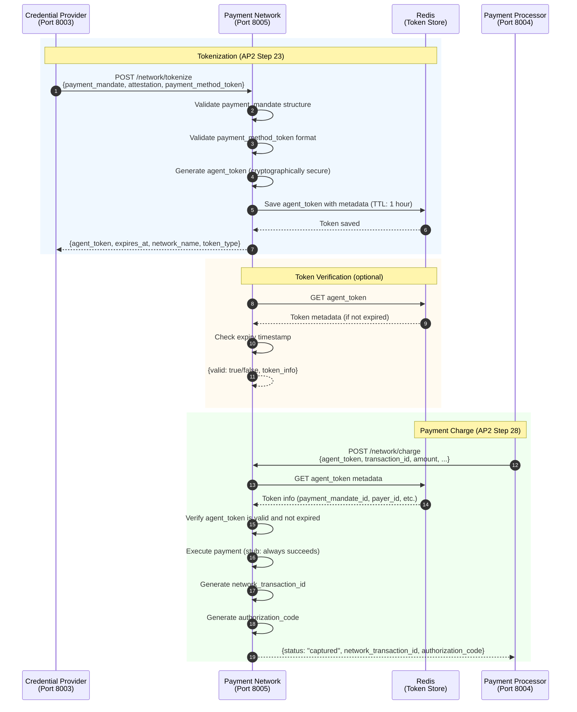

# Payment Network

**Payment Network Stub Service** - Provides agent token lifecycle management and payment execution for AP2-compliant transactions.

## Overview

The Payment Network is a stub implementation of actual payment networks (e.g., Visa, Mastercard). It handles agent token generation, verification, and payment charging for AP2 protocol compliance. In production, this would be replaced with actual payment network integrations.

**Port**: 8005
**Role**: Payment Network (stub implementation)
**Protocol**: AP2 v0.2

## Key Features

- **Agent Token Generation** - Cryptographically secure token issuance (AP2 Step 23)
- **Token Verification** - Agent token validation with Redis TTL
- **Payment Charging** - Network-side payment execution (AP2 Step 28)
- **Redis Token Store** - TTL-managed token storage (1-hour expiry)
- **Network Transaction IDs** - Unique network-side transaction tracking
- **Authorization Codes** - Payment authorization code generation

## Sequence Diagram

This diagram shows the Payment Network's internal processing for tokenization and charging.



## API Endpoints

### Tokenization

**`POST /network/tokenize`** - Generate agent token (AP2 Step 23)

**Request**:
```json
{
  "payment_mandate": {
    "id": "payment_xxx",
    "payer_id": "user_123",
    "amount": {"value": 2500, "currency": "JPY"}
  },
  "attestation": {
    "type": "webauthn",
    "credential_id": "cred_xxx"
  },
  "payment_method_token": "tok_xxx",
  "transaction_context": {
    "merchant_id": "merchant_abc",
    "cart_id": "cart_xyz"
  }
}
```

**Response**:
```json
{
  "agent_token": "agent_tok_abc123xyz789",
  "expires_at": "2025-10-23T13:34:56Z",
  "network_name": "DemoPaymentNetwork",
  "token_type": "agent_token"
}
```

**Implementation**: `network.py:158`

**Token Generation**:
- Cryptographically secure token (32 bytes, hex-encoded)
- 1-hour expiry (configurable)
- Stored in Redis with TTL
- Associated with payment_mandate_id, payer_id, amount

### Token Verification

**`POST /network/verify-token`** - Verify agent token

**Request**:
```json
{
  "agent_token": "agent_tok_abc123xyz789"
}
```

**Response (Valid)**:
```json
{
  "valid": true,
  "token_info": {
    "payment_mandate_id": "payment_xxx",
    "payer_id": "user_123",
    "amount": {"value": 2500, "currency": "JPY"},
    "network_name": "DemoPaymentNetwork",
    "created_at": "2025-10-23T12:34:56Z",
    "expires_at": "2025-10-23T13:34:56Z"
  }
}
```

**Response (Invalid)**:
```json
{
  "valid": false,
  "token_info": null,
  "error": "Token not found or expired"
}
```

**Implementation**: `network.py:233`

### Payment Execution

**`POST /network/charge`** - Execute payment with agent token (AP2 Step 28)

**Request**:
```json
{
  "agent_token": "agent_tok_abc123xyz789",
  "transaction_id": "txn_xxx",
  "amount": {"value": 2500, "currency": "JPY"},
  "payment_mandate_id": "payment_xxx",
  "payer_id": "user_123"
}
```

**Response (Success)**:
```json
{
  "status": "captured",
  "transaction_id": "txn_xxx",
  "network_transaction_id": "net_txn_abc123",
  "authorization_code": "AUTH123456"
}
```

**Response (Error)**:
```json
{
  "status": "failed",
  "transaction_id": "txn_xxx",
  "network_transaction_id": "",
  "error": "Invalid agent token: Token not found"
}
```

**Implementation**: `network.py:296`

### Network Information

**`GET /network/info`** - Get network capabilities

**Response**:
```json
{
  "network_name": "DemoPaymentNetwork",
  "supported_payment_methods": ["card", "digital_wallet"],
  "tokenization_enabled": true,
  "agent_transactions_supported": true,
  "timestamp": "2025-10-23T12:34:56Z"
}
```

**Implementation**: `network.py:275`

### Common Endpoints

**`GET /health`** - Health check
- **Response**: `{status: "healthy", service: "payment_network", network_name: "DemoPaymentNetwork"}`

## Environment Variables

```bash
# Service Configuration
NETWORK_NAME=DemoPaymentNetwork

# Redis Configuration
REDIS_URL=redis://localhost:6379/2

# Agent Token Configuration
AGENT_TOKEN_EXPIRY_HOURS=1

# Logging
LOG_LEVEL=INFO
LOG_FORMAT=text
```

## Dependencies

### Python Packages
- **fastapi** 0.115.0 - Web framework
- **redis** - Redis client for token storage
- **cryptography** - Secure token generation

### Shared Components
- **common.redis_client** - RedisClient, TokenStore (TTL management)

### Upstream Services
- **Credential Provider** (Port 8003) - Calls `/network/tokenize` during WebAuthn flow

### Downstream Services
- **Payment Processor** (Port 8004) - Calls `/network/charge` for payment execution

## Key Implementation Details

### Agent Token Generation

Cryptographically secure token with metadata:

```python
# network.py:212-218 (via utils.TokenHelpers)
import secrets

# Generate 32-byte secure token
token_bytes = secrets.token_bytes(32)
agent_token = f"agent_tok_{token_bytes.hex()}"

# Token metadata
token_data = {
    "payment_mandate_id": payment_mandate["id"],
    "payer_id": payment_mandate.get("payer_id"),
    "amount": payment_mandate.get("amount"),
    "payment_method_token": payment_method_token,
    "attestation_verified": attestation is not None,
    "network_name": network_name,
    "created_at": datetime.now(timezone.utc).isoformat(),
    "expires_at": (datetime.now(timezone.utc) + timedelta(hours=1)).isoformat()
}

# Save to Redis with TTL
await token_store.save_token(agent_token, token_data, ttl_seconds=3600)
```

**Token Properties**:
- **Length**: 64 hex characters (32 bytes)
- **Prefix**: `agent_tok_`
- **Expiry**: 1 hour (configurable)
- **Storage**: Redis with automatic TTL expiry

### Redis Token Store

TTL-managed token storage:

```python
# common/redis_client.py
class TokenStore:
    def __init__(self, redis_client, prefix="agent_token"):
        self.redis = redis_client
        self.prefix = prefix

    async def save_token(self, token: str, data: Dict, ttl_seconds: int):
        """Save token with TTL"""
        key = f"{self.prefix}:{token}"
        await self.redis.setex(
            key,
            ttl_seconds,
            json.dumps(data)
        )

    async def get_token(self, token: str) -> Optional[Dict]:
        """Get token data (returns None if expired)"""
        key = f"{self.prefix}:{token}"
        data = await self.redis.get(key)
        return json.loads(data) if data else None
```

**Redis Key Structure**:
- **Key Format**: `agent_token:{agent_tok_xxx}`
- **Value**: JSON-serialized token metadata
- **TTL**: 3600 seconds (1 hour)
- **Database**: Redis DB 2 (dedicated to Payment Network)

### Payment Charging

Stub implementation with network transaction generation:

```python
# network.py:296-378
async def charge_payment(request: ChargeRequest):
    # Step 1: Verify agent_token
    valid, token_info, error = await token_helpers.verify_agent_token(
        request.agent_token
    )

    if not valid:
        return ChargeResponse(
            status="failed",
            transaction_id=request.transaction_id,
            network_transaction_id="",
            error=f"Invalid agent token: {error}"
        )

    # Step 2: Execute payment (stub: always succeeds)
    network_transaction_id = f"net_txn_{uuid.uuid4().hex[:12]}"
    authorization_code = f"AUTH{uuid.uuid4().hex[:6].upper()}"

    # Step 3: Return success
    return ChargeResponse(
        status="captured",
        transaction_id=request.transaction_id,
        network_transaction_id=network_transaction_id,
        authorization_code=authorization_code
    )
```

**Stub Behavior**:
- All payments succeed (no actual network call)
- Generates realistic network_transaction_id and authorization_code
- In production, this would call actual payment network APIs (Visa, Mastercard, etc.)

### Token Lifecycle

Complete token flow:

1. **Tokenization (AP2 Step 23)**:
   - CP → Payment Network: `POST /network/tokenize`
   - Payment Network generates agent_token
   - Token saved to Redis (1-hour TTL)
   - agent_token returned to CP
   - CP saves agent_token to token_data

2. **Credential Verification (AP2 Step 26-27)**:
   - PP → CP: `POST /credentials/verify`
   - CP retrieves agent_token from token_data
   - CP returns agent_token to PP

3. **Payment Charging (AP2 Step 28)**:
   - PP → Payment Network: `POST /network/charge` with agent_token
   - Payment Network verifies agent_token (Redis lookup)
   - Payment Network executes payment
   - Payment Network returns network_transaction_id and authorization_code

## Development

### Run Locally

```bash
# Set environment variables
export NETWORK_NAME=DemoPaymentNetwork
export REDIS_URL=redis://localhost:6379/2

# Install dependencies
pip install -e .

# Start Redis
redis-server --port 6379

# Run service
cd services/payment_network
python main.py
```

### Run with Docker

```bash
# Build and run
docker compose up payment_network

# View logs
docker compose logs -f payment_network
```

## Testing

```bash
# Health check
curl http://localhost:8005/health

# Network info
curl http://localhost:8005/network/info

# Tokenize payment
curl -X POST http://localhost:8005/network/tokenize \
  -H "Content-Type: application/json" \
  -d '{
    "payment_mandate": {
      "id": "payment_xxx",
      "payer_id": "user_123",
      "amount": {"value": 2500, "currency": "JPY"}
    },
    "payment_method_token": "tok_xxx"
  }'

# Verify token
curl -X POST http://localhost:8005/network/verify-token \
  -H "Content-Type: application/json" \
  -d '{
    "agent_token": "agent_tok_abc123xyz789"
  }'

# Charge payment
curl -X POST http://localhost:8005/network/charge \
  -H "Content-Type: application/json" \
  -d '{
    "agent_token": "agent_tok_abc123xyz789",
    "transaction_id": "txn_xxx",
    "amount": {"value": 2500, "currency": "JPY"},
    "payment_mandate_id": "payment_xxx",
    "payer_id": "user_123"
  }'
```

## AP2 Compliance

- ✅ **Agent Token Generation** - AP2 Step 23 (Tokenization)
- ✅ **Token Verification** - Redis-backed with TTL
- ✅ **Payment Charging** - AP2 Step 28 (Network Charge)
- ✅ **Token Lifecycle** - 1-hour expiry with automatic cleanup
- ✅ **Network Transaction IDs** - Unique network-side tracking
- ✅ **Authorization Codes** - Payment authorization generation

## References

- [Main README](../../README.md)
- [Credential Provider README](../credential_provider/README.md)
- [Payment Processor README](../payment_processor/README.md)
- [AP2 Specification](https://ap2-protocol.org/specification/)

---

**Port**: 8005
**Role**: Payment Network (stub)
**Protocol**: AP2 v0.2
**Status**: Production-Ready (stub implementation)
