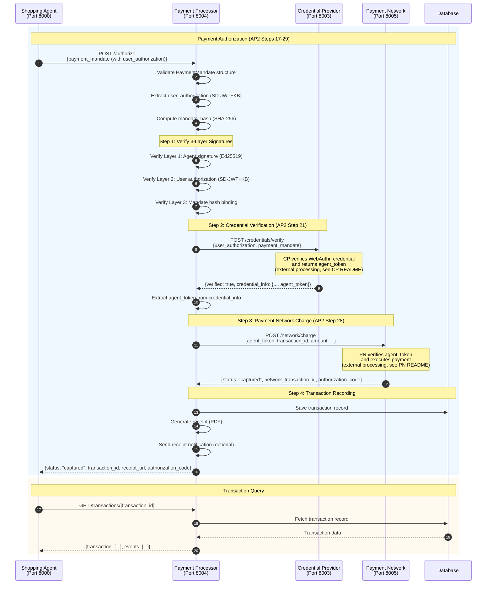

# Payment Processor

**Payment Processing Service** - Orchestrates payment authorization, credential verification, and network charging for AP2 transactions.

## Overview

The Payment Processor is the central orchestrator for payment execution in the AP2 protocol. It coordinates between the Credential Provider (for WebAuthn verification), Payment Network (for actual payment), and manages the complete transaction lifecycle.

**Port**: 8004
**Role**: Payment Processor (MPP - Merchant Payment Processor)
**Protocol**: AP2 v0.2

## Key Features

- **Payment Authorization** - AP2 payment flow with 3-layer signature verification
- **Credential Verification** - Integration with Credential Provider (WebAuthn/Passkey)
- **Payment Network Integration** - Agent token-based network charging
- **Transaction Management** - Complete transaction lifecycle tracking
- **Receipt Generation** - PDF receipt generation and notifications
- **A2A Protocol** - Ed25519-signed messaging
- **OpenTelemetry Integration** - Jaeger tracing for all operations

## Sequence Diagram

This diagram shows the Payment Processor's internal processing for payment authorization.



## API Endpoints

### Payment Processing

**`POST /authorize`** - Payment authorization with 3-layer signature verification

**Request**:
```json
{
  "id": "payment_xxx",
  "cart_mandate_id": "cart_xxx",
  "payer_id": "user_123",
  "payee_id": "merchant_abc",
  "amount": {"value": 2500, "currency": "JPY"},
  "payment_method": {
    "type": "card",
    "token": "tok_xxx"
  },
  "user_authorization": "issuer_jwt~kb_jwt",
  "risk_score": 25,
  "created_at": "2025-10-23T12:34:56Z"
}
```

**Response (Success)**:
```json
{
  "status": "captured",
  "transaction_id": "txn_xxx",
  "network_transaction_id": "net_txn_xxx",
  "authorization_code": "AUTH123456",
  "amount": {"value": 2500, "currency": "JPY"},
  "receipt_url": "http://payment_processor:8004/receipts/txn_xxx.pdf",
  "created_at": "2025-10-23T12:34:56Z"
}
```

**Response (Error)**:
```json
{
  "status": "failed",
  "transaction_id": "txn_xxx",
  "error": "Credential verification failed",
  "error_code": "CREDENTIAL_VERIFICATION_FAILED"
}
```

**Implementation**: `processor.py:788`

**3-Layer Signature Verification**:
1. **Layer 1**: Agent signature (Ed25519) - Verifies Shopping Agent signed the PaymentMandate
2. **Layer 2**: User authorization (SD-JWT+KB) - Verifies user's WebAuthn/Passkey consent
3. **Layer 3**: Mandate hash binding - Verifies mandate hasn't been tampered with

### Transaction Management

**`GET /transactions/{transaction_id}`** - Get transaction details

**Response**:
```json
{
  "transaction": {
    "id": "txn_xxx",
    "payment_mandate_id": "payment_xxx",
    "status": "captured",
    "amount": {"value": 2500, "currency": "JPY"},
    "payer_id": "user_123",
    "payee_id": "merchant_abc",
    "network_transaction_id": "net_txn_xxx",
    "authorization_code": "AUTH123456",
    "created_at": "2025-10-23T12:34:56Z"
  },
  "events": [
    {"event": "authorization_started", "timestamp": "2025-10-23T12:34:56Z"},
    {"event": "credential_verified", "timestamp": "2025-10-23T12:34:57Z"},
    {"event": "payment_captured", "timestamp": "2025-10-23T12:34:58Z"}
  ]
}
```

**Implementation**: `processor.py:1100`

**`GET /receipts/{transaction_id}.pdf`** - Download receipt PDF

**Response**: PDF file (application/pdf)

**Implementation**: `processor.py:1150`

### Common Endpoints (Inherited from BaseAgent)

**`GET /`** - Health check
- **Response**: `{agent_id, agent_name, status, version}`

**`GET /health`** - Health check (for Docker)
- **Response**: `{status: "healthy"}`

**`POST /a2a/message`** - Receive A2A messages from other agents
- **Request**: A2AMessage (Ed25519 signed)
- **Response**: A2A response

**`GET /.well-known/did.json`** - DID document
- **Response**: W3C DID Document

## Environment Variables

```bash
# Service Configuration
AGENT_ID=did:ap2:agent:payment_processor
DATABASE_URL=sqlite+aiosqlite:////app/data/payment_processor.db
AP2_KEYS_DIRECTORY=/app/keys

# Downstream Services
CREDENTIAL_PROVIDER_URL=http://credential_provider:8003
PAYMENT_NETWORK_URL=http://payment_network:8005

# Optional Features
ENABLE_RECEIPT_NOTIFICATION=true

# OpenTelemetry
OTEL_ENABLED=true
OTEL_SERVICE_NAME=payment_processor
OTEL_EXPORTER_OTLP_ENDPOINT=http://jaeger:4317

# Logging
LOG_LEVEL=INFO
LOG_FORMAT=text
```

## Database Schema

### Tables

- **transactions** - Payment transaction records
  - `id` (primary key)
  - `payment_mandate_id`
  - `status` (captured/failed)
  - `amount` (JSON)
  - `payer_id`
  - `payee_id`
  - `network_transaction_id`
  - `authorization_code`
  - `created_at`

- **transaction_events** - Transaction lifecycle events
  - `id` (primary key)
  - `transaction_id` (foreign key)
  - `event` (authorization_started/credential_verified/payment_captured/payment_failed)
  - `timestamp`
  - `details` (JSON)

## Dependencies

### Python Packages
- **fastapi** 0.115.0 - Web framework
- **httpx** 0.27.0 - Async HTTP client
- **cryptography** 43.0.0 - Ed25519 signing
- **sqlalchemy** 2.0.35 - ORM
- **reportlab** - PDF receipt generation

### Shared Components
- **common.base_agent** - BaseAgent for A2A protocol
- **common.user_authorization** - SD-JWT+KB verification
- **common.database** - DatabaseManager, TransactionCRUD
- **common.telemetry** - OpenTelemetry instrumentation

### Downstream Services
- **Credential Provider** (Port 8003) - WebAuthn verification, agent token retrieval
- **Payment Network** (Port 8005) - Payment execution with agent token

## Key Implementation Details

### 3-Layer Signature Verification

Complete signature verification stack:

```python
# processor.py:788-959
async def authorize_payment(payment_mandate: Dict[str, Any]) -> Dict[str, Any]:
    # Layer 1: Agent signature (inherited from BaseAgent)
    # Verified automatically by A2A message handler

    # Layer 2: User authorization (SD-JWT+KB)
    user_authorization = payment_mandate.get("user_authorization")
    if not user_authorization:
        raise HTTPException(status_code=400, detail="Missing user_authorization")

    # Verify SD-JWT+KB format (tilde-separated)
    # Format: issuer_jwt~kb_jwt
    if "~" not in user_authorization:
        raise HTTPException(status_code=400, detail="Invalid SD-JWT+KB format")

    # Layer 3: Mandate hash binding
    mandate_hash = compute_mandate_hash(payment_mandate)

    # Verify credential with Credential Provider
    response = await http_client.post(
        f"{credential_provider_url}/credentials/verify",
        json={
            "user_authorization": user_authorization,
            "mandate_hash": mandate_hash,
            "payment_mandate": payment_mandate
        }
    )

    if not response.json().get("verified"):
        raise HTTPException(status_code=401, detail="Credential verification failed")
```

**Verification Steps**:
1. Agent signature verified by A2A handler (Ed25519)
2. SD-JWT+KB format validated (tilde-separated)
3. Mandate hash computed (SHA-256)
4. Credential Provider verifies WebAuthn and returns agent_token

### Payment Network Integration

Agent token-based payment execution:

```python
# processor.py:829-959
# Step 1: Get agent_token from Credential Provider
credential_info = verify_response.json().get("credential_info", {})
agent_token = credential_info.get("agent_token")

if not agent_token:
    logger.error("[PaymentProcessor] No agent_token returned from Credential Provider")
    return {"status": "failed", "error": "No agent_token from CP"}

# Step 2: Charge Payment Network with agent_token
charge_response = await http_client.post(
    f"{payment_network_url}/network/charge",
    json={
        "agent_token": agent_token,
        "transaction_id": transaction_id,
        "amount": amount,
        "payment_mandate_id": payment_mandate.get("id"),
        "payer_id": payment_mandate.get("payer_id")
    }
)

charge_result = charge_response.json()

if charge_result.get("status") == "captured":
    # Payment successful
    return {
        "status": "captured",
        "transaction_id": transaction_id,
        "network_transaction_id": charge_result.get("network_transaction_id"),
        "authorization_code": charge_result.get("authorization_code")
    }
```

**AP2 Flow**:
- **Step 21**: CP verifies WebAuthn → generates agent_token → saves to token store
- **Step 26-27**: PP requests credential verification → CP returns agent_token
- **Step 28**: PP charges Payment Network with agent_token

### Receipt Generation

PDF receipt generation and optional notifications:

```python
# processor.py:1000-1050
from reportlab.pdfgen import canvas

def generate_receipt_pdf(transaction: Dict[str, Any]) -> bytes:
    """Generate PDF receipt"""
    buffer = BytesIO()
    c = canvas.Canvas(buffer, pagesize=letter)

    # Receipt header
    c.setFont("Helvetica-Bold", 16)
    c.drawString(100, 750, "Payment Receipt")

    # Transaction details
    c.setFont("Helvetica", 12)
    c.drawString(100, 700, f"Transaction ID: {transaction['id']}")
    c.drawString(100, 680, f"Amount: {transaction['amount']['value']} {transaction['amount']['currency']}")
    c.drawString(100, 660, f"Status: {transaction['status']}")

    c.save()
    return buffer.getvalue()

# Optional: Send receipt notification
if enable_receipt_notification:
    await send_receipt_notification(
        payer_id=payer_id,
        receipt_url=f"{base_url}/receipts/{transaction_id}.pdf"
    )
```

**Receipt Features**:
- PDF generation with ReportLab
- Transaction details (ID, amount, status, timestamp)
- Authorization code and network transaction ID
- Optional email/push notifications

### Transaction Lifecycle

Complete transaction tracking:

```python
# Transaction states
STATUS_CAPTURED = "captured"
STATUS_FAILED = "failed"

# Transaction events
EVENTS = [
    "authorization_started",
    "credential_verified",
    "payment_captured",
    "payment_failed",
    "receipt_generated"
]

# Event recording
async def record_transaction_event(
    transaction_id: str,
    event: str,
    details: Dict[str, Any]
):
    await transaction_crud.create_event(
        transaction_id=transaction_id,
        event=event,
        timestamp=datetime.now(timezone.utc),
        details=details
    )
```

**Lifecycle Flow**:
1. authorization_started → POST /authorize received
2. credential_verified → CP verified WebAuthn
3. payment_captured → Payment Network charged successfully
4. receipt_generated → PDF receipt created

### Error Handling

Comprehensive error codes and messages:

```python
ERROR_CODES = {
    "INVALID_MANDATE": "Invalid PaymentMandate structure",
    "MISSING_USER_AUTHORIZATION": "Missing user_authorization field",
    "INVALID_SDJWT_FORMAT": "Invalid SD-JWT+KB format",
    "CREDENTIAL_VERIFICATION_FAILED": "Credential Provider verification failed",
    "NO_AGENT_TOKEN": "No agent_token returned from Credential Provider",
    "PAYMENT_NETWORK_ERROR": "Payment Network charge failed",
    "TRANSACTION_NOT_FOUND": "Transaction not found"
}

# Error response format
{
    "status": "failed",
    "transaction_id": "txn_xxx",
    "error": "Credential verification failed",
    "error_code": "CREDENTIAL_VERIFICATION_FAILED",
    "timestamp": "2025-10-23T12:34:56Z"
}
```

## Development

### Run Locally

```bash
# Set environment variables
export AGENT_ID=did:ap2:agent:payment_processor
export DATABASE_URL=sqlite+aiosqlite:////app/data/payment_processor.db
export CREDENTIAL_PROVIDER_URL=http://localhost:8003
export PAYMENT_NETWORK_URL=http://localhost:8005

# Install dependencies
pip install -e .

# Run service
cd services/payment_processor
python main.py
```

### Run with Docker

```bash
# Build and run
docker compose up payment_processor

# View logs
docker compose logs -f payment_processor
```

## Testing

```bash
# Health check
curl http://localhost:8004/health

# Authorize payment
curl -X POST http://localhost:8004/authorize \
  -H "Content-Type: application/json" \
  -d '{
    "id": "payment_xxx",
    "cart_mandate_id": "cart_xxx",
    "payer_id": "user_123",
    "payee_id": "merchant_abc",
    "amount": {"value": 2500, "currency": "JPY"},
    "payment_method": {"type": "card", "token": "tok_xxx"},
    "user_authorization": "issuer_jwt~kb_jwt",
    "risk_score": 25
  }'

# Get transaction details
curl http://localhost:8004/transactions/txn_xxx

# Download receipt
curl -O http://localhost:8004/receipts/txn_xxx.pdf
```

## AP2 Compliance

- ✅ **3-Layer Signature Verification** - Agent + User + Mandate hash
- ✅ **SD-JWT+KB Format** - Tilde-separated, alg="none"
- ✅ **Credential Verification** - WebAuthn/Passkey via Credential Provider
- ✅ **Agent Token Flow** - CP → agent_token → Payment Network
- ✅ **A2A Protocol** - Ed25519 signed messages
- ✅ **Transaction Lifecycle** - Complete event tracking
- ✅ **Receipt Generation** - PDF receipts with transaction details

## References

- [Main README](../../README.md)
- [Credential Provider README](../credential_provider/README.md)
- [Payment Network README](../payment_network/README.md)
- [AP2 Specification](https://ap2-protocol.org/specification/)

---

**Port**: 8004
**Role**: Payment Processor (MPP)
**Protocol**: AP2 v0.2
**Status**: Production-Ready
