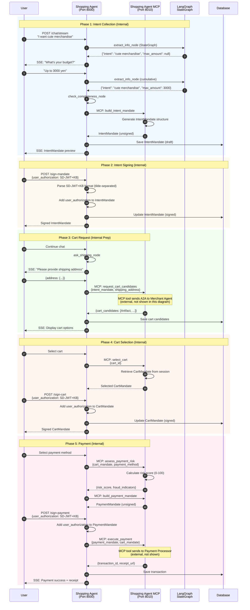

# Shopping Agent

**User's AI Agent** - Handles user dialogue, intent collection, cart selection, and payment execution using LangGraph conversation flows.

## Overview

The Shopping Agent is the primary interface between users and the AP2 protocol. It orchestrates the complete purchase flow from initial intent to payment completion, coordinating with other services via A2A (Agent-to-Agent) messaging.

**Port**: 8000
**Role**: User's AI Agent
**Protocol**: AP2 v0.2

## Key Features

- **LangGraph Dialogue Flow** - 14-node StateGraph for conversation management
- **SSE Streaming** - Real-time responses via Server-Sent Events
- **Intent Collection** - Gradual extraction of purchase requirements
- **A2A Communication** - Secure Ed25519-signed messaging with other agents
- **Mandate Management** - Creation and signing of Intent/Cart/Payment mandates
- **Risk Assessment** - Transaction risk evaluation (0-100 score)
- **JWT Authentication** - Layer 1 HTTP session authentication
- **WebAuthn Integration** - Passkey-based user authorization (SD-JWT+KB)
- **MCP Integration** - 6 tools via Shopping Agent MCP (Port 8010)

## Sequence Diagram

This diagram shows the Shopping Agent's internal processing flow for a complete purchase.



## API Endpoints

### Chat & Dialogue

**`POST /chat/stream`** - SSE streaming chat (LangGraph-powered)
- **Request**: `{user_input: string, session_id?: string, user_id?: string}`
- **Response**: Server-Sent Events (JSON stream)
  - `{type: "agent_text", content: string}`
  - `{type: "agent_thinking", thought: string}`
  - `{type: "intent_mandate", mandate: object}`
  - `{type: "cart_candidates", candidates: array}`
  - `{type: "done"}`
- **Implementation**: `agent.py:961`

### Mandate Management

**`POST /create-intent`** - Create IntentMandate
- **Request**: `{user_id: string, max_amount: object, intent: string, ...}`
- **Response**: IntentMandate (unsigned)

**`POST /sign-mandate`** - Sign IntentMandate with WebAuthn (SD-JWT+KB)
- **Request**: `{intent_mandate: object, user_authorization: string}`
- **Response**: Signed IntentMandate

**`POST /sign-cart`** - Sign CartMandate with WebAuthn (SD-JWT+KB)
- **Request**: `{cart_id: string, user_authorization: string}`
- **Response**: Signed CartMandate

**`POST /sign-payment`** - Sign PaymentMandate with WebAuthn (SD-JWT+KB)
- **Request**: `{payment_mandate: object, user_authorization: string}`
- **Response**: Signed PaymentMandate

### User Authentication (Layer 1)

**`POST /auth/register`** - Register new user (Argon2id password hashing)
- **Request**: `{email: string, password: string, full_name: string}`
- **Response**: `{access_token: string, user: object}`
- **Implementation**: `agent.py:294`

**`POST /auth/login`** - Login user
- **Request**: `{email: string, password: string}`
- **Response**: `{access_token: string, user: object}`
- **Implementation**: `agent.py:368`

**`GET /auth/me`** - Get current user (JWT-protected)
- **Headers**: `Authorization: Bearer <token>`
- **Response**: User object
- **Implementation**: `agent.py:665`

### Transactions

**`GET /transactions/{transaction_id}`** - Get transaction details
- **Response**: Transaction object with status and events

### Common Endpoints (Inherited from BaseAgent)

**`GET /`** - Health check
- **Response**: `{agent_id, agent_name, status, version}`

**`GET /health`** - Health check (for Docker)
- **Response**: `{status: "healthy"}`

**`POST /a2a/message`** - Receive A2A messages from other agents
- **Request**: A2AMessage (Ed25519 signed)
- **Response**: A2A response

**`GET /.well-known/did.json`** - DID document
- **Response**: W3C DID Document

## Environment Variables

```bash
# Service Configuration
AGENT_ID=did:ap2:agent:shopping_agent
DATABASE_URL=sqlite+aiosqlite:////app/data/shopping_agent.db
AP2_KEYS_DIRECTORY=/app/keys

# Downstream Services
MERCHANT_AGENT_URL=http://merchant_agent:8001
CREDENTIAL_PROVIDER_URL=http://credential_provider:8003
PAYMENT_PROCESSOR_URL=http://payment_processor:8004
SHOPPING_MCP_URL=http://shopping_agent_mcp:8010

# LLM Configuration (LangGraph)
DMR_API_URL=http://host.docker.internal:12434/engines/llama.cpp/v1
DMR_MODEL=ai/qwen3
DMR_API_KEY=none

# Langfuse (Optional)
LANGFUSE_ENABLED=false
LANGFUSE_PUBLIC_KEY=
LANGFUSE_SECRET_KEY=
LANGFUSE_HOST=https://cloud.langfuse.com

# OpenTelemetry
OTEL_ENABLED=true
OTEL_SERVICE_NAME=shopping_agent
OTEL_EXPORTER_OTLP_ENDPOINT=http://jaeger:4317

# Logging
LOG_LEVEL=INFO
LOG_FORMAT=text
```

## Database Schema

### Tables

- **mandates** - IntentMandate, CartMandate, PaymentMandate storage
- **transactions** - Payment transaction records
- **agent_sessions** - User session management
- **users** - User accounts (JWT authentication, Argon2id hashing)
- **passkey_credentials** - WebAuthn/Passkey credentials

## Dependencies

### Python Packages
- **fastapi** 0.115.0 - Web framework
- **sse-starlette** 2.1.0 - Server-Sent Events
- **httpx** 0.27.0 - Async HTTP client
- **langgraph** - Conversation flow management (14-node StateGraph)
- **langchain** 0.3.0+ - LLM integration
- **sqlalchemy** 2.0.35 - ORM
- **cryptography** 43.0.0 - Ed25519 signing

### Downstream Services
- **Shopping Agent MCP** (Port 8010) - 6 MCP tools
- **Merchant Agent** (Port 8001) - Product search & cart creation
- **Credential Provider** (Port 8003) - WebAuthn verification
- **Payment Processor** (Port 8004) - Payment execution
- **LLM Endpoint** - OpenAI-compatible API (DMR)

## Key Implementation Details

### LangGraph StateGraph

The Shopping Agent uses a 14-node StateGraph for conversation management:

```python
ConversationState = {
    "session_id": str,
    "user_id": str,
    "step": str,  # Current conversation step
    "intent": str | None,
    "max_amount": float | None,
    "categories": List[str],
    "brands": List[str],
    "shipping_address": Dict | None,
    "intent_mandate": Dict | None,
    "cart_candidates": List[Dict],
    "selected_cart": Dict | None,
    "payment_method": Dict | None,
    "conversation_history": List[Dict],
    "error": str | None
}
```

**14 Nodes**:
1. `greeting_node` - Initial greeting
2. `extract_intent_node` - LLM extracts purchase intent
3. `build_intent_node` - MCP: build_intent_mandate
4. `ask_max_amount_node` - Ask for budget
5. `ask_categories_node` - Ask for product categories
6. `ask_shipping_node` - Ask for shipping address
7. `request_carts_node` - MCP: request_cart_candidates
8. `select_cart_node` - User selects cart
9. `consent_signature_node` - MCP: select_and_sign_cart
10. `select_payment_node` - MCP: assess_payment_risk + build_payment_mandate
11. `webauthn_auth_node` - WebAuthn authentication
12. `execute_payment_node` - MCP: execute_payment
13. `completed_node` - Purchase completed
14. `error_handler_node` - Error handling

**File**: `langgraph_shopping_flow.py` (1547 lines)

### MCP Integration (6 Tools)

**MCP Server**: `http://shopping_agent_mcp:8010`

| MCP Tool | Description | Used in Node |
|----------|-------------|--------------|
| `build_intent_mandate` | Create IntentMandate | build_intent_node |
| `request_cart_candidates` | Send A2A to Merchant Agent | request_carts_node |
| `select_and_sign_cart` | Add user signature to CartMandate | consent_signature_node |
| `assess_payment_risk` | Run RiskAssessmentEngine | select_payment_node |
| `build_payment_mandate` | Create PaymentMandate | select_payment_node |
| `execute_payment` | Send to Payment Processor | execute_payment_node |

### A2A Communication

All inter-agent communication uses Ed25519-signed A2A messages:

```json
{
  "header": {
    "message_id": "msg_abc123",
    "sender": "did:ap2:agent:shopping_agent",
    "recipient": "did:ap2:agent:merchant_agent",
    "timestamp": "2025-10-23T12:34:56Z",
    "schema_version": "0.2"
  },
  "dataPart": {
    "@type": "ap2/IntentMandate",
    "payload": {...}
  },
  "signature": {
    "type": "Ed25519Signature2020",
    "created": "2025-10-23T12:34:56Z",
    "verificationMethod": "did:ap2:agent:shopping_agent#key-1",
    "proofPurpose": "authentication",
    "signatureValue": "..."
  }
}
```

### Mandate Chain

The Shopping Agent manages the complete mandate chain:

1. **IntentMandate** - User's purchase intent (unsigned → signed with SD-JWT+KB)
2. **CartMandate** - Selected cart from Merchant (received → signed with SD-JWT+KB)
3. **PaymentMandate** - Payment details (created → signed with SD-JWT+KB → submitted)

### Risk Assessment

Built-in risk assessment engine evaluates:
- Transaction amount vs. constraints
- Payment method risk factors
- User transaction history
- Fraud indicators

**Risk Score**: 0-100 (>80 = high risk, auto-decline)

**Implementation**: `common/risk_assessment.py`

## Development

### Run Locally

```bash
# Set environment variables
export OPENAI_API_KEY=sk-proj-your-key
export DATABASE_URL=sqlite+aiosqlite:////app/data/shopping_agent.db

# Install dependencies
pip install -e .

# Run service
cd services/shopping_agent
python main.py
```

### Run with Docker

```bash
# Build and run
docker compose up shopping_agent

# View logs
docker compose logs -f shopping_agent
```

## Testing

```bash
# Health check
curl http://localhost:8000/health

# Test SSE streaming
curl -N -H "Content-Type: application/json" \
  -d '{"user_input": "I want cute merchandise"}' \
  http://localhost:8000/chat/stream

# Register user
curl -X POST http://localhost:8000/auth/register \
  -H "Content-Type: application/json" \
  -d '{"email": "test@example.com", "password": "SecurePass123!", "full_name": "Test User"}'

# Login
curl -X POST http://localhost:8000/auth/login \
  -H "Content-Type: application/json" \
  -d '{"email": "test@example.com", "password": "SecurePass123!"}'
```

## AP2 Compliance

- ✅ **IntentMandate Creation** - Natural language → structured mandate
- ✅ **User Authorization** - SD-JWT+KB format (tilde-separated, alg="none")
- ✅ **A2A Protocol** - Ed25519 signed messages
- ✅ **Mandate Chain Validation** - Intent → Cart → Payment
- ✅ **Layer 1 Authentication** - JWT Bearer tokens (Argon2id)
- ✅ **Risk Assessment** - Transaction evaluation (0-100 score)

## References

- [Main README](../../README.md)
- [AP2 Specification](https://ap2-protocol.org/specification/)
- [LangGraph Documentation](https://langchain-ai.github.io/langgraph/)
- [WebAuthn Specification](https://www.w3.org/TR/webauthn/)

---

**Port**: 8000
**Role**: User's AI Agent
**Protocol**: AP2 v0.2
**Status**: Production-Ready
