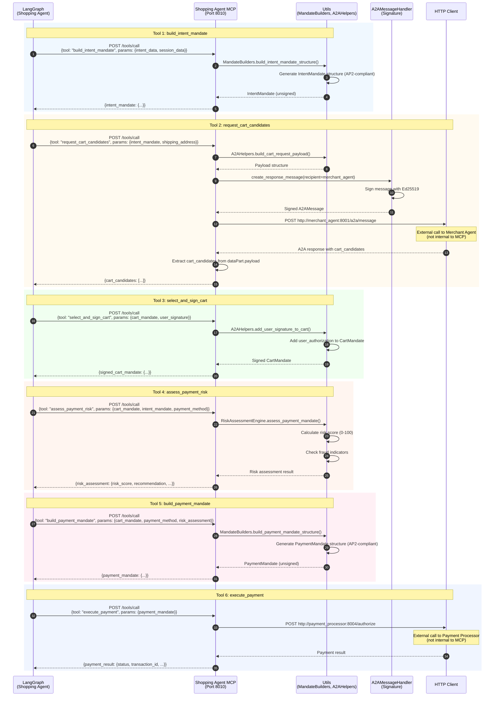

# Shopping Agent MCP

**MCP Tool Provider** - Provides 6 MCP tools for Shopping Agent's LangGraph conversation flow, handling data access and mandate operations.

## Overview

The Shopping Agent MCP (Model Context Protocol) is a specialized tool server that provides data access and mandate manipulation capabilities to the Shopping Agent. It follows the MCP specification where tools are stateless operations invoked by LangGraph nodes, with no LLM inference performed within the MCP server itself.

**Port**: 8010
**Role**: MCP Tool Provider for Shopping Agent
**Protocol**: MCP (Model Context Protocol)

## Key Features

- **6 MCP Tools** - Stateless data access operations
- **AP2 Mandate Builders** - IntentMandate and PaymentMandate construction
- **A2A Communication** - Ed25519-signed messages to Merchant Agent
- **Risk Assessment** - Transaction risk evaluation (0-100 score)
- **Payment Execution** - Payment Processor integration
- **OpenTelemetry Integration** - Jaeger tracing for MCP tool calls

## Sequence Diagram

This diagram shows the Shopping Agent MCP's internal processing for each tool invocation.



## MCP Tools

### Tool 1: `build_intent_mandate`

**Description**: Build AP2-compliant IntentMandate structure

**Input Schema**:
```json
{
  "intent_data": {
    "intent": "cute merchandise",
    "max_amount": {"value": 3000, "currency": "JPY"},
    "categories": ["merchandise", "accessories"],
    "brands": []
  },
  "session_data": {
    "user_id": "user_123",
    "session_id": "session_abc"
  }
}
```

**Output**:
```json
{
  "intent_mandate": {
    "id": "intent_xxx",
    "payer_id": "user_123",
    "intent": "cute merchandise",
    "constraints": {
      "max_amount": {"value": 3000, "currency": "JPY"},
      "categories": ["merchandise", "accessories"]
    },
    "created_at": "2025-10-23T12:34:56Z"
  }
}
```

**Implementation**: `main.py:85`

### Tool 2: `request_cart_candidates`

**Description**: Send A2A message to Merchant Agent to request cart candidates

**Input Schema**:
```json
{
  "intent_mandate": {...},
  "shipping_address": {
    "recipient_name": "John Doe",
    "line1": "123 Main St",
    "city": "Tokyo",
    "postal_code": "100-0001",
    "country": "JP"
  }
}
```

**Output**:
```json
{
  "cart_candidates": [
    {
      "id": "cart_xxx",
      "merchant_id": "merchant_abc",
      "items": [...],
      "total_amount": {"value": 2500, "currency": "JPY"}
    }
  ]
}
```

**Implementation**: `main.py:125`

**A2A Flow**:
1. Build cart request payload with IntentMandate and shipping address
2. Create signed A2A message (Ed25519 signature)
3. POST to `http://merchant_agent:8001/a2a/message`
4. Extract cart_candidates from `dataPart.payload.cart_candidates`

### Tool 3: `select_and_sign_cart`

**Description**: Add user authorization (SD-JWT+KB) to selected CartMandate

**Input Schema**:
```json
{
  "cart_mandate": {...},
  "user_signature": {
    "type": "passkey",
    "credential_id": "cred_xxx",
    "signature": "..."
  }
}
```

**Output**:
```json
{
  "signed_cart_mandate": {
    ...cart_mandate,
    "user_authorization": "issuer_jwt~kb_jwt"
  }
}
```

**Implementation**: `main.py:206`

### Tool 4: `assess_payment_risk`

**Description**: Run RiskAssessmentEngine to evaluate transaction risk

**Input Schema**:
```json
{
  "cart_mandate": {...},
  "intent_mandate": {...},
  "payment_method": {
    "type": "card",
    "last4": "1234",
    "brand": "visa"
  }
}
```

**Output**:
```json
{
  "risk_assessment": {
    "risk_score": 25,
    "recommendation": "approve",
    "fraud_indicators": [],
    "risk_factors": [
      {"factor": "transaction_amount", "score": 10, "weight": 0.3}
    ]
  }
}
```

**Implementation**: `main.py:250`

**Risk Score**: 0-100 (>80 = high risk, auto-decline)

### Tool 5: `build_payment_mandate`

**Description**: Build AP2-compliant PaymentMandate structure

**Input Schema**:
```json
{
  "cart_mandate": {...},
  "payment_method": {...},
  "risk_assessment": {...}
}
```

**Output**:
```json
{
  "payment_mandate": {
    "id": "payment_xxx",
    "cart_mandate_id": "cart_xxx",
    "payment_method": {...},
    "amount": {"value": 2500, "currency": "JPY"},
    "risk_score": 25,
    "created_at": "2025-10-23T12:34:56Z"
  }
}
```

**Implementation**: `main.py:313`

### Tool 6: `execute_payment`

**Description**: Send PaymentMandate to Payment Processor for execution

**Input Schema**:
```json
{
  "payment_mandate": {...}
}
```

**Output**:
```json
{
  "payment_result": {
    "status": "captured",
    "transaction_id": "txn_xxx",
    "authorization_code": "AUTH123456",
    "network_transaction_id": "net_txn_xxx"
  }
}
```

**Implementation**: `main.py:352`

**Payment Processor Flow**:
1. POST to `http://payment_processor:8004/authorize`
2. Payment Processor handles Credential Provider verification
3. Payment Processor charges Payment Network
4. Return payment result with transaction details

## Environment Variables

```bash
# Service Configuration
AGENT_ID=did:ap2:agent:shopping_agent
DATABASE_URL=sqlite+aiosqlite:////app/data/shopping_agent.db
AP2_KEYS_DIRECTORY=/app/keys

# Downstream Services
MERCHANT_AGENT_URL=http://merchant_agent:8001
PAYMENT_PROCESSOR_URL=http://payment_processor:8004

# OpenTelemetry
OTEL_ENABLED=true
OTEL_SERVICE_NAME=shopping_agent_mcp
OTEL_EXPORTER_OTLP_ENDPOINT=http://jaeger:4317

# Logging
LOG_LEVEL=INFO
LOG_FORMAT=text
```

## Dependencies

### Python Packages
- **fastapi** 0.115.0 - Web framework
- **httpx** 0.27.0 - Async HTTP client for A2A/downstream calls
- **cryptography** 43.0.0 - Ed25519 signing for A2A messages
- **sqlalchemy** 2.0.35 - Database ORM (shared with Shopping Agent)

### Shared Components
- **common.mcp_server** - MCP server base class
- **common.a2a_handler** - A2A message signing/verification
- **common.risk_assessment** - RiskAssessmentEngine
- **common.crypto** - KeyManager, SignatureManager
- **common.telemetry** - OpenTelemetry instrumentation

### Downstream Services
- **Merchant Agent** (Port 8001) - Cart candidate retrieval via A2A
- **Payment Processor** (Port 8004) - Payment execution

## Key Implementation Details

### MCP Server Pattern

The Shopping Agent MCP follows the stateless tool pattern:

```python
from common.mcp_server import MCPServer

mcp = MCPServer(
    server_name="shopping_agent_mcp",
    version="1.0.0"
)

@mcp.tool(
    name="build_intent_mandate",
    description="AP2準拠IntentMandate構築",
    input_schema={...}
)
async def build_intent_mandate(params: Dict[str, Any]) -> Dict[str, Any]:
    # Stateless operation
    intent_mandate = MandateBuilders.build_intent_mandate_structure(...)
    return {"intent_mandate": intent_mandate}
```

**Key Points**:
- Tools are stateless functions (no internal state)
- LangGraph handles conversation state and tool orchestration
- All tools return `Dict[str, Any]` results
- Errors returned as `{"error": "..."}` in result (no exceptions)

### A2A Message Signing

All A2A messages to Merchant Agent are signed with Ed25519:

```python
# Create signed message
message = a2a_handler.create_response_message(
    recipient="did:ap2:agent:merchant_agent",
    data_type="ap2.mandates.IntentMandate",
    data_id=intent_mandate["id"],
    payload=payload,
    sign=True  # Ed25519 signature
)

# Send to Merchant Agent
response = await http_client.post(
    f"{MERCHANT_AGENT_URL}/a2a/message",
    json=message.model_dump()
)
```

**Signature Format** (Ed25519Signature2020):
```json
{
  "signature": {
    "type": "Ed25519Signature2020",
    "created": "2025-10-23T12:34:56Z",
    "verificationMethod": "did:ap2:agent:shopping_agent#key-1",
    "proofPurpose": "authentication",
    "signatureValue": "base64_encoded_signature"
  }
}
```

### Mandate Builders

Helper utilities for AP2-compliant mandate construction:

**IntentMandate**:
```python
from services.shopping_agent_mcp.utils import MandateBuilders

intent_mandate = MandateBuilders.build_intent_mandate_structure(
    intent_data={
        "intent": "cute merchandise",
        "max_amount": {"value": 3000, "currency": "JPY"},
        "categories": ["merchandise"]
    },
    session_data={
        "user_id": "user_123",
        "session_id": "session_abc"
    }
)
```

**PaymentMandate**:
```python
payment_mandate = MandateBuilders.build_payment_mandate_structure(
    cart_mandate=cart_mandate,
    payment_method=payment_method,
    risk_assessment=risk_assessment
)
```

**File**: `utils/mandate_builders.py`

### Risk Assessment Engine

Built-in risk evaluation for transactions:

```python
from common.risk_assessment import RiskAssessmentEngine

risk_engine = RiskAssessmentEngine(db_manager=db_manager)

risk_result = await risk_engine.assess_payment_mandate({
    "cart_mandate": cart_mandate,
    "intent_mandate": intent_mandate,
    "payment_method": payment_method
})

# Result:
# {
#   "risk_score": 25,
#   "recommendation": "approve",  # approve | review | decline
#   "fraud_indicators": [],
#   "risk_factors": [...]
# }
```

**Risk Factors**:
- Transaction amount vs. constraints
- Payment method risk level
- User transaction history
- Fraud indicators

**File**: `common/risk_assessment.py`

### Lifespan Management

Initialization of global resources at startup:

```python
@asynccontextmanager
async def lifespan(app: FastAPI):
    # Startup
    await db_manager.init_db()
    key_manager = KeyManager(keys_directory="/app/keys")
    a2a_handler = A2AMessageHandler(
        agent_id=AGENT_ID,
        key_manager=key_manager,
        signature_manager=signature_manager
    )
    risk_engine = RiskAssessmentEngine(db_manager=db_manager)

    yield  # Request processing

    # Shutdown
    await http_client.aclose()
```

**Initialized Resources**:
- DatabaseManager (shared with Shopping Agent)
- KeyManager (ED25519 + ECDSA keys)
- A2AMessageHandler (message signing)
- RiskAssessmentEngine (risk scoring)
- HTTPClient (downstream calls)

## Development

### Run Locally

```bash
# Set environment variables
export AGENT_ID=did:ap2:agent:shopping_agent
export DATABASE_URL=sqlite+aiosqlite:////app/data/shopping_agent.db
export MERCHANT_AGENT_URL=http://localhost:8001
export PAYMENT_PROCESSOR_URL=http://localhost:8004

# Install dependencies
pip install -e .

# Run service
cd services/shopping_agent_mcp
python main.py
```

### Run with Docker

```bash
# Build and run
docker compose up shopping_agent_mcp

# View logs
docker compose logs -f shopping_agent_mcp
```

## Testing

```bash
# Health check
curl http://localhost:8010/health

# List available tools
curl http://localhost:8010/tools/list

# Call build_intent_mandate tool
curl -X POST http://localhost:8010/tools/call \
  -H "Content-Type: application/json" \
  -d '{
    "tool": "build_intent_mandate",
    "params": {
      "intent_data": {
        "intent": "cute merchandise",
        "max_amount": {"value": 3000, "currency": "JPY"}
      },
      "session_data": {
        "user_id": "user_123",
        "session_id": "session_abc"
      }
    }
  }'

# Call assess_payment_risk tool
curl -X POST http://localhost:8010/tools/call \
  -H "Content-Type: application/json" \
  -d '{
    "tool": "assess_payment_risk",
    "params": {
      "cart_mandate": {...},
      "intent_mandate": {...},
      "payment_method": {"type": "card", "brand": "visa"}
    }
  }'
```

## AP2 Compliance

- ✅ **IntentMandate Construction** - AP2-compliant structure
- ✅ **PaymentMandate Construction** - AP2-compliant structure
- ✅ **A2A Protocol** - Ed25519 signed messages to Merchant Agent
- ✅ **Risk Assessment** - Transaction evaluation (0-100 score)
- ✅ **Stateless Tools** - MCP specification compliance
- ✅ **OpenTelemetry** - Distributed tracing for all tool calls

## References

- [Main README](../../README.md)
- [Shopping Agent README](../shopping_agent/README.md)
- [AP2 Specification](https://ap2-protocol.org/specification/)
- [MCP Specification](https://spec.modelcontextprotocol.io/)

---

**Port**: 8010
**Role**: MCP Tool Provider
**Protocol**: MCP (Model Context Protocol)
**Status**: Production-Ready
