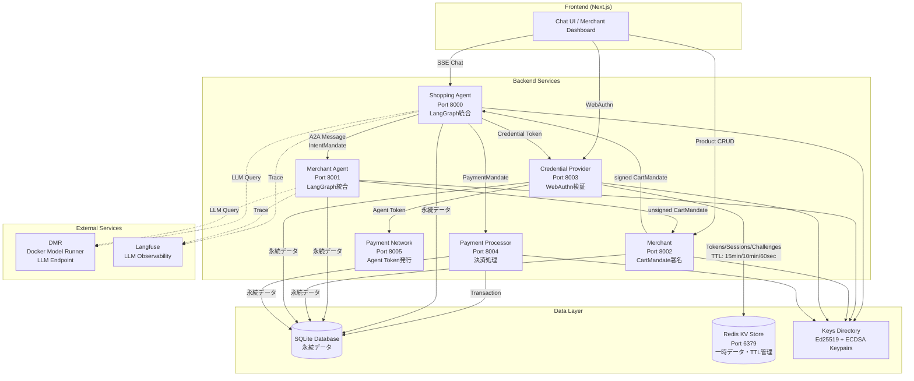
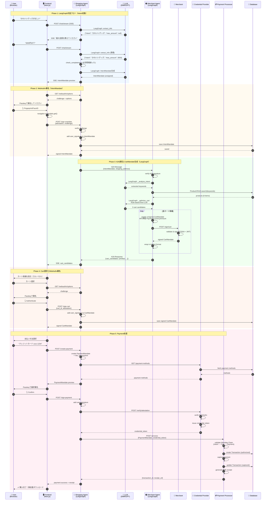
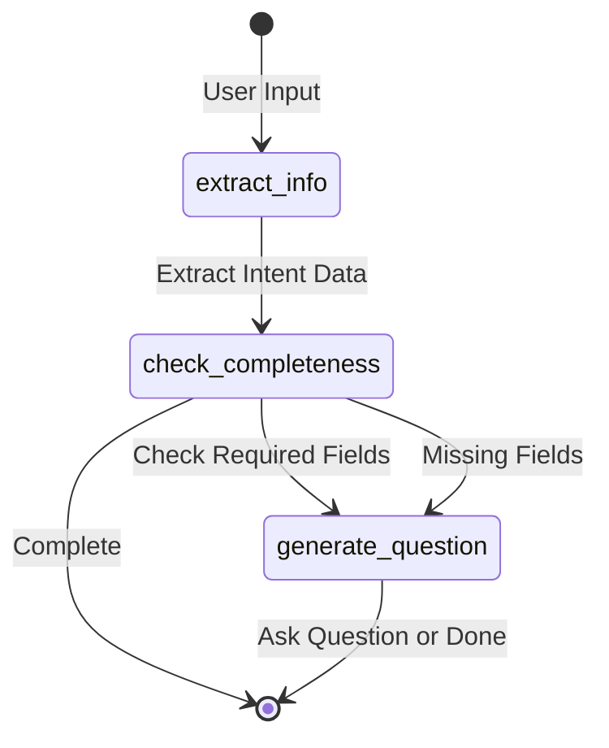

# AP2 Demo App v2

**完全実装版** - AP2プロトコルのマイクロサービスアーキテクチャ実装。FastAPI + Docker Compose + Next.js + LangGraph + WebAuthn + Langfuseで構築。

🎉 **Phase 1 & 2 完了！フル機能デモアプリ稼働中！**

## 🏗️ アーキテクチャ概要

このアプリケーションは、AP2（Agent Payments Protocol）仕様に完全準拠したマイクロサービスアーキテクチャで構築されています。6つのサービス（Backend 5 + Frontend 1）が相互に連携し、LangGraphによるAI対話機能とWebAuthn/Passkeyによる安全な署名機能を提供します。



### AP2準拠の6エンティティ

| エンティティ | ポート | 役割 | LangGraph | 主要機能 |
|------------|-------|------|-----------|---------|
| **Shopping Agent** | 8000 | ユーザー代理人 | ✅ | 対話、Intent生成、Payment処理 |
| **Merchant Agent** | 8001 | 商品検索・Cart作成 | ✅ | 商品検索、CartMandate作成（未署名） |
| **Merchant** | 8002 | 販売者 | ❌ | CartMandate署名、在庫管理 |
| **Credential Provider** | 8003 | 認証・トークン発行 | ❌ | WebAuthn検証、Step-up認証 |
| **Payment Processor** | 8004 | 決済処理 | ❌ | 支払い処理、領収書生成 |
| **Payment Network** | 8005 | 決済ネットワーク | ❌ | Agent Token発行 |

## 🔄 完全な購入フロー（シーケンス図）

以下は、ユーザーが商品を購入する際の完全なシーケンス図です。AP2仕様に完全準拠した3つのMandate（Intent → Cart → Payment）の流れを示しています。



### フローの主要ポイント

1. **LangGraph対話フロー（Phase 1）**
   - Shopping Agentの`langgraph_conversation.py`が対話を管理
   - `extract_info` → `check_completeness` → `generate_question`のノード構成
   - 必須情報（intent, max_amount）を段階的に収集

2. **A2A通信（Phase 3）**
   - Shopping Agent → Merchant Agent間でEd25519/ECDSA署名付きメッセージ（デフォルト: Ed25519）
   - Merchant AgentがLangGraphで商品検索とカート最適化
   - Rule-based filtering → LLM-based optimization（2段階最適化）

3. **AP2準拠のMandate Chain（Phase 5）**
   - IntentMandate（ユーザー署名）
   - CartMandate（Merchant署名 + User署名）
   - PaymentMandate（Risk評価 + User署名）
   - Payment Processorが3つのMandateを検証

## 📁 ディレクトリ構造

```
v2/
├── common/                      # 共通モジュール
│   ├── models.py                # Pydanticモデル（A2Aメッセージ、API型）
│   ├── a2a_handler.py           # A2Aメッセージ処理・署名検証・ルーティング
│   ├── base_agent.py            # 全エージェントの基底クラス（POST /a2a/message実装）
│   ├── database.py              # SQLAlchemyモデル＋CRUD操作（Receipt追加）
│   ├── redis_client.py          # Redis KVストアクライアント（TokenStore, SessionStore）
│   ├── crypto.py                # 暗号化・署名・鍵管理（Ed25519/ECDSA, AES-256-CBC）
│   ├── logger.py                # 統一ロギングシステム（JSON/Text対応）
│   ├── seed_data.py             # サンプルデータ投入スクリプト
│   └── receipt_generator.py    # PDF領収書生成（AP2準拠）
│
├── services/                    # 各マイクロサービス
│   ├── shopping_agent/          # ✅ 完全実装
│   │   ├── agent.py             # ShoppingAgentビジネスロジック
│   │   ├── langgraph_conversation.py  # LangGraph対話フロー
│   │   ├── main.py              # FastAPIエントリーポイント
│   │   └── Dockerfile           # コンテナ定義
│   ├── merchant_agent/          # ✅ 完全実装
│   │   ├── agent.py             # 商品検索・CartMandate作成（AP2準拠）
│   │   ├── main.py
│   │   └── Dockerfile
│   ├── merchant/                # ✅ 完全実装
│   │   ├── service.py           # CartMandate署名・在庫管理
│   │   ├── main.py
│   │   └── Dockerfile
│   ├── credential_provider/     # ✅ 完全実装
│   │   ├── provider.py          # WebAuthn検証・Step-up認証・Redis統合
│   │   ├── main.py
│   │   └── Dockerfile
│   └── payment_processor/       # ✅ 完全実装
│       ├── processor.py         # 決済処理・領収書生成
│       ├── main.py
│       └── Dockerfile
│
├── frontend/                    # Next.js フロントエンド（✅ 完全実装）
│   ├── app/                     # App Router
│   │   ├── page.tsx             # ホームページ
│   │   ├── chat/page.tsx        # Chat UI（SSE/Streaming対応）
│   │   └── merchant/page.tsx    # Merchant Dashboard
│   ├── components/              # Reactコンポーネント
│   │   ├── auth/                # WebAuthn認証コンポーネント
│   │   ├── cart/                # カート表示（AP2準拠）
│   │   ├── chat/                # チャットUI・署名モーダル
│   │   ├── product/             # 商品カルーセル
│   │   └── ui/                  # shadcn/ui コンポーネント
│   ├── hooks/                   # カスタムフック
│   │   └── useSSEChat.ts        # SSE Streaming対応チャットフック
│   ├── lib/                     # ユーティリティ
│   │   ├── webauthn.ts          # WebAuthn Passkey署名
│   │   └── types/               # TypeScript型定義
│   └── Dockerfile               # フロントエンドコンテナ
│
├── scripts/                     # ユーティリティスクリプト
│   └── init_db.py               # データベース初期化
│
├── data/                        # 永続化データ（Docker Volume）
│   ├── *.db                     # SQLiteデータベース（各サービス）
│   ├── receipts/                # PDF領収書
│   └── did_documents/           # DID Documents
│
├── keys/                        # 暗号鍵格納（Docker Volume）
│   └── *_private.pem            # Ed25519/ECDSA秘密鍵（AES-256暗号化）
│
├── docker-compose.yml           # 全サービスオーケストレーション（Redis含む）
├── pyproject.toml               # Python依存関係（uv管理、redis>=5.0.0追加）
└── README.md                    # このファイル
```

## ✅ 実装済み機能（Phase 1 & 2 完了）

### 🎯 コア機能
- ✅ **完全なAP2準拠フロー** - Intent → Cart → Payment → Receipt
- ✅ **LangGraph対話エンジン** - OpenAI GPT-4統合、段階的情報収集
- ✅ **WebAuthn/Passkey署名** - ブラウザ認証デバイスによる安全な署名
- ✅ **SSE Streaming** - リアルタイムチャット体験
- ✅ **A2A通信** - マイクロサービス間Ed25519/ECDSA署名付きメッセージング（デフォルト: Ed25519）
- ✅ **Step-up認証** - 高額決済時の追加認証フロー
- ✅ **PDF領収書生成** - ReportLabによるAP2準拠領収書

### 🛠️ 共通モジュール
- ✅ **models.py** - Pydanticモデル（A2A, API, AP2 Mandates）
- ✅ **a2a_handler.py** - A2Aメッセージ処理・ECDSA署名検証・ルーティング
- ✅ **base_agent.py** - 全エージェントの基底クラス（POST /a2a/message実装）
- ✅ **database.py** - SQLAlchemyモデル＋非同期CRUD操作（Receipt追加）
- ✅ **redis_client.py** - Redis KVストアクライアント（TokenStore, SessionStore、TTL管理）
- ✅ **crypto.py** - ECDSA鍵生成・署名・検証、AES-256-CBC暗号化
- ✅ **logger.py** - 統一ロギング（JSON/Text、機密データマスキング）
- ✅ **seed_data.py** - サンプルデータ（商品8点、ユーザー2人）
- ✅ **receipt_generator.py** - PDF領収書生成（AP2 CartMandate準拠）

### 🚀 マイクロサービス（全5サービス完全稼働）

#### Shopping Agent (Port 8000)
- ✅ LangGraph対話フロー（Intent収集、カート選択、決済）
- ✅ SSE/Streaming対応チャット
- ✅ IntentMandate生成・署名
- ✅ PaymentMandate生成・リスク評価
- ✅ WebAuthn Challenge生成・検証
- ✅ トランザクション管理

#### Merchant Agent (Port 8001)
- ✅ 商品検索（キーワード、カテゴリ、ブランド）
- ✅ CartMandate作成（AP2準拠PaymentRequest構造）
- ✅ 配送先住所管理（ContactAddress形式）
- ✅ 価格計算（小計、税金、送料）

#### Merchant (Port 8002)
- ✅ CartMandate署名（ECDSA + JWT）
- ✅ 在庫検証・予約
- ✅ 商品CRUD API
- ✅ 署名モード切替（自動/手動）
- ✅ 手動承認ワークフロー

#### Credential Provider (Port 8003)
- ✅ WebAuthn attestation検証
- ✅ Credential Token発行（Redis KV、TTL: 15分）
- ✅ Step-up認証フロー（Redis セッション、TTL: 10分）
- ✅ WebAuthn Challenge管理（Redis、TTL: 60秒、リプレイ攻撃防止）
- ✅ 支払い方法管理（カード、銀行口座）
- ✅ 領収書永続化（DB保存）
- ✅ 外部認証画面（/step-up-auth）

#### Payment Processor (Port 8004)
- ✅ 決済処理（Authorize → Capture）
- ✅ Mandate Chain検証（Intent → Cart → Payment）
- ✅ トランザクション管理（状態遷移）
- ✅ PDF領収書生成（AP2準拠）
- ✅ 返金処理（Refund API）

### 🎨 フロントエンド（Next.js 15 + TypeScript）

#### Chat UI (`/chat`)
- ✅ SSE Streaming対応チャット
- ✅ LLM思考過程表示（agent_thinking）
- ✅ 「考え中...」ローディングUI
- ✅ 商品カルーセル表示
- ✅ カート候補選択UI（AP2準拠）
- ✅ SignaturePromptModal（Intent/Cart/Payment署名）
- ✅ WebAuthn/Passkey統合
- ✅ 配送先フォーム
- ✅ 決済完了・領収書表示

#### Merchant Dashboard (`/merchant`)
- ✅ 商品管理（CRUD、在庫調整）
- ✅ 署名待ちCartMandate一覧（AP2準拠金額表示）
- ✅ 手動承認/却下フロー
- ✅ トランザクション履歴
- ✅ 署名モード設定（自動/手動）
- ✅ リアルタイム更新（5秒ポーリング）

#### UI/UXコンポーネント
- ✅ shadcn/ui + TailwindCSS
- ✅ Passkey登録・認証フロー
- ✅ カート詳細モーダル（AP2準拠）
- ✅ レスポンシブデザイン

### 🐳 インフラ
- ✅ **Docker Compose** - 全サービス（Backend 5 + Frontend 1 + Redis 1 + Meilisearch 1 + Jaeger 1）
- ✅ **SQLite永続化** - Dockerボリュームマウント（永続データ）
- ✅ **Redis KVストア** - 一時データ・TTL管理（トークン、セッション、チャレンジ）
- ✅ **環境変数管理** - `.env`対応
- ✅ **ヘルスチェック** - 全サービスliveness probe実装（Redis含む）

## 🛠️ セットアップ手順

### 🚀 クイックスタート（Docker Compose推奨）

最も簡単な方法は、Docker Composeを使用して全6サービス（Backend 5 + Frontend 1）を一括起動することです。

#### 前提条件
- Docker & Docker Compose
- OpenAI API Key（LangGraph用）

#### 1. 環境変数設定

```bash
cd v2/

# .envファイルを作成
cat > .env << 'EOF'
# OpenAI API（必須）
OPENAI_API_KEY=sk-proj-your-api-key-here

# オプション設定
LOG_LEVEL=INFO
LOG_FORMAT=text
EOF
```

#### 2. データベース初期化（初回のみ）

```bash
# プロジェクトルートから実行
python v2/scripts/init_db.py
```

#### 3. 全サービス起動

```bash
# 全サービスをビルド＆起動
docker compose up --build

# または、バックグラウンドで起動
docker compose up --build -d
```

#### 4. 動作確認

```bash
# 各サービスのヘルスチェック
curl http://localhost:8000/health  # Shopping Agent
curl http://localhost:8001/health  # Merchant Agent
curl http://localhost:8002/health  # Merchant
curl http://localhost:8003/health  # Credential Provider
curl http://localhost:8004/health  # Payment Processor
curl http://localhost:3000/        # Frontend

# ブラウザでアクセス
open http://localhost:3000         # ホームページ
open http://localhost:3000/chat    # Chat UI（メインデモ）
open http://localhost:3000/merchant  # Merchant Dashboard
```

#### 5. デモフロー体験

1. **Passkey登録** - `/chat`で初回訪問時に登録
2. **商品検索** - 「かわいいグッズがほしい」と入力
3. **Intent署名** - 最大金額などを入力してPasskey署名
4. **カート選択** - LLMが提案するカートを選択
5. **Cart署名** - カート内容を確認してPasskey署名
6. **決済** - 支払い方法を選択してPayment署名
7. **領収書取得** - 決済完了後、PDF領収書ダウンロード

**ログ確認：**
```bash
# 全サービスのログを表示
docker compose logs -f

# 特定サービスのログを表示
docker compose logs -f shopping_agent
```

**停止：**
```bash
# 停止（コンテナは保持）
docker compose stop

# 停止＆削除
docker compose down

# ボリュームも含めて完全削除
docker compose down -v
```

---

### 📦 開発環境セットアップ（ローカル実行）

Docker Composeを使わず、各サービスを個別に実行する場合の手順です。

#### 1. 依存関係のインストール（uv使用）

```bash
cd v2/

# uvがインストールされていない場合
pip install uv

# 依存関係をインストール
uv pip install -e .

# フロントエンド依存関係
cd frontend/
npm install
```

#### 2. 環境変数設定

```bash
# バックエンド用
export OPENAI_API_KEY=sk-proj-your-api-key-here
export LOG_LEVEL=INFO

# フロントエンド用（frontend/.env.local）
cat > frontend/.env.local << 'EOF'
NEXT_PUBLIC_SHOPPING_AGENT_URL=http://localhost:8000
NEXT_PUBLIC_MERCHANT_URL=http://localhost:8002
NEXT_PUBLIC_CREDENTIAL_PROVIDER_URL=http://localhost:8003
NEXT_PUBLIC_RP_ID=localhost
EOF
```

#### 3. データベース初期化

```bash
# プロジェクトルートから実行
python v2/scripts/init_db.py
```

#### 4. 各サービスを個別起動

```bash
# Terminal 1: Shopping Agent
cd v2/services/shopping_agent/
python main.py  # Port 8000

# Terminal 2: Merchant Agent
cd v2/services/merchant_agent/
python main.py  # Port 8001

# Terminal 3: Merchant
cd v2/services/merchant/
python main.py  # Port 8002

# Terminal 4: Credential Provider
cd v2/services/credential_provider/
python main.py  # Port 8003

# Terminal 5: Payment Processor
cd v2/services/payment_processor/
python main.py  # Port 8004

# Terminal 6: Frontend
cd v2/frontend/
npm run dev  # Port 3000
```

## 📡 API エンドポイント

### 共通エンドポイント（全サービス）

すべてのサービスが以下のエンドポイントを持ちます：

- `GET /` - ヘルスチェック（agent_id, agent_name, status, versionを返す）
- `GET /health` - ヘルスチェック（Docker向け）
- `POST /a2a/message` - A2Aメッセージ受信（BaseAgentで自動実装）

---

### Shopping Agent (Port 8000)

ユーザーとの対話を担当するエージェント。

**固有エンドポイント：**

- `POST /chat/stream` - ユーザーとの対話（SSE Streaming）
  - リクエスト: `{ "user_input": "ランニングシューズが欲しい", "session_id"?: "..." }`
  - レスポンス: Server-Sent Events（JSON lines）
  ```
  data: {"type": "agent_text", "content": "こんにちは！"}
  data: {"type": "product_list", "products": [...]}
  data: {"type": "done"}
  ```

- `POST /create-intent` - IntentMandate作成
  - リクエスト: `{ "user_id": "user_demo_001", "max_amount": {...}, ... }`
  - レスポンス: IntentMandate（署名付き）

- `POST /create-payment` - PaymentMandate作成
  - リクエスト: `{ "cart_mandate": {...}, "intent_mandate": {...}, ... }`
  - レスポンス: PaymentMandate（リスクスコア付き）

- `GET /transactions/{transaction_id}` - トランザクション取得

---

### Merchant Agent (Port 8001)

商品検索とCartMandate作成を担当。

**固有エンドポイント：**

- `GET /products?query=...&limit=10` - 商品検索
  - レスポンス: `{ "products": [...], "total": N }`

- `POST /create-cart` - CartMandate作成（未署名）
  - リクエスト: `{ "items": [...], "merchant_id": "...", ... }`
  - レスポンス: CartMandate（merchant_signature = null）

---

### Merchant (Port 8002)

CartMandateの署名・在庫検証を担当。

**固有エンドポイント：**

- `POST /sign/cart` - CartMandate署名
  - リクエスト: `{ "cart_mandate": {...} }`
  - レスポンス: CartMandate（merchant_signature付き）

- `GET /inventory/{sku}` - 在庫確認
  - レスポンス: `{ "sku": "...", "available": N }`

---

### Credential Provider (Port 8003)

WebAuthn検証とトークン発行を担当。

**固有エンドポイント：**

- `POST /verify/attestation` - WebAuthn attestation検証
  - リクエスト: `{ "payment_mandate": {...}, "attestation": {...} }`
  - レスポンス: `{ "verified": true, "token": "cred_token_...", "details": {...} }`

- `GET /payment-methods?user_id=...` - 支払い方法一覧
  - レスポンス: `{ "user_id": "...", "payment_methods": [...] }`

- `POST /payment-methods` - 支払い方法追加
  - リクエスト: `{ "user_id": "...", "payment_method": {...} }`
  - レスポンス: 追加された支払い方法

---

### Payment Processor (Port 8004)

決済処理とトランザクション管理を担当。

**固有エンドポイント：**

- `POST /process` - 支払い処理実行
  - リクエスト: `{ "payment_mandate": {...}, "credential_token"?: "..." }`
  - レスポンス: `{ "transaction_id": "txn_...", "status": "captured", "receipt_url": "..." }`

- `GET /transactions/{transaction_id}` - トランザクション取得

- `POST /refund` - 返金処理
  - リクエスト: `{ "transaction_id": "txn_...", "reason": "..." }`
  - レスポンス: `{ "refund_id": "refund_...", "status": "refunded" }`

## 🧪 テスト方法

### 1. ヘルスチェック

```bash
curl http://localhost:8000/
```

### 2. チャット対話（SSE Streaming）

```bash
# curlでSSEをテスト
curl -N -H "Content-Type: application/json" \
  -d '{"user_input": "こんにちは"}' \
  http://localhost:8000/chat/stream
```

**期待される出力（SSE形式）：**
```
data: {"type":"agent_text","content":"こんにちは！AP2 Shopping Agentです。"}

data: {"type":"agent_text","content":"何をお探しですか？例えば「かわいいグッズがほしい」のように教えてください。"}

data: {"type":"done"}
```

### 3. A2Aメッセージテスト（Postman推奨）

```bash
# A2Aメッセージを送信（署名付き）
curl -X POST http://localhost:8000/a2a/message \
  -H "Content-Type: application/json" \
  -d '{
    "header": {
      "message_id": "test-123",
      "sender": "did:ap2:agent:merchant_agent",
      "recipient": "did:ap2:agent:shopping_agent",
      "timestamp": "2025-10-16T00:00:00Z",
      "schema_version": "0.2"
    },
    "dataPart": {
      "@type": "ap2/ProductList",
      "id": "prod-list-001",
      "payload": {
        "products": []
      }
    }
  }'
```

## 📚 技術スタック

### バックエンド
- **FastAPI** 0.115.0 - 高速なWebフレームワーク
- **SQLAlchemy** 2.0.35 - ORM
- **aiosqlite** 0.20.0 - 非同期SQLite
- **cryptography** 43.0.0 - ECDSA署名・AES-256-CBC暗号化
- **fido2** 1.1.3 - WebAuthn検証
- **sse-starlette** 2.1.0 - Server-Sent Events
- **httpx** 0.27.0 - 非同期HTTPクライアント
- **LangGraph** - LLM対話フロー管理（StateGraph）
- **LangChain** 0.3.0+ - LLM統合（OpenAI互換API）
- **Langfuse** 2.0.0+ - LLM Observability（トレーシング）
- **OpenAI** - ChatOpenAI（DMR endpoint対応）
- **ReportLab** - PDF生成
- **PyJWT** - JWT署名

## 🧠 LangGraph統合の詳細

このアプリケーションは、2つのエージェント（Shopping AgentとMerchant Agent）でLangGraphを活用しています。

### Shopping Agent - 2つのLangGraphエンジン

#### 1. `langgraph_conversation.py` - 対話フロー管理

**目的**: ユーザーとの段階的な対話でIntent Mandateに必要な情報を収集

**StateGraph構成**:
```python
ConversationState = {
    "intent": str | None,           # 購買意図（必須）
    "max_amount": float | None,     # 最大金額（必須）
    "categories": List[str],        # カテゴリー（オプション）
    "brands": List[str],            # ブランド（オプション）
    "conversation_history": List[Dict],
    "missing_fields": List[str],
    "is_complete": bool
}
```

**ノードフロー**:
```
extract_info → check_completeness → generate_question → END
```

1. **extract_info**: LLMでユーザー入力から情報抽出（JSON形式）
2. **check_completeness**: 必須フィールド（intent, max_amount）が揃ったか確認
3. **generate_question**: 不足情報を質問、または完了メッセージ

**実装ファイル**: `v2/services/shopping_agent/langgraph_conversation.py`

**使用LLM**: DMR endpoint（OpenAI互換API）
- Model: `ai/qwen3` or `ai/smollm2`
- Temperature: 0.3（決定論的）
- Max tokens: 512

#### 2. `langgraph_agent.py` - Intent Mandate生成

**目的**: 対話完了後、AP2準拠のIntentMandateデータを生成

**StateGraph構成**:
```python
IntentExtractionState = {
    "user_prompt": str,
    "intent_data": Optional[Dict[str, Any]],
    "error": Optional[str]
}
```

**ノードフロー**:
```
extract_intent → format_intent → END
```

1. **extract_intent**: LLMでAP2準拠フィールドを抽出
   - `natural_language_description`
   - `user_cart_confirmation_required`
   - `merchants`, `skus`, `requires_refundability`
2. **format_intent**: Pydantic `IntentMandate`型でバリデーション

**実装ファイル**: `v2/services/shopping_agent/langgraph_agent.py`

**Langfuseトレーシング**:
- Span名: `shopping_agent_intent_extraction`
- Metadata: `user_prompt`, `natural_language_description`

### Merchant Agent - CartMandate生成エンジン

#### `langgraph_merchant.py` - AI-Powered Cart最適化

**目的**: Intent Mandateから複数のカート候補を生成（Rule-based + LLM最適化）

**StateGraph構成**:
```python
MerchantState = {
    "intent_mandate": Dict,
    "user_id": str,
    "session_id": str,
    "shipping_address": Optional[Dict],
    "search_results": List[Dict],
    "cart_candidates": List[Dict],
    "error": Optional[str]
}
```

**ノードフロー**:
```
_analyze_intent → _search_products → _optimize_cart → _create_cart_mandates → END
```

1. **_analyze_intent**: LLMでIntent Mandateから検索キーワード抽出
   - `natural_language_description`から商品カテゴリ、特徴を抽出

2. **_search_products**: データベースから商品検索
   - `ProductCRUD.search(keywords, limit=20)`
   - 在庫状況を確認

3. **_optimize_cart**: 2段階最適化
   - **Rule-based**: 価格フィルタリング、カテゴリマッチング
   - **LLM-based**: 商品の組み合わせ最適化（LLMに3つのカート候補を生成させる）
   - Timeout: 180秒、Retries: 2

4. **_create_cart_mandates**: 各カート候補をAP2準拠CartMandateに変換
   - `PaymentCurrencyAmount` (float, JPY)
   - Merchantに署名リクエスト
   - Artifact形式でラップ

**実装ファイル**: `v2/services/merchant_agent/langgraph_merchant.py`

**使用LLM**: DMR endpoint（OpenAI互換API）
- Model: `ai/qwen3`
- Temperature: 0.5（創造性とバランス）
- Max tokens: 2048（詳細な推論用）
- Timeout: 180秒（LLMに十分な思考時間）

**Langfuseトレーシング**:
- Span名: `merchant_agent_cart_generation`
- Metadata: `intent_mandate_id`, `user_id`, `product_count`

### LangGraph設定

**共通設定**:
- LLM Endpoint: 環境変数 `DMR_API_URL`（デフォルト: `http://host.docker.internal:12434/engines/llama.cpp/v1`）
- Model: 環境変数 `DMR_MODEL`（デフォルト: `ai/qwen3`）
- API Key: 環境変数 `DMR_API_KEY`（デフォルト: `none`）

**Langfuse設定**:
```bash
LANGFUSE_ENABLED=true
LANGFUSE_PUBLIC_KEY=your-public-key
LANGFUSE_SECRET_KEY=your-secret-key
LANGFUSE_HOST=https://cloud.langfuse.com
```

**Timeout設定**:
- Shopping Agent → Merchant Agent: 300秒（5分）
- LLM呼び出し: 180秒（3分）+ 2リトライ
- 理由: `_optimize_cart`は重要な処理で、LLMに十分な思考時間が必要

### LangGraph State Management



### AP2準拠の重要実装

#### PaymentCurrencyAmount型（完全準拠）

**W3C仕様**: https://www.w3.org/TR/payment-request/#dom-paymentcurrencyamount

```python
class PaymentCurrencyAmount(BaseModel):
    currency: str  # ISO 4217（例: "JPY", "USD"）
    value: float   # ★ float型、基本通貨単位（円、ドル）
```

**重要**: `value`は**float型**で、**基本通貨単位**（セント/銭ではない）

**実装例**（`langgraph_merchant.py:523-530`）:
```python
cart_items.append({
    "product_id": product_id,
    "name": product["name"],
    "quantity": quantity,
    "unit_price": {
        "value": unit_price_cents / 100,  # AP2準拠: float型、円単位
        "currency": "JPY"
    },
    "total_price": {
        "value": total_price_cents / 100,  # AP2準拠: float型、円単位
        "currency": "JPY"
    },
    # ...
})
```

#### IntentMandate構造（AP2準拠）

**参照**: `v2/common/mandate_types.py:39-86`

```python
class IntentMandate(BaseModel):
    user_cart_confirmation_required: bool  # カート確認が必要か
    natural_language_description: str      # ★ AP2準拠フィールド
    merchants: Optional[list[str]]         # 許可されたMerchantリスト
    skus: Optional[list[str]]              # 特定のSKUリスト
    requires_refundability: Optional[bool] # 返金可能性が必要か
    intent_expiry: str                     # 有効期限（ISO 8601）
```

**重要**: `natural_language_description`はAP2仕様で**必須**フィールド

#### CartMandate構造（AP2準拠 + Artifact Wrapping）

**参照**: `v2/common/mandate_types.py:117-148`, `langgraph_merchant.py:721-733`

```python
# Artifact形式でラップ（A2A仕様準拠）
artifact = {
    "artifactId": f"artifact_{uuid.uuid4().hex[:8]}",
    "name": "カート名",
    "parts": [
        {
            "kind": "data",
            "data": {
                "ap2.mandates.CartMandate": {  # ★ AP2データキー
                    "contents": {
                        "id": "cart_abc123",
                        "user_cart_confirmation_required": true,
                        "payment_request": {
                            "details": {
                                "display_items": [...],  # PaymentItem[]
                                "total": {...}           # PaymentItem
                            },
                            "shipping_address": {...}  # ContactAddress
                        },
                        "cart_expiry": "2025-10-23T12:00:00Z",
                        "merchant_name": "Demo Store"
                    },
                    "merchant_authorization": "eyJhbGc..."  # JWT署名
                }
            }
        }
    ]
}
```

### フロントエンド
- **Next.js** 15.1.4 (App Router)
- **React** 19.0.0
- **TypeScript** 5.x
- **TailwindCSS** 3.4.1
- **shadcn/ui** - UIコンポーネントライブラリ
- **Lucide React** - アイコン
- **WebAuthn API** - Passkey署名

### インフラ
- **Docker** + **Docker Compose** - コンテナオーケストレーション
- **SQLite** - 開発環境データベース
- **Volume Mount** - データ永続化

## 🔐 セキュリティ

### 鍵管理
- 各エージェントはECDSA鍵ペアを自動生成
- 秘密鍵はAES-256-CBCで暗号化して`./keys/`に保存
- パスフレーズは環境変数または`AgentPassphraseManager`から取得

### A2A署名検証
- 全A2Aメッセージは署名付き
- `a2a_handler.py`で自動的に署名検証
- 署名検証失敗時は400エラー

### ロギング設定

統一ロギングシステムを使用しており、環境変数で制御可能です。

**環境変数:**
```bash
# ログレベル（DEBUG/INFO/WARNING/ERROR/CRITICAL）
LOG_LEVEL=INFO  # デフォルト: INFO

# ログフォーマット（text/json）
LOG_FORMAT=text  # デフォルト: text
```

**ログレベルの説明:**
- `DEBUG`: 詳細なデバッグ情報（HTTPペイロード、A2Aメッセージ、署名操作等）
- `INFO`: 一般的な情報メッセージ（鍵生成、トランザクション開始等）
- `WARNING`: 警告メッセージ（チャレンジ失敗、タイムスタンプずれ等）
- `ERROR`: エラーメッセージ（検証失敗、データベースエラー等）
- `CRITICAL`: 致命的なエラー（サービス起動失敗等）

**フォーマットの説明:**
- `text`: 人間が読みやすい形式（開発環境向け）
  ```
  [2025-10-21 12:34:56] INFO     common.crypto                  | Generating new key pair: shopping_agent
  ```
- `json`: 構造化JSON形式（本番環境向け、ログ集約ツールと連携）
  ```json
  {"timestamp":"2025-10-21T12:34:56Z","level":"INFO","logger":"common.crypto","message":"Generating new key pair: shopping_agent"}
  ```

**使用例:**
```bash
# デバッグモードで起動（すべてのHTTPペイロードを表示）
LOG_LEVEL=DEBUG docker compose up

# 本番環境（JSON形式、WARNINGレベル以上のみ）
LOG_LEVEL=WARNING LOG_FORMAT=json docker compose up
```

**機能:**
- 機密データの自動マスキング（password, token, private_key等）
- HTTPリクエスト/レスポンスの自動ログ（DEBUGレベル）
- A2Aメッセージペイロードの自動ログ（DEBUGレベル）
- 暗号化操作の詳細ログ（署名、検証、鍵生成）
- サービス別ログタグ（shopping_agent, merchant等）

## 🎯 AP2準拠の重要実装

このデモアプリは、[AP2公式仕様](https://ap2-protocol.org/specification/)に完全準拠しています。

### CartMandate構造（AP2準拠）

```typescript
// AP2準拠のCartMandate構造
{
  "contents": {
    "id": "cart_abc123",
    "user_cart_confirmation_required": true,
    "payment_request": {
      "method_data": [...],
      "details": {
        "id": "cart_abc123",
        "display_items": [
          {
            "label": "商品名",
            "amount": { "value": 10000, "currency": "JPY" },
            "refund_period": 2592000  // 30日（商品の識別子）
          },
          {
            "label": "税金",
            "amount": { "value": 800, "currency": "JPY" },
            "refund_period": 0  // 非商品アイテム
          },
          {
            "label": "送料",
            "amount": { "value": 500, "currency": "JPY" },
            "refund_period": 0
          }
        ],
        "total": {
          "label": "合計",
          "amount": { "value": 11300, "currency": "JPY" }
        },
        "shipping_options": [...]
      },
      "shipping_address": {
        "recipient_name": "山田太郎",
        "address_line": ["東京都渋谷区", "神南1-2-3"],  // AP2準拠の配列形式
        "postal_code": "150-0041",
        "country": "JP"
      }
    },
    "cart_expiry": "2025-10-22T12:00:00Z",
    "merchant_name": "デモストア"
  },
  "merchant_authorization": "eyJhbGc...",  // Merchant署名（JWT）
  "_metadata": {
    "cart_name": "カート名",
    "raw_items": [...],  // 元の商品情報（数量など）
    "merchant_id": "merchant_demo_001"
  }
}
```

### Mandate Chain検証

Payment Processorは、以下の3つのMandateを検証します：

1. **IntentMandate** - ユーザーの購買意図（最大金額、カテゴリなど）
2. **CartMandate** - 具体的なカート内容（Merchant署名 + User署名）
3. **PaymentMandate** - 決済情報（支払い方法、リスクスコア）

```python
# v2/services/payment_processor/processor.py:755-764
def _validate_mandate_chain(cart_mandate, payment_mandate):
    cart_id = cart_mandate.get("contents", {}).get("id")
    assert payment_mandate["cart_mandate_id"] == cart_id
    # ... さらなる検証
```

## 🚧 今後の拡張予定

### Phase 3: 高度な機能
- ⏳ **MCP（Model Context Protocol）統合** - 外部ツール連携
- ⏳ **マルチテナント対応** - 複数店舗サポート
- ⏳ **Risk Assessment強化** - 機械学習モデル統合
- ⏳ **返金フロー完全実装** - UI統合
- ⏳ **サブスクリプション決済** - RecurringMandate対応

### Phase 4: 本番運用準備
- ⏳ **PostgreSQL移行** - SQLiteからの移行
- ⏳ **Kubernetes/ECS対応** - コンテナオーケストレーション
- ⏳ **監視・ログ集約** - Prometheus + Grafana + ELK
- ⏳ **CI/CD パイプライン** - GitHub Actions
- ⏳ **セキュリティ強化** - Vault統合、シークレット管理

## 📖 参考資料

- [demo_app_v2.md](../demo_app_v2.md) - v2要件書
- [CLAUDE.md](../CLAUDE.md) - プロジェクト概要
- [AP2 Official Spec](https://ap2-protocol.org/specification/)
- [Google AP2 Samples](./refs/AP2-main/)

## 🐛 トラブルシューティング

### データベースエラー
```bash
# データベースをリセット
rm v2/data/ap2.db

# 再初期化
python v2/common/seed_data.py
```

### 鍵生成エラー
```bash
# 鍵ディレクトリをリセット
rm -rf keys/

# サービスを再起動すると自動生成されます
```

### ポート競合
```bash
# ポート8000が使用中の場合
lsof -ti:8000 | xargs kill -9
```

## 🎬 デモ動画・スクリーンショット

### Chat UI（メインデモフロー）

1. **Passkey登録**
   - 初回訪問時に自動表示
   - デバイス認証を使用した安全な登録

2. **LangGraph対話フロー**
   - 「かわいいグッズがほしい」と入力
   - LLMが段階的に必要情報を収集（Intent、最大金額、カテゴリ）
   - 思考過程がリアルタイム表示

3. **Intent署名**
   - 収集した情報を確認
   - Passkeyで署名

4. **商品検索・カート提案**
   - LLMが複数のカートを提案
   - カルーセルUIで選択

5. **Cart署名**
   - カート内容（商品、金額、配送先）を確認
   - AP2準拠の金額表示（¥0ではなく実際の金額）
   - Passkeyで署名

6. **決済・領収書**
   - 支払い方法選択
   - Payment署名
   - PDF領収書ダウンロード

### Merchant Dashboard

- 商品管理（在庫調整、追加、削除）
- 署名待ちCartMandate一覧（AP2準拠金額表示）
- 手動承認/却下フロー
- トランザクション履歴

## 📝 ライセンス

このプロジェクトはAP2プロトコルのデモ実装です。

## 👥 コントリビューター

このプロジェクトは、AP2プロトコル（Google主導）の公式仕様に基づいて実装されています。

- **AP2仕様**: https://ap2-protocol.org/
- **Google AP2サンプル**: https://github.com/google-agentic-commerce/AP2

---

**作成日**: 2025-10-16
**最終更新**: 2025-10-22
**バージョン**: v2.1.0
**ステータス**: ✅ Phase 1 & 2 完了 - フル機能デモアプリ稼働中！

🎉 **完全実装版リリース！** - LangGraph + WebAuthn + AP2準拠CartMandate + PDF領収書 + Merchant Dashboard
