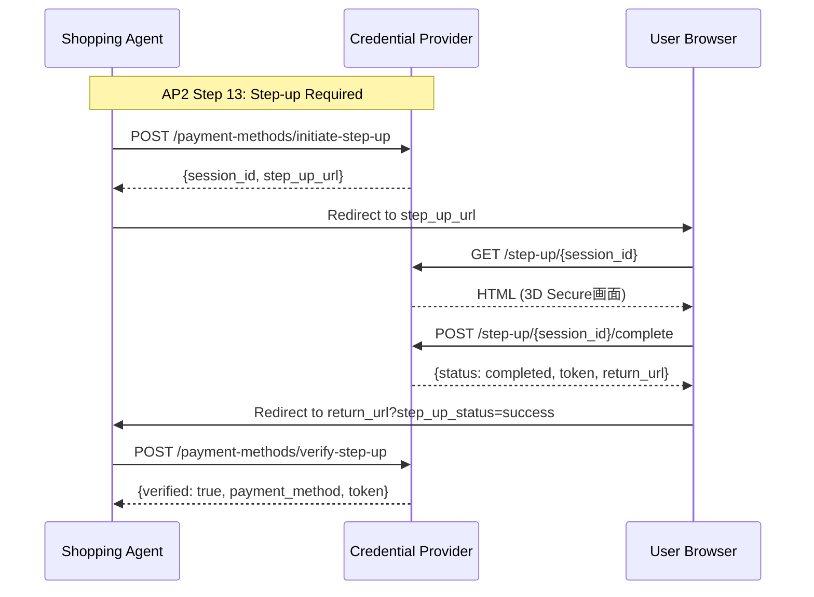
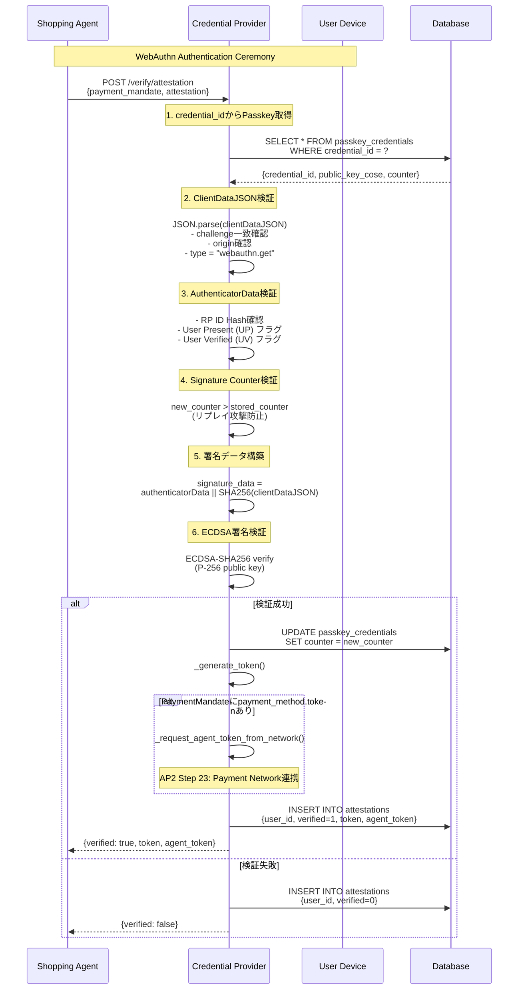

# Credential Provider

**Credential Provider** は、AP2プロトコルにおいてユーザーの認証情報管理とデバイス証明の検証を担当するサービスです。

## 目次

- [概要](#概要)
- [AP2における役割](#ap2における役割)
- [アーキテクチャ](#アーキテクチャ)
- [主要機能](#主要機能)
- [エンドポイント](#エンドポイント)
- [WebAuthn検証フロー](#webauthn検証フロー)
- [支払い方法管理](#支払い方法管理)
- [Step-upフロー](#step-upフロー)
- [トークン管理](#トークン管理)
- [セキュリティ](#セキュリティ)
- [データベース構造](#データベース構造)
- [開発](#開発)

---

## 概要

Credential Providerは、以下の責任を持つエンティティです：

- **WebAuthn認証**: デバイス証明（Passkey/WebAuthn）の検証
- **支払い方法管理**: カード情報、トークン化、Step-up認証
- **領収書管理**: Payment Processorから受信した領収書の保存
- **Credential Token発行**: 認証済みユーザーへのトークン発行

### AP2における役割

```
AP2 Role: credentials-provider
DID: did:ap2:agent:credential_provider
```

**Key Responsibilities**:
1. **User Authorization検証** (AP2 Step 4, 22)
2. **Payment Network連携** (AP2 Step 23)
3. **Agent Token取得** (決済ネットワークからのトークン化)
4. **領収書受信** (AP2 Step 29)

---

## アーキテクチャ

```
┌─────────────────────────────────────────────────────────┐
│         Credential Provider Service                      │
│  (did:ap2:agent:credential_provider)                    │
├─────────────────────────────────────────────────────────┤
│                                                          │
│  ┌──────────────────────────────────────────────────┐  │
│  │  WebAuthn Verification Engine                     │  │
│  │  - Passkey署名検証 (FIDO2)                         │  │
│  │  - Challenge管理                                   │  │
│  │  - Counter-based replay attack prevention         │  │
│  │  - RFC 8785 Canonicalization                      │  │
│  └──────────────────────────────────────────────────┘  │
│                                                          │
│  ┌──────────────────────────────────────────────────┐  │
│  │  Payment Method Management                        │  │
│  │  - カード情報管理                                  │  │
│  │  - トークン化 (AP2 Step 17-18)                     │  │
│  │  - Step-up認証フロー (AP2 Step 13)                │  │
│  └──────────────────────────────────────────────────┘  │
│                                                          │
│  ┌──────────────────────────────────────────────────┐  │
│  │  Payment Network Integration                      │  │
│  │  - Agent Token取得 (AP2 Step 23)                   │  │
│  │  - Attestation送信                                 │  │
│  └──────────────────────────────────────────────────┘  │
│                                                          │
│  ┌──────────────────────────────────────────────────┐  │
│  │  Receipt Management                               │  │
│  │  - 領収書受信 (AP2 Step 29)                        │  │
│  │  - ユーザー別領収書保管                            │  │
│  └──────────────────────────────────────────────────┘  │
│                                                          │
└─────────────────────────────────────────────────────────┘
           ↓                ↓                ↓
    ┌──────────┐    ┌───────────────┐   ┌────────────┐
    │ Database │    │ Payment       │   │ Shopping   │
    │ (SQLite) │    │ Network       │   │ Agent      │
    └──────────┘    └───────────────┘   └────────────┘
```

---

## 主要機能

### 1. Passkey登録 (provider.py:155-262)

```python
@self.app.post("/register/passkey")
async def register_passkey(registration_request: Dict[str, Any]):
    """
    WebAuthn Registration Ceremonyの結果を受信して、
    公開鍵をデータベースに保存します。
    """
    user_id = registration_request["user_id"]
    credential_id = registration_request["credential_id"]
    attestation_object_b64 = registration_request["attestation_object"]

    # attestationObjectから公開鍵を抽出 (COSE format)
    attestation_obj = AttestationObject(attestation_object_bytes)
    auth_data = attestation_obj.auth_data
    credential_public_key = auth_data.credential_data.public_key

    # データベースに保存
    await PasskeyCredentialCRUD.create(session, {
        "credential_id": credential_id,
        "user_id": user_id,
        "public_key_cose": public_key_cose_b64,
        "counter": 0,  # 初期値
        "transports": transports
    })
```

**処理フロー**:
1. `attestationObject` から公開鍵をCOSE形式で抽出
2. `fido2` ライブラリで `AuthenticatorData` をパース
3. 公開鍵をBase64エンコードしてDBに保存
4. `counter` を0で初期化（リプレイ攻撃対策の基準値）

---

### 2. WebAuthn Attestation検証 (provider.py:264-433)

```python
@self.app.post("/verify/attestation")
async def verify_attestation(request: AttestationVerifyRequest):
    """
    WebAuthn attestation検証 (AP2 Step 4, 22)

    IntentMandate署名時: payment_method未設定 → Payment Network呼び出しスキップ
    PaymentMandate署名時: payment_method設定済み → Payment Network呼び出し (Step 23)
    """
    payment_mandate = request.payment_mandate
    attestation = request.attestation
    credential_id = attestation.get("rawId")

    # データベースから登録済みPasskeyを取得
    passkey_credential = await PasskeyCredentialCRUD.get_by_credential_id(
        session, credential_id
    )

    # WebAuthn署名検証（完全な暗号学的検証）
    verified, new_counter = self.attestation_manager.verify_webauthn_signature(
        webauthn_auth_result=attestation,
        challenge=challenge,
        public_key_cose_b64=passkey_credential.public_key_cose,
        stored_counter=passkey_credential.counter,
        rp_id="localhost"
    )

    if verified:
        # Signature counterを更新（リプレイ攻撃対策）
        await PasskeyCredentialCRUD.update_counter(
            session, credential_id, new_counter
        )

        # トークン発行
        token = self._generate_token(payment_mandate, attestation)

        # PaymentMandateに支払い方法トークンが含まれている場合のみ
        # Payment Networkに送信 (AP2 Step 23)
        agent_token = None
        payment_method_token = payment_mandate.get("payment_method", {}).get("token")
        if payment_method_token:
            agent_token = await self._request_agent_token_from_network(
                payment_mandate=payment_mandate,
                attestation=attestation,
                payment_method_token=payment_method_token
            )
```

**WebAuthn検証の6ステップ** (crypto.py:1176-1339):

1. **ClientDataJSON検証**: challenge、origin、typeを確認
2. **AuthenticatorData検証**: RP ID Hash、User Present (UP) フラグ、User Verified (UV) フラグ
3. **Signature Counter検証**: リプレイ攻撃防止（counter増加チェック）
4. **署名データ構築**: `authenticatorData || SHA256(clientDataJSON)`
5. **COSE公開鍵デコード**: CBOR形式からEC2公開鍵を抽出 (P-256/ES256)
6. **ECDSA署名検証**: `ECDSA-SHA256` で署名を検証

---

### 3. Payment Network連携 (provider.py:1408-1478)

```python
async def _request_agent_token_from_network(
    self,
    payment_mandate: Dict[str, Any],
    attestation: Dict[str, Any],
    payment_method_token: str
) -> Optional[str]:
    """
    決済ネットワークへのトークン化呼び出し（AP2 Step 23）

    CPが決済ネットワークにHTTPリクエストを送信し、Agent Tokenを取得
    """
    async with httpx.AsyncClient() as client:
        response = await client.post(
            f"{self.payment_network_url}/network/tokenize",
            json={
                "payment_mandate": payment_mandate,
                "attestation": attestation,
                "payment_method_token": payment_method_token,
                "transaction_context": {
                    "credential_provider_id": self.agent_id,
                    "timestamp": datetime.now(timezone.utc).isoformat()
                }
            },
            timeout=10.0
        )

        if response.status_code == 200:
            data = response.json()
            agent_token = data.get("agent_token")
            return agent_token
```

**AP2 Step 23の実装**:
- Credential Provider → Payment Network: `POST /network/tokenize`
- リクエスト: `payment_mandate` + `attestation` + `payment_method_token`
- レスポンス: `agent_token` (決済ネットワークが発行したトークン)

**重要**: `agent_token` は `payment_method.token` とは別物：
- `payment_method.token`: CPが発行した一時トークン (Step 17-18)
- `agent_token`: Payment Networkが発行したトークン (Step 23)

---

### 4. 支払い方法トークン化 (provider.py:477-554)

```python
@self.app.post("/payment-methods/tokenize")
async def tokenize_payment_method(tokenize_request: Dict[str, Any]):
    """
    支払い方法のトークン化 (AP2 Step 17-18)

    選択された支払い方法に対して一時的なセキュアトークンを生成
    """
    user_id = tokenize_request["user_id"]
    payment_method_id = tokenize_request["payment_method_id"]

    # 支払い方法を取得
    payment_method = next(
        (pm for pm in user_payment_methods if pm["id"] == payment_method_id),
        None
    )

    # 一時トークン生成（暗号学的に安全）
    random_bytes = secrets.token_urlsafe(32)  # 256ビット
    secure_token = f"tok_{uuid.uuid4().hex[:8]}_{random_bytes[:24]}"
    expires_at = now + timedelta(minutes=15)  # 15分間有効

    # トークンストアに保存
    self.token_store[secure_token] = {
        "user_id": user_id,
        "payment_method_id": payment_method_id,
        "payment_method": payment_method,
        "issued_at": now.isoformat(),
        "expires_at": expires_at.isoformat()
    }
```

**トークン化の目的**:
- カード情報をトークンに置き換え、PaymentMandateに含める
- トークンは15分間有効（タイムアウト防止）
- `secrets.token_urlsafe()` で暗号学的に安全な乱数生成

---

### 5. Step-upフロー (provider.py:556-1012)

**AP2 Step 13対応**: 決済ネットワークが追加認証を要求する場合の処理

#### Step 5.1: Step-up開始 (provider.py:556-643)

```python
@self.app.post("/payment-methods/initiate-step-up")
async def initiate_step_up(request: Dict[str, Any]):
    """
    Step-upフロー開始 (AP2 Step 13)

    American Expressなど、3D Secure認証が必要なカードの場合
    """
    user_id = request["user_id"]
    payment_method_id = request["payment_method_id"]

    # Step-upセッション作成
    session_id = f"stepup_{uuid.uuid4().hex[:16]}"
    expires_at = now + timedelta(minutes=10)  # 10分間有効

    self.step_up_sessions[session_id] = {
        "session_id": session_id,
        "user_id": user_id,
        "payment_method_id": payment_method_id,
        "payment_method": payment_method,
        "transaction_context": transaction_context,
        "return_url": return_url,
        "status": "pending",
        "created_at": now.isoformat(),
        "expires_at": expires_at.isoformat()
    }

    # Step-up URL生成
    step_up_url = f"http://localhost:8003/step-up/{session_id}"

    return {
        "session_id": session_id,
        "step_up_url": step_up_url,
        "expires_at": expires_at.isoformat(),
        "step_up_reason": "3D Secure authentication required"
    }
```

#### Step 5.2: Step-up認証画面 (provider.py:645-848)

```python
@self.app.get("/step-up/{session_id}")
async def get_step_up_page(session_id: str):
    """
    Step-up認証画面

    決済ネットワークのStep-up画面をシミュレート
    実際の環境では3D Secureなどの決済ネットワーク画面にリダイレクト
    """
    # HTMLページを返す（3D Secure風のUI）
    html_content = f"""
    <html>
        <head><title>3D Secure Authentication</title></head>
        <body>
            <h1>🔐 3D Secure Authentication</h1>
            <div>追加認証が必要です。</div>
            <button onclick="completeStepUp()">認証を完了する</button>
            <button onclick="cancelStepUp()">キャンセル</button>
        </body>
    </html>
    """
```

#### Step 5.3: Step-up完了 (provider.py:850-936)

```python
@self.app.post("/step-up/{session_id}/complete")
async def complete_step_up(session_id: str, request: Dict[str, Any]):
    """
    Step-up完了

    認証成功時にトークンを発行し、return_urlにリダイレクト
    """
    if status == "success":
        # トークン発行
        token = f"tok_stepup_{uuid.uuid4().hex[:8]}_{random_bytes[:24]}"

        # トークンストアに保存
        self.token_store[token] = {
            "user_id": session_data["user_id"],
            "payment_method_id": session_data["payment_method_id"],
            "payment_method": session_data["payment_method"],
            "issued_at": now.isoformat(),
            "expires_at": token_expires_at.isoformat(),
            "step_up_completed": True  # Step-up完了フラグ
        }

        return {
            "status": "completed",
            "session_id": session_id,
            "return_url": session_data["return_url"],
            "token": token
        }
```

#### Step 5.4: Step-up検証 (provider.py:938-1012)

```python
@self.app.post("/payment-methods/verify-step-up")
async def verify_step_up(request: Dict[str, Any]):
    """
    Step-up完了確認

    Shopping Agentが認証完了後に呼び出して、
    認証が成功したかを確認し、支払い方法情報を取得する
    """
    session_data = self.step_up_sessions.get(session_id)

    if status == "completed":
        return {
            "verified": True,
            "payment_method": session_data["payment_method"],
            "token": session_data.get("token"),
            "message": "Step-up authentication verified successfully"
        }
```

**Step-upフローのシーケンス**:



---

### 6. トークン検証 (provider.py:1160-1249)

```python
@self.app.post("/credentials/verify")
async def verify_credentials(verify_request: Dict[str, Any]):
    """
    トークン検証と認証情報提供 (AP2 Step 26-27)

    Payment Processorからトークンを受信し、検証して支払い方法情報を返却
    """
    token = verify_request["token"]
    payer_id = verify_request["payer_id"]

    # トークンストアから支払い方法を取得
    token_data = self.token_store.get(token)
    if not token_data:
        return {"verified": False, "error": "Token not found or expired"}

    # トークン有効期限チェック
    expires_at = datetime.fromisoformat(token_data["expires_at"])
    if datetime.now(timezone.utc) > expires_at:
        del self.token_store[token]
        return {"verified": False, "error": "Token expired"}

    # ユーザーIDの一致チェック
    if token_data["user_id"] != payer_id:
        return {"verified": False, "error": "User ID mismatch"}

    # 支払い方法情報を返却
    payment_method = token_data["payment_method"]
    return {
        "verified": True,
        "credential_info": {
            "payment_method_id": payment_method["id"],
            "type": payment_method.get("type", "card"),
            "brand": payment_method.get("brand", "unknown"),
            "last4": payment_method.get("last4", "0000"),
            "holder_name": payment_method.get("holder_name", "Unknown")
        }
    }
```

**トークン検証の3ステップ**:
1. **存在確認**: `token_store` にトークンが存在するか
2. **有効期限確認**: `expires_at` が現在時刻より後か
3. **ユーザーID確認**: `token_data["user_id"]` が `payer_id` と一致するか

---

### 7. 領収書管理 (provider.py:1065-1158)

```python
@self.app.post("/receipts")
async def receive_receipt(receipt_data: Dict[str, Any]):
    """
    領収書受信 (AP2 Step 29)

    Payment Processorから領収書通知を受信
    """
    transaction_id = receipt_data.get("transaction_id")
    receipt_url = receipt_data.get("receipt_url")
    payer_id = receipt_data.get("payer_id")

    # 領収書情報を保存
    if payer_id not in self.receipts:
        self.receipts[payer_id] = []

    self.receipts[payer_id].append({
        "transaction_id": transaction_id,
        "receipt_url": receipt_url,
        "amount": receipt_data.get("amount"),
        "received_at": datetime.now(timezone.utc).isoformat(),
        "payment_timestamp": receipt_data.get("timestamp")
    })
```

**領収書取得**:

```python
@self.app.get("/receipts")
async def get_receipts(user_id: str):
    """
    ユーザーの領収書一覧取得
    """
    receipts = self.receipts.get(user_id, [])
    return {
        "user_id": user_id,
        "receipts": receipts,
        "total_count": len(receipts)
    }
```

---

## エンドポイント

### 認証関連

| Method | Path | 説明 | AP2 Step |
|--------|------|------|----------|
| POST | `/register/passkey` | Passkey登録 (WebAuthn Registration) | N/A |
| POST | `/verify/attestation` | WebAuthn attestation検証 | 4, 22 |
| POST | `/passkey/get-public-key` | Passkey公開鍵取得 | N/A |

### 支払い方法管理

| Method | Path | 説明 | AP2 Step |
|--------|------|------|----------|
| GET | `/payment-methods` | 支払い方法一覧取得 | N/A |
| POST | `/payment-methods` | 支払い方法追加 | N/A |
| POST | `/payment-methods/tokenize` | 支払い方法のトークン化 | 17-18 |

### Step-upフロー

| Method | Path | 説明 | AP2 Step |
|--------|------|------|----------|
| POST | `/payment-methods/initiate-step-up` | Step-up開始 | 13 |
| GET | `/step-up/{session_id}` | Step-up認証画面 | 13 |
| POST | `/step-up/{session_id}/complete` | Step-up完了 | 13 |
| POST | `/payment-methods/verify-step-up` | Step-up検証 | 13 |

### トークン検証

| Method | Path | 説明 | AP2 Step |
|--------|------|------|----------|
| POST | `/credentials/verify` | トークン検証と認証情報提供 | 26-27 |

### 領収書管理

| Method | Path | 説明 | AP2 Step |
|--------|------|------|----------|
| POST | `/receipts` | 領収書受信 | 29 |
| GET | `/receipts` | 領収書一覧取得 | N/A |

### A2Aエンドポイント

| Method | Path | 説明 |
|--------|------|------|
| POST | `/a2a/message` | A2Aメッセージ受信 (BaseAgentから継承) |

---

## WebAuthn検証フロー

### 完全な暗号学的検証プロセス



### WebAuthn検証の実装詳細 (crypto.py:1176-1339)

```python
def verify_webauthn_signature(
    self,
    webauthn_auth_result: Dict[str, Any],
    challenge: str,
    public_key_cose_b64: str,
    stored_counter: int,
    rp_id: str = "localhost"
) -> tuple[bool, int]:
    """
    WebAuthn署名の完全な暗号学的検証

    Returns:
        (verified: bool, new_counter: int)
    """
    # 1. ClientDataJSON検証
    client_data_json_b64 = webauthn_auth_result.get("response", {}).get("clientDataJSON")
    client_data_json = base64.b64decode(client_data_json_b64).decode('utf-8')
    client_data = json.loads(client_data_json)

    assert client_data["challenge"] == challenge
    assert client_data["type"] == "webauthn.get"
    assert rp_id in client_data.get("origin", "")

    # 2. AuthenticatorData検証
    authenticator_data_b64 = webauthn_auth_result.get("response", {}).get("authenticatorData")
    authenticator_data = base64.b64decode(authenticator_data_b64)

    rp_id_hash = authenticator_data[0:32]
    assert rp_id_hash == hashlib.sha256(rp_id.encode()).digest()

    flags = authenticator_data[32]
    user_present = bool(flags & 0x01)  # UP
    user_verified = bool(flags & 0x04)  # UV
    assert user_present

    # 3. Signature Counter検証
    counter = int.from_bytes(authenticator_data[33:37], byteorder='big')
    if stored_counter > 0 and counter > 0:
        assert counter > stored_counter  # リプレイ攻撃防止

    # 4. 署名データ構築
    client_data_hash = hashlib.sha256(client_data_json.encode()).digest()
    signature_data = authenticator_data + client_data_hash

    # 5. COSE公開鍵デコード
    public_key_cose_bytes = base64.b64decode(public_key_cose_b64)
    cose_key = cbor2.loads(public_key_cose_bytes)

    # 6. ECDSA署名検証 (P-256)
    ec_public_key = ec.EllipticCurvePublicKey.from_encoded_point(
        ec.SECP256R1(), public_key_bytes
    )

    signature_b64 = webauthn_auth_result.get("response", {}).get("signature")
    signature = base64.b64decode(signature_b64)

    ec_public_key.verify(
        signature,
        signature_data,
        ec.ECDSA(hashes.SHA256())
    )

    return True, counter
```

---

## 支払い方法管理

### デモ環境の支払い方法データ (provider.py:66-105)

```python
self.payment_methods: Dict[str, List[Dict[str, Any]]] = {
    "user_demo_001": [
        {
            "id": "pm_001",
            "type": "card",
            "token": "tok_visa_4242",
            "last4": "4242",
            "brand": "visa",
            "expiry_month": 12,
            "expiry_year": 2025,
            "holder_name": "山田太郎",
            "requires_step_up": False  # 通常のカード
        },
        {
            "id": "pm_003",
            "type": "card",
            "token": "tok_amex_3782",
            "last4": "3782",
            "brand": "amex",
            "expiry_month": 9,
            "expiry_year": 2026,
            "holder_name": "山田太郎",
            "requires_step_up": True,  # American ExpressはStep-up必要
            "step_up_reason": "3D Secure authentication required"
        }
    ]
}
```

**`requires_step_up`フィールド**:
- `False`: 通常の決済フロー (Visa, Mastercard)
- `True`: Step-up認証が必要 (American Express, 高額決済)

---

## Step-upフロー

### Step-upが必要なケース

1. **カードブランド要件**: American Express等、3D Secureが必須のカード
2. **高額決済**: 決済ネットワークが追加認証を要求
3. **リスク評価**: 不審なトランザクションパターン

### Step-upセッション管理 (provider.py:107-109)

```python
# Step-upセッション管理（インメモリ）
# 本番環境ではRedis等のKVストアを使用
self.step_up_sessions: Dict[str, Dict[str, Any]] = {}
```

**セッションデータ構造**:

```json
{
  "session_id": "stepup_abc123",
  "user_id": "user_demo_001",
  "payment_method_id": "pm_003",
  "payment_method": { ... },
  "transaction_context": {
    "amount": {"value": "10000.00", "currency": "JPY"},
    "merchant_id": "did:ap2:merchant:mugibo_merchant"
  },
  "return_url": "http://localhost:3000/payment/step-up-callback",
  "status": "pending",  // pending, completed, failed
  "created_at": "2025-10-23T12:34:56Z",
  "expires_at": "2025-10-23T12:44:56Z"  // 10分後
}
```

---

## トークン管理

### トークンの種類

Credential Providerは3種類のトークンを管理します：

#### 1. Payment Method Token (provider.py:477-554)

```python
# 例: "tok_a1b2c3d4_x9y8z7w6v5u4t3s2r1q0"
secure_token = f"tok_{uuid.uuid4().hex[:8]}_{random_bytes[:24]}"
```

- **目的**: 支払い方法のセキュアな参照
- **有効期限**: 15分
- **生成タイミング**: AP2 Step 17-18 (支払い方法選択後)

#### 2. Credential Token (provider.py:1480-1497)

```python
# 例: "cred_token_a1b2c3d4_x9y8z7w6v5u4t3s2r1q0"
secure_token = f"cred_token_{uuid.uuid4().hex[:8]}_{random_bytes[:24]}"
```

- **目的**: WebAuthn検証成功の証明
- **生成タイミング**: AP2 Step 4, 22 (attestation検証後)

#### 3. Agent Token (Payment Networkが発行)

```python
# 例: "agent_tok_visa_network_a1b2c3d4e5f6"
agent_token = data.get("agent_token")
```

- **目的**: 決済ネットワークが発行したトークン
- **生成タイミング**: AP2 Step 23 (Payment Network連携後)

### トークンストア構造 (provider.py:115-117)

```python
self.token_store: Dict[str, Dict[str, Any]] = {}

# 例:
# {
#   "tok_a1b2c3d4_x9y8z7w6": {
#     "user_id": "user_demo_001",
#     "payment_method_id": "pm_001",
#     "payment_method": { ... },
#     "issued_at": "2025-10-23T12:00:00Z",
#     "expires_at": "2025-10-23T12:15:00Z",
#     "step_up_completed": false  // Step-upの場合はtrue
#   }
# }
```

---

## セキュリティ

### 1. リプレイ攻撃防止

#### Signature Counter (provider.py:361-375)

```python
# Signature counterを更新（リプレイ攻撃対策）
await PasskeyCredentialCRUD.update_counter(
    session, credential_id, new_counter
)

if new_counter == 0:
    logger.info(
        f"AP2準拠: Authenticatorがcounterを実装していない場合でも、"
        f"user_authorizationのnonceによりリプレイ攻撃は防止されます"
    )
else:
    logger.info(f"Signature counter updated: {stored_counter} → {new_counter}")
```

**2段階のリプレイ攻撃防止**:
1. **Signature Counter**: WebAuthn仕様の標準機能 (counter増加チェック)
2. **Nonce**: AP2仕様の `user_authorization.nonce` (一度だけ使用可能)

### 2. 暗号学的に安全なトークン生成

```python
import secrets

# secrets.token_urlsafe()を使用（cryptographically strong random）
random_bytes = secrets.token_urlsafe(32)  # 32バイト = 256ビット
secure_token = f"tok_{uuid.uuid4().hex[:8]}_{random_bytes[:24]}"
```

**`secrets` モジュール**:
- OS提供の暗号学的に安全な乱数生成器を使用
- `random` モジュールより安全（予測不可能）

### 3. トークン有効期限

```python
# Payment Method Token: 15分
expires_at = now + timedelta(minutes=15)

# Step-up Session: 10分
expires_at = now + timedelta(minutes=10)
```

### 4. RP ID検証 (crypto.py:1176-1339)

```python
# AuthenticatorDataのRP ID Hash検証
rp_id_hash = authenticator_data[0:32]
expected_rp_id_hash = hashlib.sha256(rp_id.encode()).digest()

if rp_id_hash != expected_rp_id_hash:
    raise ValueError(f"RP ID mismatch")
```

**RP ID検証の重要性**:
- フィッシング攻撃防止
- 異なるドメインでの署名利用を防止

---

## データベース構造

### PasskeyCredential (database.py)

```sql
CREATE TABLE passkey_credentials (
    id INTEGER PRIMARY KEY AUTOINCREMENT,
    credential_id TEXT UNIQUE NOT NULL,       -- WebAuthn credential ID (Base64URL)
    user_id TEXT NOT NULL,                    -- ユーザーID
    public_key_cose TEXT NOT NULL,            -- COSE公開鍵 (Base64)
    counter INTEGER DEFAULT 0,                -- Signature counter (リプレイ攻撃対策)
    transports TEXT,                          -- ["internal", "usb", "nfc", "ble"] (JSON)
    created_at DATETIME DEFAULT CURRENT_TIMESTAMP,
    updated_at DATETIME DEFAULT CURRENT_TIMESTAMP
);

CREATE INDEX idx_passkey_user_id ON passkey_credentials(user_id);
CREATE INDEX idx_passkey_credential_id ON passkey_credentials(credential_id);
```

### Attestation (database.py)

```sql
CREATE TABLE attestations (
    id TEXT PRIMARY KEY,                      -- UUID
    user_id TEXT NOT NULL,                    -- ユーザーID
    attestation_raw TEXT NOT NULL,            -- WebAuthn attestation結果 (JSON)
    verified INTEGER NOT NULL,                -- 検証結果 (0 or 1)
    verification_details TEXT,                -- 検証詳細 (JSON)
                                              -- {token, agent_token, verified_at}
    created_at DATETIME DEFAULT CURRENT_TIMESTAMP
);

CREATE INDEX idx_attestation_user_id ON attestations(user_id);
```

### CRUD操作 (database.py)

#### PasskeyCredentialCRUD

```python
# Passkey作成
credential = await PasskeyCredentialCRUD.create(session, {
    "credential_id": "...",
    "user_id": "user_demo_001",
    "public_key_cose": "...",
    "counter": 0,
    "transports": ["internal"]
})

# credential_idで取得
passkey = await PasskeyCredentialCRUD.get_by_credential_id(session, credential_id)

# Counter更新
await PasskeyCredentialCRUD.update_counter(session, credential_id, new_counter)
```

---

## 開発

### 環境変数

```bash
# データベースURL
DATABASE_URL=sqlite+aiosqlite:////app/v2/data/credential_provider.db

# 決済ネットワークURL (AP2 Step 23用)
PAYMENT_NETWORK_URL=http://payment_network:8005

# Passphraseマネージャー
CREDENTIAL_PROVIDER_PASSPHRASE=credential_provider_secret_123
```

### Docker起動

```bash
# コンテナ起動
docker compose up credential_provider

# ログ確認
docker compose logs credential_provider --tail=100

# データベース確認
docker compose exec credential_provider sqlite3 /app/v2/data/credential_provider.db "SELECT * FROM passkey_credentials;"
```

### ローカル起動

```bash
cd v2/services/credential_provider

# 依存関係インストール
pip install -r requirements.txt

# サービス起動
python main.py
# または
uvicorn main:app --host 0.0.0.0 --port 8003 --reload
```

### Health Check

```bash
# サービス稼働確認
curl http://localhost:8003/health

# DIDドキュメント取得
curl http://localhost:8003/.well-known/did.json
```

### テスト用エンドポイント

#### Passkey登録

```bash
curl -X POST http://localhost:8003/register/passkey \
  -H "Content-Type: application/json" \
  -d '{
    "user_id": "user_demo_001",
    "credential_id": "test_credential_id_001",
    "attestation_object": "...",
    "transports": ["internal"]
  }'
```

#### WebAuthn検証（モック）

```bash
curl -X POST http://localhost:8003/verify/attestation \
  -H "Content-Type: application/json" \
  -d '{
    "payment_mandate": {
      "id": "pm_001",
      "payer_id": "user_demo_001"
    },
    "attestation": {
      "rawId": "mock_credential_id_001",
      "challenge": "test_challenge"
    }
  }'
```

#### 支払い方法一覧取得

```bash
curl "http://localhost:8003/payment-methods?user_id=user_demo_001"
```

#### 支払い方法トークン化

```bash
curl -X POST http://localhost:8003/payment-methods/tokenize \
  -H "Content-Type: application/json" \
  -d '{
    "user_id": "user_demo_001",
    "payment_method_id": "pm_001"
  }'
```

---

## AP2シーケンスとコード対応

| AP2 Step | 説明 | ファイル | 行番号 | メソッド |
|----------|------|----------|--------|----------|
| Step 4 | Intent Mandate署名後のWebAuthn検証 | provider.py | 264-433 | `verify_attestation()` |
| Step 13 | Step-up認証要求 | provider.py | 556-1012 | `initiate_step_up()` |
| Step 17-18 | 支払い方法トークン化 | provider.py | 477-554 | `tokenize_payment_method()` |
| Step 22 | Payment Mandate署名後のWebAuthn検証 | provider.py | 264-433 | `verify_attestation()` |
| Step 23 | Payment Network連携 (Agent Token取得) | provider.py | 1408-1478 | `_request_agent_token_from_network()` |
| Step 26-27 | トークン検証 (Payment Processorから) | provider.py | 1160-1249 | `verify_credentials()` |
| Step 29 | 領収書受信 | provider.py | 1065-1158 | `receive_receipt()` |

---

## 参考リンク

- **WebAuthn仕様**: https://www.w3.org/TR/webauthn-2/
- **FIDO2**: https://fidoalliance.org/fido2/
- **COSE (CBOR Object Signing and Encryption)**: https://datatracker.ietf.org/doc/html/rfc8152
- **AP2プロトコル**: https://ap2-protocol.org/specification/
- **3D Secure**: https://www.emvco.com/emv-technologies/3d-secure/
