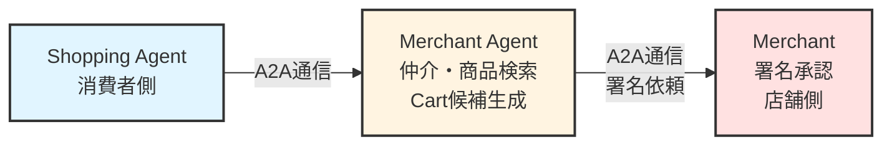
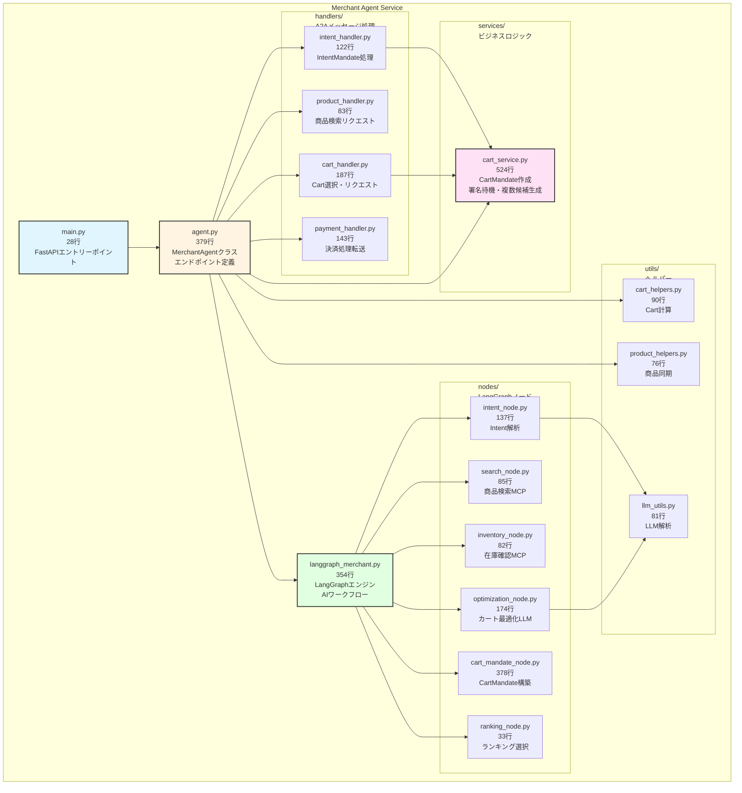
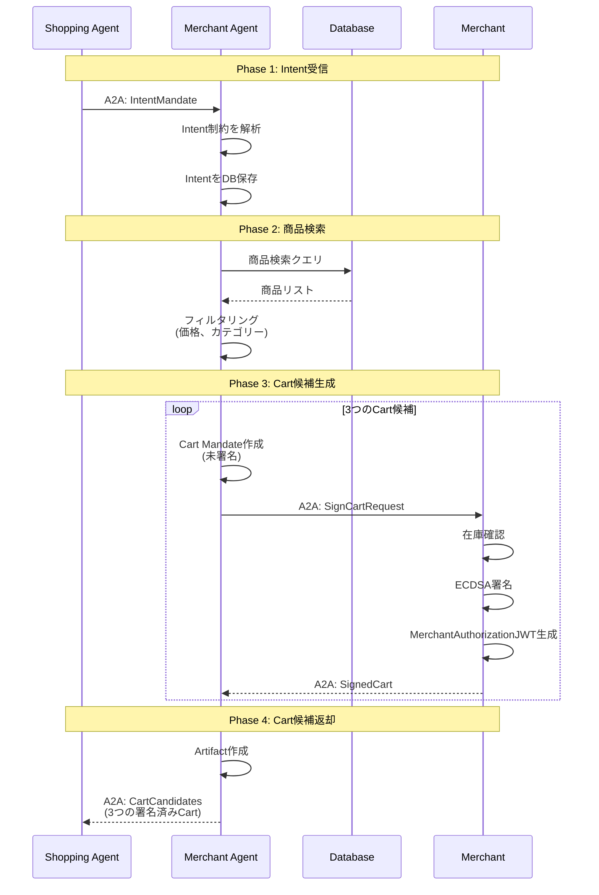
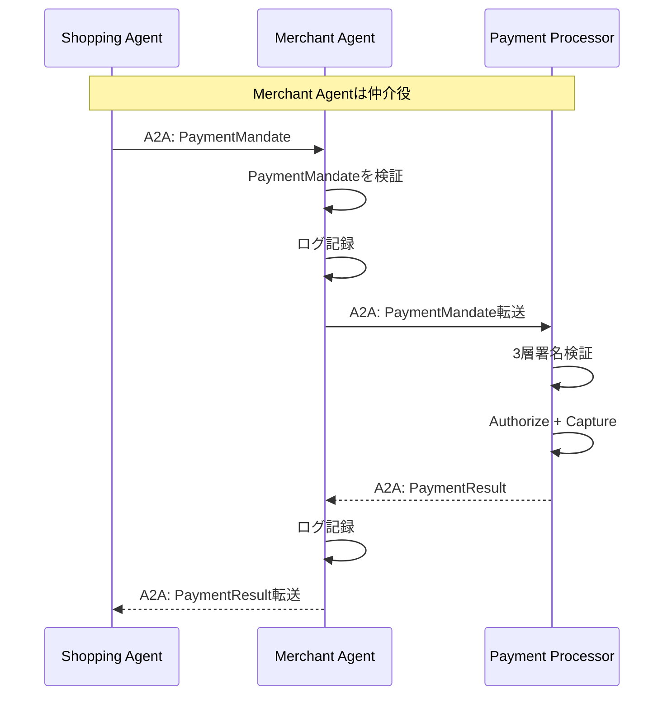

# Merchant Agent

**AP2 Protocol - 商店代理エージェント**

Merchant Agentは、商店に代わって商品検索、Cart Mandate作成、在庫管理を行うAIエージェントです。Shopping AgentからのA2A通信を受け、商品データベースを検索し、複数のCart候補を生成します。

## 📋 目次

- [概要](#概要)
- [役割と責務](#役割と責務)
- [主要機能](#主要機能)
- [エンドポイント一覧](#エンドポイント一覧)
- [実装詳細](#実装詳細)
- [データフロー](#データフロー)
- [AI化（LangGraph統合）](#ai化langgraph統合)
- [開発者向け情報](#開発者向け情報)

---

## 概要

### AP2での役割

- **AP2 Role**: `merchant`
- **DID**: `did:ap2:agent:merchant_agent`
- **Port**: `8001`
- **Database**: `v2/data/merchant_agent.db`
- **担当Merchant**: `did:ap2:merchant:mugibo_merchant`（むぎぼーショップ）

### 主要な責務

1. **商品検索**: データベースからの商品検索（名前・説明・カテゴリー）
2. **Cart Mandate作成**: 未署名のCart Mandateを生成
3. **Merchant署名依頼**: Cart MandateをMerchantに送信して署名を依頼
4. **在庫管理**: 商品在庫の照会・更新
5. **A2A通信ハブ**: Shopping Agent ←→ Merchant間の仲介
6. **AI化**: LangGraph統合による複数Cart候補の自動生成

---

## 役割と責務

### 1. エージェント分離の重要性

**AP2仕様の要件**: Merchant AgentとMerchantは**別エンティティ**である必要があります。



**理由**:
- **セキュリティ**: Merchant Agentは署名権限を持たない（署名鍵を保持しない）
- **責任分離**: エージェント（自動処理）と店舗（承認・署名）の責務を明確化
- **監査**: Merchantによる明示的な承認プロセスが記録される

### 2. A2Aメッセージフロー

**受信するA2Aメッセージ**:
- `ap2.mandates.IntentMandate`: Shopping Agentからの購買意図
- `ap2.requests.ProductSearch`: 商品検索リクエスト
- `ap2.requests.CartRequest`: Cart作成・署名リクエスト
- `ap2.requests.CartSelection`: Cart選択通知（AI化で追加）
- `ap2.mandates.PaymentMandate`: 決済処理依頼（Payment Processorへ転送）

**送信するA2Aメッセージ**:
- `ap2.responses.ProductList`: 商品リスト
- `ap2.responses.CartCandidates`: 複数のCart候補（AI化）
- `ap2.mandates.CartMandate`: 署名済みCart（Merchantから受領後）

---

## アーキテクチャ

### 内部モジュール構造

Merchant Agentは、責務ごとにモジュール化された構造になっています（2025-10-29リファクタリング済み）:



**主要な改善点**:
- **agent.py**: 1284行 → 379行（70%削減）
- **langgraph_merchant.py**: 1318行 → 354行（73%削減）
- **モジュール化**: handlers/, services/, nodes/, utils/ディレクトリに分割
- **責務の明確化**: A2A処理、ビジネスロジック、AI処理、ヘルパーを分離
- **保守性向上**: 各ファイルが100-500行の適切なサイズに

---

## 主要機能

### 1. 商品検索

**エンドポイント**: `GET /search`

**パラメータ**:
- `query`: 検索クエリ（名前または説明で部分一致）
- `category`: カテゴリーフィルター（オプション）
- `limit`: 結果数上限（デフォルト: 10）

**実装**: `agent.py:194-225`

```python
# v2/services/merchant_agent/agent.py:194-225
@self.app.get("/search")
async def search_products(
    query: str = "",
    category: Optional[str] = None,
    limit: int = 10
):
    async with self.db_manager.get_session() as session:
        if query:
            products = await ProductCRUD.search(session, query, limit)
        else:
            products = await ProductCRUD.list_all(session, limit)

        # カテゴリーフィルター
        if category:
            products = [
                p for p in products
                if p.product_metadata and json.loads(p.product_metadata).get("category") == category
            ]

        return {
            "products": [p.to_dict() for p in products],
            "total": len(products)
        }
```

**商品データ構造**:

```json
{
  "id": "prod_mugibo_calendar_001",
  "sku": "MUGIBO-CAL-2025",
  "name": "むぎぼーカレンダー2025",
  "description": "むぎぼーの可愛いカレンダー",
  "price": 1980,  // cents単位（¥1,980）
  "inventory_count": 50,
  "image_url": "/assets/むぎぼーカレンダー.png",
  "product_metadata": {
    "category": "goods",
    "brand": "むぎぼー",
    "tags": ["カレンダー", "文具"]
  }
}
```

### 2. Cart Mandate作成（未署名）

**フロー**:
1. Shopping AgentからCart作成依頼を受信（A2A通信）
2. 商品データベースから商品情報を取得
3. 未署名のCart Mandateを作成
4. MerchantにA2A通信で署名を依頼（`POST /a2a/message`）
5. 署名済みCart MandateをShopping Agentに返却

**Cart Mandate構造**（未署名）:

```json
{
  "type": "CartMandate",
  "contents": {
    "id": "cart_abc123",
    "merchant_id": "did:ap2:merchant:mugibo_merchant",
    "items": [
      {
        "product_id": "prod_mugibo_calendar_001",
        "sku": "MUGIBO-CAL-2025",
        "name": "むぎぼーカレンダー2025",
        "quantity": 1,
        "unit_price": {"value": "1980", "currency": "JPY"},
        "total_price": {"value": "1980", "currency": "JPY"}
      }
    ],
    "subtotal": {"value": "1980", "currency": "JPY"},
    "shipping_cost": {"value": "500", "currency": "JPY"},
    "tax": {"value": "198", "currency": "JPY"},
    "total": {"value": "2678", "currency": "JPY"},
    "shipping_address": {
      "recipient": "山田太郎",
      "addressLine": ["東京都渋谷区1-2-3"],
      "city": "渋谷区",
      "country": "JP",
      "postalCode": "150-0001"
    }
  },
  "created_at": "2025-10-23T12:34:56Z"
  // merchant_signature はまだない（Merchantが追加）
}
```

**実装**: `agent.py` の `_create_cart_mandate()` メソッド

### 3. Merchant署名依頼（A2A通信）

**送信先**: `did:ap2:merchant` (Merchant Service)

**A2Aメッセージ例**:

```json
{
  "header": {
    "message_id": "msg_sign_cart_123",
    "sender": "did:ap2:agent:merchant_agent",
    "recipient": "did:ap2:merchant",
    "timestamp": "2025-10-23T12:35:00Z",
    "nonce": "32バイトhex文字列",
    "proof": {
      "algorithm": "ed25519",
      "signatureValue": "...",
      "publicKey": "...",
      "kid": "did:ap2:agent:merchant_agent#key-2",
      "created": "2025-10-23T12:35:00Z",
      "proofPurpose": "authentication"
    }
  },
  "dataPart": {
    "@type": "ap2.mandates.CartMandate",
    "id": "cart_abc123",
    "payload": {
      /* 未署名のCart Mandate */
    }
  }
}
```

**実装**: `agent.py` の `_request_merchant_signature()` メソッド

### 4. 在庫管理

**エンドポイント**:
- `GET /inventory`: 在庫一覧取得
- `POST /inventory/update`: 在庫更新

**在庫更新例**:

```bash
curl -X POST http://localhost:8001/inventory/update \
  -H "Content-Type: application/json" \
  -d '{
    "product_id": "prod_mugibo_calendar_001",
    "quantity_delta": -2
  }'
```

**実装**:
- 在庫取得: `agent.py:260-283`
- 在庫更新: `agent.py:285-313`

---

## エンドポイント一覧

### 商品管理

| エンドポイント | メソッド | 説明 | 実装 |
|--------------|---------|------|------|
| `/search` | GET | 商品検索 | `agent.py:194` |
| `/inventory` | GET | 在庫一覧 | `agent.py:260` |
| `/inventory/update` | POST | 在庫更新 | `agent.py:285` |
| `/create-cart` | POST | Cart Mandate作成 | `agent.py:227` |

### A2A通信

| エンドポイント | メソッド | 説明 | 実装 |
|--------------|---------|------|------|
| `/a2a/message` | POST | A2Aメッセージ受信 | `base_agent.py:185` |
| `/.well-known/agent-card.json` | GET | AgentCard取得 | `base_agent.py:268` |

### ヘルスチェック

| エンドポイント | メソッド | 説明 | 実装 |
|--------------|---------|------|------|
| `/` | GET | ヘルスチェック | `base_agent.py:175` |
| `/health` | GET | Docker向けヘルスチェック | `base_agent.py:263` |

---

## 実装詳細

### クラス構造

```python
# agent.py:57-159
class MerchantAgent(BaseAgent):
    """
    Merchant Agent実装

    継承元: BaseAgent (v2/common/base_agent.py)
    """

    def __init__(self):
        super().__init__(
            agent_id="did:ap2:agent:merchant_agent",
            agent_name="Merchant Agent",
            passphrase=AgentPassphraseManager.get_passphrase("merchant_agent"),
            keys_directory="./keys"
        )

        # データベースマネージャー
        self.db_manager = DatabaseManager(
            database_url=os.getenv("DATABASE_URL")
        )

        # HTTPクライアント（Merchantとの通信用）
        self.http_client = httpx.AsyncClient(timeout=30.0)

        # 他エンティティのURL
        self.merchant_url = "http://merchant:8002"
        self.payment_processor_url = "http://payment_processor:8004"

        # このMerchantの情報
        self.merchant_id = "did:ap2:merchant:mugibo_merchant"
        self.merchant_name = "むぎぼーショップ"

        # LangGraphエンジン（AI化）
        self.langgraph_agent = None  # startup時に初期化

        # AI化モードフラグ
        self.ai_mode_enabled = os.getenv("MERCHANT_AI_MODE", "true").lower() == "true"
```

### A2Aメッセージハンドラー

```python
# agent.py:169-187
def register_a2a_handlers(self):
    """
    Merchant Agentが受信するA2Aメッセージ

    注: 各ハンドラーの実装は handlers/ ディレクトリに分割されています
    """
    self.a2a_handler.register_handler(
        "ap2.mandates.IntentMandate",
        self.handle_intent_mandate
    )
    self.a2a_handler.register_handler(
        "ap2.requests.ProductSearch",
        self.handle_product_search_request
    )
    self.a2a_handler.register_handler(
        "ap2.requests.CartRequest",
        self.handle_cart_request
    )
    self.a2a_handler.register_handler(
        "ap2.requests.CartSelection",
        self.handle_cart_selection  # AI化で追加
    )
    self.a2a_handler.register_handler(
        "ap2.mandates.PaymentMandate",
        self.handle_payment_request  # Payment Processorへ転送
    )
```

### Intent Mandate処理

```python
# handlers/intent_handler.py:17-122
async def handle_intent_mandate(agent, message: A2AMessage) -> Dict[str, Any]:
    """
    IntentMandateを受信（Shopping Agentから）

    AP2/A2A仕様準拠:
    - IntentMandateから複数のカート候補を生成
    - 各カートをArtifactとして返却
    - a2a-extension.md:144-229

    フロー:
    1. Intent制約を解析（max_amount, categories等）
    2. 商品データベースを検索
    3. 複数のCart候補を生成（AI化: 3パターン）
    4. 各Cart候補をMerchantに送信して署名依頼
    5. 署名済みCart候補をArtifactとして返却
    """
    payload = message.dataPart.payload
    intent_mandate = payload.get("intent_mandate")
    shipping_address = payload.get("shipping_address")

    if self.ai_mode_enabled and self.langgraph_agent:
        # AI化モード: LangGraphで複数Cart候補を生成
        cart_candidates = await self.langgraph_agent.generate_cart_candidates(
            intent_mandate,
            shipping_address
        )
    else:
        # 従来モード: 固定ロジックでCart生成
        cart_candidates = await self._generate_cart_candidates_fixed(
            intent_mandate,
            shipping_address
        )

    # 各Cart候補をMerchantに送信して署名依頼
    signed_carts = []
    for cart in cart_candidates:
        signed_cart = await self._request_merchant_signature(cart)
        signed_carts.append(signed_cart)

    # Artifactレスポンスを作成
    return {
        "is_artifact": True,
        "artifact_name": "Cart Candidates",
        "data_type_key": "ap2.responses.CartCandidates",
        "artifact_data": {
            "candidates": signed_carts,
            "total": len(signed_carts)
        }
    }
```

---

## データフロー

### Cart作成フロー（詳細）



### Payment処理フロー（転送）



---

## AI化（LangGraph統合）

### 概要

Merchant AgentはLangGraphを統合し、AI駆動でCart候補を生成します。

**AI化モード**:
- **有効**: `MERCHANT_AI_MODE=true`（デフォルト）
- **無効**: `MERCHANT_AI_MODE=false`

### LangGraphエージェント

```python
# langgraph_merchant.py:121-196
class MerchantLangGraphAgent:
    """
    LangGraph統合エージェント

    機能:
    - Intent解析: ユーザーの購買意図を理解
    - 商品推薦: データベースから最適な商品を選択
    - Cart候補生成: 3パターンのCart候補を自動生成
      1. Budget（予算重視）
      2. Standard（バランス型）
      3. Premium（高品質・多機能）
    """

    def __init__(
        self,
        db_manager: DatabaseManager,
        merchant_id: str,
        merchant_name: str,
        merchant_url: str,
        http_client: httpx.AsyncClient
    ):
        self.db_manager = db_manager
        self.merchant_id = merchant_id
        self.merchant_name = merchant_name
        self.merchant_url = merchant_url
        self.http_client = http_client

        # LangGraphのStateGraph定義
        self.graph = self._build_graph()

    async def generate_cart_candidates(
        self,
        intent_mandate: Dict[str, Any],
        shipping_address: Dict[str, Any]
    ) -> List[Dict[str, Any]]:
        """
        Intent MandateからCart候補を生成

        Returns:
            List[CartMandate]: 3つのCart候補（未署名）
        """
        # LangGraphのワークフロー実行
        state = {
            "intent_mandate": intent_mandate,
            "shipping_address": shipping_address,
            "products": [],
            "cart_candidates": []
        }

        # グラフ実行
        result_state = await self.graph.ainvoke(state)

        return result_state["cart_candidates"]

    def _build_graph(self) -> StateGraph:
        """
        LangGraphのStateGraphを構築

        ノード:
        1. analyze_intent: Intent解析
        2. search_products: 商品検索
        3. generate_carts: Cart候補生成
        """
        workflow = StateGraph(MerchantState)

        workflow.add_node("analyze_intent", self._analyze_intent)
        workflow.add_node("search_products", self._search_products)
        workflow.add_node("generate_carts", self._generate_carts)

        workflow.add_edge(START, "analyze_intent")
        workflow.add_edge("analyze_intent", "search_products")
        workflow.add_edge("search_products", "generate_carts")
        workflow.add_edge("generate_carts", END)

        return workflow.compile()
```

### Cart候補生成戦略

**3つのパターン**:

1. **Budget（予算重視）**:
   - 最も安価な商品を選択
   - 送料を最小化
   - 合計金額をIntent制約内に収める

2. **Standard（バランス型）**:
   - 価格と品質のバランス
   - 人気商品を優先
   - 標準的な送料

3. **Premium（高品質・多機能）**:
   - 高品質な商品を選択
   - 関連商品をバンドル
   - 付加価値サービス（ギフトラッピング等）

**実装**: `langgraph_merchant.py` の `_generate_carts()` メソッド

### Langfuse統合

**トレース機能**:
- LangGraphの実行フローを可視化
- LLM呼び出しのコスト追跡
- パフォーマンス分析

```python
# langgraph_merchant.py:67-86
# Langfuseトレーシング設定
LANGFUSE_ENABLED = os.getenv("LANGFUSE_ENABLED", "false").lower() == "true"
CallbackHandler = None
langfuse_client = None

if LANGFUSE_ENABLED:
    try:
        from langfuse.langchain import CallbackHandler as LangfuseCallbackHandler
        from langfuse import Langfuse

        langfuse_client = Langfuse(
            public_key=os.getenv("LANGFUSE_PUBLIC_KEY"),
            secret_key=os.getenv("LANGFUSE_SECRET_KEY"),
            host=os.getenv("LANGFUSE_HOST", "https://cloud.langfuse.com")
        )
        CallbackHandler = LangfuseCallbackHandler
        logger.info("[Langfuse] Tracing enabled")
    except Exception as e:
        logger.warning(f"[Langfuse] Failed to initialize: {e}")
        LANGFUSE_ENABLED = False
```

---

## 開発者向け情報

### ローカル開発

```bash
# 仮想環境のアクティベート
source v2/.venv/bin/activate

# 依存関係インストール
cd v2
uv sync

# 環境変数設定
export AP2_MERCHANT_AGENT_PASSPHRASE="your_passphrase"
export DATABASE_URL="sqlite+aiosqlite:///./data/merchant_agent.db"
export MERCHANT_URL="http://localhost:8002"
export MERCHANT_AI_MODE="true"

# サーバー起動
uvicorn services.merchant_agent.main:app --host 0.0.0.0 --port 8001 --reload
```

### Docker開発

```bash
# Merchant Agent単体でビルド＆起動
cd v2
docker compose up --build merchant_agent

# ログ確認
docker compose logs -f merchant_agent

# AI化モード無効で起動
MERCHANT_AI_MODE=false docker compose up merchant_agent
```

### テスト

```bash
# ヘルスチェック
curl http://localhost:8001/

# 商品検索
curl "http://localhost:8001/search?query=むぎぼー&limit=5"

# 在庫一覧
curl http://localhost:8001/inventory

# A2A通信テスト（Intent Mandate送信）
curl -X POST http://localhost:8001/a2a/message \
  -H "Content-Type: application/json" \
  -d @sample_intent_mandate.json
```

### 環境変数

| 変数名 | 説明 | デフォルト |
|--------|------|-----------|
| `AP2_MERCHANT_AGENT_PASSPHRASE` | 秘密鍵のパスフレーズ | *必須* |
| `DATABASE_URL` | データベースURL | `sqlite+aiosqlite:///...` |
| `MERCHANT_URL` | MerchantのURL | `http://merchant:8002` |
| `PAYMENT_PROCESSOR_URL` | Payment ProcessorのURL | `http://payment_processor:8004` |
| `MERCHANT_AI_MODE` | AI化モード | `true` |
| `LANGFUSE_ENABLED` | Langfuseトレース | `false` |
| `LANGFUSE_PUBLIC_KEY` | Langfuse公開鍵 | - |
| `LANGFUSE_SECRET_KEY` | Langfuse秘密鍵 | - |
| `LOG_LEVEL` | ログレベル | `INFO` |

### 主要ファイル

#### コアファイル

| ファイル | 行数 | 説明 |
|---------|------|------|
| `agent.py` | 379 | MerchantAgentクラス実装、エンドポイント定義 |
| `main.py` | 28 | FastAPIエントリーポイント |
| `langgraph_merchant.py` | 354 | LangGraphエンジン（AIワークフロー） |
| `Dockerfile` | ~40 | Dockerイメージ定義 |

#### モジュール構成

| ディレクトリ/ファイル | 行数 | 説明 |
|---------|------|------|
| **handlers/** | 593 | **A2Aメッセージハンドラー** |
| `├─ intent_handler.py` | 122 | IntentMandate処理 |
| `├─ product_handler.py` | 83 | 商品検索リクエスト |
| `├─ cart_handler.py` | 187 | Cart選択・リクエスト |
| `└─ payment_handler.py` | 143 | 決済処理転送 |
| **services/** | 524 | **ビジネスロジック** |
| `└─ cart_service.py` | 524 | CartMandate作成・署名待機・候補生成 |
| **nodes/** | 928 | **LangGraphノード** |
| `├─ intent_node.py` | 137 | Intent解析（LLM/フォールバック） |
| `├─ search_node.py` | 85 | 商品検索（MCPツール） |
| `├─ inventory_node.py` | 82 | 在庫確認（MCPツール） |
| `├─ optimization_node.py` | 174 | カート最適化（LLM/ルールベース） |
| `├─ cart_mandate_node.py` | 378 | CartMandate構築（MCP署名） |
| `└─ ranking_node.py` | 33 | ランキング選択 |
| **utils/** | 247 | **ヘルパー関数** |
| `├─ cart_helpers.py` | 90 | Cart計算ヘルパー |
| `├─ product_helpers.py` | 76 | 商品同期ヘルパー |
| `└─ llm_utils.py` | 81 | LLM解析ヘルパー |

**合計**: 約3,000行（リファクタリング前: 約2,600行、モジュール化により可読性・保守性が大幅向上）

---

## 関連ドキュメント

- [メインREADME](../../../README.md) - プロジェクト全体の概要
- [Shopping Agent README](../shopping_agent/README.md)
- [Merchant README](../merchant/README.md)
- [Payment Processor README](../payment_processor/README.md)
- [AP2仕様書](https://ap2-protocol.org/specification/)

---

**作成日**: 2025-10-23
**バージョン**: v2.0.0
**メンテナー**: AP2 Development Team
