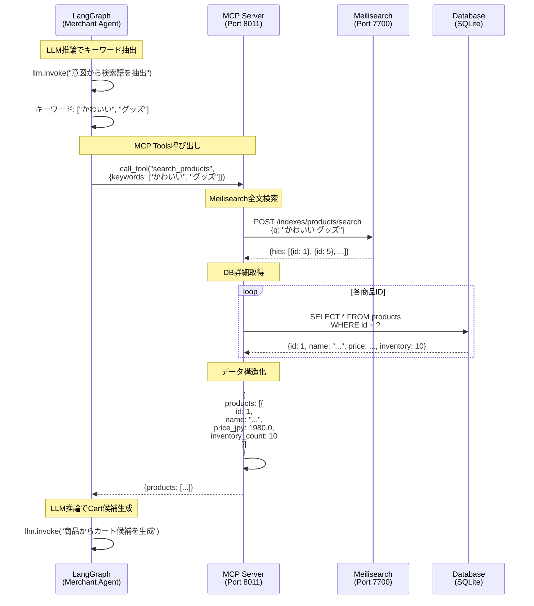

# Merchant Agent MCP

**Model Context Protocol (MCP) ツールサーバー - Merchant Agent用**

Merchant Agent MCPは、LangGraphエージェントにデータアクセスツールを提供するMCPサーバーです。LLM推論はLangGraph側で行い、このサーバーはデータ操作のみを担当します。

## 📋 目次

- [概要](#概要)
- [MCP仕様準拠](#mcp仕様準拠)
- [提供ツール](#提供ツール)
- [アーキテクチャ](#アーキテクチャ)
- [ツール詳細](#ツール詳細)
- [開発者向け情報](#開発者向け情報)

---

## 概要

### MCPサーバーの役割

- **Port**: `8011`
- **Server Name**: `merchant_agent_mcp`
- **Version**: `1.0.0`

### 主要な責務

1. **商品検索**: Meilisearch全文検索 + データベースアクセス
2. **在庫確認**: 商品在庫状況の照会
3. **CartMandate構築**: AP2準拠のCartMandate構造化（未署名）

### アーキテクチャ上の位置付け

```
┌───────────────────┐      ┌─────────────────────┐      ┌──────────────┐
│ Merchant Agent    │      │ Merchant Agent MCP  │      │ Meilisearch  │
│ (LangGraph)       │─────>│ (Port 8011)         │─────>│ (Port 7700)  │
│                   │ MCP  │                     │ HTTP │              │
│ - LLM推論         │ Tools│ - search_products   │      │ - 全文検索    │
│ - ワークフロー    │      │ - check_inventory   │      └──────────────┘
│ - 意思決定        │      │ - build_cart_      │
└───────────────────┘      │   mandates          │      ┌──────────────┐
                           │                     │      │ Database     │
                           │                     │─────>│ (SQLite)     │
                           └─────────────────────┘ SQL  │ - 商品情報    │
                                                         │ - 在庫情報    │
                                                         └──────────────┘
```

---

## MCP仕様準拠

### Model Context Protocol とは

**MCP (Model Context Protocol)** は、LLMアプリケーションとデータソース・ツールを接続するためのオープンプロトコルです。

- **公式仕様**: [Model Context Protocol Specification](https://spec.modelcontextprotocol.io/)
- **JSON-RPC 2.0**: MCPはJSON-RPC 2.0に基づいたプロトコル
- **Streamable HTTP Transport**: HTTP/SSEによるストリーミング対応

### MCPサーバーの責務分離

**重要**: MCPサーバーはLLM推論を行いません。

| 責務 | 担当 |
|------|------|
| **LLM推論** | LangGraph（Merchant Agent） |
| **ワークフロー制御** | LangGraph（Merchant Agent） |
| **意思決定** | LangGraph（Merchant Agent） |
| **データアクセス** | **MCP Server（このサービス）** |
| **データ構造化** | **MCP Server（このサービス）** |

**例**: 商品検索フロー

```python
# LangGraph側（Merchant Agent）
llm_response = llm.invoke("ユーザーの意図から検索キーワードを抽出")
# → キーワード: ["かわいい", "グッズ"]

# MCP Server側（このサービス）
products = await mcp_client.call_tool("search_products", {
    "keywords": ["かわいい", "グッズ"],
    "limit": 20
})
# → Meilisearch検索 + DB取得 + データ構造化
```

---

## 提供ツール

### ツール一覧

| ツール名 | 説明 | 入力 | 出力 |
|---------|------|------|------|
| `search_products` | Meilisearch全文検索 + DB詳細取得 | `{keywords: [...], limit: 20}` | `{products: [...]}` |
| `check_inventory` | 在庫状況確認 | `{product_ids: [...]}` | `{inventory: {1: 10, ...}}` |
| `build_cart_mandates` | AP2準拠CartMandate構築 | `{cart_plan, products, shipping_address}` | `{cart_mandate: {...}}` |

### ツール呼び出し例

```python
from common.mcp_client import MCPClient

mcp_client = MCPClient("http://merchant_agent_mcp:8011")

# search_products呼び出し
result = await mcp_client.call_tool("search_products", {
    "keywords": ["むぎぼー", "カレンダー"],
    "limit": 10
})

# check_inventory呼び出し
inventory = await mcp_client.call_tool("check_inventory", {
    "product_ids": [1, 2, 3]
})

# build_cart_mandates呼び出し
cart_mandate = await mcp_client.call_tool("build_cart_mandates", {
    "cart_plan": {
        "items": [{"product_id": 1, "quantity": 2}]
    },
    "products": products_list,
    "shipping_address": {...}
})
```

---

## アーキテクチャ

### データフロー



### Meilisearch統合

**検索フロー**:

1. **キーワード結合**: `["かわいい", "グッズ"]` → `"かわいい グッズ"`
2. **Meilisearch検索**: 全文検索（商品名、説明、カテゴリ、ブランド、キーワード）
3. **商品ID取得**: `[1, 5, 12, 24, ...]`
4. **DB詳細取得**: 各商品の価格、在庫、メタデータを取得
5. **データ構造化**: AP2準拠のJSONに変換

**フォールバック機能**:
- Meilisearch検索結果が0件の場合 → 全商品を返す（ユーザー体験向上）
- エラー発生時 → 全商品を返す（可用性確保）

---

## ツール詳細

### 1. search_products (main.py:60-186)

**ツール定義**:

```python
@mcp.tool(
    name="search_products",
    description="データベースから商品を検索",
    input_schema={
        "type": "object",
        "properties": {
            "keywords": {
                "type": "array",
                "items": {"type": "string"},
                "description": "検索キーワードリスト"
            },
            "limit": {
                "type": "integer",
                "description": "最大検索結果数",
                "default": 20
            }
        },
        "required": ["keywords"]
    }
)
async def search_products(params: Dict[str, Any]) -> Dict[str, Any]:
    """Meilisearch全文検索で商品を検索"""
```

**入力**:

```json
{
  "keywords": ["かわいい", "グッズ"],
  "limit": 10
}
```

**出力**:

```json
{
  "products": [
    {
      "id": 1,
      "sku": "MUGIBO-CAL-2025",
      "name": "むぎぼーカレンダー2025",
      "description": "むぎぼーの可愛いカレンダー",
      "price_cents": 198000,
      "price_jpy": 1980.0,
      "inventory_count": 50,
      "category": "goods",
      "brand": "むぎぼー",
      "image_url": "/assets/むぎぼーカレンダー.png",
      "refund_period_days": 30
    }
  ]
}
```

**処理フロー**:

```python
# main.py:80-186
async def search_products(params: Dict[str, Any]) -> Dict[str, Any]:
    keywords = params["keywords"]
    limit = params.get("limit", 20)

    # キーワード結合
    if not keywords or keywords == [""]:
        query = ""  # 全商品取得
    else:
        query = " ".join(keywords)  # "かわいい グッズ"

    # Step 1: Meilisearchで全文検索
    product_ids = await search_client.search(query, limit=limit)

    # Step 2: Product DBから詳細情報取得
    async with db_manager.get_session() as session:
        products_list = []

        if not product_ids:
            # フォールバック: 全商品を返す
            all_products = await ProductCRUD.get_all_with_stock(session, limit=limit)
            product_ids = [p.id for p in all_products]

        for product_id in product_ids:
            product = await ProductCRUD.get_by_id(session, product_id)

            if not product or product.inventory_count <= 0:
                continue  # 在庫なしはスキップ

            products_list.append({
                "id": product.id,
                "sku": product.sku,
                "name": product.name,
                "description": product.description,
                "price_cents": product.price,  # cents単位
                "price_jpy": product.price / 100.0,  # AP2準拠: float, 円単位
                "inventory_count": product.inventory_count,
                "category": metadata.get("category"),
                "brand": metadata.get("brand"),
                "image_url": metadata.get("image_url"),
                "refund_period_days": metadata.get("refund_period_days", 30)
            })

        return {"products": products_list}
```

### 2. check_inventory (main.py:189-231)

**ツール定義**:

```python
@mcp.tool(
    name="check_inventory",
    description="在庫状況を確認",
    input_schema={
        "type": "object",
        "properties": {
            "product_ids": {
                "type": "array",
                "items": {"type": "integer"},
                "description": "商品IDリスト"
            }
        },
        "required": ["product_ids"]
    }
)
async def check_inventory(params: Dict[str, Any]) -> Dict[str, Any]:
    """在庫状況を確認"""
```

**入力**:

```json
{
  "product_ids": [1, 2, 3]
}
```

**出力**:

```json
{
  "inventory": {
    "1": 50,
    "2": 30,
    "3": 0
  }
}
```

**処理フロー**:

```python
# main.py:204-231
async def check_inventory(params: Dict[str, Any]) -> Dict[str, Any]:
    product_ids = params["product_ids"]

    async with db_manager.get_session() as session:
        inventory = {}
        for product_id in product_ids:
            product = await ProductCRUD.get_by_id(session, product_id)
            if product:
                inventory[product_id] = product.inventory_count
            else:
                inventory[product_id] = 0

        return {"inventory": inventory}
```

### 3. build_cart_mandates (main.py:233-379)

**ツール定義**:

```python
@mcp.tool(
    name="build_cart_mandates",
    description="AP2準拠のCartMandateを構築（未署名）",
    input_schema={
        "type": "object",
        "properties": {
            "cart_plan": {
                "type": "object",
                "description": "カートプラン（optimize_cartの結果）"
            },
            "products": {
                "type": "array",
                "items": {"type": "object"},
                "description": "商品情報リスト"
            },
            "shipping_address": {
                "type": "object",
                "description": "AP2準拠のContactAddress"
            }
        },
        "required": ["cart_plan", "products"]
    }
)
async def build_cart_mandates(params: Dict[str, Any]) -> Dict[str, Any]:
    """AP2準拠のCartMandateを構築"""
```

**入力**:

```json
{
  "cart_plan": {
    "items": [
      {"product_id": 1, "quantity": 2},
      {"product_id": 5, "quantity": 1}
    ]
  },
  "products": [
    {"id": 1, "name": "...", "price_jpy": 1980.0, ...},
    {"id": 5, "name": "...", "price_jpy": 3500.0, ...}
  ],
  "shipping_address": {
    "recipient": "山田太郎",
    "addressLine": ["東京都渋谷区1-2-3"],
    "city": "渋谷区",
    "country": "JP",
    "postalCode": "150-0001"
  }
}
```

**出力**:

```json
{
  "cart_mandate": {
    "type": "CartMandate",
    "contents": {
      "id": "cart_abc123",
      "merchant_id": "did:ap2:merchant:mugibo_merchant",
      "display_items": [
        {
          "label": "むぎぼーカレンダー2025",
          "amount": {"value": 3960.0, "currency": "JPY"},
          "refund_period": 2592000
        }
      ],
      "total": {"value": 8108.0, "currency": "JPY"},
      "metadata": {
        "raw_items": [
          {
            "product_id": 1,
            "sku": "MUGIBO-CAL-2025",
            "name": "むぎぼーカレンダー2025",
            "quantity": 2,
            "unit_price_jpy": 1980.0,
            "total_price_jpy": 3960.0
          }
        ],
        "shipping_fee": 500.0,
        "tax": 746.0,
        "subtotal": 7460.0
      },
      "shipping_address": {...}
    },
    "created_at": "2025-10-23T12:00:00Z"
  }
}
```

**AP2準拠のポイント**:
- `display_items`: W3C Payment Request API準拠の`PaymentItem`配列
- `total`: 合計金額（subtotal + shipping_fee + tax）
- `metadata.raw_items`: 商品詳細情報（AP2拡張）
- `refund_period`: 秒単位（30日 = 2592000秒）

**送料計算**:
- 小計 ≥ ¥5,000 → 送料無料
- 小計 < ¥5,000 → 送料¥500

**税金計算**:
- 税率: 10%
- `tax = (subtotal + shipping_fee) × 0.1`

---

## 開発者向け情報

### ローカル開発

```bash
# 仮想環境のアクティベート
source v2/.venv/bin/activate

# 依存関係インストール
cd v2
uv sync

# 環境変数設定
export DATABASE_URL="sqlite+aiosqlite:////app/v2/data/merchant_agent.db"
export MEILISEARCH_URL="http://localhost:7700"
export MERCHANT_ID="did:ap2:merchant:mugibo_merchant"
export MERCHANT_NAME="Demo Merchant"

# サーバー起動
uvicorn services.merchant_agent_mcp.main:app --host 0.0.0.0 --port 8011 --reload
```

### Docker開発

```bash
# Merchant Agent MCP単体でビルド＆起動
cd v2
docker compose up --build merchant_agent_mcp

# ログ確認
docker compose logs -f merchant_agent_mcp
```

### MCPツール一覧取得

```bash
# MCPサーバーのツール一覧を取得
curl -X POST http://localhost:8011/mcp/tools/list \
  -H "Content-Type: application/json" \
  -d '{}'
```

### MCPツール呼び出し

```bash
# search_products呼び出し
curl -X POST http://localhost:8011/mcp/tools/call \
  -H "Content-Type: application/json" \
  -d '{
    "name": "search_products",
    "arguments": {
      "keywords": ["むぎぼー"],
      "limit": 5
    }
  }'

# check_inventory呼び出し
curl -X POST http://localhost:8011/mcp/tools/call \
  -H "Content-Type: application/json" \
  -d '{
    "name": "check_inventory",
    "arguments": {
      "product_ids": [1, 2, 3]
    }
  }'
```

### 環境変数

| 変数名 | 説明 | デフォルト |
|--------|------|-----------|
| `DATABASE_URL` | データベースURL | `sqlite+aiosqlite:////app/v2/data/merchant_agent.db` |
| `MEILISEARCH_URL` | MeilisearchエンドポイントURL | `http://meilisearch:7700` |
| `MEILISEARCH_MASTER_KEY` | Meilisearchマスターキー | `masterKey123` |
| `MERCHANT_ID` | Merchant DID | `did:ap2:merchant:mugibo_merchant` |
| `MERCHANT_NAME` | Merchant名 | `Demo Merchant` |
| `SHIPPING_FEE` | 送料（円） | `500.0` |
| `FREE_SHIPPING_THRESHOLD` | 送料無料の閾値（円） | `5000.0` |
| `TAX_RATE` | 税率 | `0.1` (10%) |
| `LOG_LEVEL` | ログレベル | `INFO` |

### 主要ファイル

| ファイル | 行数 | 説明 |
|---------|------|------|
| `main.py` | ~379 | MCPサーバー実装、3つのツール定義 |
| `Dockerfile` | ~30 | Dockerイメージ定義 |

---

## 関連ドキュメント

- [メインREADME](../../../README.md) - プロジェクト全体の概要
- [Merchant Agent README](../merchant_agent/README.md) - LangGraph統合（ツール呼び出し側）
- [MCP Specification](https://spec.modelcontextprotocol.io/) - Model Context Protocol仕様
- [AP2仕様書](https://ap2-protocol.org/specification/)

---

**作成日**: 2025-10-23
**バージョン**: v2.0.0
**メンテナー**: AP2 Development Team
