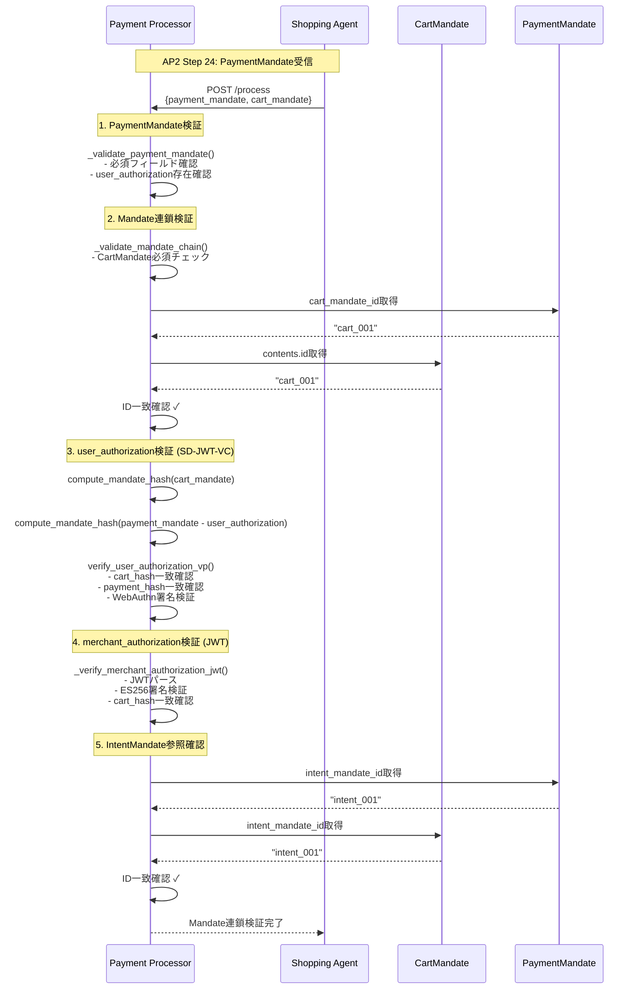
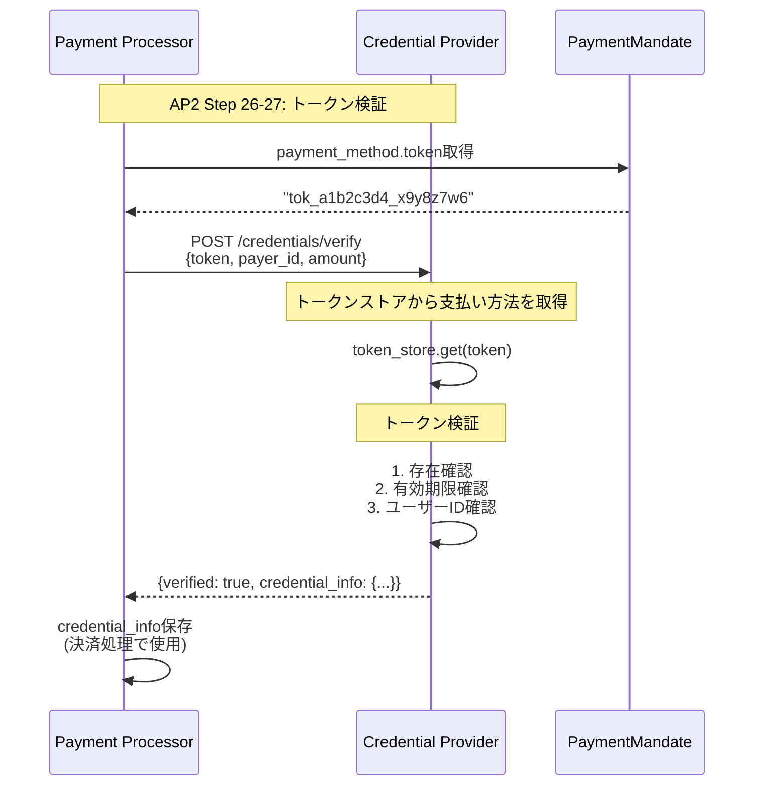
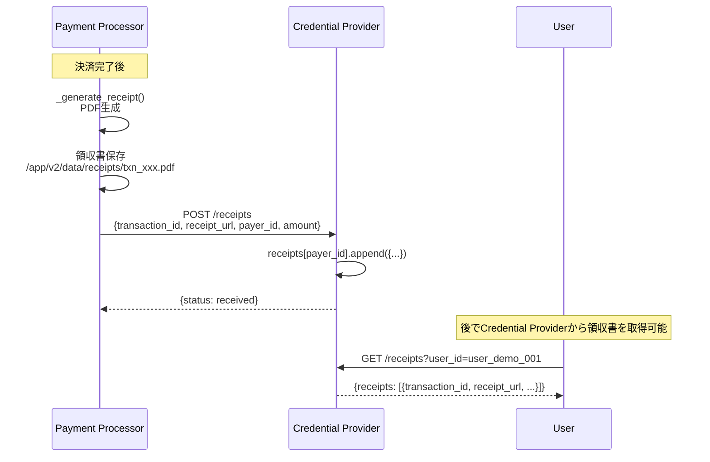
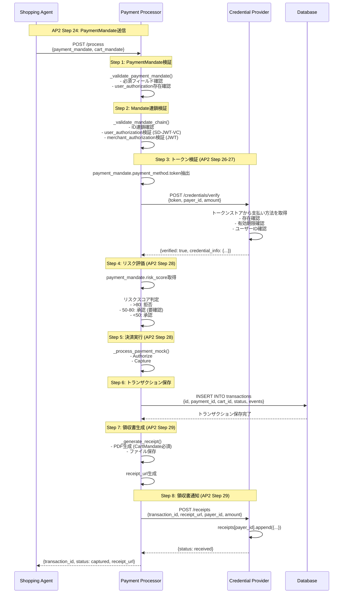

# Payment Processor

**Payment Processor** は、AP2プロトコルにおいて決済処理とトランザクション管理を担当するサービスです。

## 目次

- [概要](#概要)
- [AP2における役割](#ap2における役割)
- [アーキテクチャ](#アーキテクチャ)
- [主要機能](#主要機能)
- [エンドポイント](#エンドポイント)
- [Mandate連鎖検証](#mandate連鎖検証)
- [JWT検証](#jwt検証)
- [決済処理フロー](#決済処理フロー)
- [領収書生成](#領収書生成)
- [リスク評価との統合](#リスク評価との統合)
- [データベース構造](#データベース構造)
- [開発](#開発)

---

## 概要

Payment Processorは、以下の責任を持つエンティティです：

- **PaymentMandate処理**: Shopping Agentからの支払い処理依頼を受付
- **Mandate連鎖検証**: IntentMandate → CartMandate → PaymentMandateの整合性確認
- **3層署名検証**: Shopping Agent、Merchant、User の署名検証
- **Credential Provider連携**: トークン検証・認証情報取得 (AP2 Step 26-27)
- **決済実行**: 決済ゲートウェイとの統合（モック実装）
- **領収書生成**: PDF形式の領収書作成とCredential Providerへの通知 (AP2 Step 29)

### AP2における役割

```
AP2 Role: payment-processor
DID: did:ap2:agent:payment_processor
```

**Key Responsibilities**:
1. **PaymentMandate検証** (AP2 Step 24-25)
2. **Credential Provider連携** (AP2 Step 26-27)
3. **決済処理実行** (AP2 Step 28)
4. **領収書発行** (AP2 Step 29)

---

## アーキテクチャ

```
┌───────────────────────────────────────────────────────────┐
│         Payment Processor Service                          │
│  (did:ap2:agent:payment_processor)                        │
├───────────────────────────────────────────────────────────┤
│                                                            │
│  ┌────────────────────────────────────────────────────┐  │
│  │  Mandate Chain Validation Engine                   │  │
│  │  - IntentMandate → CartMandate → PaymentMandate   │  │
│  │  - ID連鎖確認                                       │  │
│  │  - ハッシュ整合性確認 (RFC 8785)                   │  │
│  └────────────────────────────────────────────────────┘  │
│                                                            │
│  ┌────────────────────────────────────────────────────┐  │
│  │  3-Layer Signature Verification                    │  │
│  │  - User Authorization: SD-JWT-VC (WebAuthn)        │  │
│  │  - Merchant Authorization: JWT (ES256/ECDSA)       │  │
│  │  - Shopping Agent Signature: ECDSA                 │  │
│  │  - DID Resolution (公開鍵取得)                      │  │
│  └────────────────────────────────────────────────────┘  │
│                                                            │
│  ┌────────────────────────────────────────────────────┐  │
│  │  Credential Provider Integration                   │  │
│  │  - Token検証 (AP2 Step 26-27)                       │  │
│  │  - 支払い方法情報取得                               │  │
│  │  - 領収書通知 (AP2 Step 29)                         │  │
│  └────────────────────────────────────────────────────┘  │
│                                                            │
│  ┌────────────────────────────────────────────────────┐  │
│  │  Payment Processing Engine                         │  │
│  │  - リスクベース承認/拒否判定                        │  │
│  │  - Authorize & Capture (モック)                     │  │
│  │  - 決済ゲートウェイ統合準備                         │  │
│  └────────────────────────────────────────────────────┘  │
│                                                            │
│  ┌────────────────────────────────────────────────────┐  │
│  │  Receipt Generator                                  │  │
│  │  - PDF形式領収書生成                                │  │
│  │  - VDC交換原則 (CartMandate必須)                   │  │
│  │  - Credential Providerへの通知                      │  │
│  └────────────────────────────────────────────────────┘  │
│                                                            │
└───────────────────────────────────────────────────────────┘
           ↓                    ↓                  ↓
    ┌──────────┐    ┌──────────────────┐   ┌──────────────┐
    │ Database │    │ Credential       │   │ Shopping     │
    │ (SQLite) │    │ Provider         │   │ Agent        │
    └──────────┘    └──────────────────┘   └──────────────┘
```

---

## 主要機能

### 1. 支払い処理実行 (processor.py:99-165)

```python
@self.app.post("/process")
async def process_payment(request: ProcessPaymentRequest):
    """
    POST /process - 支払い処理実行 (AP2 Step 24-29)

    処理フロー:
    1. PaymentMandateバリデーション
    2. トランザクション作成
    3. 決済処理（モック）
    4. トランザクション保存
    5. レシート生成（PDF形式、VDC交換によりCartMandateを渡す）
    """
    payment_mandate = request.payment_mandate
    cart_mandate = request.cart_mandate  # VDC交換：CartMandateを取得
    credential_token = request.credential_token

    # 1. PaymentMandateバリデーション
    self._validate_payment_mandate(payment_mandate)

    # 2. トランザクション作成
    transaction_id = f"txn_{uuid.uuid4().hex[:12]}"

    # 3. 決済処理（モック）
    result = await self._process_payment_mock(
        transaction_id=transaction_id,
        payment_mandate=payment_mandate,
        credential_token=credential_token
    )

    # 4. トランザクション保存
    await self._save_transaction(
        transaction_id=transaction_id,
        payment_mandate=payment_mandate,
        result=result
    )

    # 5. レスポンス生成
    if result["status"] == "captured":
        # レシート生成（VDC交換によりCartMandateを渡す）
        receipt_url = await self._generate_receipt(
            transaction_id, payment_mandate, cart_mandate
        )

        return ProcessPaymentResponse(
            transaction_id=transaction_id,
            status="captured",
            receipt_url=receipt_url
        )
```

---

### 2. PaymentMandate検証 (processor.py:346-372)

```python
def _validate_payment_mandate(self, payment_mandate: Dict[str, Any]):
    """
    PaymentMandateを検証 (AP2仕様準拠)

    検証項目:
    - 必須フィールドの存在チェック
    - user_authorizationフィールドの検証（AP2仕様で必須）
    """
    required_fields = ["id", "amount", "payment_method", "payer_id", "payee_id"]
    for field in required_fields:
        if field not in payment_mandate:
            raise ValueError(f"Missing required field: {field}")

    # AP2仕様準拠：user_authorizationフィールドの検証
    # user_authorizationはCartMandateとPaymentMandateのハッシュに基づくユーザー承認トークン
    # 取引の正当性を保証する重要なフィールド
    user_authorization = payment_mandate.get("user_authorization")
    if user_authorization is None:
        raise ValueError(
            "AP2 specification violation: user_authorization field is required in PaymentMandate. "
            "This field contains the user's authorization token binding CartMandate and PaymentMandate."
        )
```

**user_authorization の重要性**:
- CartMandateとPaymentMandateを暗号学的にバインド
- ユーザーの明示的な承認を保証
- リプレイ攻撃やマンデート改ざんを防止

---

### 3. Mandate連鎖検証 (processor.py:721-878)

```python
def _validate_mandate_chain(
    self,
    payment_mandate: Dict[str, Any],
    cart_mandate: Optional[Dict[str, Any]] = None
) -> bool:
    """
    AP2仕様準拠のMandate連鎖検証

    AP2仕様では、以下の連鎖が必須：
    IntentMandate → CartMandate → PaymentMandate

    検証項目：
    1. PaymentMandateがCartMandateを正しく参照している
    2. CartMandateがIntentMandateを正しく参照している（オプション）
    3. 各Mandateのハッシュ整合性
    4. 署名検証（merchant_authorization、user_authorization）
    """
    # 1. CartMandateは必須（AP2仕様）
    if not cart_mandate:
        raise ValueError(
            "AP2 specification violation: CartMandate is required for PaymentMandate validation. "
            "VDC exchange principle requires CartMandate to be provided by Shopping Agent."
        )

    # 2. PaymentMandateがCartMandateを正しく参照しているか
    cart_mandate_id_in_payment = payment_mandate.get("cart_mandate_id")
    cart_mandate_id = cart_mandate.get("contents", {}).get("id")

    if cart_mandate_id_in_payment != cart_mandate_id:
        raise ValueError(
            f"AP2 specification violation: PaymentMandate references cart_mandate_id={cart_mandate_id_in_payment}, "
            f"but received CartMandate has id={cart_mandate_id}"
        )

    # 3. user_authorization SD-JWT-VC検証（AP2仕様完全準拠）
    user_authorization = payment_mandate.get("user_authorization")
    if user_authorization:
        # CartMandateとPaymentMandateのハッシュを計算（AP2仕様準拠）
        cart_hash = compute_mandate_hash(cart_mandate)

        # PaymentMandateのハッシュ計算時はuser_authorizationを除外
        payment_mandate_for_hash = {
            k: v for k, v in payment_mandate.items()
            if k != "user_authorization"
        }
        payment_hash = compute_mandate_hash(payment_mandate_for_hash)

        # SD-JWT-VC形式のuser_authorizationを検証
        vp_result = verify_user_authorization_vp(
            user_authorization=user_authorization,
            expected_cart_hash=cart_hash,
            expected_payment_hash=payment_hash,
            expected_audience="did:ap2:agent:payment_processor"
        )

        logger.info(
            f"✓ SD-JWT-VC user_authorization verified: "
            f"cart_hash_match=True, payment_hash_match=True, "
            f"webauthn_signature_verified=True"
        )

    # 4. CartMandateのMerchant署名検証（merchant_authorization JWT）
    merchant_authorization = cart_mandate.get("merchant_authorization")
    if merchant_authorization:
        merchant_payload = self._verify_merchant_authorization_jwt(merchant_authorization)

        # CartMandateハッシュの検証（JWTペイロード内のハッシュと実際のハッシュを比較）
        cart_hash_in_jwt = merchant_payload.get("cart_hash")
        actual_cart_hash = compute_mandate_hash(cart_mandate)

        if actual_cart_hash != cart_hash_in_jwt:
            raise ValueError(
                f"CartMandate hash mismatch in merchant_authorization: "
                f"JWT contains {cart_hash_in_jwt[:16]}..., "
                f"but actual hash is {actual_cart_hash[:16]}..."
            )

    # 5. IntentMandateへの参照確認（オプション）
    intent_mandate_id_in_payment = payment_mandate.get("intent_mandate_id")
    intent_mandate_id_in_cart = cart_mandate.get("intent_mandate_id")

    if intent_mandate_id_in_payment and intent_mandate_id_in_cart:
        if intent_mandate_id_in_payment != intent_mandate_id_in_cart:
            raise ValueError(
                f"AP2 specification violation: PaymentMandate references intent_mandate_id={intent_mandate_id_in_payment}, "
                f"but CartMandate references intent_mandate_id={intent_mandate_id_in_cart}"
            )

        logger.info(
            f"Full mandate chain validated: "
            f"IntentMandate({intent_mandate_id_in_cart}) → "
            f"CartMandate({cart_mandate_id}) → "
            f"PaymentMandate({payment_mandate.get('id')})"
        )
```

**Mandate連鎖検証のシーケンス**:



---

### 4. User Authorization検証 (processor.py:772-808)

```python
# user_authorization SD-JWT-VC検証（AP2仕様完全準拠）
user_authorization = payment_mandate.get("user_authorization")
if user_authorization:
    # CartMandateとPaymentMandateのハッシュを計算（AP2仕様準拠）
    cart_hash = compute_mandate_hash(cart_mandate)

    # PaymentMandateのハッシュ計算時はuser_authorizationを除外
    payment_mandate_for_hash = {
        k: v for k, v in payment_mandate.items()
        if k != "user_authorization"
    }
    payment_hash = compute_mandate_hash(payment_mandate_for_hash)

    # SD-JWT-VC形式のuser_authorizationを検証
    vp_result = verify_user_authorization_vp(
        user_authorization=user_authorization,
        expected_cart_hash=cart_hash,
        expected_payment_hash=payment_hash,
        expected_audience="did:ap2:agent:payment_processor"
    )

    # WebAuthn署名の暗号学的検証は verify_user_authorization_vp() 内で完了
    # - VP内のIssuer JWTのcnf claimから公開鍵を抽出
    # - ECDSA署名検証（authenticatorData + SHA256(clientDataJSON)）
```

**SD-JWT-VC検証の内部処理** (user_authorization.py):

1. **SD-JWT-VCパース**: VP（Verifiable Presentation）を "~" で分割
2. **Issuer JWT検証**: Header, Payload, Signatureをパース
3. **公開鍵抽出**: `cnf.jwk` クレームからWebAuthn公開鍵を取得
4. **Holder Binding検証**: KB-JWT（Key Binding JWT）の署名検証
5. **ハッシュ検証**: `cart_hash` と `payment_hash` の一致確認
6. **WebAuthn署名検証**: ECDSA-SHA256で署名を検証

---

### 5. Merchant Authorization検証 (processor.py:547-719)

```python
def _verify_merchant_authorization_jwt(
    self, merchant_authorization_jwt: str
) -> Dict[str, Any]:
    """
    merchant_authorization JWTを検証 (AP2仕様準拠)

    JWT構造:
    - Header: { "alg": "ES256", "kid": "did:ap2:merchant:xxx#key-1", "typ": "JWT" }
    - Payload: {
        "iss": "did:ap2:merchant:xxx",
        "sub": "did:ap2:merchant:xxx",
        "aud": "did:ap2:agent:payment_processor",
        "iat": <timestamp>,
        "exp": <timestamp>,
        "jti": <unique_id>,
        "cart_hash": "<cart_contents_hash>"
      }
    - Signature: ECDSA署名

    検証項目:
    1. JWT形式の検証（header.payload.signature）
    2. Base64url デコード
    3. Header検証（alg, kid, typ）
    4. Payload検証（iss, sub, aud, iat, exp, jti, cart_hash）
    5. 署名検証（ES256: ECDSA with P-256 and SHA-256）
    """
    # 1. JWT形式の検証（header.payload.signature）
    jwt_parts = merchant_authorization_jwt.split('.')
    if len(jwt_parts) != 3:
        raise ValueError("Invalid JWT format")

    header_b64, payload_b64, signature_b64 = jwt_parts

    # 2. Base64url デコード
    header_json = base64url_decode(header_b64).decode('utf-8')
    payload_json = base64url_decode(payload_b64).decode('utf-8')

    header = json.loads(header_json)
    payload = json.loads(payload_json)

    # 3. Header検証
    if header.get("alg") != "ES256":
        logger.warning(f"Unexpected algorithm: {header.get('alg')}, expected ES256")

    if not header.get("kid"):
        raise ValueError("Missing 'kid' (key ID) in JWT header")

    # 4. Payload検証
    required_claims = ["iss", "sub", "aud", "iat", "exp", "jti", "cart_hash"]
    for claim in required_claims:
        if claim not in payload:
            raise ValueError(f"Missing required claim in JWT payload: {claim}")

    # aud検証（audienceはPayment Processorであるべき）
    if payload.get("aud") != "did:ap2:agent:payment_processor":
        logger.warning(f"Unexpected audience: {payload.get('aud')}")

    # exp検証（有効期限）
    current_timestamp = int(time.time())
    if payload.get("exp", 0) < current_timestamp:
        raise ValueError(f"JWT has expired: exp={payload.get('exp')}")

    # 5. 署名検証（ES256: ECDSA with P-256 and SHA-256）
    # KID（Key ID）からDIDドキュメント経由で公開鍵を取得
    kid = header.get("kid")

    did_resolver = DIDResolver(self.key_manager)
    public_key_pem = did_resolver.resolve_public_key(kid)

    if not public_key_pem:
        raise ValueError(
            f"Public key not found for KID: {kid}. "
            f"Cannot verify JWT signature without public key."
        )

    # PEM形式の公開鍵を読み込み
    public_key = serialization.load_pem_public_key(
        public_key_pem.encode('utf-8')
    )

    # 署名対象データ（header_b64.payload_b64）
    message_to_verify = f"{header_b64}.{payload_b64}".encode('utf-8')

    # 署名をデコード
    signature_bytes = base64url_decode(signature_b64)

    # ECDSA署名を検証
    public_key.verify(
        signature_bytes,
        message_to_verify,
        ec.ECDSA(hashes.SHA256())
    )

    logger.info("✓ JWT signature verified successfully")

    return payload
```

**DID Resolution** (did_resolver.py):

```python
did_resolver = DIDResolver(self.key_manager)
public_key_pem = did_resolver.resolve_public_key(kid)
# kid例: "did:ap2:merchant:mugibo_merchant#key-1"
# 1. DIDドキュメントを /app/v2/data/did_documents/ から読み込み
# 2. verificationMethod配列から該当するkidを検索
# 3. publicKeyPemフィールドを返却
```

---

### 6. 決済処理 (processor.py:880-970)

```python
async def _process_payment_mock(
    self,
    transaction_id: str,
    payment_mandate: Dict[str, Any],
    credential_token: Optional[str] = None
) -> Dict[str, Any]:
    """
    決済処理（モック） (AP2 Step 26-28)

    AP2仕様準拠：
    1. PaymentMandateからトークンを抽出
    2. Credential Providerにトークン検証・認証情報要求 (Step 26-27)
    3. 検証成功後、決済処理を実行 (Step 28)

    本番環境では実際の決済ゲートウェイ（Stripe, Square等）と統合
    """
    amount = payment_mandate.get("amount", {})
    payment_method = payment_mandate.get("payment_method", {})

    # AP2 Step 26-27: Credential Providerにトークン検証を依頼
    token = payment_method.get("token")
    if not token:
        return {
            "status": "failed",
            "error": "No payment method token provided"
        }

    # Credential Providerにトークン検証・認証情報要求
    credential_info = await self._verify_credential_with_cp(
        token=token,
        payer_id=payment_mandate.get("payer_id"),
        amount=amount
    )

    # AP2仕様準拠：リスクベース承認/拒否判定
    risk_score = payment_mandate.get("risk_score", 0)
    fraud_indicators = payment_mandate.get("fraud_indicators", [])

    # リスクスコアに基づく判定
    if risk_score > 80:
        # 高リスク：拒否
        return {
            "status": "failed",
            "error": f"Payment declined: High risk score ({risk_score})",
            "risk_score": risk_score,
            "fraud_indicators": fraud_indicators
        }
    elif risk_score > 50:
        # 中リスク：通常は要確認だが、デモ環境では承認
        logger.info(f"Medium risk detected ({risk_score}), proceeding (demo mode)")

    # 承認・キャプチャ処理
    result = {
        "status": "captured",
        "transaction_id": transaction_id,
        "amount": amount,
        "payment_method": payment_method,
        "payer_id": payment_mandate.get("payer_id"),
        "payee_id": payment_mandate.get("payee_id"),
        "cart_mandate_id": payment_mandate.get("cart_mandate_id"),
        "intent_mandate_id": payment_mandate.get("intent_mandate_id"),
        "authorized_at": datetime.now(timezone.utc).isoformat(),
        "captured_at": datetime.now(timezone.utc).isoformat(),
        "credential_verified": True,  # AP2 Step 26-27で検証済み
        "risk_score": risk_score,
        "fraud_indicators": fraud_indicators
    }

    return result
```

---

### 7. Credential Provider連携 (processor.py:997-1043)

```python
async def _verify_credential_with_cp(
    self,
    token: str,
    payer_id: str,
    amount: Dict[str, Any]
) -> Dict[str, Any]:
    """
    Credential Providerにトークン検証・認証情報要求 (AP2 Step 26-27)

    1. Payment ProcessorがトークンをCredential Providerに送信
    2. Credential Providerがトークンを検証
    3. Credential Providerが認証情報（支払い方法の詳細）を返却
    """
    # Credential ProviderにPOST /credentials/verifyでトークン検証依頼
    response = await self.http_client.post(
        f"{self.credential_provider_url}/credentials/verify",
        json={
            "token": token,
            "payer_id": payer_id,
            "amount": amount
        },
        timeout=10.0
    )
    response.raise_for_status()
    result = response.json()

    # 検証結果を取得
    if not result.get("verified"):
        raise ValueError(f"Credential verification failed: {result.get('error')}")

    credential_info = result.get("credential_info", {})
    if not credential_info:
        raise ValueError("Credential Provider did not return credential_info")

    logger.info(
        f"Credential verification succeeded: "
        f"payment_method_id={credential_info.get('payment_method_id')}"
    )

    return credential_info
```

**Credential Provider連携のシーケンス**:



---

### 8. 領収書生成 (processor.py:1100-1211)

```python
async def _generate_receipt(
    self,
    transaction_id: str,
    payment_mandate: Dict[str, Any],
    cart_mandate: Optional[Dict[str, Any]] = None
) -> str:
    """
    レシート生成（実際のPDF生成） (AP2 Step 29)

    AP2仕様準拠：
    - VDC交換の原則に従い、CartMandateは引数として受け取る
    - データベースからではなく、暗号的に署名されたVDCを直接使用

    Args:
        transaction_id: トランザクションID
        payment_mandate: PaymentMandate（最小限のペイロード）
        cart_mandate: CartMandate（注文詳細、領収書生成に必要）

    Returns:
        str: 領収書PDF URL
    """
    # CartMandateは必須（AP2仕様）
    if not cart_mandate:
        error_msg = (
            f"AP2 specification violation: CartMandate not provided. "
            f"CartMandate with Merchant signature is required for all transactions. "
            f"VDC exchange principle: CartMandate must be passed from Shopping Agent."
        )
        logger.error(error_msg)
        raise ValueError(error_msg)

    # トランザクション結果を取得
    async with self.db_manager.get_session() as session:
        transaction = await TransactionCRUD.get_by_id(session, transaction_id)
        transaction_dict = transaction.to_dict()

    # トランザクションイベントから決済結果を取得
    events = transaction_dict.get("events", [])
    payment_result = None
    for event in events:
        if event.get("type") == "payment_processed":
            payment_result = event.get("result", {})
            break

    # ユーザー名を取得
    payer_id = payment_mandate.get("payer_id", "user_demo_001")
    async with self.db_manager.get_session() as session:
        user = await UserCRUD.get_by_id(session, payer_id)
        user_name = user.display_name if user else "デモユーザー"

    # PDFを生成
    from v2.common.receipt_generator import generate_receipt_pdf

    pdf_buffer = generate_receipt_pdf(
        transaction_result=transaction_result,
        cart_mandate=cart_mandate,
        payment_mandate=payment_mandate,
        user_name=user_name
    )

    # PDFをファイルシステムに保存
    receipts_dir = Path("/app/v2/data/receipts")
    receipts_dir.mkdir(parents=True, exist_ok=True)

    receipt_file_path = receipts_dir / f"{transaction_id}.pdf"
    with open(receipt_file_path, "wb") as f:
        f.write(pdf_buffer.getvalue())

    logger.info(f"Generated receipt PDF: {receipt_file_path}")

    # URLを生成（ブラウザからアクセス可能なlocalhost URL）
    receipt_url = f"http://localhost:8004/receipts/{transaction_id}.pdf"

    return receipt_url
```

---

### 9. Credential Providerへの領収書通知 (processor.py:1045-1098)

```python
async def _send_receipt_to_credential_provider(
    self,
    transaction_id: str,
    receipt_url: str,
    payer_id: str,
    payment_mandate: Dict[str, Any]
):
    """
    Credential Providerに領収書を送信 (AP2 Step 29)

    Args:
        transaction_id: トランザクションID
        receipt_url: 領収書URL
        payer_id: 支払者ID
        payment_mandate: PaymentMandate
    """
    # Credential ProviderにPOST /receiptsで領収書通知
    response = await self.http_client.post(
        f"{self.credential_provider_url}/receipts",
        json={
            "transaction_id": transaction_id,
            "receipt_url": receipt_url,
            "payer_id": payer_id,
            "amount": payment_mandate.get("amount"),
            "timestamp": datetime.now(timezone.utc).isoformat().replace('+00:00', 'Z')
        },
        timeout=10.0
    )
    response.raise_for_status()

    logger.info(
        f"Receipt notification sent successfully: "
        f"transaction_id={transaction_id}, status={response.status_code}"
    )
```

**領収書通知のシーケンス** (AP2 Step 29):



---

## エンドポイント

### 決済処理

| Method | Path | 説明 | AP2 Step |
|--------|------|------|----------|
| POST | `/process` | 支払い処理実行 | 24-29 |
| GET | `/transactions/{transaction_id}` | トランザクション取得 | N/A |
| POST | `/refund` | 返金処理 | N/A |

### 領収書管理

| Method | Path | 説明 | AP2 Step |
|--------|------|------|----------|
| GET | `/receipts/{transaction_id}.pdf` | 領収書PDFダウンロード | 29 |

### A2Aエンドポイント

| Method | Path | 説明 |
|--------|------|------|
| POST | `/a2a/message` | A2Aメッセージ受信 (BaseAgentから継承) |

---

## Mandate連鎖検証

### 完全な連鎖検証プロセス

```
IntentMandate
      ↓
  (intent_mandate_id)
      ↓
CartMandate ──────────────┐
      ↓                   │ merchant_authorization (JWT)
  (cart_mandate_id)       │ - iss: Merchant DID
      ↓                   │ - cart_hash: CartMandateのRFC 8785ハッシュ
PaymentMandate ───────────┤
                          │ user_authorization (SD-JWT-VC)
                          │ - cart_hash: CartMandateのRFC 8785ハッシュ
                          │ - payment_hash: PaymentMandateのRFC 8785ハッシュ
                          │ - WebAuthn署名
                          └─→ Payment Processor
```

### 検証ステップ

1. **ID連鎖確認**:
   - `PaymentMandate.cart_mandate_id` == `CartMandate.contents.id`
   - `PaymentMandate.intent_mandate_id` == `CartMandate.intent_mandate_id`

2. **user_authorization検証** (SD-JWT-VC):
   - CartMandateのハッシュを計算: `compute_mandate_hash(cart_mandate)`
   - PaymentMandateのハッシュを計算: `compute_mandate_hash(payment_mandate - user_authorization)`
   - SD-JWT-VCパース: VP（Verifiable Presentation）を "~" で分割
   - Issuer JWT検証: cnf.jwkから公開鍵を抽出
   - Holder Binding検証: KB-JWTの署名検証
   - ハッシュ一致確認: VP内の `cart_hash` と計算値が一致するか
   - ハッシュ一致確認: VP内の `payment_hash` と計算値が一致するか
   - WebAuthn署名検証: ECDSA-SHA256で署名を検証

3. **merchant_authorization検証** (JWT):
   - JWTパース: header, payload, signatureに分割
   - Header検証: `alg=ES256`, `kid` 存在確認
   - Payload検証: `iss`, `sub`, `aud`, `exp`, `cart_hash` 確認
   - DID Resolution: `kid` から公開鍵を取得
   - ECDSA署名検証: P-256/SHA-256で検証
   - CartMandateハッシュ一致確認: JWT内の `cart_hash` と実際のハッシュが一致するか

---

## JWT検証

### User Authorization JWT検証 (processor.py:374-546)

**JWT構造**:

```json
{
  "header": {
    "alg": "ES256",
    "kid": "did:ap2:user:xxx#key-1",
    "typ": "JWT"
  },
  "payload": {
    "iss": "did:ap2:user:xxx",
    "aud": "did:ap2:agent:payment_processor",
    "iat": 1729670000,
    "exp": 1729673600,
    "nonce": "random_nonce_12345",
    "transaction_data": {
      "cart_mandate_hash": "abc123...",
      "payment_mandate_hash": "def456..."
    }
  },
  "signature": "ECDSA_signature_bytes"
}
```

**検証項目**:

1. **JWT形式**: `header.payload.signature` の3部構成
2. **Header検証**: `alg=ES256`, `kid` 存在, `typ=JWT`
3. **Payload検証**: `iss`, `aud`, `iat`, `exp`, `nonce`, `transaction_data` 存在
4. **Audience検証**: `aud == "did:ap2:agent:payment_processor"`
5. **有効期限検証**: `exp > current_timestamp`
6. **Transaction Data検証**: `cart_mandate_hash`, `payment_mandate_hash` 存在
7. **公開鍵取得**: DID Resolverで `kid` から公開鍵を取得
8. **ECDSA署名検証**: P-256/SHA-256で署名を検証

### Merchant Authorization JWT検証 (processor.py:547-719)

**JWT構造**:

```json
{
  "header": {
    "alg": "ES256",
    "kid": "did:ap2:merchant:mugibo_merchant#key-1",
    "typ": "JWT"
  },
  "payload": {
    "iss": "did:ap2:merchant:mugibo_merchant",
    "sub": "did:ap2:merchant:mugibo_merchant",
    "aud": "did:ap2:agent:payment_processor",
    "iat": 1729670000,
    "exp": 1729673600,
    "jti": "unique_jwt_id_12345",
    "cart_hash": "abc123..."
  },
  "signature": "ECDSA_signature_bytes"
}
```

**検証項目**:

1. **JWT形式**: `header.payload.signature` の3部構成
2. **Header検証**: `alg=ES256`, `kid` 存在, `typ=JWT`
3. **Payload検証**: `iss`, `sub`, `aud`, `iat`, `exp`, `jti`, `cart_hash` 存在
4. **Issuer/Subject検証**: `iss == sub` (Merchantが自分自身に署名)
5. **Audience検証**: `aud == "did:ap2:agent:payment_processor"`
6. **有効期限検証**: `exp > current_timestamp`
7. **CartHash検証**: `cart_hash` が16文字以上
8. **公開鍵取得**: DID Resolverで `kid` から公開鍵を取得
9. **ECDSA署名検証**: P-256/SHA-256で署名を検証
10. **CartMandateハッシュ一致**: JWT内の `cart_hash` と実際のハッシュが一致するか

---

## 決済処理フロー

### 完全な決済処理シーケンス (AP2 Step 24-29)



---

## 領収書生成

### VDC交換原則 (Verifiable Data Container)

**重要**: Payment Processorは、データベースからCartMandateを取得してはいけません。
代わりに、Shopping Agentから暗号的に署名されたCartMandateを直接受け取る必要があります。

**理由**:
1. **データ整合性**: CartMandateにはMerchant署名が含まれており、改ざん検知が可能
2. **セキュリティ**: データベースから取得すると、改ざんされたデータを使う可能性がある
3. **AP2仕様準拠**: VDC交換の原則に従い、署名付きデータを直接交換

### PDF生成コード (receipt_generator.py)

```python
from v2.common.receipt_generator import generate_receipt_pdf

pdf_buffer = generate_receipt_pdf(
    transaction_result={
        "id": "txn_abc123",
        "status": "captured",
        "authorized_at": "2025-10-23T12:00:00Z",
        "captured_at": "2025-10-23T12:00:01Z"
    },
    cart_mandate={
        "contents": {
            "id": "cart_001",
            "merchant_id": "did:ap2:merchant:mugibo_merchant",
            "items": [
                {
                    "id": "item_001",
                    "name": "むぎぼーぬいぐるみL",
                    "quantity": 2,
                    "price": {"value": "3980.00", "currency": "JPY"}
                }
            ],
            "total_amount": {"value": "8068.00", "currency": "JPY"}
        },
        "merchant_authorization": "eyJhbGciOiJFUzI1NiIs..."
    },
    payment_mandate={
        "id": "pm_001",
        "amount": {"value": "8068.00", "currency": "JPY"},
        "payer_id": "user_demo_001",
        "payee_id": "did:ap2:merchant:mugibo_merchant"
    },
    user_name="山田太郎"
)

# PDFをファイルに保存
with open("/app/v2/data/receipts/txn_abc123.pdf", "wb") as f:
    f.write(pdf_buffer.getvalue())
```

**生成されるPDF内容**:
- トランザクションID
- 決済日時 (authorized_at, captured_at)
- 購入者名 (user_name)
- 商品リスト (cart_mandate.contents.items)
- 合計金額 (cart_mandate.contents.total_amount)
- マーチャント情報 (cart_mandate.contents.merchant_id)

---

## リスク評価との統合

### リスクスコアに基づく判定 (processor.py:929-950)

```python
# PaymentMandateからリスク評価結果を取得
risk_score = payment_mandate.get("risk_score", 0)
fraud_indicators = payment_mandate.get("fraud_indicators", [])

logger.info(f"Risk assessment: score={risk_score}, indicators={fraud_indicators}")

# リスクスコアに基づく判定
if risk_score > 80:
    # 高リスク：拒否
    logger.warning(f"Payment declined due to high risk score: {risk_score}")
    return {
        "status": "failed",
        "transaction_id": transaction_id,
        "error": f"Payment declined: High risk score ({risk_score})",
        "risk_score": risk_score,
        "fraud_indicators": fraud_indicators
    }
elif risk_score > 50:
    # 中リスク：通常は要確認だが、デモ環境では承認
    logger.info(f"Medium risk detected ({risk_score}), proceeding (demo mode)")
```

**リスクスコアの範囲**:

| スコア | 判定 | アクション |
|--------|------|-----------|
| 0-50 | 低リスク | 自動承認 |
| 51-80 | 中リスク | 要確認 (デモでは承認) |
| 81-100 | 高リスク | 自動拒否 |

### Fraud Indicators

Shopping Agentから受け取る可能性のあるfraud_indicators:

- `high_transaction_amount`: 高額決済
- `card_not_present_transaction`: CNP取引 (Card Not Present)
- `agent_involved`: エージェント関与
- `unusual_transaction_pattern`: 異常な取引パターン
- `card_testing_pattern`: カードテスト攻撃パターン
- `high_velocity_pattern`: 高頻度取引パターン
- `unusual_shipping_address`: 異常な配送先
- `off_hours_transaction`: 営業時間外取引

---

## データベース構造

### Transaction (database.py)

```sql
CREATE TABLE transactions (
    id TEXT PRIMARY KEY,                      -- トランザクションID (txn_xxx)
    payment_id TEXT NOT NULL,                 -- PaymentMandate ID
    cart_id TEXT,                             -- CartMandate ID
    intent_id TEXT,                           -- IntentMandate ID
    status TEXT NOT NULL,                     -- captured, failed, refunded
    events TEXT,                              -- トランザクションイベント (JSON)
                                              -- [{"type": "payment_processed", "result": {...}}]
    created_at DATETIME DEFAULT CURRENT_TIMESTAMP,
    updated_at DATETIME DEFAULT CURRENT_TIMESTAMP
);

CREATE INDEX idx_transaction_payment_id ON transactions(payment_id);
CREATE INDEX idx_transaction_cart_id ON transactions(cart_id);
CREATE INDEX idx_transaction_intent_id ON transactions(intent_id);
```

### CRUD操作 (database.py)

#### TransactionCRUD

```python
# トランザクション作成
transaction = await TransactionCRUD.create(session, {
    "id": "txn_abc123",
    "payment_id": "pm_001",
    "cart_id": "cart_001",
    "intent_id": "intent_001",
    "status": "captured",
    "events": [
        {
            "type": "payment_processed",
            "result": {
                "status": "captured",
                "amount": {"value": "8068.00", "currency": "JPY"},
                "authorized_at": "2025-10-23T12:00:00Z",
                "captured_at": "2025-10-23T12:00:01Z"
            },
            "timestamp": "2025-10-23T12:00:01Z"
        }
    ]
})

# IDでトランザクション取得
transaction = await TransactionCRUD.get_by_id(session, "txn_abc123")

# イベント追加
await TransactionCRUD.add_event(session, "txn_abc123", {
    "type": "refund",
    "refund_id": "refund_xyz789",
    "reason": "Customer requested refund",
    "timestamp": "2025-10-23T14:00:00Z"
})
```

---

## 開発

### 環境変数

```bash
# データベースURL
DATABASE_URL=sqlite+aiosqlite:////app/v2/data/payment_processor.db

# Credential ProviderエンドポイントMerchant のREADME.mdを作成中 (Docker Compose環境)
CREDENTIAL_PROVIDER_URL=http://credential_provider:8003

# 領収書送信を有効化するかどうか
ENABLE_RECEIPT_NOTIFICATION=true

# Passphraseマネージャー
PAYMENT_PROCESSOR_PASSPHRASE=payment_processor_secret_123
```

### Docker起動

```bash
# コンテナ起動
docker compose up payment_processor

# ログ確認
docker compose logs payment_processor --tail=100

# データベース確認
docker compose exec payment_processor sqlite3 /app/v2/data/payment_processor.db "SELECT * FROM transactions;"

# 領収書ファイル確認
docker compose exec payment_processor ls -la /app/v2/data/receipts/
```

### ローカル起動

```bash
cd v2/services/payment_processor

# 依存関係インストール
pip install -r requirements.txt

# サービス起動
python main.py
# または
uvicorn main:app --host 0.0.0.0 --port 8004 --reload
```

### Health Check

```bash
# サービス稼働確認
curl http://localhost:8004/health

# DIDドキュメント取得
curl http://localhost:8004/.well-known/did.json
```

### テスト用エンドポイント

#### 支払い処理

```bash
curl -X POST http://localhost:8004/process \
  -H "Content-Type: application/json" \
  -d '{
    "payment_mandate": {
      "id": "pm_001",
      "amount": {"value": "8068.00", "currency": "JPY"},
      "payment_method": {"token": "tok_xxx"},
      "payer_id": "user_demo_001",
      "payee_id": "did:ap2:merchant:mugibo_merchant",
      "cart_mandate_id": "cart_001",
      "intent_mandate_id": "intent_001",
      "user_authorization": "eyJhbGci...",
      "risk_score": 25,
      "fraud_indicators": []
    },
    "cart_mandate": {
      "contents": {
        "id": "cart_001",
        "merchant_id": "did:ap2:merchant:mugibo_merchant",
        "items": [...],
        "total_amount": {"value": "8068.00", "currency": "JPY"}
      },
      "merchant_authorization": "eyJhbGci..."
    }
  }'
```

#### トランザクション取得

```bash
curl http://localhost:8004/transactions/txn_abc123
```

#### 領収書ダウンロード

```bash
curl http://localhost:8004/receipts/txn_abc123.pdf --output receipt.pdf
```

#### 返金処理

```bash
curl -X POST http://localhost:8004/refund \
  -H "Content-Type: application/json" \
  -d '{
    "transaction_id": "txn_abc123",
    "reason": "Customer requested refund"
  }'
```

---

## AP2シーケンスとコード対応

| AP2 Step | 説明 | ファイル | 行番号 | メソッド |
|----------|------|----------|--------|----------|
| Step 24-25 | PaymentMandate受信と検証 | processor.py | 260-340 | `handle_payment_mandate()` |
| Step 24 | PaymentMandate検証 | processor.py | 346-372 | `_validate_payment_mandate()` |
| Step 24 | Mandate連鎖検証 | processor.py | 721-878 | `_validate_mandate_chain()` |
| Step 26-27 | Credential Provider連携 (トークン検証) | processor.py | 997-1043 | `_verify_credential_with_cp()` |
| Step 28 | 決済処理実行 | processor.py | 880-970 | `_process_payment_mock()` |
| Step 29 | 領収書生成 | processor.py | 1100-1211 | `_generate_receipt()` |
| Step 29 | Credential Providerへの領収書通知 | processor.py | 1045-1098 | `_send_receipt_to_credential_provider()` |

---

## 参考リンク

- **AP2プロトコル**: https://ap2-protocol.org/specification/
- **RFC 8785 (JSON Canonicalization Scheme)**: https://datatracker.ietf.org/doc/html/rfc8785
- **SD-JWT-VC**: https://www.ietf.org/archive/id/draft-ietf-oauth-sd-jwt-vc-03.html
- **WebAuthn**: https://www.w3.org/TR/webauthn-2/
- **JWT (RFC 7519)**: https://datatracker.ietf.org/doc/html/rfc7519
- **ECDSA (P-256/SHA-256)**: https://csrc.nist.gov/projects/cryptographic-algorithm-validation-program/digital-signatures
