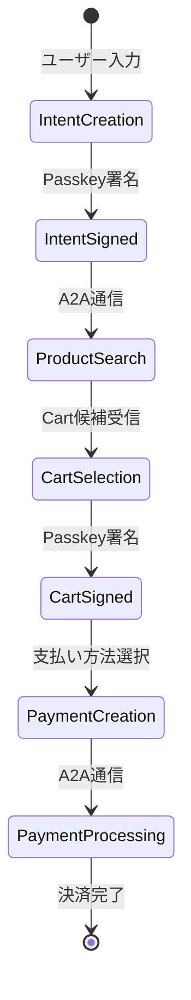
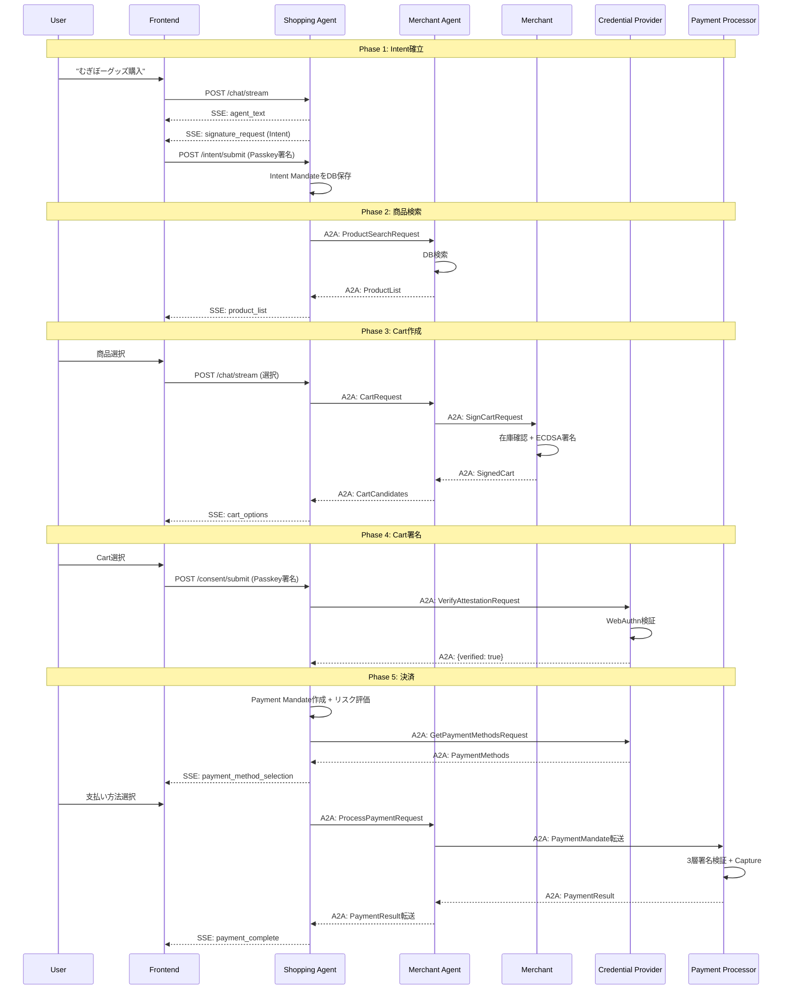

# Shopping Agent

**AP2 Protocol - ユーザー代理エージェント**

Shopping Agentは、ユーザーに代わって購買プロセスを管理するAIエージェントです。ユーザーとの対話からIntent Mandateを作成し、商品検索、Cart選択、決済処理までをエンドツーエンドで実行します。

## 📋 目次

- [概要](#概要)
- [役割と責務](#役割と責務)
- [主要機能](#主要機能)
- [エンドポイント一覧](#エンドポイント一覧)
- [実装詳細](#実装詳細)
- [データフロー](#データフロー)
- [セキュリティ](#セキュリティ)
- [開発者向け情報](#開発者向け情報)

---

## 概要

### AP2での役割

- **AP2 Role**: `shopper`
- **DID**: `did:ap2:agent:shopping_agent`
- **Port**: `8000`
- **Database**: `v2/data/shopping_agent.db`

### 主要な責務

1. **ユーザー対話**: SSEストリーミングによるリアルタイムチャット
2. **Intent Mandate管理**: ユーザーの購買意図を構造化
3. **A2A通信**: 他エージェント（Merchant Agent、Credential Provider）との通信
4. **決済オーケストレーション**: Payment Mandateの作成と署名管理
5. **リスク評価**: 取引のリスクスコア計算

---

## 役割と責務

### 1. ユーザーインターフェース

```
ユーザー ←→ Shopping Agent ←→ 他エージェント
          (SSE Stream)      (A2A Messages)
```

- **入力**: ユーザーの自然言語入力（"むぎぼーのグッズが欲しい"）
- **出力**: SSEストリーミングイベント（agent_text、cart_options、signature_request等）
- **LangGraph統合**: AI による意図抽出（オプション）

### 2. Mandateライフサイクル管理



### 3. セキュリティ管理

- **署名検証**: A2Aメッセージの署名検証（ECDSA/Ed25519）
- **WebAuthn統合**: ユーザーのPasskey署名管理
- **Nonce管理**: リプレイ攻撃対策
- **リスク評価**: 8要素に基づく取引リスクスコア計算

---

## 主要機能

### 1. チャットストリーミング（SSE）

**エンドポイント**: `POST /chat/stream`

```typescript
// フロントエンドからの呼び出し例
const eventSource = new EventSource('/api/shopping-agent/chat/stream', {
  method: 'POST',
  body: JSON.stringify({
    user_input: "むぎぼーのグッズが欲しい",
    session_id: "session_abc123"
  })
});

eventSource.onmessage = (event) => {
  const data = JSON.parse(event.data);

  switch (data.type) {
    case 'agent_text':
      // エージェントの応答を表示
      console.log(data.content);
      break;
    case 'signature_request':
      // Passkey署名を要求
      requestWebAuthnSignature(data.mandate);
      break;
    case 'cart_options':
      // カート候補を表示
      displayCartOptions(data.items);
      break;
    case 'done':
      // ストリーム終了
      eventSource.close();
      break;
  }
};
```

**実装**: `agent.py:443-482`

### 2. Intent Mandate作成

**フロー**:
1. Challenge生成: `POST /intent/challenge`
2. Passkey署名（フロントエンド）
3. 署名付きIntent提出: `POST /intent/submit`

**Intent Mandate構造**:

```json
{
  "id": "intent_abc123",
  "type": "IntentMandate",
  "user_id": "user_demo_001",
  "intent": "むぎぼーのグッズを購入",
  "constraints": {
    "max_amount": {"value": "50000", "currency": "JPY"},
    "allowed_merchants": ["did:ap2:merchant:mugibo_merchant"],
    "allowed_categories": ["goods"],
    "expiry": "2025-10-24T12:00:00Z"
  },
  "passkey_signature": {
    "challenge_id": "ch_xyz789",
    "clientDataJSON": "...",
    "authenticatorData": "...",
    "signature": "..."
  }
}
```

**実装**:
- Challenge生成: `agent.py:171-213`
- Intent提出: `agent.py:215-289`
- WebAuthn検証: `crypto.py:1176-1339`

### 3. A2A通信（商品検索）

**送信先**: Merchant Agent (`did:ap2:agent:merchant_agent`)

**A2Aメッセージ例**:

```json
{
  "header": {
    "message_id": "msg_abc123",
    "sender": "did:ap2:agent:shopping_agent",
    "recipient": "did:ap2:agent:merchant_agent",
    "timestamp": "2025-10-23T12:34:56Z",
    "nonce": "32バイトhex文字列",
    "proof": {
      "algorithm": "ed25519",
      "signatureValue": "...",
      "publicKey": "...",
      "kid": "did:ap2:agent:shopping_agent#key-2",
      "created": "2025-10-23T12:34:56Z",
      "proofPurpose": "authentication"
    }
  },
  "dataPart": {
    "@type": "ap2.requests.ProductSearch",
    "id": "search_123",
    "payload": {
      "query": "むぎぼー",
      "category": "goods",
      "max_results": 10
    }
  }
}
```

**実装**: `agent.py` の `_search_products_via_merchant_agent()` メソッド

### 4. Cart Mandate署名

**フロー**:
1. Cart候補を受信（Merchant Agentから）
2. ユーザーにCart選択UIを表示
3. Merchant署名を検証
4. Consent Challenge生成: `POST /consent/challenge`
5. Passkey署名（フロントエンド）
6. 署名付きConsent提出: `POST /consent/submit`

**Consent構造**:

```json
{
  "consent_id": "consent_abc123",
  "cart_mandate_id": "cart_xyz789",
  "intent_message_id": "msg_intent_456",
  "user_id": "user_demo_001",
  "approved": true,
  "timestamp": "2025-10-23T12:40:00Z",
  "passkey_signature": {
    "challenge_id": "ch_consent_123",
    "clientDataJSON": "...",
    "authenticatorData": "...",
    "signature": "..."
  },
  "signed_data_hash": "sha256ハッシュ"
}
```

**実装**:
- Consent Challenge: `agent.py:291-347`
- Consent提出: `agent.py:349-441`

### 5. Payment Mandate作成とリスク評価

**Payment Mandate構造**:

```json
{
  "id": "payment_abc123",
  "type": "PaymentMandate",
  "cart_mandate": { /* 署名済みCart */ },
  "intent_mandate": { /* 署名済みIntent */ },
  "credential_provider_id": "cp_demo_001",
  "payment_method_id": "pm_visa_1234",
  "risk_assessment": {
    "risk_score": 25,
    "risk_level": "LOW",
    "fraud_indicators": [],
    "recommendation": "APPROVE"
  },
  "shopping_agent_signature": {
    "algorithm": "Ed25519",
    "value": "...",
    "public_key": "...",
    "signed_at": "2025-10-23T12:45:00Z",
    "key_id": "shopping_agent"
  }
}
```

**リスク評価エンジン** (`v2/common/risk_assessment.py`):

| 評価要素 | 重み | 内容 |
|---------|------|------|
| 金額リスク | 20% | 高額取引（>¥50,000）を検出 |
| Intent制約違反 | 30% | max_amount超過、merchant制限違反 |
| CNP取引 | 15% | Card Not Present取引 |
| 支払い方法 | 10% | カード vs Passkey |
| パターン異常 | 10% | 異常な取引パターン |
| 配送先リスク | 5% | 配送先住所の妥当性 |
| 時間帯リスク | 5% | 深夜取引等 |
| エージェント関与 | 5% | 人間 vs AI主導 |

**実装**:
- Payment Mandate作成: `agent.py` の `_create_payment_mandate()` メソッド
- リスク評価: `risk_assessment.py` の `assess_payment_mandate()` メソッド

---

## エンドポイント一覧

### ユーザー対話

| エンドポイント | メソッド | 説明 | 実装 |
|--------------|---------|------|------|
| `/chat/stream` | POST | SSEストリーミングチャット | `agent.py:443` |
| `/` | GET | ヘルスチェック | `base_agent.py:175` |
| `/health` | GET | Docker向けヘルスチェック | `base_agent.py:263` |

### Intent Mandate管理

| エンドポイント | メソッド | 説明 | 実装 |
|--------------|---------|------|------|
| `/intent/challenge` | POST | Intent署名用Challenge生成 | `agent.py:171` |
| `/intent/submit` | POST | 署名付きIntent提出 | `agent.py:215` |

### Consent管理

| エンドポイント | メソッド | 説明 | 実装 |
|--------------|---------|------|------|
| `/consent/challenge` | POST | Consent署名用Challenge生成 | `agent.py:291` |
| `/consent/submit` | POST | 署名付きConsent提出 | `agent.py:349` |

### A2A通信

| エンドポイント | メソッド | 説明 | 実装 |
|--------------|---------|------|------|
| `/a2a/message` | POST | A2Aメッセージ受信 | `base_agent.py:185` |
| `/.well-known/agent-card.json` | GET | AgentCard取得 | `base_agent.py:268` |

### デバッグ用

| エンドポイント | メソッド | 説明 | 実装 |
|--------------|---------|------|------|
| `/products` | GET | 商品検索（デバッグ） | `agent.py:484` |

---

## 実装詳細

### クラス構造

```python
# agent.py:57-144
class ShoppingAgent(BaseAgent):
    """
    Shopping Agent実装

    継承元: BaseAgent (v2/common/base_agent.py)
    """

    def __init__(self):
        super().__init__(
            agent_id="did:ap2:agent:shopping_agent",
            agent_name="Shopping Agent",
            passphrase=AgentPassphraseManager.get_passphrase("shopping_agent"),
            keys_directory="./keys"
        )

        # データベースマネージャー
        self.db_manager = DatabaseManager(database_url=os.getenv("DATABASE_URL"))

        # HTTPクライアント（A2A通信用）
        self.http_client = httpx.AsyncClient(timeout=30.0)

        # 他エージェントのURL
        self.merchant_agent_url = "http://merchant_agent:8001"
        self.payment_processor_url = "http://payment_processor:8004"

        # Credential Provider一覧
        self.credential_providers = [...]

        # セッション管理（インメモリ）
        self.sessions: Dict[str, Dict[str, Any]] = {}

        # リスク評価エンジン
        self.risk_engine = RiskAssessmentEngine(db_manager=self.db_manager)

        # WebAuthn Challenge管理
        self.webauthn_challenge_manager = WebAuthnChallengeManager(
            challenge_ttl_seconds=60
        )

        # LangGraphエージェント（AI機能）
        self.langgraph_agent = get_langgraph_agent()
        self.conversation_agent = get_conversation_agent()
```

### A2Aメッセージハンドラー登録

```python
# agent.py:153-164
def register_a2a_handlers(self):
    """
    Shopping Agentが受信するA2Aメッセージ
    """
    self.a2a_handler.register_handler(
        "ap2.mandates.CartMandate",
        self.handle_cart_mandate
    )
    self.a2a_handler.register_handler(
        "ap2.responses.ProductList",
        self.handle_product_list
    )
    self.a2a_handler.register_handler(
        "ap2.responses.SignatureResponse",
        self.handle_signature_response
    )
```

### セッション管理

```python
# セッション構造
session = {
    "session_id": "session_abc123",
    "user_id": "user_demo_001",
    "step": "initial",  # 会話ステート
    "messages": [
        {"role": "user", "content": "むぎぼーのグッズが欲しい"},
        {"role": "assistant", "content": "最大金額を教えてください"}
    ],
    "intent_mandate": None,  # Intent Mandate（署名済み）
    "cart_mandate": None,    # 選択されたCart Mandate
    "payment_mandate": None  # Payment Mandate
}
```

### データベーステーブル

**mandates テーブル**:

| カラム | 型 | 説明 |
|--------|---|------|
| id | TEXT | Mandate ID (PK) |
| type | TEXT | "Intent" / "Cart" / "Payment" / "Consent" |
| status | TEXT | "draft" / "signed" / "submitted" / "completed" |
| payload | JSON | Mandate本体（JSON） |
| issuer | TEXT | 発行者（user_id or agent DID） |
| issued_at | TIMESTAMP | 発行日時 |
| updated_at | TIMESTAMP | 更新日時 |

**transactions テーブル**:

| カラム | 型 | 説明 |
|--------|---|------|
| id | TEXT | Transaction ID (PK) |
| intent_id | TEXT | Intent Mandate ID (FK) |
| cart_id | TEXT | Cart Mandate ID (FK) |
| payment_id | TEXT | Payment Mandate ID (FK) |
| status | TEXT | "pending" / "completed" / "failed" |
| events | JSON | イベントログ（JSON配列） |
| created_at | TIMESTAMP | 作成日時 |
| updated_at | TIMESTAMP | 更新日時 |

---

## データフロー

### 完全な購買フロー



---

## セキュリティ

### 1. 署名管理

**Intent Mandate署名**:
- **署名者**: ユーザー（Passkey）
- **署名対象**: `{intent, constraints}` フィールド
- **アルゴリズム**: WebAuthn（ECDSA P-256）
- **検証**: Credential Provider

**Shopping Agent署名（A2A通信）**:
- **署名者**: Shopping Agent
- **署名対象**: A2Aメッセージ全体（header.proofを除く）
- **アルゴリズム**: Ed25519（デフォルト）、ECDSA（後方互換）
- **検証**: 受信側エージェント

### 2. WebAuthn Challenge管理

```python
# v2/common/crypto.py:987-1107
class WebAuthnChallengeManager:
    """
    WebAuthn Challenge管理

    - challengeはサーバ側で生成し、一度のみ使用可能
    - 使用後は無効化される
    - 有効期限あり（デフォルト60秒）
    """

    def generate_challenge(self, user_id: str, context: str) -> Dict[str, str]:
        """
        新しいchallengeを生成

        Returns:
            {
                "challenge_id": "ch_abc123",
                "challenge": "base64url_encoded_32_bytes"
            }
        """
        challenge_bytes = os.urandom(32)
        challenge = base64.urlsafe_b64encode(challenge_bytes).decode('utf-8')
        challenge_id = f"ch_{uuid.uuid4().hex[:16]}"

        self._challenges[challenge_id] = {
            "challenge": challenge,
            "issued_at": datetime.now(timezone.utc),
            "used": False,
            "user_id": user_id,
            "context": context
        }

        return {"challenge_id": challenge_id, "challenge": challenge}

    def verify_and_consume_challenge(
        self,
        challenge_id: str,
        challenge: str,
        user_id: str
    ) -> bool:
        """
        challengeを検証して消費（一度のみ使用可能）

        検証項目:
        - challenge_idの存在
        - 有効期限（60秒以内）
        - 使用済みフラグ
        - challenge値の一致
        - user_idの一致
        """
        # ...実装は crypto.py:1042-1092 参照
```

### 3. Nonce管理（リプレイ攻撃対策）

```python
# v2/common/nonce_manager.py
class NonceManager:
    """
    Nonce管理（A2Aメッセージのリプレイ攻撃対策）

    - 各A2Aメッセージは一意のnonceを持つ
    - 使用済みnonceは記録され、再利用を防止
    - TTL（Time To Live）によって古いnonceは自動削除
    """

    async def is_valid_nonce(self, nonce: str) -> bool:
        """
        Nonceの妥当性を検証

        Returns:
            True: 有効なnonce（初回使用）
            False: 無効なnonce（再利用または不正）
        """
        async with self._lock:
            if nonce in self._used_nonces:
                # 再利用検出
                return False

            # 使用済みとして記録
            self._used_nonces[nonce] = datetime.now(timezone.utc)
            return True
```

### 4. リスク評価

**リスクスコア計算例**:

```python
# Payment Mandate
payment = {
    "cart_mandate": {
        "contents": {
            "total": {"value": "30000", "currency": "JPY"}
        }
    },
    "intent_mandate": {
        "constraints": {
            "max_amount": {"value": "50000", "currency": "JPY"}
        }
    },
    "payment_method": {
        "type": "card"
    }
}

# リスク評価
risk_result = risk_engine.assess_payment_mandate(payment)
# {
#   "risk_score": 25,
#   "risk_level": "LOW",
#   "fraud_indicators": [],
#   "recommendation": "APPROVE",
#   "risk_factors": {
#       "amount_risk": 0,
#       "constraint_violation": 0,
#       "cnp_transaction": 20,
#       "payment_method_risk": 10,
#       ...
#   }
# }
```

---

## 開発者向け情報

### ローカル開発

```bash
# 仮想環境のアクティベート
source v2/.venv/bin/activate

# 依存関係インストール
cd v2
uv sync

# 環境変数設定
export AP2_SHOPPING_AGENT_PASSPHRASE="your_passphrase"
export DATABASE_URL="sqlite+aiosqlite:///./data/shopping_agent.db"
export MERCHANT_AGENT_URL="http://localhost:8001"

# サーバー起動
uvicorn services.shopping_agent.main:app --host 0.0.0.0 --port 8000 --reload
```

### Docker開発

```bash
# Shopping Agent単体でビルド＆起動
cd v2
docker compose up --build shopping_agent

# ログ確認
docker compose logs -f shopping_agent

# デバッグモード
LOG_LEVEL=DEBUG docker compose up shopping_agent
```

### テスト

```bash
# ヘルスチェック
curl http://localhost:8000/

# Intent Challenge生成
curl -X POST http://localhost:8000/intent/challenge \
  -H "Content-Type: application/json" \
  -d '{
    "user_id": "user_demo_001",
    "intent_data": {
      "intent": "むぎぼーグッズ購入",
      "constraints": {"max_amount": {"value": "50000", "currency": "JPY"}}
    }
  }'

# SSEチャット（ブラウザから）
# http://localhost:8000/chat/stream に POST
```

### 環境変数

| 変数名 | 説明 | デフォルト |
|--------|------|-----------|
| `AP2_SHOPPING_AGENT_PASSPHRASE` | 秘密鍵のパスフレーズ | *必須* |
| `DATABASE_URL` | データベースURL | `sqlite+aiosqlite:///...` |
| `MERCHANT_AGENT_URL` | Merchant AgentのURL | `http://merchant_agent:8001` |
| `MERCHANT_URL` | MerchantのURL | `http://merchant:8002` |
| `PAYMENT_PROCESSOR_URL` | Payment ProcessorのURL | `http://payment_processor:8004` |
| `LOG_LEVEL` | ログレベル | `INFO` |
| `LOG_FORMAT` | ログ形式 | `text` |

### 主要ファイル

| ファイル | 行数 | 説明 |
|---------|------|------|
| `agent.py` | ~1500 | ShoppingAgentクラス実装 |
| `main.py` | ~30 | FastAPIエントリーポイント |
| `langgraph_agent.py` | ~300 | LangGraph統合（AI機能） |
| `langgraph_conversation.py` | ~400 | 対話エージェント（AI） |
| `mcp_tools.py` | ~200 | MCP（Model Context Protocol）ツール |
| `Dockerfile` | ~40 | Dockerイメージ定義 |

---

## 関連ドキュメント

- [メインREADME](../../../README.md) - プロジェクト全体の概要
- [AP2仕様書](https://ap2-protocol.org/specification/)
- [A2A拡張仕様](../../refs/AP2-main/docs/a2a-extension.md)
- [Common Modules](../../common/) - 共通モジュールのドキュメント
- [Merchant Agent README](../merchant_agent/README.md)
- [Payment Processor README](../payment_processor/README.md)

---

**作成日**: 2025-10-23
**バージョン**: v2.0.0
**メンテナー**: AP2 Development Team
