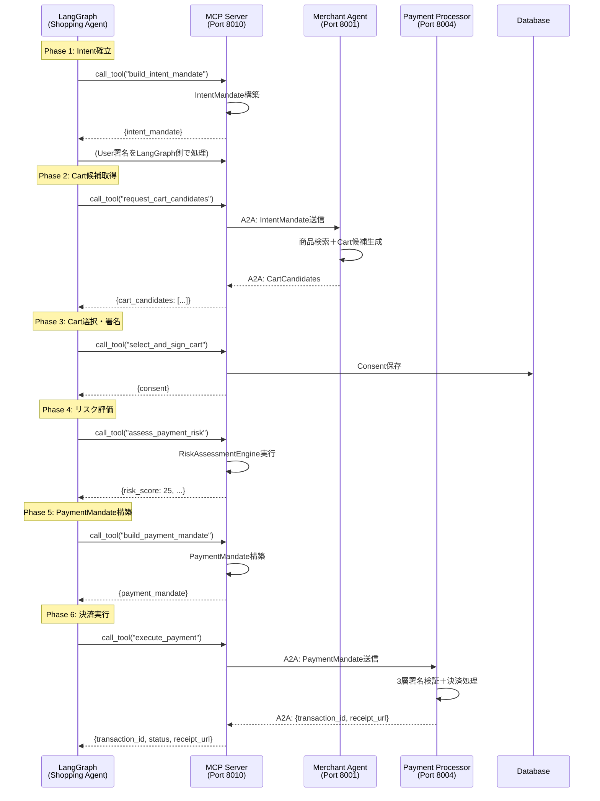

# Shopping Agent MCP

**Model Context Protocol (MCP) ツールサーバー - Shopping Agent用**

Shopping Agent MCPは、LangGraphエージェントにデータアクセス・AP2操作ツールを提供するMCPサーバーです。LLM推論はLangGraph側で行い、このサーバーはAP2プロトコル操作のみを担当します。

## 📋 目次

- [概要](#概要)
- [MCP仕様準拠](#mcp仕様準拠)
- [提供ツール](#提供ツール)
- [アーキテクチャ](#アーキテクチャ)
- [ツール詳細](#ツール詳細)
- [開発者向け情報](#開発者向け情報)

---

## 概要

### MCPサーバーの役割

- **Port**: `8010`
- **Server Name**: `shopping_agent_mcp`
- **Version**: `1.0.0`

### 主要な責務

1. **IntentMandate構築**: AP2準拠のIntentMandate構造化
2. **Cart候補取得**: Merchant AgentへのA2A通信
3. **Cart選択・署名**: ユーザーのCart選択とConsent管理
4. **リスク評価実行**: Payment Mandateのリスク評価
5. **PaymentMandate構築**: AP2準拠のPaymentMandate構造化
6. **決済実行**: Payment ProcessorへのA2A通信

### アーキテクチャ上の位置付け

```
┌───────────────────┐      ┌─────────────────────┐      ┌──────────────┐
│ Shopping Agent    │      │ Shopping Agent MCP  │      │ Merchant     │
│ (LangGraph)       │─────>│ (Port 8010)         │─────>│ Agent        │
│                   │ MCP  │                     │ A2A  │ (Port 8001)  │
│ - LLM推論         │ Tools│ - build_intent_     │      └──────────────┘
│ - ワークフロー    │      │   mandate           │
│ - 対話管理        │      │ - request_cart_     │      ┌──────────────┐
└───────────────────┘      │   candidates        │      │ Payment      │
                           │ - assess_payment_   │─────>│ Processor    │
                           │   risk              │ A2A  │ (Port 8004)  │
                           │ - execute_payment   │      └──────────────┘
                           └─────────────────────┘
                                     │
                                     v
                           ┌─────────────────────┐
                           │ Database (SQLite)   │
                           │ - Mandates          │
                           │ - Transactions      │
                           └─────────────────────┘
```

---

## MCP仕様準拠

### Model Context Protocol とは

**MCP (Model Context Protocol)** は、LLMアプリケーションとデータソース・ツールを接続するためのオープンプロトコルです。

- **公式仕様**: [Model Context Protocol Specification](https://spec.modelcontextprotocol.io/)
- **JSON-RPC 2.0**: MCPはJSON-RPC 2.0に基づいたプロトコル
- **Streamable HTTP Transport**: HTTP/SSEによるストリーミング対応

### MCPサーバーの責務分離

**重要**: MCPサーバーはLLM推論を行いません。

| 責務 | 担当 |
|------|------|
| **LLM推論** | LangGraph（Shopping Agent） |
| **対話管理** | LangGraph（Shopping Agent） |
| **意思決定** | LangGraph（Shopping Agent） |
| **AP2プロトコル操作** | **MCP Server（このサービス）** |
| **データアクセス** | **MCP Server（このサービス）** |
| **A2A通信** | **MCP Server（このサービス）** |

---

## 提供ツール

### ツール一覧

| ツール名 | 説明 | 入力 | 出力 |
|---------|------|------|------|
| `build_intent_mandate` | AP2準拠IntentMandate構築 | `{intent_data, session_data}` | `{intent_mandate}` |
| `request_cart_candidates` | Merchant AgentにA2A通信でCart候補取得 | `{intent_mandate, shipping_address}` | `{cart_candidates}` |
| `select_and_sign_cart` | ユーザーがCart選択、Consent管理 | `{cart_mandate, user_id, ...}` | `{consent}` |
| `assess_payment_risk` | PaymentMandateのリスク評価 | `{payment_mandate, cart_mandate, ...}` | `{risk_score, fraud_indicators}` |
| `build_payment_mandate` | AP2準拠PaymentMandate構築 | `{intent_mandate, cart_mandate, ...}` | `{payment_mandate}` |
| `execute_payment` | Payment Processorに決済依頼 | `{payment_mandate, cart_mandate}` | `{transaction_id, status, receipt_url}` |

### ツール呼び出し例

```python
from common.mcp_client import MCPClient

mcp_client = MCPClient("http://shopping_agent_mcp:8010")

# build_intent_mandate呼び出し
intent = await mcp_client.call_tool("build_intent_mandate", {
    "intent_data": {
        "natural_language_description": "むぎぼーのグッズを¥50,000以内で購入",
        "intent_expiry": "2025-10-24T12:00:00Z"
    },
    "session_data": {
        "user_id": "user_demo_001",
        "session_id": "session_abc123"
    }
})

# request_cart_candidates呼び出し
carts = await mcp_client.call_tool("request_cart_candidates", {
    "intent_mandate": intent["intent_mandate"],
    "shipping_address": {...}
})

# execute_payment呼び出し
result = await mcp_client.call_tool("execute_payment", {
    "payment_mandate": payment_mandate,
    "cart_mandate": cart_mandate
})
```

---

## アーキテクチャ

### AP2フロー全体



---

## ツール詳細

### 1. build_intent_mandate (main.py:69-126)

**ツール定義**:

```python
@mcp.tool(
    name="build_intent_mandate",
    description="AP2準拠IntentMandate構築",
    input_schema={
        "type": "object",
        "properties": {
            "intent_data": {
                "type": "object",
                "description": "LLMが抽出したインテントデータ"
            },
            "session_data": {
                "type": "object",
                "description": "セッションデータ（user_id, session_id等）"
            }
        },
        "required": ["intent_data", "session_data"]
    }
)
```

**入力**:

```json
{
  "intent_data": {
    "natural_language_description": "むぎぼーのグッズを¥50,000以内で購入",
    "user_cart_confirmation_required": true,
    "merchants": ["did:ap2:merchant:mugibo_merchant"],
    "requires_refundability": false,
    "intent_expiry": "2025-10-24T12:00:00Z"
  },
  "session_data": {
    "user_id": "user_demo_001",
    "session_id": "session_abc123"
  }
}
```

**出力**:

```json
{
  "intent_mandate": {
    "id": "intent_a1b2c3d4e5f6",
    "natural_language_description": "むぎぼーのグッズを¥50,000以内で購入",
    "user_cart_confirmation_required": true,
    "merchants": ["did:ap2:merchant:mugibo_merchant"],
    "skus": null,
    "requires_refundability": false,
    "intent_expiry": "2025-10-24T12:00:00Z",
    "_metadata": {
      "user_id": "user_demo_001",
      "session_id": "session_abc123",
      "created_at": "2025-10-23T12:00:00Z"
    }
  }
}
```

### 2. request_cart_candidates (main.py:128-210)

**ツール定義**:

```python
@mcp.tool(
    name="request_cart_candidates",
    description="Merchant AgentにA2Aメッセージ送信してカート候補取得",
    input_schema={
        "type": "object",
        "properties": {
            "intent_mandate": {"type": "object"},
            "shipping_address": {"type": "object"}
        },
        "required": ["intent_mandate"]
    }
)
```

**処理フロー**:

```python
# main.py:146-210
async def request_cart_candidates(params: Dict[str, Any]) -> Dict[str, Any]:
    intent_mandate = params["intent_mandate"]
    shipping_address = params.get("shipping_address")

    # A2Aメッセージ作成
    a2a_message = a2a_handler.create_message(
        recipient="did:ap2:agent:merchant_agent",
        data_type_key="ap2.mandates.IntentMandate",
        payload={
            "intent_mandate": intent_mandate,
            "shipping_address": shipping_address
        }
    )

    # Merchant Agentに送信
    response = await http_client.post(
        f"{MERCHANT_AGENT_URL}/a2a/message",
        json=a2a_message.model_dump()
    )

    # レスポンス解析
    a2a_response = response.json()
    cart_candidates = a2a_response["dataPart"]["artifact_data"]["candidates"]

    return {"cart_candidates": cart_candidates}
```

### 3. select_and_sign_cart (main.py:212-253)

**ツール定義**:

```python
@mcp.tool(
    name="select_and_sign_cart",
    description="ユーザーがカートを選択し、署名",
    input_schema={
        "type": "object",
        "properties": {
            "cart_mandate": {"type": "object"},
            "user_id": {"type": "string"},
            "intent_message_id": {"type": "string"}
        },
        "required": ["cart_mandate", "user_id"]
    }
)
```

**出力**:

```json
{
  "consent": {
    "consent_id": "consent_abc123",
    "cart_mandate_id": "cart_xyz789",
    "intent_message_id": "msg_intent_456",
    "user_id": "user_demo_001",
    "approved": true,
    "timestamp": "2025-10-23T12:40:00Z"
  }
}
```

### 4. assess_payment_risk (main.py:255-316)

**ツール定義**:

```python
@mcp.tool(
    name="assess_payment_risk",
    description="リスク評価実行",
    input_schema={
        "type": "object",
        "properties": {
            "payment_mandate": {"type": "object"},
            "cart_mandate": {"type": "object"},
            "intent_mandate": {"type": "object"}
        },
        "required": ["payment_mandate"]
    }
)
```

**処理フロー**:

```python
# main.py:269-316
async def assess_payment_risk(params: Dict[str, Any]) -> Dict[str, Any]:
    payment_mandate = params["payment_mandate"]
    cart_mandate = params.get("cart_mandate")
    intent_mandate = params.get("intent_mandate")

    # RiskAssessmentEngine実行
    risk_result = await risk_engine.assess_payment_mandate(
        payment_mandate,
        cart_mandate=cart_mandate,
        intent_mandate=intent_mandate
    )

    return {
        "risk_score": risk_result["risk_score"],
        "risk_level": risk_result["risk_level"],
        "fraud_indicators": risk_result["fraud_indicators"],
        "recommendation": risk_result["recommendation"]
    }
```

**出力例**:

```json
{
  "risk_score": 25,
  "risk_level": "LOW",
  "fraud_indicators": [],
  "recommendation": "APPROVE"
}
```

### 5. build_payment_mandate (main.py:318-373)

**ツール定義**:

```python
@mcp.tool(
    name="build_payment_mandate",
    description="AP2準拠PaymentMandate構築",
    input_schema={
        "type": "object",
        "properties": {
            "intent_mandate": {"type": "object"},
            "cart_mandate": {"type": "object"},
            "payment_method": {"type": "object"},
            "risk_assessment": {"type": "object"}
        },
        "required": ["cart_mandate", "payment_method"]
    }
)
```

**出力**:

```json
{
  "payment_mandate": {
    "id": "pm_abc123",
    "cart_mandate_id": "cart_xyz789",
    "intent_mandate_id": "intent_456",
    "payment_method": {
      "type": "card",
      "token": "tok_a1b2c3d4_x9y8z7w6"
    },
    "payer_id": "user_demo_001",
    "payee_id": "did:ap2:merchant:mugibo_merchant",
    "amount": {"value": 8068.0, "currency": "JPY"},
    "risk_score": 25,
    "fraud_indicators": [],
    "created_at": "2025-10-23T12:45:00Z"
  }
}
```

### 6. execute_payment (main.py:375-511)

**ツール定義**:

```python
@mcp.tool(
    name="execute_payment",
    description="Payment Processorに決済依頼",
    input_schema={
        "type": "object",
        "properties": {
            "payment_mandate": {"type": "object"},
            "cart_mandate": {"type": "object"}
        },
        "required": ["payment_mandate", "cart_mandate"]
    }
)
```

**処理フロー**:

```python
# main.py:389-511
async def execute_payment(params: Dict[str, Any]) -> Dict[str, Any]:
    payment_mandate = params["payment_mandate"]
    cart_mandate = params["cart_mandate"]

    # Payment Processorに送信
    response = await http_client.post(
        f"{PAYMENT_PROCESSOR_URL}/process",
        json={
            "payment_mandate": payment_mandate,
            "cart_mandate": cart_mandate
        }
    )

    result = response.json()

    return {
        "transaction_id": result.get("transaction_id"),
        "status": result.get("status"),
        "receipt_url": result.get("receipt_url"),
        "error": result.get("error")
    }
```

**出力例（成功）**:

```json
{
  "transaction_id": "txn_abc123",
  "status": "captured",
  "receipt_url": "http://localhost:8004/receipts/txn_abc123.pdf",
  "error": null
}
```

---

## 開発者向け情報

### ローカル開発

```bash
# 仮想環境のアクティベート
source v2/.venv/bin/activate

# 依存関係インストール
cd v2
uv sync

# 環境変数設定
export AGENT_ID="did:ap2:agent:shopping_agent"
export DATABASE_URL="sqlite+aiosqlite:////app/v2/data/shopping_agent.db"
export MERCHANT_AGENT_URL="http://localhost:8001"
export PAYMENT_PROCESSOR_URL="http://localhost:8004"

# サーバー起動
uvicorn services.shopping_agent_mcp.main:app --host 0.0.0.0 --port 8010 --reload
```

### Docker開発

```bash
# Shopping Agent MCP単体でビルド＆起動
cd v2
docker compose up --build shopping_agent_mcp

# ログ確認
docker compose logs -f shopping_agent_mcp
```

### MCPツール一覧取得

```bash
# MCPサーバーのツール一覧を取得
curl -X POST http://localhost:8010/mcp/tools/list \
  -H "Content-Type: application/json" \
  -d '{}'
```

### MCPツール呼び出し例

```bash
# build_intent_mandate呼び出し
curl -X POST http://localhost:8010/mcp/tools/call \
  -H "Content-Type: application/json" \
  -d '{
    "name": "build_intent_mandate",
    "arguments": {
      "intent_data": {
        "natural_language_description": "むぎぼーのグッズを¥50,000以内で購入",
        "intent_expiry": "2025-10-24T12:00:00Z"
      },
      "session_data": {
        "user_id": "user_demo_001",
        "session_id": "session_abc123"
      }
    }
  }'

# assess_payment_risk呼び出し
curl -X POST http://localhost:8010/mcp/tools/call \
  -H "Content-Type: application/json" \
  -d '{
    "name": "assess_payment_risk",
    "arguments": {
      "payment_mandate": {
        "id": "pm_001",
        "amount": {"value": 8068.0, "currency": "JPY"},
        "payment_method": {"type": "card"}
      }
    }
  }'
```

### 環境変数

| 変数名 | 説明 | デフォルト |
|--------|------|-----------|
| `AGENT_ID` | Shopping Agent DID | `did:ap2:agent:shopping_agent` |
| `DATABASE_URL` | データベースURL | `sqlite+aiosqlite:////app/v2/data/shopping_agent.db` |
| `MERCHANT_AGENT_URL` | Merchant AgentエンドポイントURL | `http://merchant_agent:8001` |
| `PAYMENT_PROCESSOR_URL` | Payment ProcessorエンドポイントURL | `http://payment_processor:8004` |
| `LOG_LEVEL` | ログレベル | `INFO` |

### 主要ファイル

| ファイル | 行数 | 説明 |
|---------|------|------|
| `main.py` | ~511 | MCPサーバー実装、6つのツール定義 |
| `Dockerfile` | ~30 | Dockerイメージ定義 |

---

## 関連ドキュメント

- [メインREADME](../../../README.md) - プロジェクト全体の概要
- [Shopping Agent README](../shopping_agent/README.md) - LangGraph統合（ツール呼び出し側）
- [MCP Specification](https://spec.modelcontextprotocol.io/) - Model Context Protocol仕様
- [AP2仕様書](https://ap2-protocol.org/specification/)

---

**作成日**: 2025-10-23
**バージョン**: v2.0.0
**メンテナー**: AP2 Development Team
